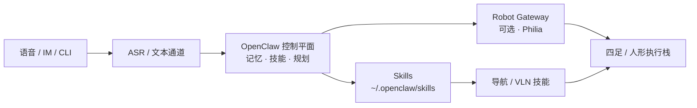

# OpenClaw

**OpenClaw**（[openclaw.ai](https://openclaw.ai/)，[GitHub: openclaw/openclaw](https://github.com/openclaw/openclaw)）是开源 **个人 AI 助手 / agent harness**：在用户自有机器上驻留，通过消息通道与技能目录执行任务。具身与四足课程中，它常作为 **语音/自然语言 → 机器人技能** 的控制平面，而非底层运动控制器。

## 一句话定义

**把「能听懂话、能调技能、能记上下文」的助手运行时装在你自己的电脑/工控机上，再通过技能或 Robot Gateway 接到导航与真机执行。**

## 英文缩写速查

| 缩写 | 英文全称 | 简要说明 |
|------|----------|----------|
| OpenClaw | OpenClaw personal agent | 本页开源助手运行时 |
| ASR | Automatic Speech Recognition | 语音→文本，语音控机入口 |
| TTS | Text-to-Speech | 文本→语音反馈 |
| VLN | Vision-Language Navigation | 语言条件下的导航执行下游 |
| MCP | Model Context Protocol | 工具/上下文扩展协议生态之一 |
| Gateway | Robot Gateway | Philia 等系统中的真机能力契约层 |

## 为什么重要

- **课程项目锚点：** 四足×VLN 实战营 Day1 项目即为 **部署 OpenClaw 做四足语音指令控制**——需要独立实体页，而不是只在 Philia/SenseNova 脚注里出现。
- **控制平面 ≠ 运动策略：** OpenClaw 负责会话、记忆、技能路由；`cmd_vel` / 步态 / 力矩仍由 [分层导航栈](../concepts/hierarchical-quadruped-navigation-stack.md) 与底层 SDK 负责。
- **生态可组合：** 技能目录（如 `~/.openclaw/skills/`）可装 [SenseNova-Skills](./sensenova-skills.md)；亦可经 [CLI-Anything](./cli-anything.md) Hub meta-skill 发现/安装专业软件 CLI；物理多机扩展见 [Philia](./philia.md)；ROS2 通用工具面见 [RosClaw](./rosclaw.md)；跨本体具身助手对照 [RoboClaw](./roboclaw.md)；对照 agent OS 见 [Hermes Agent](./hermes-agent.md)。

## 核心结构/机制

| 层次 | 职责 |
|------|------|
| **交互** | 语音、IM、Web/CLI；可接实时语音模型 |
| **控制平面** | 意图、长期记忆、技能选择、确认与安全话术 |
| **技能** | 声明式 `SKILL.md` 能力包（办公、检索、机器人相关自定义） |
| **执行** | 本机工具，或经 Gateway 调用导航/操作服务 |

## 工程实践

| 场景 | 做法 |
|------|------|
| 快速安装 | 官网一键脚本：`curl -fsSL https://openclaw.ai/install.sh \| bash` |
| 四足语音最小闭环 | ASR → OpenClaw 技能「导航到 X」→ 发布目标点/字符串给 Nav2 或 VLN 节点 → TTS 反馈 |
| 与 Philia 对齐 | 控制平面保持 OpenClaw；真机能力进 Gateway manifest，避免 LLM 直接吐电机命令 |
| ROS2 + IM | 装 [RosClaw](./rosclaw.md) 插件：`docker compose` 演示或 `rosbridge` 连真机；配置 `/estop` 旁路 |
| 调试 | 先验证纯文本技能路由，再接通语音与真机；打断（barge-in）见 [语音交互流水线](../queries/humanoid-voice-interaction-pipeline.md) |

## 局限与风险

- **不是运动栈：** 不会替代 SLAM、局部规划或 RL locomotion。
- **权限与安全：** 助手拥有本机/网关能力时需最小权限与人工确认（物理 STOP 独立于对话）。
- **课程实现差异：** 各实训营对「OpenClaw 控四足」的桥接脚本可能私有，本页描述的是 **公开运行时角色**，不是某一闭源课件的逐行复现。

## 关联页面

- [RosClaw](./rosclaw.md) — OpenClaw 插件：IM 自然语言 → ROS2 工具集
- [RoboClaw](./roboclaw.md) — SJTU MINT 跨本体具身助手（对照）
- [Philia](./philia.md) — OpenClaw + Robot Gateway 多机器人助手
- [Hermes Agent](./hermes-agent.md) — 对照开源 agent OS
- [ScienceDiscovery](./sciencediscovery.md) — 本地科研工作台（文献 MCP + 沙箱）；不是语音控机平面
- [openJiuwen](./openjiuwen.md) — WorkSwarm 自称覆盖 Claw 类个人助手模式
- [DeepSeek Harness](./deepseek-harness.md) — DeepSeek 官方插件化 coding harness（Cordis；非具身控制平面）
- [CLI-Anything（HKUDS）](./cli-anything.md) — 生成/分发 agent-native 软件 CLI；OpenClaw 为 SKILL 宿主之一
- [DeepTutor（HKUDS）](./deeptutor.md) — 辅导工作区；可 consult OpenClaw 并安装 ClawHub skills
- [SkillCorpus](./paper-skillcorpus.md) — 社区 `SKILL.md` 策展语料；OpenClaw 为其端到端评测 harness 之一
- [HarnessBank](./paper-harnessbank.md) — 冻结模型下进化宿主 harness（与技能层互补）
- [人形语音交互流水线](../queries/humanoid-voice-interaction-pipeline.md)
- [四足×VLN 实战营总览](../overview/quadruped-vln-embodied-workshop.md)
- [视觉–语言导航](../tasks/vision-language-navigation.md)

## 参考来源

- [OpenClaw 官网](../../sources/sites/openclaw-ai.md)
- [OpenClaw 代码仓](../../sources/repos/openclaw.md)
- [四足×VLN 实战营课程大纲](../../sources/courses/quadruped_vln_embodied_workshop_2day.md)
- [古月居：RosClaw / ROS2 自然语言控制](../../sources/blogs/wechat_guyue_rosclaw_ros2_natural_language.md)

## 推荐继续阅读

- 官网与安装：<https://openclaw.ai/>
- 仓库：<https://github.com/openclaw/openclaw>
