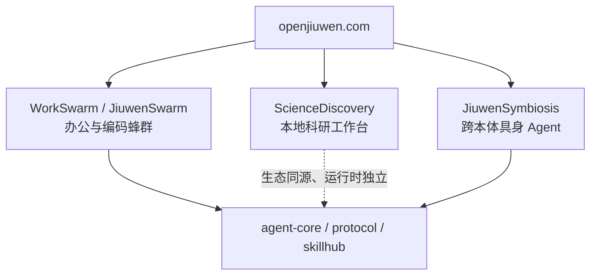

# openJiuwen（开放九问）

**openJiuwen**（[openjiuwen.com](https://www.openjiuwen.com)，GitHub org [openJiuwen-ai](https://github.com/openJiuwen-ai)，AtomGit [openJiuwen](https://atomgit.com/openJiuwen)）是面向 **生产级 AI Agent** 的开源平台：桌面侧用 WorkSwarm 把多 Agent 编成可人机同场的团队，垂直侧再用独立仓覆盖科研工作台与具身执行。它不是单一聊天壳，也不是本库的 wiki 维护运行时。

## 一句话定义

用 **协同工程（Coordination Engineering）** 把「单助手对话」升级为 **可分工、可沉淀技能、可人在环** 的 Agent Swarm，并在同一社区下分发科研工作台与跨本体机器人适配器。

## 英文缩写速查

| 缩写 | 英文全称 | 简要说明 |
|------|----------|----------|
| WorkSwarm | Work Swarm office agent | 官网主推的蜂群办公智能体（由 JiuwenSwarm 办公向升级） |
| HOTS | Human on the Swarm | 人在蜂群之上：监督、拍板、抽查 |
| HITS | Human in the Swarm | 人在蜂群之中：与 Agent 同场改稿/改代码 |
| MCP | Model Context Protocol | 工具/数据总线；ScienceDiscovery 科学 Connector 走此协议 |
| KV Cache | Key-Value Cache | 官网宣称的推理亲和：上下文与池化 KV 主动协同 |
| A2A | Agent-to-Agent | org 内 `agent-protocol` 仓提供的智能体间协议实现之一 |

## 核心信息

| 字段 | 内容 |
|------|------|
| 机构 | 华为（Huawei）2012 实验室、华为云、终端、计算联合共建 |
| 类型 | 开源 AI Agent 平台 + 产品家族 |
| 官网 | <https://www.openjiuwen.com> |
| 代码 | GitHub `openJiuwen-ai` / AtomGit `openJiuwen` |
| 许可 | 核心产品仓多为 Apache-2.0；社区文档仓 CC-BY-4.0 |
| 开源结论 | **已开源**（平台级多仓；模型不随仓分发） |
| 联系 | `contact@openjiuwen.com` |

## 为什么重要

- **科研工作台入口：** [ScienceDiscovery](./sciencediscovery.md) 把文献 MCP、沙箱实验和 CAS 溯源收进本地 Linux 工作台，对应 [AI Auto-Research](../concepts/ai-auto-research.md) 的 S2/S3，而不是本库 `ingest` 那种「编译进 wiki」。
- **具身对照：** 官网 WorkSwarm 自称 Claw 类个人助手 + Swarm；真机执行在独立仓 [JiuwenSymbiosis](https://github.com/openJiuwen-ai/jiuwensymbiosis)（`ActionSpec` + Piper / SO-101 / Cruzr adapter）。对照本库 [OpenClaw](./openclaw.md) + [Philia](./philia.md) 的「助手控制平面 / Robot Gateway」拆分，不要把 ScienceDiscovery 误当成控机栈。
- **国产算力叙事：** 文档与官网强调昇腾 / 鲲鹏亲和、KV Cache 协同与统一调度；ScienceDiscovery 另有可选 Host NPU Broker。这对在国内集群上跑科研 agent 有选型意义，数字仍须按各仓 README 复核。

## 核心原理

官网把能力分成三层，不要与某一个 GitHub 仓一一等同：

| 层 | 官网说法 | 落到代码时 |
|----|----------|------------|
| **WorkSwarm 产品** | 个人助手 / Coding / Swarm 三模式；IM 频道常驻 | 上游仓 [jiuwenswarm](https://github.com/openJiuwen-ai/jiuwenswarm)（星标远高于垂直仓） |
| **协同工程** | Agent 自主分工、Swarm Skills 沉淀、Skills Hub 流动 | [skillhub](https://github.com/openJiuwen-ai/skillhub) 声称可兼容 ClawHub |
| **底座 SDK** | 开发、运行、优化、演进 | [agent-core](https://github.com/openJiuwen-ai/agent-core)、[agent-runtime](https://github.com/openJiuwen-ai/agent-runtime) |

ScienceDiscovery 的 Explanation 写明 agent 环是 **本仓 TypeScript `native-agent/`**，不用 LangChain。把它理解成「同一社区的垂直工作台」，而不是 JiuwenSwarm 的 git submodule。

## 工程实践

| 场景 | 做法 |
|------|------|
| 先摸产品 | 打开 [openjiuwen.com](https://www.openjiuwen.com) 走「在线体验 WorkSwarm」；社区 Issue 走 AtomGit / GitCode |
| 要科研文献+沙箱 | 克隆 [sciencediscovery](https://github.com/openJiuwen-ai/sciencediscovery)，按 [实体页](./sciencediscovery.md) 走 `./ScienceDiscovery serve` |
| 要真机/桌面臂 | 看 JiuwenSymbiosis README：Ubuntu 22.04、`openjiuwen>=0.1.13`、按 adapter extra 装 Piper / SO-101 / Cruzr；**本次未升格独立 wiki** |
| 对照本库维护 | 本仓库仍用 `schema/ingest-workflow.md`；不要用 Swarm Skill 替代 wiki 的 `## 参考来源` 与 lint |

## 局限与风险

- **官网 ≠ 单一可运行仓库。** 首页主推 WorkSwarm；ScienceDiscovery 与 JiuwenSymbiosis 要进对应 GitHub/AtomGit 仓。
- **营销数字未进本页。** 第三方新闻里的 PinchBench / BiomniBench 分数，官网与 ScienceDiscovery README 均未给出可复核表；需要时回官方文档，不要当 SOTA 事实引用。
- **单用户信任模型出现在垂直仓。** ScienceDiscovery 明确无 TLS、单 token、禁止当多租户生产服务。
- **具身仓未在本次 ingest 深挖。** JiuwenSymbiosis 对机器人读者更贴，但按「一次一条资料」只登记入口。

## 关联页面

- [ScienceDiscovery](./sciencediscovery.md) — 本地 AI 科研工作台（本次深挖）
- [Hermes Agent](./hermes-agent.md) — 常驻 agent OS 对照（网关 / 记忆 / cron）
- [OpenClaw](./openclaw.md) — Claw 类个人助手；WorkSwarm 自称覆盖同类模式
- [DeepSeek Harness](./deepseek-harness.md) — 插件化 coding harness 对照
- [Philia](./philia.md) — 助手控制平面 + Robot Gateway；对照 JiuwenSymbiosis 的本体 adapter
- [AI Auto-Research](../concepts/ai-auto-research.md) — 研究生命周期；ScienceDiscovery 落 S2/S3
- [Model Context Protocol](../concepts/model-context-protocol.md) — 科学 Connector 与工具总线
- [LLM Wiki（Karpathy 模式）](../references/llm-wiki-karpathy.md) — 知识编译 vs 可执行 Swarm

## 参考来源

- [openJiuwen 官网归档](../../sources/sites/openjiuwen-com.md)
- [ScienceDiscovery 仓库归档](../../sources/repos/sciencediscovery.md)
- [openJiuwen-ai（GitHub org）](https://github.com/openJiuwen-ai)
- [openJiuwen（AtomGit org）](https://atomgit.com/openJiuwen)

## 推荐继续阅读

- ScienceDiscovery 中英文档导航：<https://github.com/openJiuwen-ai/sciencediscovery/blob/main/docs/README.md>
- JiuwenSymbiosis（具身，未升格）：<https://github.com/openJiuwen-ai/jiuwensymbiosis>
- JiuwenSwarm / WorkSwarm 上游仓：<https://github.com/openJiuwen-ai/jiuwenswarm>
