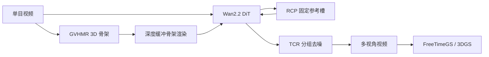
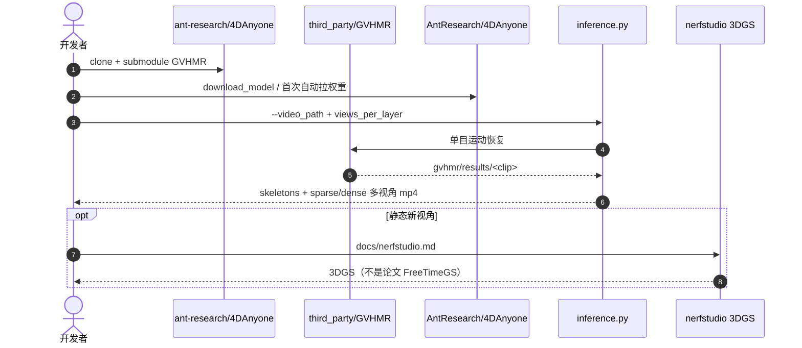

# 4DAnyone：单目随意视频做出 4D 人

**4DAnyone**（*Create Anyone in 4D from a Casual Monocular Video*，[arXiv:2608.20335](https://arxiv.org/abs/2608.20335)，[项目页](https://4danyone.github.io/)，[代码](https://github.com/ant-research/4DAnyone)）由 **浙江大学** Yudong Jin、Tao Xie、Xiaowei Zhou 与 **蚂蚁灵波科技（Robbyant）** / **蚂蚁集团** / **香港科技大学** / **香港中文大学** 的 Yinghao Xu、Yujun Shen 等提出，投 **SIGGRAPH Asia 2026**：光真实 4D 人通常要标定同步相机阵列；作者改成「先生成阵列本该录到的视频，再抬 4DGS」。现成相机控制视频扩散在 **几十路目标视角** 上会跨组漂。4DAnyone 用 **RCP** 把参考上下文压成常数预算，用 **TCR** 在去噪时轮换分组传结构，几何条件走 [GVHMR](./gvhmr.md) 的 3D 骨架而不是稠密深度。

## 一句话定义

**单目、不标定、不架三脚架的人体视频，先生成「够拿去训 4DGS」的多视角，而不是直接从单目拟合一个看不见背面的 avatar。**

## 英文缩写速查

| 缩写 | 英文全称 | 简要说明 |
|------|----------|----------|
| 4DGS | 4D Gaussian Splatting | 动态高斯重建；论文下游用 FreeTimeGS |
| RCP | Reference Context Packing | 把增长的参考视角压进固定 token 槽 |
| TCR | Target Context Routing | 高噪声轮换分组、低噪声固定邻接组 |
| HMR | Human Mesh Recovery | 单目出 3D 骨架；本管线默认 GVHMR |
| DiT | Diffusion Transformer | 骨干 Wan2.2-TI2V-5B |
| OOD | Out of Distribution | DyMVHumans 对训练分布外 |

## 为什么重要

- 把「阵列才能做 4D 人」改成手机视频入口，和本库 [GVHMR](./gvhmr.md) → 重定向链是 **同一上游、不同下游**：GVHMR 出运动，4DAnyone 出可绕视外观。
- 点明失败模式：不是再叠一个 Plücker / 深度 warp，而是 **单次注意力装不下几十路视角**。
- **已开源** 且 2026-09-05 把峰值显存压到 **24 GB 以下**，4090 能跑推理。

## 方法

| 项 | 内容 |
|----|------|
| **机构** | 浙江大学、蚂蚁灵波科技（Robbyant）、蚂蚁集团、香港科技大学、香港中文大学 |
| **输入** | 单目 RGB；内参/位姿未知；相机宜小动 |
| **几何** | GVHMR 3D 骨架 → 深度缓冲渲染；40 / 308 Goliath 关键点 |
| **生成** | Wan2.2-TI2V-5B + 多视角自注意力；RCP + TCR |
| **重建** | 论文：FreeTimeGS 4DGS；仓：nerfstudio **3DGS** 已接，开源 4DGS **仍待接** |
| **开源** | **已开源** Apache-2.0 + HF `AntResearch/4DAnyone` |

### 流程总览

### 核心原理

1. **精度优先于密度。** 野外度量深度和相机参数容易错，错几何会把多视角生成拉崩。3D 骨架稀疏但稳；深度缓冲消掉「手臂在躯干前还是后」的 2D 歧义。脸和细手指不喂噪声关键点，交给源视频外观。
2. **RCP：参考从 \(O(N)\) 变成 \(O(1)\)。** 已生成视角高度冗余。用比标准 Wan patchify 更粗的 \((1,2r,2r)\) 把参考压进固定槽：源视频全分辨率 + 3 路 \(r=2\) + 4 路 \(r=4\)。推理先两轮 farthest-point 出参考，再给所有目标组共用。
3. **TCR：结构在高噪声、细节在低噪声。** \(t>t_s\)（默认 \(t_s/T=0.2\)）按步循环重分组，让不相邻视角交换上下文；之后固定四视角邻接组修纹理。消融里 Random / Strided 路由没有增益，**只有 Sliding** 涨分。
4. **三阶段课。** ① DNA-Rendering 前景、骨架控制；② 全多视角、带背景光影；③ 单目 Pexels / TedTalk，并去掉手指点。损失：latent flow-matching + \(\lambda=0.25\) LPIPS。

## 源码运行时序图

默认开 **Turbo**（四步去噪，官方称相对 Base **5.58×**）。24 路满轨道是 4DGS 常用布局；6 路只适合冒烟。仓 Roadmap 写明 **开源 4DGS 方法仍待接**。

## 评测

Table 2（单正视源视频 → 16 路均匀目标；DNA-Rendering 10 场 / DyMVHumans 3 场，每场 98 帧）：

| 维度 | 方法 | DNA PSNR ↑ | DyMV PSNR ↑ |
|------|------|------------|-------------|
| 生成一致性 | ReCamMaster† | 21.47 | 21.94 |
| 生成一致性 | **Ours** | **24.33** | **24.48** |
| 4DGS 重建 | ReCamMaster† | 20.55 | 19.86 |
| 4DGS 重建 | **Ours** | **24.15** | **23.28** |

对照还有 MV-Performer、TrajectoryCrafter。ReCamMaster† 是作者用同一套数据 + RCP/TCR 微调后的公平对照。DyMVHumans 对各方都是 OOD。

Table 3 消融（生成一致性）：去掉 RCP+TCR **21.09**；只去其一约 22.0–22.2；Sliding 满配 **22.63**。主表 24.33 与消融 22.63 **协议不同**（消融 8 条难例、121 帧），不要混比。

训练：128 张 H20-3E，\(704\times1280\)，三阶段约 3 天。推理 20 步。数据：MVGameHuman 38k（自研引擎、24 相机、318 演员）+ SynCamVideo + DNA-Rendering + TedTalk + Pexels。

## 结论

**要重建级 4D 人，先解决「几十路视角装不进一次 DiT」；骨架条件只负责几何，外观一致性靠 RCP/TCR，不要指望单目直接补出可靠背面。**

1. **分组是根因** — 相机控制模型在 2–4 路上好看，扩到 16 路会漂。
2. **骨架优于稠密深度** — 野外深度错了会把生成锁死；40 点深度缓冲够用。
3. **RCP 和 TCR 互补** — 只压参考或只轮换分组都不够。
4. **路由要保邻接** — Sliding 有效，Random/Strided 无效。
5. **仓 ≠ 论文重建** — 推理已开；论文 4DGS 数字绑 FreeTimeGS，仓目前是 nerfstudio 3DGS。
6. **不是机器人关节指令** — 输出是多视角视频 / splat，不能直接喂 [GMR](../methods/motion-retargeting-gmr.md)。要关节走 GVHMR。

## 工程实践

| 项 | 建议 |
|----|------|
| 冒烟 | `inference.py --views_per_layer 6`，默认 Turbo |
| 重建布局 | 24 路满轨道；要俯仰覆盖再加 `--layer_pitches` |
| 显存 | 2026-09-05 峰值 **< 24 GB**；121 帧约 27 s / 4090 |
| 输入 | 单人、半身或全身、相机小动、≥1080p、9:16、≥121 帧 |
| 运动复用 | `data/gvhmr/results/<clip>/` 可留给后续 run |
| 误用 | 不要把 4DGS PSNR 当成策略成功率；不要当重定向前端 |

## 局限与风险

- **大相机运动被过滤。** 训练单目子集和推荐输入都假设小动；手持狂甩不在承诺里。
- **开源 4DGS 未落地。** 论文数字不可用仓内脚本一键复现。
- **权重条款分项。** 代码 Apache-2.0；SMPL-X / GVHMR / 预训练骨干各有许可证。
- **伦理。** 作者写明反对 deepfake / 未同意的身份合成。
- **失败案例在附录 H。** 正文只展示背面源、复杂外观和复杂运动仍能撑住。
- **机器人相关只是内容域。** 项目页有 Robot 演示分类，指画面里出现机器人，不是控机器人。

## 与其他工作对比

| 对照 | 差异读法 |
|------|----------|
| [GVHMR](./gvhmr.md) | 出重力对齐 SMPL 运动；4DAnyone **调用它当几何条件**，再生成外观多视角 |
| Diffuman4D（同作者） | 要同步稀疏多视角和已知相机；本文只要单目 |
| CAT4D / TrajectoryCrafter | 相机或深度条件；扩到几十路会漂或深度误差累积 |
| 单目 GaussianAvatar / GauHuman | 直接拟合，看不见的区域有天花板 |
| [Face Anything](./paper-face-anything-4d-face-reconstruction.md) | 脸部 4D；本文是全身外观 |
| [LUNA](./paper-luna-universal-3d-human-animation.md) | 前馈隐式 2D 驱动 3DGS，推理不走 LBS；本文是单目补多视角再重建 |
| [EasyMocap](./easymocap.md) | 有外参的多视角运动；没有外观生成 |

## 关联页面

- [GVHMR](./gvhmr.md)
- [SMPL-X](../concepts/smpl-x.md)
- [Motion Retargeting Pipeline](../concepts/motion-retargeting-pipeline.md)
- [Face Anything](./paper-face-anything-4d-face-reconstruction.md)
- [EasyMocap](./easymocap.md)
- [OpenCap Monocular](./paper-opencap-monocular.md)
- [LUNA](./paper-luna-universal-3d-human-animation.md) — LBS-free 前馈动画；与「生成阵列再抬 4DGS」对照

## 参考来源

- [4danyone_arxiv_2608_20335](../../sources/papers/4danyone_arxiv_2608_20335.md)
- [4danyone 项目页](../../sources/sites/4danyone-github-io.md)
- [ant-research/4DAnyone](../../sources/repos/4danyone.md)

## 推荐继续阅读

- [项目页](https://4danyone.github.io/)
- [arXiv:2608.20335](https://arxiv.org/abs/2608.20335)
- [GitHub](https://github.com/ant-research/4DAnyone)
