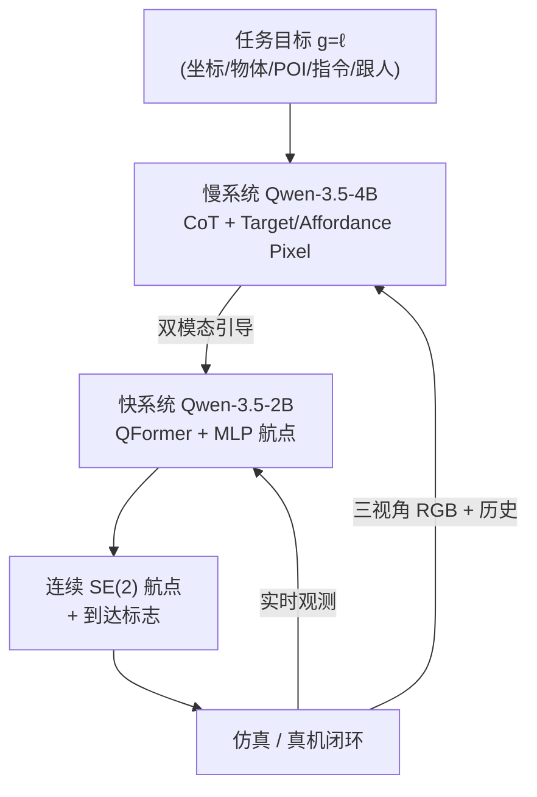
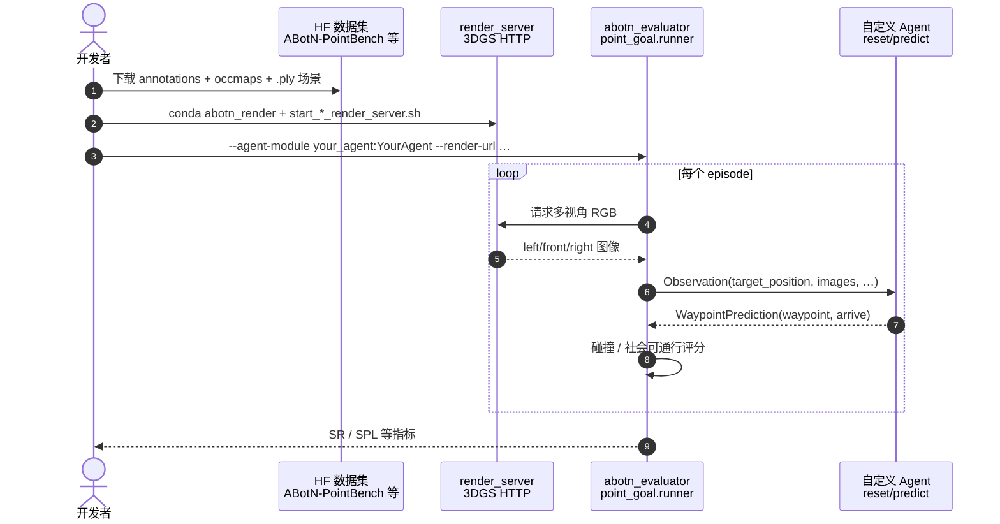

# ABot-N1（通用视觉–语言导航基础模型）

**ABot-N1**（*ABot-N1: Toward a General Visual Language Navigation Foundation Model*，[arXiv:2607.10383](https://arxiv.org/abs/2607.10383)，2026-07 技术报告）由 **阿里巴巴高德 AMAP CV Lab** 提出：用 **慢–快双系统** 把 **CoT 语义推理** 与 **高频连续控制** 解耦，并以 **像素目标（Target / Affordance Pixel）** 作为五类导航任务的统一中间接口，缓解单体 VLA 的坐标漂移、长尾语义与黑箱不可解释问题。

## 一句话定义

**慢 VLM 做可读的 CoT 并输出图像空间像素锚点，快 VLM 据此生成原生控制频率的连续 SE(2) 航点——把点目标、物体、POI、语言指令与跟人五任务压到同一「追像素」接口上。**

## 英文缩写速查

| 缩写 | 英文全称 | 简要说明 |
|------|----------|----------|
| VLN | Vision-and-Language Navigation | 视觉–语言导航，自然语言/语义条件下的具身移动 |
| VLA | Vision-Language-Action | 视觉–语言–动作统一策略范式 |
| CoT | Chain-of-Thought | 逐步文本推理轨迹，慢系统显式输出 |
| GRPO | Group Relative Policy Optimization | 慢系统 outcome-driven 后训练对齐算法 |
| POI | Point of Interest | 兴趣点（商铺入口等地标）导航目标 |
| SE(2) | Special Euclidean Group in 2D | 平面位置 + 航向的连续运动群 |
| 3DGS | 3D Gaussian Splatting | 高保真场景重建，ABotN-Bench 观测渲染栈 |

## 为什么重要

- **架构读点清晰：** 相对 [ABot-N0](https://amap-cvlab.github.io/ABot-Navigation/ABot-N0/) 等 **单体 Brain–Action VLA**，N1 把 **推理频率** 与 **控制频率** 拆开，并用 **人类可读的 CoT + 像素锚点** 作瓶颈，便于区分「语义错了」还是「空间指错了」。
- **城市级基准缺口：** 开源 **ABotN-PointBench**（31 真实 3DGS 场景、465 轨迹）与 **ABotN-POIBench**（163 POI）填补 **闭环、社会规则可通行** 的 Point/POI 评测空白；附带 **Short-Horizon OVON** 隔离物体「识别–接近」阶段。
- **五任务单 checkpoint 领先叙事（2026-08 技术报告口径）：** 报告在 Point / POI / Object / VLN-CE R2R·RxR / Person-Following 七套基准上领先当时的专精与多任务基线，**POI 到达 +35.0 pp（至 77.3%）** 与 **室内外 Point-Goal 95.4% / 92.9% SR** 是城市部署的主证据。
- **与通才 VLA 的对照轴：** 同 Qwen 系骨干族可与 [Qwen-VLA](./qwen-vla.md) 对照；N1 更强调 **导航专用慢–快接口** 而非操作–导航大一统 checkpoint。

## 核心信息

| 项 | 内容 |
|----|------|
| **机构** | 阿里巴巴（Alibaba）高德 AMAP CV Lab |
| **慢系统** | Qwen-3.5-4B-VL；低频 CoT + Target/Affordance Pixel |
| **快系统** | Qwen-3.5-2B-VL + QFormer 动作查询 + MLP；smooth-L1 航点 + 到达分类 |
| **数据** | 约 **30M** 轨迹；**8,423** 场景；五任务各自 CoT + VLA 合成管线 |
| **后训练** | 慢系统 **GRPO**（格式/安全/任务奖励解耦；动作平衡采样） |
| **开源** | **部分开源**：[`amap-cvlab/ABot-Navigation`](https://github.com/amap-cvlab/ABot-Navigation)（`ABotN-Bench`）基准 + 评测 + 3DGS 渲染；**模型权重 / 训练栈截至 2026-08-31 未发布** |

核查日：**2026-08-31**（[项目页](https://amap-cvlab.github.io/ABot-Navigation/ABot-N1/)、[GitHub `ABotN-Bench`](https://github.com/amap-cvlab/ABot-Navigation/tree/ABotN-Bench)）。

## 核心原理

### 慢–快接口

| 子系统 | 输入 | 输出 | 频率 |
|--------|------|------|------|
| **慢推理器** | 历史帧缓冲、三视角 RGB、任务语言 $g=\ell$、上轮 $(\mathcal{C}_{n-1}, \mathbf{p}_{n-1})$ | CoT 文本 $\mathcal{C}_n$ + 像素目标 $\mathbf{p}_n$（目标像素 + 可通行 affordance 像素） | 低频异步 |
| **快动作专家** | 实时观测、慢系统缓存的 CoT 与像素、本体 $q_t$ | 连续航点块 $a_{t:t+H}$（$x,y,\sin\theta,\cos\theta$ + 到达标志） | 原生控制频率 |

五类任务（Point / Object / POI / Instruction / Person-Following）均通过 **统一语言指令** 编码目标，再经慢系统 **图像空间重接地**，避免纯 ego 坐标偏移落进不可通行区域。

### 流程总览

### 训练配方（两阶段）

1. **预训练：** 慢系统 CE（CoT + 像素）；快系统在慢系统离散决策后做 **近似单峰** smooth-L1 回归；输入加噪（坐标扰动、异步滞后）。
2. **GRPO 后训练：** 仅慢系统；奖励 = 格式 + 安全几何 + 可替换任务到达；平衡采样防「永久不动 / 隐瞒目标」。

## 源码运行时序图

官方仓 [`amap-cvlab/ABot-Navigation`](https://github.com/amap-cvlab/ABot-Navigation)（`ABotN-Bench` 分支）提供 **基准闭环评测** 入口（归档见 [sources/repos/abot-navigation.md](../../sources/repos/abot-navigation.md)）。**ABot-N1 策略权重与训练脚本截至入库日未发布**，下图描述 **可复现的评测运行时序**：

- **最短评测路径：** `pip install -e .` → 部署 `render_server` → 实现 `BasePointGoalAgent` → `python -m abotn_evaluator.point_goal.runner …`。
- **模型推理：** **不适用**（无官方 ABot-N1 checkpoint）；待权重发布后应补「慢–快异步推理」时序图。

## 工程实践

| 主题 | 要点 |
|------|------|
| 基准选型 | 城市 Point/POI 优先 **ABotN-PointBench / POIBench**；物体接近阶段用 **Short-Horizon OVON**；语言导航仍对照 VLN-CE R2R/RxR |
| 硬件 | 渲染服务 README 建议 **≥24 GB VRAM**、CUDA 11 独立环境；评测机与渲染机可分离 |
| 自定义 agent | 只需 `reset()` + `predict(Observation)`；观测含三视角 RGB 与相对目标坐标 |
| 部署读法 | 论文真机强调 **低精度 SD 地图 + 像素重接地** 即可长程城市导航，降低对高精地图依赖 |
| 开源边界 | 勿将「技术报告 + 基准开源」误读为「SOTA 策略可复现」 |

## 局限与风险

- **权重未发布：** 截至 2026-08-31 无法本地复现报告中的成绩数字，仅能跑基准与自研 agent 对照。
- **慢–快异步：** 缓存像素目标在极端动态场景可能滞后；论文以噪声注入缓解，真机仍须验安全边界。
- **与 ABot-N0 关系：** N1 为架构演进（像素接口 + GRPO），非简单 scale；跨代数字需看任务分项而非单 SR。
- **评测栈复杂度：** 3DGS 渲染 + 双 conda 环境，CI 集成成本高于纯 Habitat 离散动作基准。

## 评测要点

| 基准 | ABot-N1（报告） | 备注 |
|------|-----------------|------|
| ABotN-PointBench 室外 | SR **92.9%** / SPL **91.4%** | SR&lt;3col 社会规则 |
| ABotN-PointBench 室内 | SR **95.4%** / SPL **93.7%** | SR&lt;1col |
| ABotN-POIBench | SR **77.3%** / SPL **72.6%** | 相对 POINav 42.3% 大幅提升 |
| Short-Horizon OVON | SR **84.9%** / DTG **0.822** | 物体接近 |
| VLN-CE R2R | NE **3.32** / SR **70.9%** | 语言指令 |
| VLN-CE RxR | NE **3.13** / SR **73.9%** | 多语言长指令 |
| Person-Following EVT | STT SR **90.1%** | 动态跟人 |

## 与其他工作对比

四条路线的分歧不在骨干大小，而在 **慢/快之间放什么接口**：

| 工作 | 架构 | 慢–快之间的接口 | 任务覆盖 | 相对 ABot-N1 |
|------|------|-----------------|----------|--------------|
| **ABot-N1** | 慢 4B + 快 2B，异步 | **CoT 文本 + Target/Affordance 像素** | 五任务单 checkpoint | — |
| [ABot-N0](https://amap-cvlab.github.io/ABot-Navigation/ABot-N0/) | 单体 Brain–Action VLA | 无显式瓶颈（端到端 latent） | 导航 | 前代；N1 是**接口层的架构演进 + GRPO**，非单纯 scale，跨代应看任务分项而非单 SR |
| [Green for Go](./paper-green-for-go-vla-nav-grounding.md) | **冻结 VLA + 视觉提示** | 画在图像上的外部提示 | 导航接地 | 同样落在**图像空间**，但提示来自外部模块；N1 的像素目标是**内生**的、且可被 GRPO 按到达结果对齐 |
| [Qwen-VLA](./qwen-vla.md) | 通才 VLA | 端到端 | 操作—导航通用 | 同 Qwen 骨干族；N1 不追大一统 checkpoint，只做**导航专用**慢–快接口 |
| [ABot-M0.5](./paper-abot-m05-mobile-manipulation-wam.md) | 移动操作 WAM | 未来观测—动作联合 | 移动操作 | 同机构互补线：一个把未来**观测**当接口，一个把**像素锚点**当接口 |

- **可诊断性是主要卖点**：CoT + 像素锚点让「语义错了」与「空间指错了」可分离归因，这是端到端 latent 接口做不到的；代价是慢系统缓存在极端动态场景可能滞后（见「局限与风险」）。
- **基准不可横比**：ABotN-PointBench 用 **3DGS 闭环 + 社会可通行评分**，与旧 open-loop waypoint 基准的 SR/SPL 不在同一口径；POI **77.3%** 的 +35.0 pp 增益也应对照其自建基准读。
- **开源边界的差异**：本文开源的是 **评测基础设施**（`ABotN-Bench`），策略权重截至 2026-08-31 未发布——与上表中已放权重的通才 VLA 相比，复现能力完全不同层级。

## 结论

**一句话总判：ABot-N1 的真贡献是「CoT + 像素目标」作为慢–快之间的可读、可 RL 对齐接口，并在城市级 Point/POI 闭环基准上给出强证据；当前开源价值主要在评测基础设施，而非策略权重。**

1. **选型** — 若关心 **城市 POI / 点目标闭环** 与 **可解释中间表示**，优先读本页与 ABotN-Bench；若只要 Habitat 离散 VLN 复现，仍先看 [VLN 任务页](../tasks/vision-language-navigation.md) 经典栈。
2. **架构** — 慢系统负责 **开放词汇与长尾语义**；快系统只做 **追像素**——勿把五任务统一误解为五个独立头。
3. **训练** — GRPO 对齐 **到达结果** 而非 token 似然，是像素目标物理可行的关键；复现时需同时看安全奖励设计。
4. **基准** — ABotN-PointBench 的 **社会可通行评分** 与 **3DGS 闭环** 与旧 open-loop waypoint 基准不可直接横比。
5. **开源** — 现阶段可 **评测自定义 agent**；等 checkpoint 发布后再补推理部署与真机复现。
6. **对照** — 与 [Qwen-VLA](./qwen-vla.md) 比 **导航接口设计**；与 [Green for Go](./paper-green-for-go-vla-nav-grounding.md) 比 **冻结 VLA + 视觉提示** vs **内生慢–快**。

## 关联页面

- [视觉–语言导航（VLN）](../tasks/vision-language-navigation.md) — 任务定义与经典基准
- [VLA](../methods/vla.md) — 视觉–语言–动作通才范式
- [ABot-M0.5](./paper-abot-m05-mobile-manipulation-wam.md) — 同机构移动操作 WAM
- [ABot-World-0](./paper-abot-world-0.md) — 同机构交互式世界模型
- [Qwen-VLA](./qwen-vla.md) — Qwen 系通才 VLA 对照

## 参考来源

- [ABot-N1 论文归档](../../sources/papers/abot_n1_arxiv_2607_10383.md)（[arXiv:2607.10383](https://arxiv.org/abs/2607.10383)）
- [ABot-N1 项目页归档](../../sources/sites/abot-n1.md)
- [ABot-Navigation 仓库归档](../../sources/repos/abot-navigation.md)

## 推荐继续阅读

- 官方项目页与真机视频：<https://amap-cvlab.github.io/ABot-Navigation/ABot-N1/>
- 基准快速上手：<https://github.com/amap-cvlab/ABot-Navigation/tree/ABotN-Bench/docs/getting-started.md>
- 前代 ABot-N0 技术报告：<https://arxiv.org/pdf/2602.11598>
