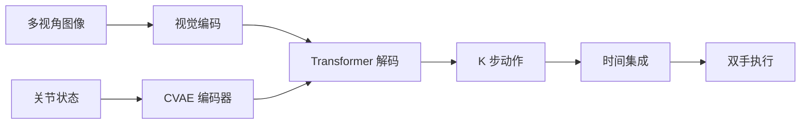
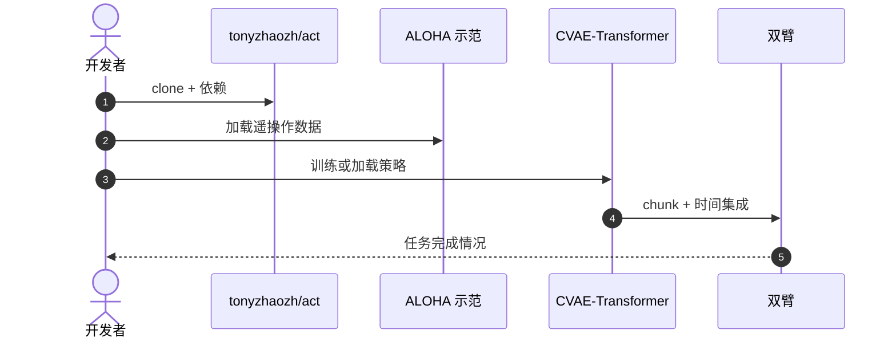

# ACT：低成本硬件上的动作块 Transformer

**ACT**（*Learning Fine-Grained Bimanual Manipulation with Low-Cost Hardware*，[arXiv:2304.13705](https://arxiv.org/abs/2304.13705)，[代码](https://github.com/tonyzhaozh/act)）由 **斯坦福大学** 提出：用 **CVAE + Transformer** 一次预测未来 **K** 步动作，在约 **$2k** 的 ALOHA 双臂上做精细操作。机制页见 [action-chunking](../methods/action-chunking.md)。

## 一句话定义

**一次输出一短段动作，用时间集成抹平抖动，让低频策略驱动高频双手。**

## 英文缩写速查

| 缩写 | 英文全称 | 简要说明 |
|------|----------|----------|
| ACT | Action Chunking with Transformers | 本方法 |
| CVAE | Conditional Variational Autoencoder | 多样化 chunk 生成 |
| ALOHA | 低成本双臂遥操作平台 | 论文配套硬件 |
| TE | Temporal Ensemble | 重叠 chunk 平均 |

## 为什么重要

- 纳入 [VLA/WM 阅读路线](../../sources/blogs/wechat_embodied_ai_lab_vla_wm_reading_roadmap_2026-09-02.md) 的动手入门。
- Action chunking 后来成为 VLA 标配，机制解释见 [why action chunking](./paper-why-action-chunking-improves-bc.md)。
- 证明低成本遥操作 + 简单算法也能做精细双手。
- **已开源** `tonyzhaozh/act`。

## 核心信息

| 项 | 内容 |
|----|------|
| **机构** | 斯坦福大学 |
| **硬件** | ALOHA 低成本双臂 |
| **结构** | 多视角视觉编码 + CVAE + Transformer 解码 |
| **控制** | chunk 预测 + 时间集成 |
| **开源** | **已开源** [tonyzhaozh/act](https://github.com/tonyzhaozh/act) |

### 流程总览

## 评测

- 精细双臂任务上相对逐步 BC 更稳。
- chunk 长度与时间集成是主超参。
- 表以 [原文](https://arxiv.org/abs/2304.13705) 为准。

## 结论

**入门模仿学习优先 ACT + ALOHA 路线：先跑通 chunk，再换扩散或 VLA 头。**

- 推理频率可以从控制频率里解耦
- 双手必须联合建模，不要两只胳膊各训一个策略
- 时间集成减抖，但会引入开环播放风险
- 后续 VLA 的 chunk 多从此处工程化
- 机制深挖读 [action-chunking](../methods/action-chunking.md)

## 源码运行时序图

## 局限与风险

- **无语言：** 不是 VLA；指令跟随要另接。
- **开环 chunk：** 过长会在扰动下崩。
- **专家类型：** 脚本/遥操作分布不同，见 ParcelStow 时间鲁棒性讨论。

## 与其他工作对比

| 工作 | 相对本页 |
|------|----------|
| [Diffusion Policy](./paper-diffusion-policy.md) | 去噪生成 chunk |
| [OpenVLA](./paper-openvla.md) | 语言条件 + 大模型 |
| [why-AC 论文](./paper-why-action-chunking-improves-bc.md) | 解释 chunk 为何有效 |

## 关联页面

- [Action Chunking](../methods/action-chunking.md)
- [Diffusion Policy](./paper-diffusion-policy.md)
- [Why Action Chunking Improves BC](./paper-why-action-chunking-improves-bc.md)
- [ParcelStow](./paper-parcelstow.md) — ACT 在 G1 包裹插入上的速度扫频：标称 100%，\(r=2\) 53%
- [VLA/WM 14 篇路线](../overview/vla-wm-reading-roadmap-14-papers-technology-map.md)

## 推荐继续阅读

- [arXiv:2304.13705](https://arxiv.org/abs/2304.13705)
- [tonyzhaozh/act](https://github.com/tonyzhaozh/act)

## 参考来源

- [act_arxiv_2304_13705](../../sources/papers/act_arxiv_2304_13705.md)
- [具身智能研究室 VLA/WM 阅读路线](../../sources/blogs/wechat_embodied_ai_lab_vla_wm_reading_roadmap_2026-09-02.md)
- [act-aloha](../../sources/repos/act-aloha.md)
