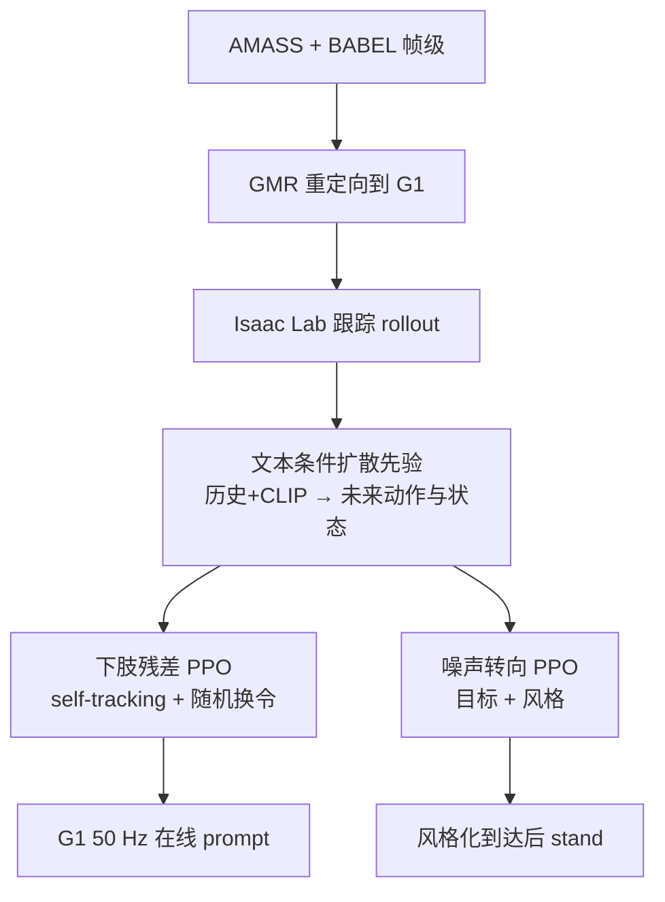

# ADAPT：端到端文本驱动人形控制

**ADAPT**（*Agile Diffusion Action Priors for Robust and Steerable Online Text-Driven Humanoid Control*，[arXiv:2609.00677](https://arxiv.org/abs/2609.00677)，[项目页](https://wuyan01.github.io/ADAPT-project/)）由 **苏黎世联邦理工（ETH Zürich）**（Yan Wu / Chenhao Li / Kaifeng Zhao / Gen Li / Marco Hutter / Siyu Tang）提出：用文本条件扩散策略直接出 G1 关节动作，再叠约束残差 RL 做在线换 prompt，并把同一冻结先验用噪声转向接到目标到达。

> **同名警告：** 本页不是 [AdaPT：人形网球自适应规划与跟踪](./paper-adapt.md)（arXiv:2608.20087，Noitom / 上海 AI Lab）。那篇是规划–跟踪网球；本篇是 **语言→全身动作** 的端到端扩散先验。

## 一句话定义

**交互式语言控制是闭环动力学问题：帧级文本对齐的扩散先验出动作，下肢残差只负责不摔，噪声转向复用同一先验做带风格的到达。**

## 英文缩写速查

| 缩写 | 英文全称 | 简要说明 |
|------|----------|----------|
| ADAPT | Agile Diffusion Action Priors | 本文框架（本页）；勿写成网球 AdaPT |
| DDIM | Denoising Diffusion Implicit Models | 推理用 2 步，约 2 ms |
| CLIP | Contrastive Language–Image Pretraining | 冻结文本编码器 |
| PPO | Proximal Policy Optimization | 残差与噪声转向的训练算法 |
| G1 | Unitree G1 Humanoid | 29 DoF 真机；ONNX + TensorRT |
| BABEL | Bodies, Action and Behavior with English Labels | 帧级技能标注，不是 clip 级 caption |

## 为什么重要

- 两阶段 text-to-motion（[TextOp](./paper-loco-manip-161-022-textop.md)、Kimodo、[SONIC](../methods/sonic-motion-tracking.md) 跟踪栈）在**快速换令**时容易吐出跟踪器跟不住的参考。
- 端到端 [LangWBC](./paper-bfm-37-langwbc.md) / [SENTINEL](./paper-sentinel.md) 多用序列级标题，训练看不到片段内切换边界。
- 同作者 [UniPhys](./paper-bfm-40-uniphys.md) 已在角色动画里做端到端扩散；本篇把延迟压到 **2 ms / 50 Hz** 并上 **G1 真机**。
- **截至 2026-09-03 未开源** — 项目页无 GitHub / 权重。

## 核心信息

| 项 | 内容 |
|----|------|
| **机构** | 苏黎世联邦理工（ETH Zürich） |
| **数据** | AMASS + BABEL 帧级标签；GMR 重定向；TextOp 跟踪策略在 Isaac Lab 采集 \((o,a,\ell)\) |
| **骨干** | 8 层因果 Transformer，512-d / 8 头；观测 96-D（含上一动作）；动作 29-D |
| **控制** | 50 Hz；物理 \(5\,\mathrm{ms}\) × decimation 4 |
| **开源** | **确认未开源**（项目页未列仓库；页脚 BibTeX 仍是 UniPhys / NaP-Control） |

### 流程总览

## 核心原理

**扩散技能先验。** clip \(T=20\)、历史 \(H=5\)；只对未来段加噪，历史保持干净。逐帧独立噪声对齐自回归 rollout。历史中的根线速度置零，避免真机依赖不可靠的速度估计。CFG dropout 0.1，推理 CFG 2.5。

**约束残差。** \(a_t=a_t^{\mathrm{diff}}+\alpha(m\odot\Delta a_t^{\mathrm{res}})\)。掩码 \(m\) 只开髋/膝/踝/腰；\(\alpha\) 在前 100k 步从 0 热到 0.05。self-tracking 让修正后的状态贴近扩散预测的 \(\hat o_{t+1}\)。残差策略**不看文本**——语言全由冻结先验承担。训练每 5–10 s 换原子技能，并按摔倒率加采样难指令。

**噪声转向。** 下游目标到达时，PPO 输出扩散初始噪声而不是残差力矩。同一冻结先验可走 “run” / “walk while bending over” / 训练未见的 “jog”，到点后切 `stand`。

## 评测

交互控制（2048 条 20 s rollout，130 命令，每 5–10 s 换 prompt；语义指标只在未摔倒回合上算）：

| 方法 | Success | R@1 | 读法 |
|------|---------|-----|------|
| DART + 跟踪 | 0.764 | 39.05% | 两阶段，且给了离线 lookahead |
| Offline TextOp | 0.522 | 45.52% | 两阶段上界仍低 |
| LangWBC | 0.923 | 40.89% | 稳但不对齐 |
| w/o residual | 0.804 | **59.50%** | 纯 BC 语义最好 |
| **ADAPT** | **0.984** | 44.60% | 用对齐换成功率 |

真机 5 trial：Walk / Jog **5/5**，Kick **4/5**，Jump **3/5**。失败集中在长单腿支撑与反复高跳，多数能先切站立再倒。

目标到达（200×5 风格）：转向 **97.1%** 成功 / **2.9%** 摔倒；随机噪声 **18.0% / 34.7%**。未见过的 jog：**95.5% / 4.5%**。

残差消融：去掉下肢空间约束 Success 到 0.997，但 R@1 掉到 **26.19%**——残差靠改写指令活下来。2 步 DDIM 是部署点（1 步 Success 0.706；5 步 4 ms 且 Success 0.792）。

## 结论

**端到端扩散先验能上 G1 做在线换令，前提是残差被空间约束住、推理步数压到实时。**

1. **两阶段在高跳/踢腿上先死于不可行参考** — 本文在线闭环仍高于带 lookahead 的离线两阶段。
2. **残差换的是成功率不是语义** — 纯 BC R@1 更高（59.5 vs 44.6）；部署应读 0.804→0.984 的不摔增益。
3. **空间约束是防语义崩塌的硬约束** — 去掉后几乎不摔，但不再做被点名的动作。
4. **噪声转向让先验可复用** — 不必为到达重训运动；未见 jog 也能到。
5. **真机短板是单腿与反复跳** — 走慢跑已稳，别把 0.984 仿真成功率读成真机全能。
6. **复现入口不存在** — 2026-09-03 项目页无代码。

## 源码运行时序图

**不适用。** 项目页与 arXiv 截至 2026-09-03 未列 GitHub；附录只描述 Isaac Lab 训练与 G1 上 ONNX+TensorRT 部署，无可对齐的官方脚本。

## 工程实践

| 项 | 论文/项目页口径 |
|----|-----------------|
| 真机推理 | 笔记本 RTX 5080 + TensorRT，2 ms @ 50 Hz |
| 换令 | ROS topic 异步送文本 |
| 到达目标 | 机载 LiDAR-惯性里程计坐标系 |
| 残差奖励 | 上身紧核跟踪、下肢宽核；残余动作 L2；终止 -20 |

## 局限与风险

- **残差会把过高动态往站立拽** — 高跳、猛拳可能被「改安全」。
- **模型刻意偏小** — 作者用容量换 2 ms；更大模型要蒸馏或异步 chunk。
- **未开源** — 数字不可在官方仓复核。

## 与其他工作对比

| 维度 | ADAPT（本页） | [LangWBC](./paper-bfm-37-langwbc.md) | [TextOp](./paper-loco-manip-161-022-textop.md) | [AdaPT 网球](./paper-adapt.md) |
|------|---------------|--------------------------------------|-----------------------------------------------|------------------------------|
| 接口 | 文本 + 本体 → 关节 | 语言 → 端到端 WBC | 文本 → 运动学 → 跟踪 | 无语言；风格化击球 |
| 监督粒度 | **BABEL 帧级** | 序列级 caption | 生成整段再跟 | MoCap / 转播片段 |
| 换令 | 训练显式随机切换 | 偏持续技能 | 快切时参考易不可行 | 不适用 |
| 开源 | **未开源** | 见其页 | 见其页 | Stage1 发球跟踪已开 |

## 关联页面

- [Unitree G1](./unitree-g1.md)
- [LangWBC](./paper-bfm-37-langwbc.md)
- [TextOp](./paper-loco-manip-161-022-textop.md)
- [UniPhys](./paper-bfm-40-uniphys.md) — 同作者角色动画前作
- [AdaPT（网球）](./paper-adapt.md) — 同名另一篇
- [SENTINEL](./paper-sentinel.md)
- [SONIC](../methods/sonic-motion-tracking.md)
- [Motion Retargeting Pipeline](../concepts/motion-retargeting-pipeline.md)

## 推荐继续阅读

- [ADAPT 项目页](https://wuyan01.github.io/ADAPT-project/)
- [arXiv:2609.00677](https://arxiv.org/abs/2609.00677)
- [UniPhys 项目页](https://wuyan01.github.io/uniphys-project/)

## 参考来源

- [adapt_arxiv_2609_00677](../../sources/papers/adapt_arxiv_2609_00677.md)
- [ADAPT 项目页归档](../../sources/sites/adapt-project.md)
