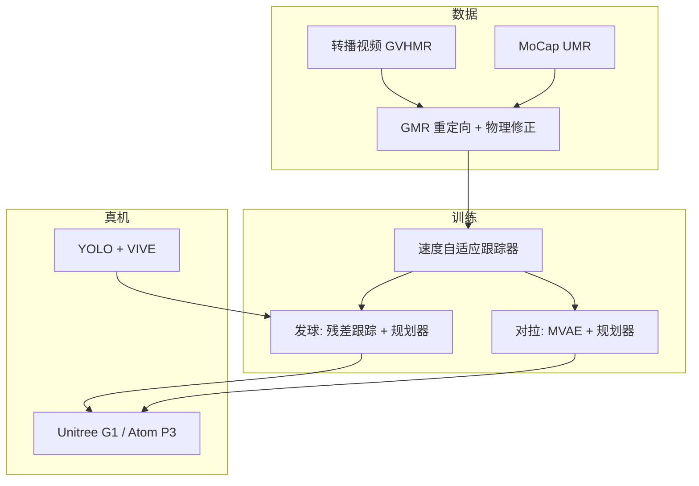
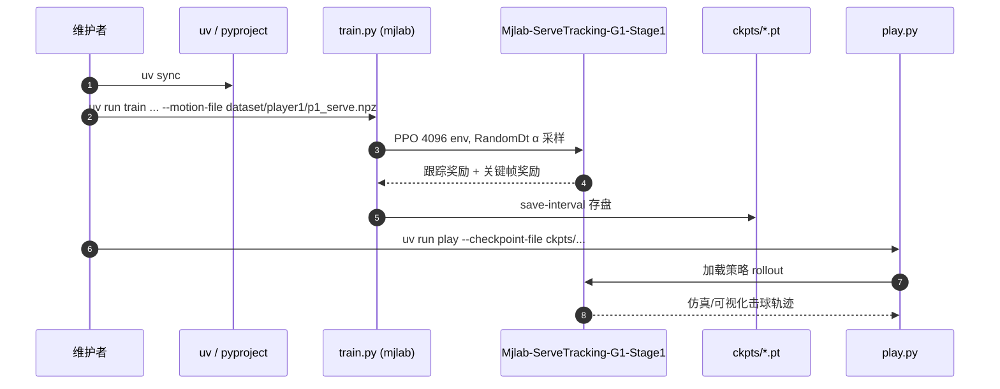

# AdaPT（人形网球自适应规划与跟踪）

> **同名警告：** 本页是网球规划–跟踪 **AdaPT**（arXiv:2608.20087）。ETH 的端到端文本运动控制见 [ADAPT（Agile Diffusion Action Priors）](./paper-adapt-text-driven-humanoid.md)（arXiv:2609.00677），两篇缩写相近、问题不同。

**AdaPT**（*Towards Professional Tennis Styles for Humanoid Robots with Adaptive Motion Planning and Tracking*，[arXiv:2608.20087](https://arxiv.org/abs/2608.20087)，[项目页](https://humanoidtennis.github.io/AdaPT/)）提出 **Adaptive motion Planning and Tracking**：从职业球员转播与 MoCap 学习 **风格化全身网球技能**，用 **解耦规划–跟踪** 保留运动风格，并以 **执行速度自适应** 缩小仿真到真机的复合误差。

## 一句话定义

**规划器生成风格化运动学轨迹、跟踪器用随机化速度训练与 α 适配执行**——在 G1 / Atom 上复现 Nadal、Federer、Djokovic 等对拉与发球风格，并支持无 MoCap 野外发球。

## 英文缩写速查

| 缩写 | 英文全称 | 简要说明 |
|------|----------|----------|
| AdaPT | Adaptive motion Planning and Tracking | 本文框架：速度自适应规划 + 跟踪 |
| MVAE | Multivariate Variational Autoencoder | 对拉运动生成器（延续 Vid2Player3D） |
| GMR | General Motion Retargeting | 人体/视频运动重定向到人形 |
| GVHMR | Gravity-View Human Motion Recovery | 从单目视频恢复 SMPL 运动 |
| G1 | Unitree G1 Humanoid | 主要真机平台之一 |
| RL | Reinforcement Learning | Mjlab + PPO 训练跟踪与规划策略 |
| MoCap | Motion Capture | 专业运动员高精度动作采集 |
| UMR | Unified Motion Retargeting | MoCap 支路重定向；论文已发、代码仍待发布 |

## 为什么重要

- **风格与任务并重：** 相对 LATENT 等偏任务成功率的人形网球线，AdaPT 显式保留 **职业球员全身协调风格**（转体、引拍、恢复步），并报告仿真中风格–成功率权衡。
- **解耦 + 速度适配应对 sim2real：** Vid2Player3D 式解耦在真机上面临跟踪退化 × 自回归规划 × 感知噪声；**α 混合参考帧** 让规划器适配跟踪器能力，跟踪器在训练中见过多速度。
- **多源运动与多机体：** 转播视频（GVHMR→GMR）与 MoCap（[UMR](./paper-umr-unified-motion-retargeting.md)）统一管线；**G1** 与 **~1.7 m Atom** 验证尺度泛化。UMR 论文已在 arXiv:2609.02134，**实现仍待发布**。
- **工程可复现入口：** [noitom-robotics/AdaPT](https://github.com/noitom-robotics/AdaPT) 已发布 **Stage1 发球跟踪** 训练/play（Apache-2.0）。

## 核心方法与结构

| 模块 | 作用 |
|------|------|
| **数据管线** | 2 s 转播片段 + MoCap；stroke/spin/触球/抛球时刻标注；物理修正跟踪器精炼 |
| **速度自适应跟踪** | \(\hat{q}_t^\alpha=(1-\alpha)\hat{q}_{t-1}+\alpha\hat{q}_t\)；对拉含 root orientation |
| **对拉规划** | MVAE 解码器 + \(\pi^{\mathrm{rally}}_{\mathrm{plan}}(z_t,\alpha_t\mid\) 球轨迹、姿态\()\) |
| **发球规划** | 直接跟踪 \(\mathcal{D}_{\mathrm{serve}}\) + **残差跟踪器** \(\Delta a_t\)；关键帧引拍奖励 |
| **真机感知** | YOLO 球检测 + VIVE 定位；野外发球无 MoCap |

### 流程总览

## 实验要点（索引级）

| 轴 | 报告口径 |
|----|----------|
| **仿真** | 对拉/发球 vs RL-Scratch、AMP、PULSE、Vid2Player3D、AdaMimic 等；AdaPT 在成功率与 \(E_{\mathrm{FID}}\) 等风格指标更均衡 |
| **真机** | G1 对拉与发球；Atom 野外发球 |
| **数据** | 三球员转播 + Mr. Black MoCap；项目页称总时长 **21.5 h** |
| **训练** | Mjlab PPO，4096 env，4×RTX 4090 |

## 结论

**AdaPT 把职业网球风格解耦为「风格化运动学规划 + 速度自适应跟踪」，用 α 显式桥接规划器与跟踪器能力，缓解人形球类 sim2real 的复合漂移。**

- **解耦规划–跟踪保留风格** — 对拉用 MVAE 生成多样击球；发球用残差跟踪适应抛球变化，关键帧约束引拍表达力。
- **速度自适应是 sim2real 核心** — 跟踪器训练见随机 α；规划器输出 α 适配 incoming 球速与跟踪能力。
- **多源数据与多机体验证** — 转播 + MoCap；G1 与全尺寸 Atom；野外发球证明感知栈可脱离 MoCap。
- **开源边界清晰** — GitHub 当前为 **Stage1 发球跟踪**；对拉规划与完整部署需跟进仓库 News。
- **与 LATENT / MotionWAM 对照** — LATENT 偏任务性能与连续 motion prior；AdaPT 偏 **风格保真 + 球类工程洞察**；MotionWAM 走 WAM 全身 loco-manip，问题设定不同。

## 工程实践与开源状态

| 项 | 状态 |
|----|------|
| **代码** | [noitom-robotics/AdaPT](https://github.com/noitom-robotics/AdaPT) — **部分开源**（Stage1 发球跟踪） |
| **权重** | `ckpts/player1/model_24000.pt` 等 |
| **环境** | `uv sync` + `uv run train/play Mjlab-ServeTracking-Flat-Unitree-G1-Stage1-RandomDt` |
| **未发布** | 对拉 MVAE 规划、完整 sim2real 感知部署脚本 |

## 源码运行时序图

> 范围：**已开源 Stage1 发球速度自适应跟踪**（`README.md` 入口）。

Stage1 在随机执行速度下学习跟踪参考发球动作；完整对拉闭环（MVAE 规划 + 球轨迹估计）尚未随仓发布。

## 常见误区或局限

- **误区：** 认为已开源即完整 AdaPT；当前仓主要为 **发球跟踪 Stage1**。
- **局限：** 风格数据依赖特定球员与视角；GVHMR 腕部需后处理；长 horizon 复合误差仍可能积累。

## 与其他页面的关系

- [Loco-Manipulation](../tasks/loco-manipulation.md) — 体育竞技子类
- [Motion Retargeting Pipeline](../concepts/motion-retargeting-pipeline.md) — GVHMR/GMR 管线
- [UMR](./paper-umr-unified-motion-retargeting.md) — MoCap 支路点名的统一点云重定向（代码待发布）
- [Unitree G1](./unitree-g1.md) — 真机平台
- [MotionWAM](./paper-motionwam-humanoid-loco-manipulation-wam.md) — 另一 G1 全身动态技能对照
- [Table Tennis Strategy & Skill](../methods/table-tennis-strategy-skill-learning.md) — 乒乓球分层技能（球类动画对照）
- [ADAPT（文本驱动扩散先验）](./paper-adapt-text-driven-humanoid.md) — 同名另一篇，ETH G1 语言控制

## 推荐继续阅读

- [AdaPT 论文（arXiv:2608.20087）](https://arxiv.org/abs/2608.20087)
- [AdaPT 项目页](https://humanoidtennis.github.io/AdaPT/)
- [AdaPT GitHub](https://github.com/noitom-robotics/AdaPT)

## 参考来源

- [AdaPT 论文归档](../../sources/papers/adapt_arxiv_2608_20087.md)
- [AdaPT 项目页归档](../../sources/sites/adapt-humanoidtennis.md)
- [AdaPT 官方仓库归档](../../sources/repos/adapt.md)
- [具身智能小站 10 篇盘点（2026-08-22）](../../sources/blogs/wechat_embodied_station_video_contact_control_10_papers_2026-08-22.md)
