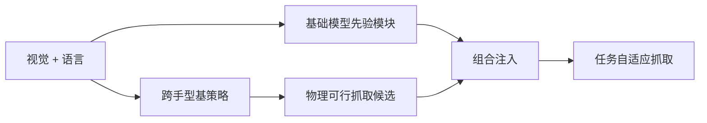

# AdaRoboVLG：可组合先验的自适应视觉语言抓取

**AdaRoboVLG**（*Adaptive Vision-Language Grasping via Composable Foundation Priors and Generalizable Grasp Synthesis*，[arXiv:2609.04096](https://arxiv.org/abs/2609.04096)，[项目页](https://adarobovlg.github.io/)）由 **华中科技大学（HUST）**、**擎朗智能（KEENON）**、**北京通用人工智能研究院（BIGAI）**、**北京大学**、**字节跳动** 等提出：面向视觉语言抓取（VLG），在不同机器人手之间生成可泛化抓取。它不把基础模型与端到端抓取策略紧耦合，而是先学一个高效基策略——用 **显式运动学映射** 与 **force-closure 稳定性估计** 生成并评估物理可行候选——再把空间、认知、时间等任务理解交给可组合的基础模型模块。

## 一句话定义

**抓取系统的可扩展性，来自物理层稳定与语义层可替换的解耦，而不是再训一个端到端巨策略。**

## 英文缩写速查

| 缩写 | 英文全称 | 简要说明 |
|------|----------|----------|
| VLG | Vision-Language-Grasp | 语言条件下的抓取生成 |
| AdaRoboVLG | Adaptive Robotic Vision-Language Grasping | 本文框架简称 |
| FC | Force-Closure | 基策略评估候选稳定性的物理准则 |
| OOD | Out-of-Distribution | 未见手型 / 杂乱 / 动态场景 |

## 为什么重要

- 纳入 [九篇盘点](../../sources/blogs/wechat_embodied_station_9_papers_open_source_2026-09-04.md) 的「可泛化操作」支线。
- 换手型时优先保住物理可行，而不是重训整条 VLA。
- 先验按任务组合，避免「一个新能力 = 一个新策略」。

## 方法

| 项 | 内容 |
|----|------|
| **机构** | 华中科技大学、擎朗智能、BIGAI、北京大学、字节跳动 |
| **基策略** | 运动学映射 + force-closure 评估 |
| **语义层** | 可组合 foundation priors（空间 / 认知 / 时间） |
| **开源** | **待发布**（截至 2026-09-04 仅项目页） |

### 流程总览

## 评测

论文与项目页报告：基策略具备较强跨手型泛化；组合先验覆盖三类代表性抓取挑战，并在杂乱与动态环境中支持功能性抓取。**入库日未见** 与公开 VLG 榜单对齐的单一汇总成功率表——选型时以项目页实验页为准，勿把叙事写成已对标 LIBERO/GraspNet 数字。

## 结论

**先保证抓得住，再把「听懂任务」做成可插拔先验。**

1. **物理层独立** — 运动学 + force-closure 不绑死某一只手。
2. **语义层可替换** — 新能力加模块，不重训基策略。
3. **紧耦合 VLG 的反面** — 基础模型不应吞掉抓取可行性。
4. **真机叙事在项目页** — 复现前先核视频与手型列表。
5. **代码待发布** — 工程细节与手型映射表未公开。

## 源码运行时序图

**不适用** — 截至 **2026-09-04** 项目页未列 GitHub。

## 工程实践

| 项 | 建议 |
|----|------|
| 何时引用 | 需要跨夹爪/多指手复用同一抓取栈 |
| 与端到端 VLA 对比 | VLA 把语义和抓取焊在一起；本框架先出物理候选 |
| 选型入口 | 对照 [抓取策略选型](../queries/grasp-policy-selection.md) |

## 局限与风险

- **代码未公开** — 手型 URDF 映射与先验接口待发布。
- **指标未对齐公开榜** — 不宜直接与 GraspNet / AnyGrasp 数字横比。
- **振动与接触保持** — 功能性抓取叙事强于长期工具使用（后者见 [ARTiS](./paper-artis-gripper.md)）。

## 与其他工作对比

| 对照 | 差异读法 |
|------|----------|
| 端到端 VLG / VLA | 语义与抓取紧耦合；AdaRoboVLG 解耦 |
| [AnyGrasp](./anygrasp.md) | 检测式稠密抓取 SDK；本文强调语言条件 + 跨手型 |
| [VTAP Gripper](./paper-vtap-gripper.md) | VTAP 做视触觉硬件；本文做抓取策略分层 |

## 关联页面

- [Manipulation](../tasks/manipulation.md)
- [抓取策略选型](../queries/grasp-policy-selection.md)
- [VLA](../methods/vla.md)
- [开源可复现性 9 篇地图](../overview/open-source-reproducibility-9-papers-technology-map.md)

## 参考来源

- [adarobovlg_arxiv_2609_04096](../../sources/papers/adarobovlg_arxiv_2609_04096.md)
- [AdaRoboVLG 项目页](../../sources/sites/adarobovlg.md)
- [具身智能小站 2026-09-04 九篇盘点](../../sources/blogs/wechat_embodied_station_9_papers_open_source_2026-09-04.md)

## 推荐继续阅读

- [arXiv:2609.04096](https://arxiv.org/abs/2609.04096)
- [AdaRoboVLG 项目页](https://adarobovlg.github.io/)
