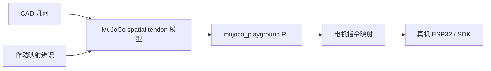
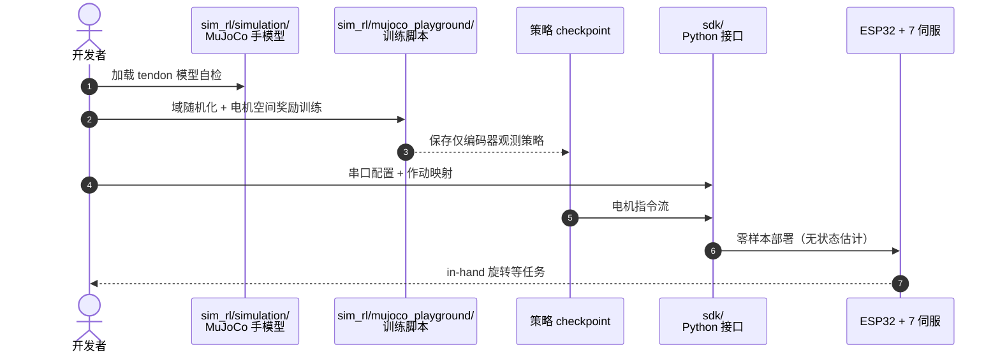

# Aero Hand Open：仿真就绪的腱驱灵巧手

**Aero Hand Open**（*A Simulation-Ready Tendon-Driven Hand for Dexterous Manipulation Learning*，[arXiv:2608.28578](https://arxiv.org/abs/2608.28578)，[项目页](https://tetheria.github.io/aero-hand-open/)，[代码](https://github.com/TetherIA/aero-hand-open)，TetherIA / Chestnut Robotics）发布 **7 电机驱动 16 关节** 的腱驱拟人手（**374 g，BOM ~$314**），并配套 **MuJoCo 缆绳传动模型**、**双向辨识作动映射** 与 **RL 训练栈**，使策略可 **零样本** 从仿真迁移真机（演示 in-hand 立方体旋转）。

## 一句话定义

**把腱驱手的「缆绳–耦合–编码器」整条传动链建模清楚，比堆关节 PD 更能决定廉价灵巧手能否 sim2real。**

## 英文缩写速查

| 缩写 | 英文全称 | 简要说明 |
|------|----------|----------|
| MCP / PIP / DIP | Metacarpophalangeal / Proximal / Distal Interphalangeal | 指关节命名 |
| CMC | Carpometacarpal | 拇指腕掌关节（含外展 linkage） |
| RL | Reinforcement Learning | mujoco_playground 训练 in-hand 等任务 |
| Sim2Real | Simulation to Real | 本文零微调部署叙事 |
| GRASP | Grasp Taxonomy | 33 类人手抓取分类（全文覆盖） |
| FDM | Fused Deposition Modeling | 全手 3D 打印制造 |

## 为什么重要

- **成本与能力拐点：** ~$314 覆盖 GRASP **33 类**抓取，对比 Leap/Shadow 等万元级平台。
- **腱驱 sim2real 难点被正面解决：** 欠驱动 + 缆绳摩擦/松弛 + 拇指三通道耦合——用 **spatial tendon + 辨识映射** 而非独立关节位置控制假装可学。
- **观测诚实：** 仅 **7 路电机编码器** 作本体感知，训练与部署观测空间一致。
- **全栈开源：** 机械、固件、SDK、ROS2 Humble、MuJoCo、RL 一条龙（设计文件 NC 许可需注意商业边界）。

## 核心信息

| 项 | 内容 |
|----|------|
| **机构** | TetherIA（论文注：已 rebranding 为 Chestnut Robotics） |
| **规格** | 16 关节 / 7 电机；374 g；指尖 ~12 N；~1.2 Hz 全行程 |
| **控制** | 位置/力矩/腱力 sensing；ESP32-S3 + Feetech HLS3606M |
| **开源** | **已开源** [TetherIA/aero-hand-open](https://github.com/TetherIA/aero-hand-open)；设计 CC BY-NC-SA |

## 核心原理

### 机械与传动

- 四指：单缆驱动 MCP→PIP→DIP，PIP–DIP **耦合缆**；被动回程弹簧分级（MCP 软 → 远端硬）实现 **分段闭合**。
- 拇指：外展 linkage + 两缆驱动 CMC 屈曲与 MCP–IP；**三通道互耦** 是仿真难点。
- **100% 反向驱动**；>40 万次全速循环耐久。

### MuJoCo 模型

- 16 hinge + **20 spatial tendons** + 7 actuators；CAD 对齐 wrap cylinder；关节等式约束复现耦合。
- GPU 训练：10 ms 步长、简化碰撞 primitive、剔除掌–指内部接触。

### 作动映射（系统辨识）

线性链：关节角 $\mathbf{q}$ → 缆绳行程 $\mathbf{d}$ → 电机角 $\boldsymbol{\theta}$ → 16-bit 指令 $u$；拇指含唯一负耦合项。双向通道验证 + 域随机化 → **零样本** 部署。

### 流程总览

## 源码运行时序图

节点对齐 [`sources/repos/aero-hand-open.md`](../../sources/repos/aero-hand-open.md)。

## 工程实践

| 项 | 建议 |
|----|------|
| 制造 | Bambu X1C，PLA，0.2 mm；约 13 h 打全套结构件 |
| 许可 | 软件 Apache-2.0；**CAD NC** — 商业量产需联系 Chestnut |
| 仿真 | 用发布 tendon 模型，勿用独立关节 PD 替代缆绳 |
| 部署 | `ros2/` 提供训练策略部署示例；观测限编码器 |
| 维护 | 模块化指节；磨损件可重打 |

## 实验与评测

- **抓取广度：** 单硬件配置完成 GRASP **33/33** 类（项目页与论文 Fig.1）。
- **载荷：** 指尖 ~12 N；整手提 ~18 kg 水桶（项目演示）；百万次循环可靠性测试。
- **RL：** in-hand **立方体旋转** — 仿真训练 → 真机 **零微调**（论文 §5 与项目页视频）。
- **对比：** Table 1 相对 InMoov / Leap / Shadow 等在 **价格–重量–DoF** 区间的定位。

## 结论

**Aero Hand Open 的价值不在「又一个便宜手」，而在把腱驱传动做到仿真可学、真机可零样本跑通。**

- **缆绳级 MuJoCo 是核心：** wrap 几何与耦合约束决定 moment arm 符号；简化成关节扭矩会毁掉 sim2real。
- **作动映射要双向验：** 线性 CAD 系数 + 通道级动态辨识，是零样本部署的必要条件而非锦上添花。
- **观测空间要诚实：** 仅电机编码器训练，避免仿真偷看关节角导致真机崩盘。
- **欠驱动是特性不是 bug：** 分段弹簧 + 耦合缆实现自适应包络，但 RL 奖励需针对电机空间而非虚构关节目标。
- **开源边界分清：** 可买成品做商业集成；**自产克隆** 需商业许可。
- **与 Paper Notebooks 占位页关系：** 已由 PROGRESS 占位升格为完整实体；深读细节见姊妹仓库笔记计划路径。

## 与其他页面的关系

- [paper-notebook-aero-hand-open](./paper-notebook-aero-hand-open.md) — 原 Paper Notebooks 索引占位
- [Deimel 顺应欠驱动手](./paper-deimel-compliant-underactuated-robotic-hand.md) — 另一欠驱动哲学
- [Sim2Real](../concepts/sim2real.md) — 作动器级迁移
- [Manipulation](../tasks/manipulation.md) — 灵巧操作任务语境

## 参考来源

- [aero_hand_open_arxiv_2608_28578.md](../../sources/papers/aero_hand_open_arxiv_2608_28578.md)
- [aero-hand-open 项目页](../../sources/sites/aero-hand-open.md)
- [aero-hand-open 仓库](../../sources/repos/aero-hand-open.md)

## 推荐继续阅读

- [Aero Hand Open 项目页](https://tetheria.github.io/aero-hand-open/)
- [GitHub: TetherIA/aero-hand-open](https://github.com/TetherIA/aero-hand-open)
- [TetherIA 文档](https://docs.tetheria.ai/)
