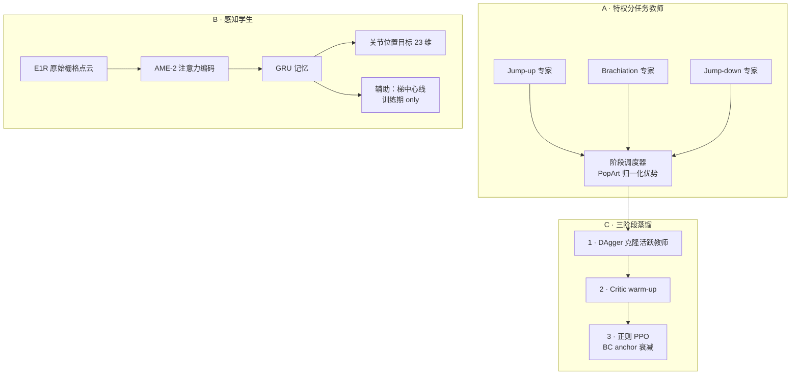

# Agile Perceptive Traversal：人形稀疏 3D 结构敏捷感知穿越

**Agile Perceptive Traversal**（*Learning Agile Perceptive Traversal of Sparse 3D Structures for Humanoids*，[arXiv:2608.29769](https://arxiv.org/abs/2608.29769)，[项目页](https://nemantor.github.io/sparse-3d-traversal-website/)）由 **苏黎世联邦理工（ETH Zürich）Robotic Systems Lab**（Marco Hutter 组）与 **ETH AI Center**、**CVG** 提出：在 **众擎（ENGINEAI）PM-01** 人形上，用头部 **RoboSense E1R** 固态 LiDAR 的 **原始稀疏回波** 直接驱动 RL 策略，经 **AME-2 注意力编码 + GRU 记忆** 与 **分阶段多教师蒸馏**，完成 **跳上猴架→荡杆→跳下** 全序列及 **2 cm 横截面矮身通过**——据作者称系首个 onboard 感知并完成该全序列的人形演示。

## 一句话定义

**不用高程图或体素，把固态 LiDAR 上几根横杆的零星回波用注意力「点选」出来，再靠分阶段特权教师蒸馏成可部署的单策略，在真机爆发式全身接触序列里仍能对准厘米级稀疏结构。**

## 英文缩写速查

| 缩写 | 英文全称 | 简要说明 |
|------|----------|----------|
| AME-2 | Attention-based Map Encoding (2nd gen) | 本文感知骨干：把 E1R 回波保持在 2D 扫描栅格上做注意力 |
| E1R | RoboSense E1R | 头部固态 LiDAR；192×144 / 120°×90°，策略消费降采样栅格 |
| GRU | Gated Recurrent Unit | 融合多帧稀疏感知与本体 |
| LiDAR | Light Detection and Ranging | 本文 map-free 外感知通道 |
| PPO | Proximal Policy Optimization | 教师训练与蒸馏后 RL 精炼（RSL-RL） |
| DAgger | Dataset Aggregation | 多教师→感知学生的第一阶段克隆 |
| PopArt | Preserving Outputs Precisely while Adaptively Rescaling Targets | 按阶段标准化优势，避免奖励尺度互相淹没 |
| LIO | LiDAR-Inertial Odometry | 真机用 SE(3)-LIO；冲击下比普通 VIO 更稳 |
| Sim2Real | Simulation to Real | 电池压降、热限、E1R 射线锥噪声建模 |
| BC | Behavior Cloning | 蒸馏阶段的模仿损失 |

## 为什么重要

- **感知表征边界：** 2.5D 高程图丢悬空细杆；体素全 3D 但算存随分辨率暴涨；本文证明 **原始 LiDAR + 注意力** 足以对准 **1–3 cm 半径** 稀疏结构。
- **任务难度轴：** 猴架同时压 **细感知、硬探索、爆发全身控制** 三轴，比稠密地形 parkour 更极端。
- **工程闭环：** 被动钩末端 + 腕 yaw 脱钩 + 执行器热/电池模型 + E1R 射线发散噪声，支撑 **14/15** 真机全序列成功率。不建模压降时，跳上电流会把整机 **brownout**。
- **可迁移感知栈：** 同一 AME-2+GRU 骨干 **不改架构** 另训矮身策略，10/10 通过 2×2 cm 杆。

## 核心信息

| 项 | 内容 |
|----|------|
| **机构** | 苏黎世联邦理工（ETH Zürich）RSL；ETH AI Center；CVG |
| **平台** | 众擎 PM-01 + 被动钩式手 + 头部 E1R（原生 192×144；猴架策略 36×35×4，矮身 36×48×4） |
| **训练** | [Isaac Lab](./isaac-lab.md) + [RSL-RL](./rsl-rl.md) PPO；分任务特权教师 + 阶段调度器 |
| **控制/感知频率** | 关节目标 **50 Hz**（23 维，不含头 yaw）；E1R **10 Hz** |
| **真机定位** | SE(3) LiDAR-惯性里程计；策略 onboard 运行 |
| **开源** | **确认未开源**（截至 **2026-09-04** [项目页](https://nemantor.github.io/sparse-3d-traversal-website/) 无 GitHub / HF / Zenodo；作者 Pages 账号 `nemantor` 亦无对应仓） |

## 流程总览

## 核心原理

### 1. 分阶段多教师 + 感知学生

- **三专家：** 跳上、荡杆、跳下各自在 **特权信息**（真值横杆端点、接触、基座速度、电池/热状态）下 PPO 训练；教师是 MLP。荡杆跟 **平面目标命令**；跳上/跳下用 **接触位置目标**，不靠人类动捕先验。
- **阶段调度：** 单 episode 内按任务阶段切换活跃教师 \(a^T_p\) 与奖励；优势按阶段标准化，value loss 用截断逆回报方差加权（PopArt 思路），避免某一阶段淹没更新。
- **学生观测：** 本体 4 帧历史（关节位置/速度，不含头 yaw；IMU 角速度与投影重力；上一动作）+ 平面目标命令与跳下触发 + E1R 栅格。AME-2 在 **2D 扫描栅格** 上做注意力（非无序 PointNet）；GRU 积分间歇稀疏回波。
- **矮身：** 独立策略，复用同一 AME-2+GRU；教师用高程图（含向上 raycast 通道登记头顶障碍，**仅教师**）；学生仍只看原始 E1R。

### 2. 奖励与课程（编译，非全文搬运）

奖励分 **共享限位组** 与 **分任务组**。限位直接惩罚热积分超 0.8、电池电压低于 40 V 的 hinge、肢力矩预算，以及关节目标软限位滤波器的裁剪量——让策略学会尊重限幅，而不是靠滤波器硬挡。跳上含抓握载荷与悬吊奖励；跳下含落地接触、下降制动与释放后禁止再碰杆。训练地形是程序化梯子：跳上/跳下用 **高度课程**（约 1.6–2.1 m），荡杆用 **间距加大 / 杆变细** 课程（半径 1–3 cm、间距 0.25–0.5 m）。

### 3. 硬件与 sim2real

- **被动钩：** 水刀不锈钢板替换整手；开口容纳 60 mm 圆，相对 1–3 cm 杆半径给出落点公差；对称结构支持双向荡杆；腕 yaw 转出平面即可脱钩，减抬身热负荷。仿真用 box collider。
- **电池压降：** 全体关节共享一节电池。力矩幅值和 \(S_t=\sum_j|\tau_{j,t}|\) 驱动一阶滞后：

  \[
  V_{t+1}=V_t+\frac{\Delta t}{T_{\mathrm{rec}}}\bigl(\mathrm{clip}(V_{\mathrm{nom}}-k_{\mathrm{sag}}S_t,\,V_{\mathrm{min}},\,V_{\mathrm{nom}})-V_t\bigr)
  \]

  \(\nu_t=V_t/V_{\mathrm{nom}}\) 同时缩放堵转力矩与空载转速。标定：\(V_{\mathrm{nom}}=51\,\mathrm{V}\)，\(V_{\mathrm{min}}=30\,\mathrm{V}\)，\(k_{\mathrm{sag}}=0.0375\,\mathrm{V\,N^{-1}m^{-1}}\)，\(T_{\mathrm{rec}}=0.1\,\mathrm{s}\)。真机跳上峰值机械功率 **2.11 kW**，电压最低 **34.7 V**；无此模型会出现整机掉电。
- **热代理：** 18 个低力矩执行器（髋 yaw、踝、腰 yaw、肩、肘、头 yaw）各带泄漏积分 \(I_{j,t}\)（\(\tau_{\mathrm{stall}}=40\,\mathrm{N\,m}\)，\(T_{\mathrm{ch}}=1\,\mathrm{s}\)，\(T_{\mathrm{leak}}=5\,\mathrm{s}\)）。持续负载比 \(\rho\ge 0.2\) 即饱和；该状态是特权观测并进奖励。
- **E1R 噪声两套：** **训练**（Isaac Lab Warp 射线）：\(0.625^\circ\) 锥内抖动 + 距离高斯 \(\sigma=2\,\mathrm{cm}\)；边缘像素（邻域深度差 \(>0.1\,\mathrm{m}\)）以 0.05 丢弃、0.20 与背景混合；安装标定 \(\pm 5^\circ/\pm 2\,\mathrm{cm}\)；1% 回波损坏；整帧冻结概率 0.1；距离门 \([0.3,1.5]\,\mathrm{m}\)。**验证**（MuJoCo）：每像素锥内 16 射线，逆平方加权融合，模拟 ToF 混合像素；边缘 dropout 随邻域深度差线性升至 0.5（差 \(>0.3\,\mathrm{m}\)）。

## 源码运行时序图

**不适用** — 截至 2026-09-04 项目页与作者 GitHub **无官方可运行仓**。若未来开源，预期路径：Isaac Lab 训分任务教师 → 阶段调度 DAgger 蒸馏 → E1R 噪声 MuJoCo 验证 → PM-01 onboard 部署（SE(3)-LIO 定位 + 策略推理）。

## 工程实践

| 项 | 建议 |
|----|------|
| 感知编码器 | AME-2（13.8k 参数）蒸馏 BC loss 优于 CNN（106.7k）/ MLP（1.31M）一个数量级；**盲学生不可行** |
| 辅助监督 | 梯中心线辅助损失把 CL 从 1.62 降到 0.71（×10⁻²）；部署时移除辅助头 |
| 横杆几何 | 真机三梯：h=1.69–1.75 m，间距 0.26–0.33 m；弱支撑结构亦在 14/15 内 |
| 速度 / 功率 | 荡杆 **0.5 m/s**；跳上峰值机械功率 **2.11 kW** |
| 定位 | 冲击下普通 VIO 易失效；作者选用 **SE(3)-LIO** 最稳 |
| 复现 | 等待官方 sim + 噪声模型 + 钩具 CAD；论文已给出可复述的电池/热/射线锥参数，但训练脚本未公开 |

## 实验与评测

**编码器消融（Table IV，BC loss ×10⁻²）：**

| 编码器 | 参数量 | total | jump | brach. | down | CL |
|--------|--------|-------|------|--------|------|----|
| AME-2 + aux | 13.8k | **2.35** | **2.48** | **1.95** | **3.20** | **0.71** |
| AME-2 | 13.8k | 2.43 | 2.56 | 2.00 | 3.26 | 1.62 |
| CNN | 106.7k | 2.62 | 2.73 | 2.16 | 3.57 | 1.79 |
| MLP | 1.31M | 2.76 | 2.92 | 2.28 | 3.62 | 1.85 |
| Blind | — | 2.90 | 3.18 | 2.30 | 3.51 | 2.07 |

**MuJoCo sim-to-sim（Table V，间距 0.35 m，各 10 trial）：** 完整序列成功率随高度 1.65→1.90 m 为 **80 / 90 / 90 / 70 / 70 / 70%**；失败几乎都在跳上。矮身圆柱杆直径 1–5 cm、净空 1.1–1.5 m 在仿真中 **100%**。

**真机猴架（15 trials）：**

| 梯 | h [m] | s [m] | trials | 完整序列 |
|----|-------|-------|--------|---------|
| A | 1.69 | 0.26 | 9 | 9/9 |
| B | 1.72 | 0.31 | 2 | 2/2 |
| C | 1.75 | 0.33 | 4 | 3/4 |
| **合计** | — | — | **15** | **14/15 (93%)** |

唯一失败：跳上成功后钩未前进到下一根杆。矮身：2×2 cm 随机朝向木条 **10/10**（净空约 1.2 m）。

## 结论

**稀疏悬空结构的 onboard 敏捷穿越，可以用「原始 LiDAR + 注意力 + 分阶段蒸馏」在通用人形上落地，但必须把传感器与执行器非理想性写进训练环——否则跳上会把电池拉崩。**

1. **表征** — 跳过中间地图，AME-2 在 **极少回波** 上仍可选中任务相关点；13.8k 参数打过百倍大的 MLP。
2. **探索** — 分任务特权教师 + 阶段调度，比单策略盲探索更易收敛爆发接触序列。
3. **蒸馏** — DAgger → critic warm-up → 正则 PPO 三阶段；中心线辅助监督帮助 GRU 骨干。
4. **硬件** — 被动钩 + 热/电池模型 + E1R 射线锥噪声是 **14/15** 真机成功的关键，而非仅增大仿真随机化。
5. **泛化** — 同一感知骨干可迁到 **矮身**；多几何长时记忆仍 open。
6. **对照** — 相对 [LadderMan](./paper-ladderman-humanoid-perceptive-ladder-climbing.md)（深度+VFM）与 [AME-2](./paper-notebook-ame-2-agile-and-generalized-legged-locomotion-vi.md)（稠密地形高程），本文专攻 **厘米级稀疏 LiDAR 接触**。
7. **开源** — 截至 2026-09-04 **无代码**；复现需等 ETH 发布。

## 与其他工作对比

| 对照 | 差异读法 |
|------|----------|
| [AME-2](./paper-notebook-ame-2-agile-and-generalized-legged-locomotion-vi.md) | 稠密地形高程/注意力；本文把 **同一编码器** 迁到 **原始 E1R 稀疏点云** |
| [LadderMan](./paper-ladderman-humanoid-perceptive-ladder-climbing.md) | 深度+VFM 梯子攀爬；本文 **LiDAR 直接感知** + **荡杆/跳跃** 全序列 |
| [PHP](./paper-hrl-stack-22-perceptive_humanoid_parkour.md) | 稠密障碍跑酷 + motion matching；本文专攻 **厘米级悬空细杆** |
| [ANYmal Parkour](./paper-notebook-anymal-parkour-robust-perceptive-locomotion.md) | 技能库切换；本文把多教师 **焊成单策略**，阶段调度只在训练期 |
| 体素 / 高程图路线（如 Gallant） | 丢悬空结构或算存随分辨率暴涨；本文 **map-free raw LiDAR** |

## 局限与风险

- **任务策略分离：** 猴架与矮身为 **独立训练策略**，非单一通用控制器。
- **几何多样性：** 仅验证少数梯距/高度与 2 cm 杆；更长时距、更复杂 3D 结构未覆盖。
- **平台专用：** PM-01 + 钩具 + E1R 安装位形；换平台需重训与重标定噪声模型。
- **定位依赖：** 全序列需可靠 onboard 里程计；冲击场景对 VIO 仍是单点故障。
- **未开源：** sim、奖励权重与噪声实现未公开；上表参数可复述，不能直接训练。

## 关联页面

- [AME-2](./paper-notebook-ame-2-agile-and-generalized-legged-locomotion-vi.md) — 本文感知编码器直接前作
- [LadderMan](./paper-ladderman-humanoid-perceptive-ladder-climbing.md) — 人形梯子攀爬（深度路线对照）
- [PHP](./paper-hrl-stack-22-perceptive_humanoid_parkour.md) — 稠密地形端到端感知跑酷
- [ANYmal Parkour](./paper-notebook-anymal-parkour-robust-perceptive-locomotion.md) — 技能库对照：训练期多专家 vs 部署期切换
- [楼梯与障碍感知 locomotion](../tasks/stair-obstacle-perceptive-locomotion.md) — 感知 loco 任务枢纽
- [Privileged training](../concepts/privileged-training.md) — 教师–学生范式
- [Sim2Real](../concepts/sim2real.md) — 执行器与传感器建模
- [Isaac Lab](./isaac-lab.md) / [RSL-RL](./rsl-rl.md) — 训练栈

## 参考来源

- [Agile Perceptive Traversal 论文归档](../../sources/papers/agile_perceptive_traversal_arxiv_2608_29769.md)
- [sparse-3d-traversal 项目页](../../sources/sites/sparse-3d-traversal-github-io.md)

## 推荐继续阅读

- [arXiv:2608.29769 PDF](https://arxiv.org/pdf/2608.29769) — Table I–V 与电池/热/E1R 噪声节
- [项目页](https://nemantor.github.io/sparse-3d-traversal-website/) — 真机视频与 LiDAR 注意力可视化
- [AME-2 前作 arXiv:2601.08485](https://arxiv.org/abs/2601.08485) — 注意力地图编码器
