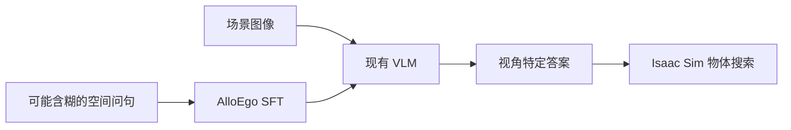
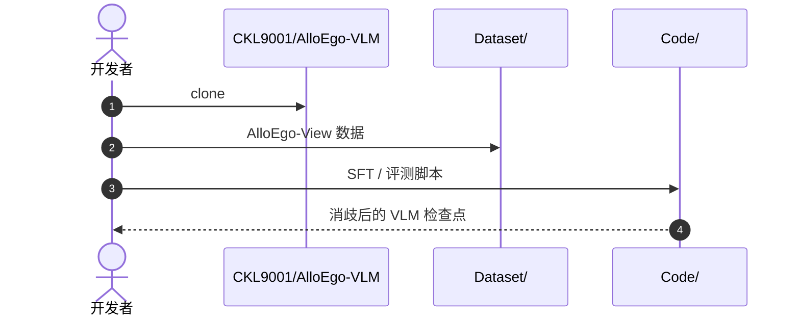

# AlloEgo-VLM：消歧自我中心与环境中心参照系

**AlloEgo-VLM**（*AlloEgo-VLM: Disambiguating Allocentric and Egocentric Reference Frames in Vision-Language Models*，[arXiv:2608.15605](https://arxiv.org/abs/2608.15605)，[代码](https://github.com/CKL9001/AlloEgo-VLM)）由 **国立阳明交通大学（NYCU）** 提出：构建 **AlloEgo-View** 数据集，通过监督微调让 VLM 在含糊空间指令下区分 **allocentric** 与 **egocentric** 语义。

## 一句话定义

**机器人理解「左与右」之前，必须先回答站在谁的视角看。**

## 英文缩写速查

| 缩写 | 英文全称 | 简要说明 |
|------|----------|----------|
| VLM | Vision-Language Model | 视觉-语言模型 |
| Allo | Allocentric | 环境中心参照系 |
| Ego | Egocentric | 自我中心参照系 |
| SFT | Supervised Fine-Tuning | 监督微调集成到现有 VLM |

## 为什么重要

- 纳入 [2026-08-31 九篇盘点](../../sources/blogs/wechat_embodied_station_clap_9_papers_open_source_2026-08-31.md) 的「空间语义」支线。
- 揭示现有 VLM 在参照系省略时的 **系统性短板**。
- **NVIDIA Isaac Sim** 开放物体搜索任务部署验证消歧能力。

## 核心信息

| 项 | 内容 |
|----|------|
| **机构** | 国立阳明交通大学（NYCU，台湾） |
| **数据** | AlloEgo-View（图像—问题—视角特定答案） |
| **开源** | **已开源** [CKL9001/AlloEgo-VLM](https://github.com/CKL9001/AlloEgo-VLM)（`Code/` + `Dataset/`） |

### 流程总览

## 评测

- 数据集与基线 VLM 对比显示参照系消歧能力提升。
- Isaac Sim 开放式物体搜索验证部署价值。

## 与其他工作对比

同样问「VLM 的空间能力够不够用」，差别在 **测什么** 与 **补什么**：

| 工作 | 关注点 | 手段 | 相对 AlloEgo-VLM |
|------|--------|------|------------------|
| **AlloEgo-VLM** | 指令**省略参照系**时的歧义 | AlloEgo-View 数据 + **SFT**，产出视角特定答案 | — |
| [3D 空间 VQA](../concepts/3d-spatial-vqa.md) | 几何关系、距离、方位、房间尺度 | 多视图/视频问答基准 | 测的是**能否算对几何**；本文测的是**该按谁的坐标系算**，前者答对也可能栽在后者 |
| [具身感知的六种空间表征](../concepts/embodied-perception-six-spatial-representations.md) | 表征选型（自我中心 / 环境中心等） | 表征谱系梳理 | 提供 allo/ego 的概念坐标；本文把这条区分变成**可监督的数据与评测** |

- **改造成本**：SFT 可集成到现有 VLM 而不重训整模（见「结论」），因此它是可叠加到既有栈上的**补丁式**改进，而非新骨干。
- **同批次分工**：在 [CLAP 九篇地图](../overview/clap-cross-embodiment-vla-wm-9-papers-technology-map.md) 的「感知—执行接口」组里，本文修的是 **语言输入侧的语义歧义**，[ViTaR](./paper-vitar.md) 修的是 **执行侧的接触偏差**，[MILO](./paper-milo.md) 补的是 **三维交互几何**。
- **证据边界**：Isaac Sim 物体搜索属仿真部署验证，真机泛化仍需 sim-to-real 对齐；且当前以英文空间指令为主（见「局限与风险」）。

## 结论

**空间 VLM 需要显式参照系监督，而不能假设「左/右」默认来自机器人视角。**

- AlloEgo-View 三元组刻画场景、参照物、目标与视角类型
- SFT 可集成到现有 VLM 而不重训整模
- 实验暴露主流 VLM 参照系混淆
- Isaac Sim 部署证明具身可用性
- 官方 `Code/` 与 `Dataset/` 已公开

## 源码运行时序图

## 局限与风险

- **数据覆盖：** 参照系类型与场景多样性仍受数据集边界约束。
- **真机泛化：** Isaac Sim 验证需额外 sim-to-real 对齐。
- **多语言：** 当前以英文空间指令为主。

## 关联页面

- [VLA](../methods/vla.md)
- [Manipulation](../tasks/manipulation.md)
- [CLAP / 跨本体 9 篇技术地图](../overview/clap-cross-embodiment-vla-wm-9-papers-technology-map.md)

## 参考来源

- [alloego_vlm_arxiv_2608_15605](../../sources/papers/alloego_vlm_arxiv_2608_15605.md)
- [ckl9001-alloego-vlm](../../sources/repos/ckl9001-alloego-vlm.md)
- [wechat_embodied_station_clap_9_papers_open_source_2026-08-31](../../sources/blogs/wechat_embodied_station_clap_9_papers_open_source_2026-08-31.md)

## 推荐继续阅读

- [arXiv:2608.15605](https://arxiv.org/abs/2608.15605)
- [AlloEgo-VLM 仓库](https://github.com/CKL9001/AlloEgo-VLM)
