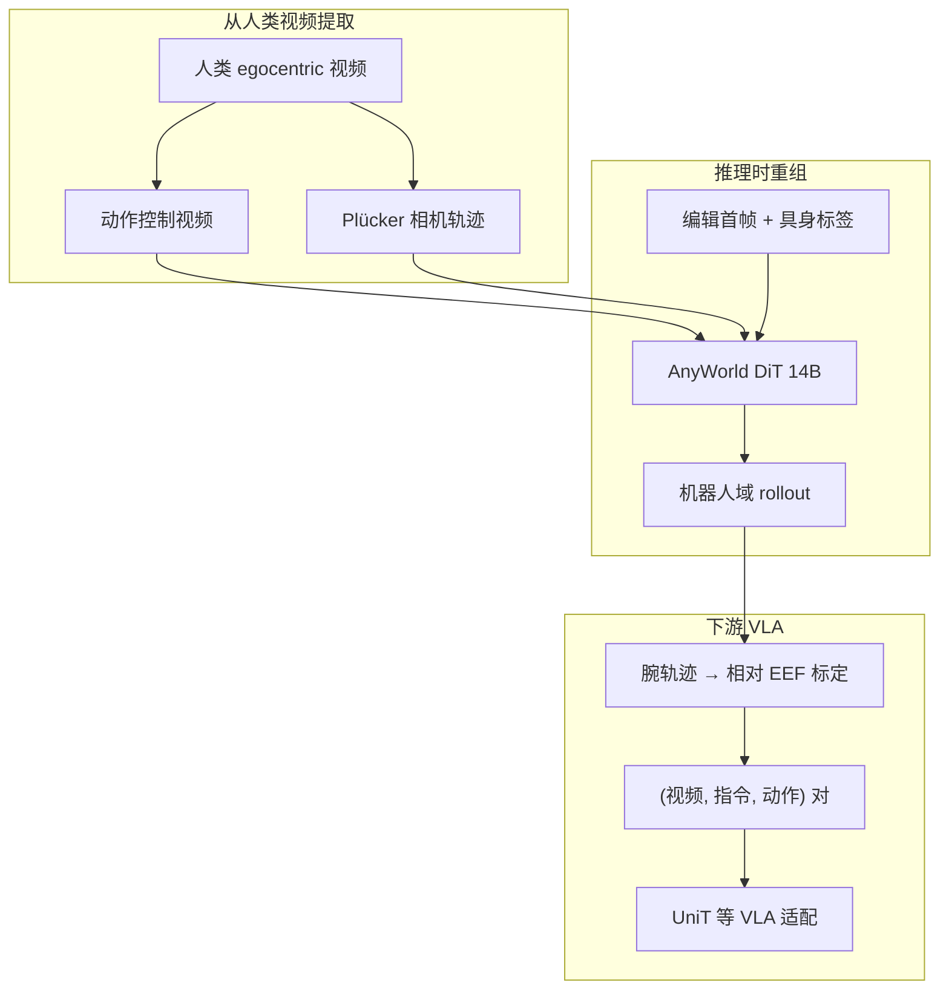

# AnyWorld（因子化 Egocentric 跨具身世界模型）

**AnyWorld**（*Factorized Egocentric World Models for Cross-Embodiment Generalization*，[arXiv:2608.29242](https://arxiv.org/abs/2608.29242)，[项目页](https://xpeng-robotics.github.io/anyworld/)）由 **小鹏机器人（XPENG Robotics）**、南洋理工大学、A*STAR IAIC、浙江大学、香港中文大学等提出：把 egocentric 交互分解为 **动作、相机、具身** 三因子，在 **无 clip 级人–机配对** 前提下，将单条人类视频扩展为多样 **机器人域** 可控 rollout，并作为 VLA **目标具身适配** 阶段的数据引擎。

## 一句话定义

**从人类 egocentric 交互抽出动作与相机轨迹，再换首帧与具身标签，就能生成保留交互动力学、但换身体/视角/场景的机器人原生视频–动作对。**

## 英文缩写速查

| 缩写 | 英文全称 | 简要说明 |
|------|----------|----------|
| AnyWorld | — | 本文跨具身因子化 egocentric 世界模型 |
| WM | World Model | 预测未来观测/状态的环境模型 |
| VLA | Vision-Language-Action | 下游策略范式（实验基线为 UniT） |
| DiT | Diffusion Transformer | 14B 级 latent 视频扩散骨干 |
| EgoDex | — | 大规模 egocentric 灵巧操作人视频数据集 |
| GR1 | — | RoboCasa 仿真人形平台 |
| IRON | — | 小鹏自研人形真机平台 |
| VBench | — | 视频生成质量评测套件 |

## 为什么重要

- **人视频的价值在「可重组」，不在「直接当机演示」。** 单条录制只覆盖一种身体与视角；因子化接口让同一交互结构成为 **可播种** 的训练资产。
- **部署期数据引擎，而非在线规划器：** 在 [五路径图](../overview/wam-motion-control-five-paths.md) 中更接近 **⑤ 评估/数据扩增外侧**——用合成 rollout 填策略缺口，不直接接管低层控制。
- **视觉重组与动作标定缺一不可：** 论文用 **仅动作反事实** 消融证明：语言空间目标选择需要 **机器人原生视觉状态**，不能只靠动作重标。

## 核心信息

| 项 | 内容 |
|----|------|
| **机构** | 小鹏（XPeng）；南洋理工大学（NTU）；A*STAR 先进智能与计算研究所（IAIC）；浙江大学（ZJU）；香港中文大学（CUHK） |
| **骨干初始化** | [WAN Fun-Control 14B](https://huggingface.co/alibaba-pai/Wan2.1-Fun-14B-Control) |
| **训练数据** | EgoDex 预训练；混合微调含 EgoDex、RoboCasa GR1、IRON（无配对） |
| **评测平台** | RoboCasa GR1 仿真；IRON 真机 |
| **开源** | **未开源**（截至 2026-09-02，[项目页](https://xpeng-robotics.github.io/anyworld/) 未列代码/权重） |

## 核心原理

### 三因子接口

| 因子 | 表示 | 作用 |
|------|------|------|
| **动作** \(A_{1:T}\) | 渲染骨架控制视频 → latent \(Z^a\) | 像素平面运动结构，具身无关 |
| **相机** \(C_{1:T}\) | 内外参 → Plücker 射线 | 分离观察者运动与操作者运动 |
| **具身** | 首帧 \(\tilde I^e_0\) + 文本标签 \(\tau_e\) | 指定目标身体、场景布局与交互几何 |

### 条件注入（DiT）

1. **动作** — 与噪声 latent **通道拼接**  
2. **相机** — 轻量 adapter **加**到 patch embedding  
3. **具身/字幕** — **cross-attention** 注入各 Transformer block  

### 流程总览

### 训练两阶段

| 阶段 | 数据 | 步数 | 目标 |
|------|------|------|------|
| 1 人交互预训练 | EgoDex 200K clip | 30K | 动作–相机条件视频先验 |
| 2 混合具身微调 | EgoDex + GR1 + IRON（各 5K） | 5K | 绑定机器人外观与几何；**人:机=2:1** 最优 |

## 源码运行时序图

**不适用** — 截至 2026-09-02，[项目页](https://xpeng-robotics.github.io/anyworld/) 与 `xpeng-robotics` 组织 **未提供** 可运行训练/推理仓库。

## 工程实践

| 用法 | 说明 |
|------|------|
| 经验倍增 | 固定动作–相机，换首帧/具身标签 → 多场景/多机体 rollout |
| VLA 适配 | 与目标域真机数据 **1:1** 混入重组 EgoDex rollout（第二阶段 only） |
| 定向修补 | 针对 **已知策略缺口** 构造缺失状态或左右对称反事实对 |
| 动作标定 | 人腕轨迹 → 目标机 **相对 EEF**；避免直接迁移人臂尺度 |
| 复现依赖 | 需自建 EgoDex/GR1/IRON 因子化管线；骨干可参照 WAN Fun-Control |

## 实验与评测

### 世界模型可控性（60 视频，↑ 越高越好）

| 方法 | ActionAlign | CameraAlign | EmbodAcc | Avg. |
|------|-------------|-------------|----------|------|
| Cosmos-Predict2.5 | 0.170 | 0.315 | 0.765 | 0.417 |
| WAN Fun-Control | 0.655 | 0.402 | 0.769 | 0.609 |
| **AnyWorld** | **0.659** | **0.789** | **0.886** | **0.778** |

VBench 四项平均 **0.971**，与强基线相当或略优。

### VLA 适配（基线：EgoDex 预训练 UniT）

| 设置 | 评测 | 基线 | + AnyWorld | 增益 |
|------|------|------|------------|------|
| RoboCasa GR1 | 18 项 pick-and-place | 49.8% | 54.6% | +4.8 |
| IRON 真机 | 20 次抓香蕉 | 20.0% | 55.0% | +35.0 |

### 定向能力干预（IRON）

- **假完成先验：** 单目标成功、双目标部分完成时基线停滞；重组「盒内已有香蕉」状态 + 标定动作后恢复放置。  
- **语言空间目标：** 对称左右目标 + 配对指令/动作；**仅动作反事实** 不稳定，需联合视觉重组。

## 结论

**AnyWorld 把跨具身迁移从「配对演示」改成「因子化重组」：动作与相机可共享，具身由首帧锚定；合成 rollout 能在 UniT 适配阶段带来可测增益，且可针对已知策略缺陷做定向干预。**

1. **三因子是核心接口** — 动作（骨架控制视频）、相机（Plücker）、具身（首帧+标签）可独立重组，无需 clip 级人–机对齐。  
2. **相机显式建模值得单独做** — CameraAlign **0.789** 相对 WAN Fun-Control **0.402** 是主要拉开项；egocentric 任务不能把视角运动全塞进动作条件。  
3. **适配阶段数据引擎** — 在已 EgoDex 预训练的 UniT 上，仿真 **+4.8pp**、真机抓香蕉 **+35pp**；混入比 **1:1**。  
4. **视觉与动作必须联合转移** — 语言空间目标选择：动作-only 反事实失败，说明需要 **机器人原生观测** 而不仅是动作重标。  
5. **人:机微调 2:1** — 纯人数据多会损 EmbodAcc；纯机数据多损动作多样性；需平衡而非单边堆量。  
6. **局限** — 无触觉/力；依赖跟踪质量；仅 3 具身；**未开源** 阻碍直接复现。

## 局限与风险

- 视觉 rollout **不能替代** 接触力与触觉反馈；精细接触仍依赖真机数据。  
- 动作–相机提取在遮挡、快速运动、剧烈抖动下可能退化。  
- 评测覆盖 GR1 桌面与 IRON 抓取；更长程、更多形态与物体泛化未充分验证。  
- 截至入库日 **无官方代码**；复现需复刻因子化数据管线与 14B 级训练栈。

## 与其他工作对比

| 工作 | 相对 AnyWorld |
|------|----------------|
| [DreamDojo](./paper-hrl-stack-35-dreamdojo.md) | 同人视频预训练 WM；DreamDojo 偏通用动力学预测，AnyWorld 强调 **无配对因子重组** 与 VLA 数据引擎 |
| [UniT](./paper-unit-unified-physical-language.md) | UniT 学共享 **潜动作语言**；AnyWorld 用 UniT 作 VLA 基线，负责 **像素级机器人域观测合成** |
| [EgoWAM](./paper-egowam-egocentric-human-wam-co-training.md) | EgoWAM 训练期检验世界目标表征；AnyWorld 在 **适配期** 用重组视频填策略缺口 |
| [EgoWM](./paper-egowm-egocentric-world-model.md) | EgoWM 给视频扩散加动作条件；AnyWorld 额外 **解耦相机与具身** 并服务跨本体重组 |

## 关联页面

- [WAM×运动控制五路径](../overview/wam-motion-control-five-paths.md)
- [机器人世界模型训练环分类](../overview/robot-world-models-training-loop-taxonomy.md)
- [Generative World Models](../methods/generative-world-models.md)
- [World Action Models](../concepts/world-action-models.md)
- [UniT](./paper-unit-unified-physical-language.md)

## 参考来源

- [anyworld_arxiv_2608_29242.md](../../sources/papers/anyworld_arxiv_2608_29242.md)
- [xpeng-robotics-anyworld.md](../../sources/sites/xpeng-robotics-anyworld.md)

## 推荐继续阅读

- [项目页](https://xpeng-robotics.github.io/anyworld/)
- [arXiv:2608.29242](https://arxiv.org/abs/2608.29242)
- [EgoDex 论文](https://arxiv.org/abs/2505.11709)
- [UniT 项目页](https://xpeng-robotics.github.io/unit/)
