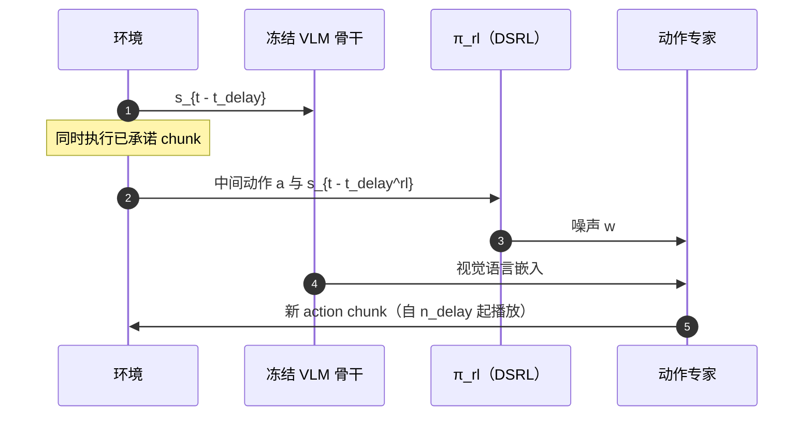

# ARLI：异步 VLA 的延迟感知 RL 后训练

**ARLI**（*Asynchronous RL with Intermediate Information*；论文 *Learning to Act While Waiting*，[arXiv:2608.23831](https://arxiv.org/abs/2608.23831)，[项目页](https://async-rl-intermediate-information.github.io/)）由 **西门子** Brian Zhu / Momen Khalil 等与 **加州大学伯克利分校** E Harrison / Sergey Levine 等、**微软、苏黎世联邦理工** 提出：通才 VLA 的推理延迟会改变有效动力学并破坏马尔可夫假设；在 **异步 chunk 执行** 上用 **已承诺中间动作** 与 **VLM 完成后的中间观测** 条件轻量 DSRL 策略，让 RL 后训练在延迟下重新可学。

## 一句话定义

**异步可以藏起推理延迟，但若 RL 仍只看见推理开始时的旧状态，标准算法会学不动——把「这段时间已经承诺的动作」和「动作专家开始去噪前的新观测」写进 RL 状态，才能在等待期间继续把舵打对。**

## 英文缩写速查

| 缩写 | 英文全称 | 简要说明 |
|------|----------|----------|
| ARLI | Asynchronous RL with Intermediate Information | 本文：中间动作 + 中间观测的延迟感知 RL |
| VLA | Vision-Language-Action | 被后训练的通才策略（文中 \(\pi_0\) / \(\pi_{0.5}\)） |
| DSRL | Diffusion Steering via Reinforcement Learning | 轻量策略选扩散/flow 初始噪声以舵向目标行为 |
| RTC | Real-Time Chunking | 用 inpainting 把旧 chunk 后缀融进新预测，保连续 |
| MDP | Markov Decision Process | 延迟+异步会破坏朴素状态上的马尔可夫性 |

## 为什么重要

- **后训练文献默认「推理瞬时完成」：** 消费级 GPU 上 \(\pi_0\) 约 100 ms，更大 VLA 可超 300 ms；停顿会改接触时序，异步又让动作在「尚未到达的状态」上生成。
- **RTC ≠ RL：** RTC 用中间动作保连续，不学「这些动作把世界带到哪」；DSRL 朴素接异步会非马尔可夫。
- **真机有无异步的质变：** 作者报告同步推理下基线差、RL 极慢或失败；ARLI 在三任务上把约 40% 推到近 100%。

## 核心信息

| 项 | 内容 |
|----|------|
| **机构** | 西门子（Siemens）；加州大学伯克利分校（UC Berkeley）；微软（Microsoft）；苏黎世联邦理工（ETH Zürich） |
| **算法底座** | 冻结 flow/扩散通才策略 + DSRL 噪声策略；可选 RTC |
| **仿真** | Kinetix 高反应任务；AlohaTransferCube + \(\pi_0\) 3.3B |
| **真机** | 双臂 UR5e，腕+基座相机；\(\pi_{0.5}\) 小演示微调；60 Hz；chunk 50 |
| **开源** | **确认未开源**（项目页无代码链；GitHub 仅 Pages 静态站） |

## 核心原理（方法）

设通才策略在 \(t-t_{\mathrm{delay}}\) 开始推理，动作用于时刻 \(t\)。RL 状态：

\[
s^{\mathrm{rl}}_{t} \leftarrow \bigl(s_{t-t_{\mathrm{delay}}},\; a_{t-t_{\mathrm{delay}}:t},\; s_{t-t_{\mathrm{delay}}^{\mathrm{rl}}}\bigr)
\]

- **中间动作：** 推理窗口内将执行的旧 chunk 后缀，用于估计将到达的状态。
- **中间观测：** VLM 骨干通常占延迟大头；DSRL 噪声只需在动作专家启动前就绪，故可在 \(t-t_{\mathrm{delay}}^{\mathrm{rl}}\) 再读一帧而不加端到端延迟。
- **RTC（可选）：** 前 \(t_{\mathrm{delay}}\) 步冻噪声并 inpaint；提高连续，但可能限制 RL 表达力。

命题（非正式）：若环境的 delayed oracle gap 为 \(\omega_d\)，对延迟观测做 action-chunk Q-learning 的次优有界；中间状态相当于减小有效 \(d\)。

## 工程实践

| 项 | 说明 |
|----|------|
| 源码运行时序图 | **不适用**（确认未开源） |
| 真机时序（RTX 5090） | \(t_{\mathrm{delay}}=10\)，\(t_{\mathrm{delay}}^{\mathrm{rl}}=7\)，执行 horizon \(n=20\) |
| 何时需要中间观测 | 扰动发生在推理窗口内（运动障碍等）；Bag-Placement 上「只加中间动作」不足以收敛 |
| RTC | 仿真上提高效率/稳定性；不是状态增广的替代 |
| 前置假设 | 策略能拆成 VLM + 需要噪声的动作专家；整网一体、无噪声接口时只能用中间动作 |

## 实验与评测

- **仿真：** ARLI 相对 naive 异步 DSRL 终成功更高、墙钟更短；DSRL+RTC 单独不够；相对逐步残差 RL，能舵冻结专家时终成功明显更高。
- **延迟敏感：** 加大 \(t_{\mathrm{delay}}\) 时 ARLI+RTC 掉点慢于 DSRL；\(t_{\mathrm{delay}}^{\mathrm{rl}}\) 小于一半总延迟时学习明显更好。
- **真机三任务：** Assembly / Shoe-in-Bag / Bag-Placement。基线约 **40%**；ARLI **100–125 episode** 近 **100%**。同步 DSRL 与 DSRL+RTC 同预算难到 80%，Shoe-in-Bag 约需双倍时间才追上。吞吐（成功/小时）全面更高。

## 结论

**在异步 VLA 上做 RL，第一件要修的是状态，而不是再换一个更强的残差头。**

1. **无异步则这三任务几乎学不动；** 有异步而无状态增广，DSRL 仍脆。
2. **中间动作 + 中间观测要一起上；** 只留动作在 Bag-Placement 上会不收敛。
3. **RTC 是连续先验，不是马尔可夫补丁。**
4. **真机读吞吐，不只读 SR：** 同成功率下 ARLI 完成更快。
5. **适用面：** 需 VLM/动作专家可拆 + DSRL 能学的任务；作者自承 DSRL 本身失败的任务 ARLI 也会失败。
6. **不可复现：** 无官方代码。

## 与其他工作对比

| 对比轴 | ARLI | [WAM 异步部署](./paper-wam-realtime-async.md) | [ReflexVLA](./paper-reflexvla.md) | [Q-Planning](./paper-qplanning.md) |
|--------|------|-----------------------------------------------|-------------------------------------|-------------------------------------|
| 问题 | 延迟下 **RL 后训练** | 固定 WAM 的平滑切换 | 延迟写进 **评测/架构** | 冻结 BC + Q 选动作 |
| 改谁 | 轻量噪声策略 | 输出融合 / 训练前缀 | 1B 预测+CUDA Graph | 只训 Q |
| RTC | 可选 inpainting | infer/train 变体 | 未作为主变量 | 不依赖 |
| 开源 | **未开源** | 无本实验代码 | **录用后** | **已开源** |

## 局限与风险

- **确认未开源：** 项目页无训练脚本；Pages 仓不是实现。
- **架构假设：** 不能拆 VLM/动作专家时失去中间观测通道。
- **RTC 可能伤反应：** 强迫播放旧动作。
- **绑 DSRL：** 扩散/flow 噪声舵失败的任务，本框架帮不上。
- **真机曲线为单细胞、自报吞吐：** 独立复现前不作硬基准。

## 关联页面

- [VLA](../methods/vla.md) — 通才策略与 RL 后训练
- [SmoothRL](./paper-smoothrl.md) — 异步 chunk 环内 value-gradient 在线 RL（arXiv:2608.29768；与 ARLI 正交）
- [Action Chunking](../methods/action-chunking.md) — chunk / 异步 / RTC
- [VLA 真机部署指南](../queries/vla-deployment-guide.md) — 延迟清单
- [WAM 实时异步部署](./paper-wam-realtime-async.md) — 部署层对照
- [ReflexVLA](./paper-reflexvla.md) — 延迟感知评测与架构
- [Why Action Chunking Improves BC](./paper-why-action-chunking-improves-bc.md) — Delay 与异步预算
- [Q-Planning](./paper-qplanning.md) — 另一条冻结骨干后训练
- [Manipulation](../tasks/manipulation.md)

## 参考来源

- [ARLI 论文摘录](../../sources/papers/arli_arxiv_2608_23831.md)
- [ARLI 项目页归档](../../sources/sites/async-rl-intermediate-information.md)

## 推荐继续阅读

- 项目页 — <https://async-rl-intermediate-information.github.io/>
- 论文 — <https://arxiv.org/abs/2608.23831>
- Wagenmaker et al., *Steering Your Diffusion Policy with Latent Space RL* — <https://arxiv.org/abs/2506.15799>
- Black, Galliker, Levine, *Real-time execution of action chunking flow policies* — <https://arxiv.org/abs/2506.07339>
