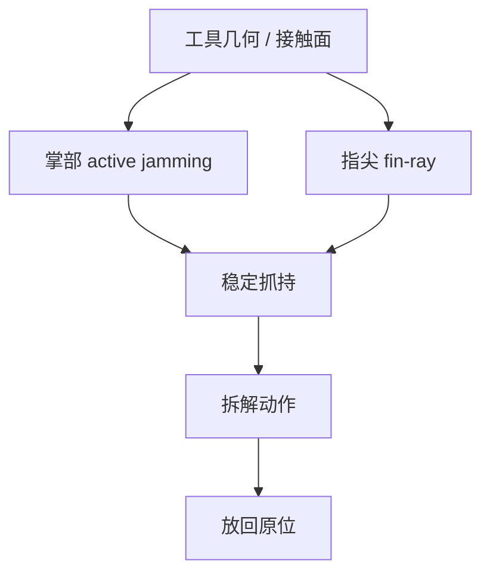

# ARTiS：面向拆解的自适应工具夹爪

**ARTiS**（*Adaptive Robotic Tool Gripper in Disassembly Systems*，[arXiv:2609.03362](https://arxiv.org/abs/2609.03362)，[项目页](https://romanmykhailyshyn.github.io/artis/)）由 **大阪大学** Roman Mykhailyshyn、**AIST** Yukiyasu Domae 与 Kensuke Harada 提出，录用 **TASE**：抓持并使用工具对机器人很难，拆解任务尤其依赖快速适应不同工具与接触面。ARTiS 是三指自适应夹爪，结合软体适应性、类人手灵巧与刚性机构稳健性；核心是 **掌部 active jamming** 与 **指尖 fin-ray**，**七自由度** 让指尖能朝向不同表面。

## 一句话定义

**面向拆解的末端执行器，关键是把软适应与硬承载放在同一个设计里。**

## 英文缩写速查

| 缩写 | 英文全称 | 简要说明 |
|------|----------|----------|
| ARTiS | Adaptive Robotic Tool Gripper in Disassembly Systems | 本文夹爪 |
| TASE | IEEE Transactions on Automation Science and Engineering | 录用期刊 |
| DoF | Degrees of Freedom | 本设计 7 自由度 |
| AIST | National Institute of Advanced Industrial Science and Technology | 产业技术综合研究所 |

## 为什么重要

- 纳入 [九篇盘点](../../sources/blogs/wechat_embodied_station_9_papers_open_source_2026-09-04.md) 的「开放硬件」支线。
- 把「抓住工具」和「用完还能放回去」写成同一评测。
- 项目页给出 CAD / 采购清单 / 硬件教程，机械复现门槛低于纯论文图。

## 方法

| 项 | 内容 |
|----|------|
| **机构** | 大阪大学、AIST |
| **结构** | jamming 掌 + fin-ray 指尖；7-DoF |
| **任务** | 螺丝刀、锤子、钻等拆解工具 |
| **开源** | **部分开源**：CAD/BOM/教程；仓为站点镜像 |

### 流程总览

## 评测

论文用传统拆解工具评估顺应性、耐久性与功能多样性；实践表明能在工具使用后保持接触，并讨论能否再定向/使用后释放回原位。电动工具振动仍是后续改进方向。入库日不以单一成功率为卖点。

## 结论

**拆解夹爪的胜负手是接触保持，而不是再加一只更像人手的手指。**

1. **jamming + fin-ray** — 软适应负责几何变化，刚性路径负责承载。
2. **7-DoF 朝向** — 指尖对准不同工具面，比盲目加自由度更关键。
3. **评「用完放回」** — 只抓起来不算完成拆解节拍。
4. **振动未闭环** — 电动工具不能当已经解决。
5. **机械可复现、控制未见仓** — 按项目页做硬件，不要期待固件脚本。

## 源码运行时序图

**不适用（控制）** — 截至 **2026-09-04** 仓库是项目页静态站。机械复现路径：项目页 Hardware Tutorial → Purchase List → CAD。

## 工程实践

| 项 | 建议 |
|----|------|
| 复现顺序 | 采购清单 → CAD → 硬件教程 |
| 任务选择 | 先手动工具，再电动工具 |
| 策略层 | 抓取语义见 [AdaRoboVLG](./paper-adarobovlg.md)；本页是末端硬件 |

## 局限与风险

- **无控制仓** — 力控 / 振动抑制需自研。
- **拆解域** — 不自动泛化到食品或服装操作。
- **耐久性样本** — 论文评测不等于产线节拍寿命。

## 与其他工作对比

| 对照 | 差异读法 |
|------|----------|
| [VTAP Gripper](./paper-vtap-gripper.md) | 视触觉主动掌 + 指尖阵列；ARTiS 强调 jamming/fin-ray 拆解工具 |
| [Yale OpenHand](./yale-openhand.md) | 开源欠驱动手家族；ARTiS 针对工具使用 |
| 纯软体夹爪 | 适应强、承载弱；本设计显式加刚性路径 |

## 关联页面

- [Manipulation](../tasks/manipulation.md)
- [VTAP Gripper](./paper-vtap-gripper.md)
- [开源可复现性 9 篇地图](../overview/open-source-reproducibility-9-papers-technology-map.md)

## 参考来源

- [artis_gripper_arxiv_2609_03362](../../sources/papers/artis_gripper_arxiv_2609_03362.md)
- [ARTiS 项目页](../../sources/sites/artis.md)
- [RomanMykhailyshyn/artis](../../sources/repos/romanmykhailyshyn-artis.md)
- [具身智能小站 2026-09-04 九篇盘点](../../sources/blogs/wechat_embodied_station_9_papers_open_source_2026-09-04.md)

## 推荐继续阅读

- [arXiv:2609.03362](https://arxiv.org/abs/2609.03362)
- [ARTiS 项目页](https://romanmykhailyshyn.github.io/artis/)
