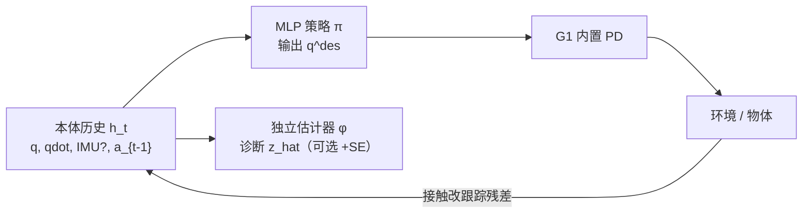

# Blind Dexterity：纯本体感知人形全身操作

**Blind Dexterity**（*Whole-Body Humanoid Manipulation via Pure Proprioception*，[arXiv:2608.29487](https://arxiv.org/abs/2608.29487)，[项目页](https://aditya.bhatts.org/BlindDexterity/)）由 **达姆施塔特工业大学（TU Darmstadt）IAS Lab**、**DFKI**、**hessian.AI**（Jan Peters 组）提出：在 **Unitree G1** 上 **完全不使用相机、标记、F/T 或触觉阵列**，仅靠 **关节编码器**（及操作任务中的 stock IMU）与 **柔顺 PD 位置控制**，学会四类 **接触丰富的全身 loco-manipulation**——并论证 **上一时刻关节命令** 使跟踪残差成为可主动采样的「全身触觉通道」。

## 一句话定义

**commercial 人形的编码器 + 柔顺 PD 已经是一条够用的盲操作传感总线——策略要会主动蹭环境，而不是等相机或触觉皮肤告诉它物体在哪。**

## 英文缩写速查

| 缩写 | 英文全称 | 简要说明 |
|------|----------|----------|
| PD | Proportional-Derivative | G1 内置位置跟踪低层；策略输出 \(q^{des}\) |
| RL | Reinforcement Learning | Isaac Sim + PPO，4096 并行环境 |
| PPO | Proximal Policy Optimization | 非对称 actor–critic（ critic 见特权物体态） |
| SE | State Estimator | 独立 MLP，诊断 proprio 历史可解码多少物体信息 |
| IMU | Inertial Measurement Unit | 行走实验可完全移除；操作任务保留 |
| PE | Previous action / command | 观测含 \(a_{t-1}\) 才能恢复力矩代理信号 |
| VS | Variable Stiffness | 手提箱任务可选：策略输出增益倍率 \(\alpha_t\) |
| DAgger | Dataset Aggregation | 特权教师→盲学生蒸馏（本文表现差） |

## 为什么重要

- **模态隔离实验：** 在 VLA/多相机操纵热潮中，系统量化 **仅用 proprio** 能走多远——对 occlusion、光照差、传感成本场景有直接选型意义。
- **与 locomotion 对称：** 腿式盲行走已成熟；本文显示 **同一编码器信号** 可支撑 **操作级** 主动感知（扫脚找球、拖滑板消歧 yaw）。
- **反直觉蒸馏结论：** 常见 teacher–student 在 **需探索的 POMDP** 上失效——蒸馏学生 exploit spawn 分布中心，而非学搜索。
- **工程可落地：** 无需改硬件；50 Hz MLP 策略 + 域随机化即可 sim→真机定性迁移。

## 核心信息

| 项 | 内容 |
|----|------|
| **机构** | TU Darmstadt IAS；DFKI；hessian.AI；Tongji（Jan Peters 合作） |
| **平台** | Unitree G1；PD 接口 \(q^{des}_t = q^{default} + 0.25 a_t\) |
| **仿真** | Isaac Sim；PPO（RSL-RL）；物理步 0.005 s，decimation 4 |
| **网络** | Actor/Critic MLP [1024,512,256]；估计器 [256,256,256,128] |
| **开源** | **待发布**（项目页 **Code (to be released)**，截至 **2026-09-02**） |

## 流程总览

## 核心原理

### 1. 隐式接触信号

在位置 PD 下，\(e_t = q^{des}_{t-1} - q_t\)，\(\tau \approx K_p e_t - K_d \dot{q}_t\)。策略观测 **必须含 \(a_{t-1}\)** 才能从历史恢复残差动态——移除后 IMU-free 行走与估计均显著变差（Table I）。

### 2. 四类任务梯度

| 任务 | 难点 | 主动感知行为 |
|------|------|-------------|
| Encoder-only 行走 | 无 IMU 推抗 | 脚接触推断重力方向 |
| 足球停球 | 0.3×0.4 m 随机 spawn | 单脚 sweep + 踝 wiggle 搜索 |
| 滑板登板 | 欠驱动板 roll/slide | 鼻/尾触碰、拖板消歧 yaw |
| 手提箱提柄 | 细柄 + 高桌随机 | 沿上缘扫触找开口；VS 降增益软搜索 |

### 3. 估计器角色

- **训练：** 与策略并行，L2 回归物体位姿等 \(z_t\)；**梯度不进策略**（-SE 变体）。
- **+SE 消融：** 把 \(\hat{z}_{t-1}\) 拼进策略观测——**无一致平均增益**，早期差估计可能干扰探索。
- **分析价值：** 接触后误差骤降证明 **信息在 proprio 里**，而非估计器本身驱动策略。

### 4. 蒸馏失败模式

特权教师直扑物体；DAgger 学生学会 **站在 spawn 中心守株待兔**（足球 mean SR 31%）。**从零 blind RL** 才涌现搜索（Blind-SE mean **92.9%**）。

## 源码运行时序图

**不适用** — 项目页标注 **Code (to be released)**，截至 2026-09-02 **无 GitHub**。若开源，预期路径：Isaac Sim 环境注册 → PPO 训 blind 策略（+ 可选并行 SE）→ 导出 Torch 策略 → G1 50 Hz PD 部署。

## 工程实践

| 项 | 建议 |
|----|------|
| 观测 | 操作任务 **K=5**（0.1 s）；行走 **K=1**；务必保留 **\(a_{t-1}\)** |
| 训练量 | 行走/足球 5000 iter；手提箱 6000；滑板 8000 |
| 教师蒸馏 | **不推荐** 作为盲操作默认路线；探索型 POMDP 用从零 RL |
| +SE | 若用估计器反馈，注意早期训练噪声；raw history 往往已够 |
| VS | 手提箱搜索阶段降 \(\alpha_t\) 可软接触；插入/提起再变硬 |
| 真机 | 论文为 **定性演示协议**；定量以 sim 4096 ep 为准 |
| 复现 | 等待官方任务 YAML（奖励/终止阈值将随代码发布） |

## 实验与评测

**行走观测消融（Table I，5 seeds，脉冲推）：**

| 配置 | Survival (%) | Lin Vel Err (m/s) |
|------|-------------|-------------------|
| +IMU+PE | 96.1±0.5 | 0.3370±0.0040 |
| -IMU+PE | 90.4±1.1 | 0.3867±0.0047 |
| -IMU-PE | 89.1±1.1 | 0.4408±0.0150 |

**足球（Table II，4096 ep eval）：** Blind-SE mean **92.9%** vs Distilled **31.2%**；首触后定位误差约 **2 cm**。

**跨任务规律：** (1) blind-from-scratch > distilled；(2) +SE 无稳定提升；(3) 接触后估计误差系统性下降。

## 结论

**关节编码器 + 柔顺 PD 已是商用类人平台被低估的操纵传感基线，值得作为 vision/tactile 之下的默认层而非「只能走路」。**

1. **传感** — 无需额外触觉硬件；**\(a_{t-1}\)** 是把残差变成可用信号的关键设计。
2. **控制** — 短历史 MLP 足够；主动搜索行为需 **RL 探索**，蒸馏学不会。
3. **任务** — 从 IMU-free 行走到滑板登板，难度递增但 **同一范式** 可覆盖。
4. **估计器** — 适合 **分析信息含量**；闭环 +SE 非必需，有时有害。
5. **部署** — 遮挡/动态场景可优先 proprio；与 vision **分层融合** 是自然扩展。
6. **局限** — 空间分辨率粗、多接触模式歧义、sim PD 与真机差异需 DR。
7. **开源** — **待发布**；复现等待 TU Darmstadt 放代码与任务配置。

## 与其他工作对比

| 对照 | 差异读法 |
|------|----------|
| [GentleHumanoid](./paper-gentlehumanoid.md) | 柔顺全身 RL 为 **稳定/安全**；本文把柔顺当 **传感通道** |
| [Current as Touch](./paper-current-as-touch-proprioceptive-contact.md) | 灵巧手电流→CRP；本文 **全身 G1 + 主动搜索式 loco-manipulation** |
| 多相机 VLA 操纵 | 依赖外感知；本文 **零相机** 仍可完成四类任务 |
| DAgger 蒸馏 | 本文实证 **盲策略从零 RL >> 蒸馏学生**（足球 92.9% vs 31.2% mean） |
| 专用触觉/F/T | 更高空间分辨率；本文 **零额外硬件** 基线 |

## 局限与风险

- **空间分辨率：** 关节级残差无法替代高密度触觉的空间精度。
- **物体域：** 每任务估计器绑定训练物体族；未声称类别级泛化。
- **真机定量：** 硬件试验为演示级，可靠性需固定协议复测。
- **Sim2Real：** PD/摩擦/柔顺失配会改变残差-接触映射。
- **未开源：** 奖励与域随机化细节暂不可复现。

## 关联页面

- [Unitree G1](./unitree-g1.md) — 实验平台
- [Loco-manipulation](../tasks/loco-manipulation.md) — 全身操作任务语境
- [GentleHumanoid](./paper-gentlehumanoid.md) — 柔顺全身 RL（本文把柔顺当传感）
- [Current as Touch](./paper-current-as-touch-proprioceptive-contact.md) — 另一路「本体即触觉」
- [DAgger](../methods/dagger.md) — 本文蒸馏失败的对照
- [Sim2Real](../concepts/sim2real.md) — 域随机化迁移
- [Query：机器人视觉感知栈选型闭环](../queries/robot-perception-stack-selection-loop.md) — 本文是该闭环的**下界对照**：整条视觉栈置零、只留本体交互式感知时策略还能做到什么，可用来判断某任务是否真的需要①～③层

## 参考来源

- [Blind Dexterity 论文归档](../../sources/papers/blind_dexterity_arxiv_2608_29487.md)
- [BlindDexterity 项目页](../../sources/sites/blind-dexterity-bhatts-org.md)

## 推荐继续阅读

- [arXiv:2608.29487 PDF](https://arxiv.org/pdf/2608.29487) — 四类任务奖励与滑板/手提箱 Table
- [项目页](https://aditya.bhatts.org/BlindDexterity/) — 主动搜索行为视频
