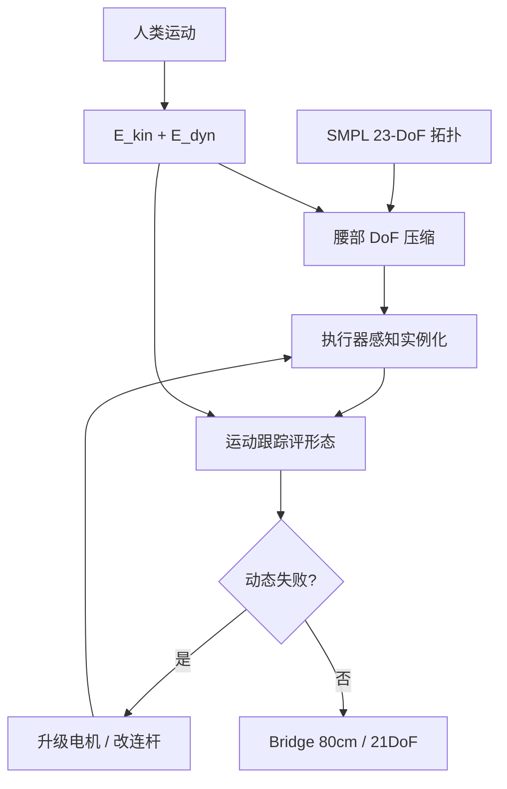

# BRIDGE：形态–控制共设计的开源人形平台

**BRIDGE**（*An Open-Source Humanoid Platform via Morphology-Control Co-Design for Physical AI*，[arXiv:2609.03497](https://arxiv.org/abs/2609.03497)，[项目页](https://sites.google.com/view/bridgerobot)）由 **卡内基梅隆大学（CMU）** Jianren Wang、Abhinav Gupta、Deepak Pathak 与 **华中科技大学**、**JoyIn AI** 等提出：能吃人类运动数据的人形是 Physical AI 的载体，但传统开发把 **硬件形态** 与 **全身控制** 串行切开，再好的策略也补不回骨架限制。作者把形态与控制写成同一优化问题：先压腰部自由度，再按执行器实例化机器人，用运动跟踪评形态，失败再改硬件。落地平台 **Bridge**：规格表与项目页为 **80 cm、12.5 kg、21 主动自由度、约 1500 美元**（图注另写 88 cm / 13 kg，以表为准）。

## 一句话定义

**开源人形不是先画一张像人的 URDF 再训策略，而是用重定向误差和闭环跟踪误差一起选骨架、选腰、选电机。**

## 英文缩写速查

| 缩写 | 英文全称 | 简要说明 |
|------|----------|----------|
| BRIDGE | Bridge Humanoid Platform | 本文共设计落地的开源人形 |
| Co-design | Morphology-Control Co-Design | 形态与全身控制联合优化 |
| DoF | Degree of Freedom | 主动自由度；本文压到 21 |
| MoCap | Motion Capture | 共设计所用人类运动数据 |
| SR | Success Rate | 统一跟踪基准的成功比例 |
| CAD | Computer-Aided Design | 项目页已放 `.stp` 整机模型 |

## 为什么重要

- 纳入 [九篇盘点](../../sources/blogs/wechat_embodied_station_9_papers_open_source_2026-09-04.md) 的「低成本开放硬件」支线。
- 把「买得起」和「像人」写成同一指标 \(\mathcal{S}_{\mathrm{HL}}\)，而不是附录里的 BOM。
- 2026-09-05 再核：项目页已能下 CAD，但训练/部署代码仍写「录用后再发」——**有模型文件 ≠ 能复现控制**。

## 方法

| 项 | 内容 |
|----|------|
| **机构** | CMU、华中科技大学、JoyIn AI |
| **规格** | **80 cm / 12.5 kg / 21 DoF / ~$1.5K**（Table 1 与项目页）；图注 88 cm / 13 kg |
| **对照** | Bumi、Booster K1、Stanford ToddlerBot |
| **开源** | **部分开源**：`.stp` CAD 已放；装配教程 / 电气 / BOM / 训练部署代码 **宣称待录用后发布** |

### 流程总览

### 核心原理

四段共设计，而不是「先定骨架再训 SONIC」：

1. **腰部 DoF 压缩。** 要从 23 压到 21 才能把整机压到 90 cm 以下并给电池留空间。先在 roll/pitch/yaw 里两两筛选（运动学重定向），丢掉 pitch；再在 roll-only vs yaw-only 上训跟踪策略，按 \(\mathcal{E}_{\mathrm{dyn}}\) 选 **只留腰 yaw**（0.02115 vs roll 0.02311）。
2. **执行器感知实例化。** 21 关节各有候选电机集合；先用最小体积电机初始化，再改轴距、网格、惯量，身高限制在约 90 cm 附近。
3. **运动评形态。** 形态冻结后，从共享 21-DoF 基策略微调 motion-specific tracker，用闭环 \(\mathcal{E}_{\mathrm{dyn}}\) 而不是只看 IK。
4. **失败引导改硬件。** 电机饱和或跟不上，就升级该关节并重建相邻连杆——控制失败直接改 BOM。

## 评测

Table 4 类人度（越小越好的误差 + 综合 \(\mathcal{S}_{\mathrm{HL}}\)）：

| 平台 | \(\mathcal{E}_{\mathrm{kin}}\) ↓ | \(\mathcal{E}_{\mathrm{dyn}}\) ↓ | \(\mathcal{S}_{\mathrm{HL}}\) ↑ |
|------|----------------------------------|----------------------------------|---------------------------------|
| Bumi | 0.0381 | 0.0458 | 0.4321 |
| K1 | 0.0396 | 0.0472 | 0.4198 |
| ToddlerBot | 0.0413 | 0.0533 | 0.3883 |
| **Bridge** | **0.0260** | **0.0384** | **0.5252** |

相对 SMPL 的肢体缩放均值：Bridge **1.021**，ToddlerBot 1.171，K1 1.344，Bumi 1.376。

Table 5：各形态上训 [SONIC](../methods/sonic-motion-tracking.md)，LaFAN1 + `bones_seed` 统一基准：

| 平台 | SR ↑ | MPJPE ↓ | MPJVE ↓ | RootVelErr ↓ | MPKPE ↓ |
|------|------|---------|---------|--------------|---------|
| Bumi | 91.87 | 0.1366 | 0.5521 | 0.2111 | 44.89 |
| K1 | 92.66 | 0.1108 | 0.5486 | 0.1826 | 42.15 |
| ToddlerBot | 88.23 | 0.1571 | 0.6333 | 0.3615 | 49.33 |
| **Bridge** | **94.83** | **0.0711** | **0.5167** | **0.1671** | **38.43** |

分域 SR：Balance 95.00%、Highly Dynamic 94.50%、Daily 94.99%；高动态相对最强基线 K1 **+4.70** 个百分点。项目页另有真机走、平衡、后空翻等视频；入库不把未公开单项力矩曲线写进来。

## 结论

**先共设计形态与控制，再谈「开源人形」；否则开源的只是一份买不齐、控不稳的零件清单。CAD 已经能下，控制仓还没有。**

1. **割裂开发是瓶颈** — 先定骨架再训策略，容易牺牲类人流畅性。
2. **指标要联合** — 只比重定向或只比跟踪都会偏科；\(\mathcal{S}_{\mathrm{HL}}\) 把两者绑在一起。
3. **腰 yaw 是算出来的** — 不是审美选型；动态误差否决了 roll-only。
4. **成本是一等参数** — 约 1500 美元写在 Table 1，不是附录。
5. **规格以表为准** — 80 cm / 12.5 kg，不要只抄图注 88 cm。
6. **部分开源** — `.stp` 可下；BOM / 教程 / 训练部署仍待录用。

## 源码运行时序图

**不适用** — 截至 **2026-09-05** 项目页明确「录用后再发训练与部署代码」；现有入口只有 CAD 下载，没有可运行控制脚本。

## 工程实践

| 项 | 建议 |
|----|------|
| 跟踪入口 | 项目页 CAD + arXiv；录用后复核是否出现真实 GitHub（不要再点通用 `github.com/bridge`） |
| 对标平台 | ToddlerBot / K1 / Bumi，而不是只对 G1 |
| 重定向 | 对照 [Motion Retargeting](../concepts/motion-retargeting.md) 与 [UMR](./paper-umr-unified-motion-retargeting.md) |
| 控制对照 | 论文用 SONIC / BeyondMimic 评形态，不等于 Bridge 仓已发布这两套配方 |

## 局限与风险

- **控制仓未落地** — 不能按论文「open code」去复现跟踪。
- **小尺寸人形** — 80 cm 动力学与全尺寸工业人形不可直接外推。
- **图注与表格不一致** — 88 cm / 13 kg vs 80 cm / 12.5 kg。
- **对照集小** — 三台桌面/小型人形，不是对 Unitree G1 的公平赛。
- **SOTA 口径** — 指标是作者自己的 \(\mathcal{E}_{\mathrm{kin}}/\mathcal{E}_{\mathrm{dyn}}\) 与内部 SONIC 复训。

## 与其他工作对比

| 对照 | 差异读法 |
|------|----------|
| Unitree G1 等商品人形 | 闭源本体 + 开源策略生态；Bridge 宣称本体与控制一起开，但控制还没开 |
| [ToddlerBot](https://toddlerbot.github.io/) 等桌面人形 | 同属低成本研究平台；本文强调共设计指标与腰部选择 |
| [UMR](./paper-umr-unified-motion-retargeting.md) | 重定向算法；Bridge 把重定向保真写进形态优化 |
| [FWBC-VLA](./paper-fwbc-vla.md) | 轮足接触补偿；Bridge 是形态–控制共设计，不是力觉 VLA |

## 关联页面

- [Humanoid Locomotion](../tasks/humanoid-locomotion.md)
- [Motion Retargeting](../concepts/motion-retargeting.md)
- [开源可复现性 9 篇地图](../overview/open-source-reproducibility-9-papers-technology-map.md)
- [Network Design](./paper-network-design-reproducible.md)
- [FWBC-VLA](./paper-fwbc-vla.md)

## 参考来源

- [bridge_humanoid_arxiv_2609_03497](../../sources/papers/bridge_humanoid_arxiv_2609_03497.md)
- [bridgerobot 项目页](../../sources/sites/bridgerobot.md)
- [具身智能小站 2026-09-04 九篇盘点](../../sources/blogs/wechat_embodied_station_9_papers_open_source_2026-09-04.md)

## 推荐继续阅读

- [arXiv:2609.03497](https://arxiv.org/abs/2609.03497)
- [Bridge 项目页](https://sites.google.com/view/bridgerobot)
