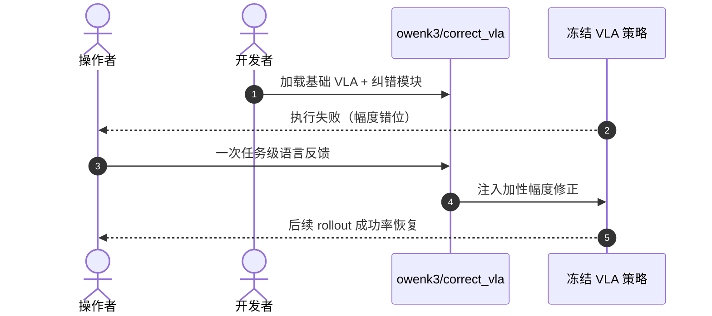

# CorrectVLA：VLA 失败的语言反馈推理期动作纠错

**CorrectVLA**（*Training-Free Action Correction for VLA Model Failures via Language Feedback*，[arXiv:2608.29967](https://arxiv.org/abs/2608.29967)，[项目页](https://correctvla.github.io/)，[代码](https://github.com/owenk3/correct_vla)）将 **任务级自然语言纠正** 转化为 **加性动作幅度调整**，**不修改策略权重**；人类 **一次反馈** 统一应用于所有 rollout。

## 一句话定义

**推理期纠错有效的前提是策略已经「想对了」——语言只能修幅度，救不了语义理解崩溃。**

## 英文缩写速查

| 缩写 | 英文全称 | 简要说明 |
|------|----------|----------|
| VLA | Vision-Language-Action | 视觉-语言-动作策略 |
| OOD | Out-of-Distribution | 分布外任务/场景 |
| LIBERO | LIBERO Benchmark | 操作仿真基准套件 |

## 为什么重要

- 纳入 [2026-09-01 七篇盘点](../../sources/blogs/wechat_embodied_station_7_papers_open_source_system_loop_2026-09-01.md) 的「VLA 推理期纠错边界」支线。
- 明确 **可修正 vs 不可修正** 失败子集（LIBERO-90 失败模式分类）。
- 真机 **UFactory xArm7** 在基础策略近乎失效时恢复近完美成功率。
- **已开源** `owenk3/correct_vla`。

## 核心信息

| 项 | 内容 |
|----|------|
| **作者** | Owen Kwon, Pablo Ortega-Kral, Arthur Bucker, Jean Oh |
| **机构** | 卡内基梅隆大学（CMU）等 |
| **修正对象** | 动作幅度（加性调整） |
| **开源** | **已开源** [owenk3/correct_vla](https://github.com/owenk3/correct_vla) |

### 流程总览

## 评测

| 设置 | 读法 |
|------|------|
| 仿真分布内 / OOD | 可恢复 execution misalignment |
| LIBERO-90 失败分类 | 「目标正确、幅度失准」可修；语义崩溃不适用 |
| 真机 xArm7 | 基础策略近乎失效时恢复近完美 SR |

## 结论

**Training-free 语言纠错是 VLA 部署的安全网，但只覆盖 execution misalignment 子集。**

- 一次语言反馈 → 全局加性幅度修正
- 不改权重，部署成本低
- 仿真与真机均验证恢复能力
- 失败模式分类给出清晰适用边界
- 官方代码可复现 LIBERO 与真机实验
- 与需要微调或 RLHF 的路线形成对比

## 源码运行时序图

## 局限与风险

- **语义失败不可修：** 理解错误需重训或更强基础模型。
- **反馈质量：** 语言描述粒度影响修正效果。
- **任务覆盖：** 以 manipulation 仿真与单臂真机为主。

## 与其他工作对比（索引级）

| 维度 | CorrectVLA | 微调 / RLHF 式纠错 | 逐 rollout 人工接管（[DAgger](../methods/dagger.md) 式） | 改写指令 / 提示工程 |
|------|-----------|------------------|--------------------------------------------------|------------------|
| 是否改权重 | **否**（推理期加性修正） | 是 | 是（聚合数据后重训） | 否 |
| 人力代价 | **一次任务级语言反馈**，全 rollout 复用 | 标注 + 训练轮次 | 每条 rollout 都要人在环 | 每次试错重写 |
| 能修的失败 | **execution misalignment**（目标对、幅度偏） | 原则上含语义，但要数据 | 含语义，代价最高 | 仅指令歧义 |
| 修不了的失败 | **语义理解崩溃** | — | — | 幅度/动力学层面误差 |
| 部署门槛 | 冻结策略即可挂载 | 需训练栈 | 需遥操作工位 | 最低 |

- **定位是安全网而非能力提升**：本文的贡献是划清 training-free 纠错的**适用边界**（LIBERO-90 失败分类），不是声称能替代基础策略能力的改进。
- **与 DAgger 路线正交**：DAgger 用专家接管扩数据再训，CorrectVLA 一次反馈就地生效、不产生新训练成本；两者可叠加——先用前者兜底采集，再判断是否值得重训。
- **数字不可横比**：真机 xArm7 上「近乎失效 → 近完美 SR」的读法前提是基础策略的失败恰好落在可修子集，换失败分布结论即变。

## 关联页面

- [VLA](../methods/vla.md)
- [Manipulation](../tasks/manipulation.md)
- [DAgger](../methods/dagger.md) — 需重训的交互式纠错对照路线
- [开源系统闭环 7 篇地图](../overview/open-source-system-loop-7-papers-technology-map.md)

## 推荐继续阅读

- [CorrectVLA 项目页](https://correctvla.github.io/)
- [arXiv:2608.29967](https://arxiv.org/abs/2608.29967)

## 参考来源

- [correctvla_arxiv_2608_29967.md](../../sources/papers/correctvla_arxiv_2608_29967.md)
- [具身智能小站 2026-09-01 七篇盘点](../../sources/blogs/wechat_embodied_station_7_papers_open_source_system_loop_2026-09-01.md)
- [CorrectVLA 项目页](../../sources/sites/correctvla.md)
- [owenk3/correct_vla](../../sources/repos/owenk3-correct-vla.md)
