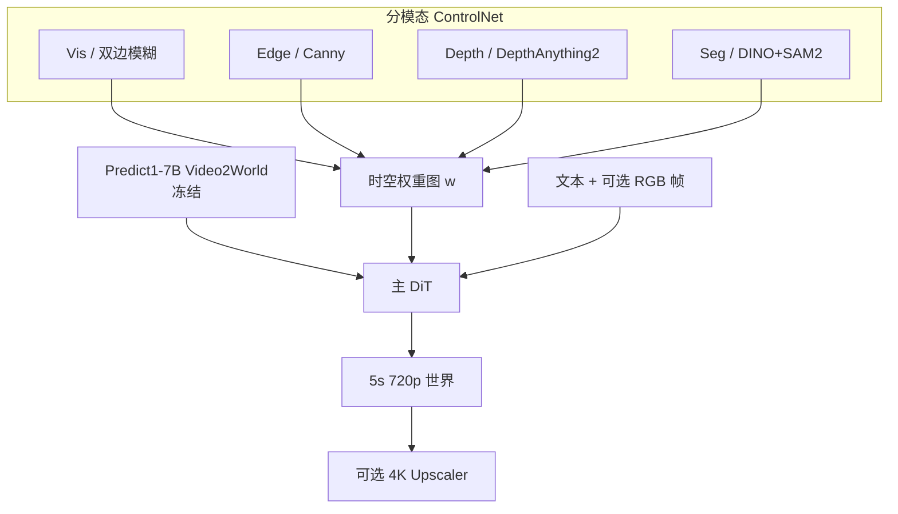
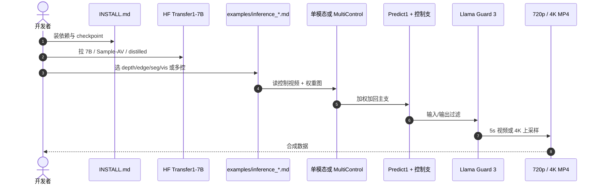

# Cosmos-Transfer1: Conditional World Generation with Adaptive Multimodal Control

**Cosmos-Transfer1**（[arXiv:2503.14492](https://arxiv.org/abs/2503.14492)，NVIDIA，[项目页](https://research.nvidia.com/labs/cosmos-lab/cosmos-transfer1/)）把 [Cosmos 1.0](./paper-sa-2501-03575-cosmos-world-foundation-model-platform-for-physi.md) 的 Predict1 Video2World 收成 **条件世界生成器**：多路空间控制（分割、深度、边缘、模糊；驾驶另加 HDMap / LiDAR）经 **自适应时空权重图** 融进主扩散支。工程家族与 2.5 代对照见 [Cosmos Transfer](./cosmos-transfer.md)。

## 一句话定义

**分模态训 ControlNet、推理时按像素加权融合——让仿真或结构化传感器视频变成可控照片级世界，用来做机器人 Sim2Real 与驾驶数据增广。**

## 英文缩写速查

| 缩写 | 英文全称 | 简要说明 |
|------|----------|----------|
| DiT | Diffusion Transformer | Predict1 基座去噪骨干 |
| ControlNet | Control Network | 冻结基座、另训控制支 |
| TransferBench | Transfer Benchmark | 论文评测集：600 例三场景 |
| si-RMSE | Scale-invariant RMSE | 深度对齐指标，越低越好 |
| FG / BG | Foreground / Background | 时空权重常按显著物体切开 |
| NVL72 | NVIDIA GB200 NVL72 | 72×B200 机柜；论文实时推理平台 |

## 为什么重要

- 把「CG 仿真看起来假」写成 **可控翻译** 而不是再训一个视频生成器：depth/seg 在 Isaac / Omniverse 里几乎免费。
- **分开训支、推理融合** 降低 7B 视频 ControlNet 的显存与配对数据负担，也能事后加减模态。
- 给出可引用的控制–多样性权衡：密结构（Vis/Edge）对齐高、多样性低；疏结构相反。均匀四控 Quality Score **8.54**。
- 演示 **64×B200 实时**：5 秒 720p 端到端 4.2 s——说明 WFM 推理可以按 token 序列做 head-parallel，而不只是「再堆采样步」。

## 核心信息

| 项 | 内容 |
|----|------|
| **机构** | 英伟达（NVIDIA） |
| **基座** | Cosmos-Predict1-7B-Video2World（AV 变体再 finetune dashcam） |
| **输出** | 5 s、1280×704、24 fps（约 56K token）；另有 720p→4K |
| **训练** | 每支 1024×H100，约 2–4 周 |
| **开源** | **已开源**：代码 Apache-2.0，权重 NVIDIA Open Model License；[cosmos-transfer1](https://github.com/nvidia-cosmos/cosmos-transfer1) |
| **维护** | 2026-06 起 **有限维护**；新产品走 [Cosmos 3](./cosmos-3.md) |

## 核心原理

基座去噪器 \(D(\mathbf{x}_\sigma,\sigma)\) 预测噪声。ControlNet 加条件 token \(\mathbf{c}\) 后为 \(D(\mathbf{x}_\sigma,\sigma,\mathbf{c})\)。Transfer1 为 \(N\) 个模态各建一支（约 3 个 transformer block，线性层零初始化），第 \(j\) 块第 \(i\) 支激活 \(\mathbf{h}_i^j\) 乘时空切片 \(\mathbf{w}_i\) 再加回主支。\(\mathbf{w}\) 可手写、按启发式（如前/背景）或另训网络；各模态权和大于 1 则归一化。

支 **单独训练、推理拼接**：一次只装一支；不同模态可用不同数据；推理时可丢掉某一支。

### 流程总览

通用模态：Vis 保颜色粗构图；Edge 保轮廓；Depth 保几何；Seg 保布局（颜色随机，无类别语义）。AV Sample 改用 RDS-HQ（约 360 小时、65K 段 20 s 环视）上的 HDMap+3D box 与插值 LiDAR。Prompt 侧另训 Pixtral-12B upsampler，把短指令扩到训练分布的长描述。

## 源码运行时序图

官方入口：[nvidia-cosmos/cosmos-transfer1](https://github.com/nvidia-cosmos/cosmos-transfer1) 的 `examples/inference_cosmos_transfer1_7b.md`（多卡）与 `INSTALL.md`。

后训练：`examples/training_cosmos_transfer_7b.md`。蒸馏 Edge：`examples/distillation_cosmos_transfer1_7b.md`（1 步 vs 36 步）。机器人场景增广：`cosmos_transfer1/auxiliary/robot_augmentation/`。

## 工程实践

| 项 | 要点 |
|----|------|
| 安装 | 仓内 `INSTALL.md`；多卡推理示例带 `torchrun` |
| 选权重 | 通用多控用 Transfer1-7B；驾驶用 Sample-AV；要快用 Edge Distilled |
| 控制图 | 机器人：FG 用 Edge/Vis 保外形，BG 用 Seg 换场景（论文 Setting1/2） |
| 4K | 3×3 重叠 patch，每步去噪后重叠区平均 |
| 新产品 | **改走** [Cosmos Transfer](./cosmos-transfer.md) 2.5 配方或 [Cosmos 3](./cosmos-3.md) |

## 评测与指标

**TransferBench：** AgiBot World / OpenDV / Ego-Exo-4D 各 200，共 600。对齐：Blur SSIM、Edge F1、Depth si-RMSE、Mask mIoU；多样性 Diversity-LPIPS；画质 DOVER-technical Quality Score。

| 设定 | Blur SSIM↑ | Edge F1↑ | Depth si-RMSE↓ | Mask mIoU↑ | LPIPS↑ | Quality↑ |
|------|-----------:|---------:|---------------:|-----------:|-------:|---------:|
| 7B [Vis] | **0.96** | 0.16 | 0.49 | **0.72** | 0.19 | 5.94 |
| 7B [Edge] | 0.77 | **0.28** | 0.53 | 0.71 | 0.28 | 5.48 |
| 7B [Depth] | 0.71 | 0.14 | 0.49 | 0.70 | 0.39 | 6.51 |
| 7B [Seg] | 0.66 | 0.11 | 0.75 | 0.68 | **0.42** | 6.30 |
| 均匀四控 | 0.87 | 0.20 | 0.47 | **0.72** | 0.22 | **8.54** |

SalientObject（FG=Vis+Edge，BG=Depth+Seg）：FG Blur SSIM 0.81、BG Diversity-LPIPS 0.33、Quality 8.29。对调前后景则 FG 多样性升、BG 对齐升——权重图不是装饰。

**机器人（Isaac Lab 厨房，20×6=120 视频）：** Setting2（FG Edge + BG Seg）Quality **10.42**、FG Mask mIoU **0.63**，高于单模态 Seg 的 0.54；单模态 Vis 的 Blur SSIM 0.95 最高但 Quality 只有 9.11。

**AV：** Sample-AV [LiDAR] 3D-Bbox mAP **46.50**、Reproj **8.60**；[HDMap] Lane mIoU 50.37；融合后 Lane mIoU **51.55**、mAP 44.66、Reproj 8.67。

**实时：** 1→64 B200，扩散 141.0 s → 3.5 s，端到端 141.7 s → **4.2 s**。

## 与其他工作对比

| 对比轴 | Transfer1 | [Predict2.5 / Transfer2.5](./paper-sa-2511-00062-world-simulation-with-video-foundation-models-fo.md) | [Cosmos 3](./cosmos-3.md) | 通用 ControlNet 视频 |
|--------|-----------|-----------------------------------------------------------------------------------------------------|---------------------------|----------------------|
| 基座 | Predict1 扩散 DiT | Predict2.5 flow，2B | 全模态 MoT | 图像 ControlNet 改编 |
| 控制 | 分模态支 + 时空 \(\mathbf{w}\) | JSON 多控，可当场算图 | 统一 Generator；Edge 无 V2V | 通常单图/弱时序 |
| 评测 | TransferBench + 厨房 + AV 表 | PAIBench-Transfer；2B 优于 7B | 换榜（Artificial Analysis 等） | 少 Physical AI 集 |
| 维护 | 有限 | 有限 | **当前主线** | 视实现 |

站内下游：Cookbook 的 X-Mobility / CARLA / GR00T-Mimic 仍常钉 Transfer1 或 2.5 权重。

## 结论

**Transfer1 真正留下的是「分模态训、按像素加权融」这套接口，以及 TransferBench 上「多控画质优于单控、密/疏结构互换多样性」的读法；7B 体积和 64 卡实时都是可被 2.5 / Cosmos 3 替换的代价。**

1. **均匀四控 Quality 8.54** 是读这篇时最有用的生成分数；单模态 Vis 对齐最高但画质差一截。
2. **机器人增广先写权重图再调 prompt** — Setting2 保外形换背景，FG mIoU 和 Quality 同时上去。
3. **AV 不要只用 LiDAR** — 3D box 最好，车道要 HDMap；融合才同时像样。
4. **实时是系统活，不是算法免费午餐** — 64×B200 + head-parallel；单卡仍是两分钟级。
5. **新产品不要从本仓起步** — README 已写迁 Cosmos 3；本页服务复现与旧配方。

## 局限与风险

- 视频翻译会幻觉物理；FG 掩码错了会把机器人「译坏」。
- Edge F1 是像素级严指标，绝对值低（0.28）不代表不可用，但不要当验收唯一门槛。
- 权重门控 + Llama Guard 3 许可独立；蒸馏配方是加速演示。
- 与 2.5 / Cosmos 3 榜单不可直接横比。

## 关联页面

- [Cosmos Transfer 族](./cosmos-transfer.md)
- [Cosmos 1.0 WFM 平台](./paper-sa-2501-03575-cosmos-world-foundation-model-platform-for-physi.md)
- [Predict2.5 / Transfer2.5](./paper-sa-2511-00062-world-simulation-with-video-foundation-models-fo.md)
- [NVIDIA Cosmos](./nvidia-cosmos.md)
- [Cosmos 3](./cosmos-3.md)
- [Cosmos Cookbook](./cosmos-cookbook.md)
- [Newton Physics](./newton-physics.md)
- [NVIDIA Omniverse](./nvidia-omniverse.md)
- [Generative World Models](../methods/generative-world-models.md)
- [Sim2Real](../concepts/sim2real.md)
- [Video-as-Simulation](../concepts/video-as-simulation.md)
- [Manipulation](../tasks/manipulation.md)

## 参考来源

- [Transfer1 一手摘录](../../sources/papers/cosmos_transfer1_arxiv_2503_14492.md)
- [Transfer1 项目页](../../sources/sites/cosmos-transfer1-project.md)
- [cosmos-transfer1 仓库](../../sources/repos/nvidia_cosmos_transfer1.md)

## 推荐继续阅读

- [arXiv:2503.14492](https://arxiv.org/abs/2503.14492)
- [项目页](https://research.nvidia.com/labs/cosmos-lab/cosmos-transfer1/)
- [GitHub: cosmos-transfer1](https://github.com/nvidia-cosmos/cosmos-transfer1)
- [Hugging Face 集合](https://huggingface.co/collections/nvidia/cosmos-transfer1-67c9d328196453be6e568d3e)
