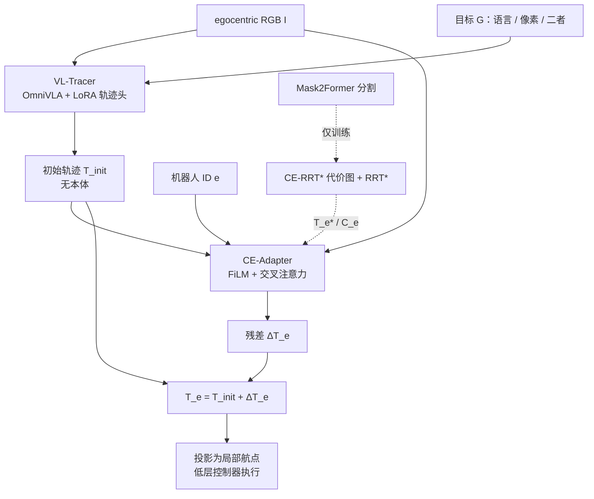

# CrossTracer：像素轨迹残差做跨本体导航

**CrossTracer**（*Cross-Embodiment Navigation via VLA Model Reasoning and Trace Residuals Adapting*，[arXiv:2608.06688](https://arxiv.org/abs/2608.06688)，[项目页](https://lilduckkk.github.io/CrossTracer-Nav/)）由 **鹏城实验室**、**南方科技大学（SUSTech）**、**创新投资研究院** 与 **苏州大学** 提出：把导航计划写成 **归一化图像平面航点**，先用改编自 [OmniVLA](https://arxiv.org/abs/2509.19480) 的 **VL-Tracer** 出无本体语义轨迹，再用 **CE-Adapter** 按机器人身份做残差修正。监督来自 **CE-RRT\***（全景分割 → 本体代价图 → 像素平面 RRT*），避免手标跨本体路径。在 [NaviTrace](https://arxiv.org/abs/2510.26909) 上总分 **45.68**；轮式与腿式真机相对 OmniVLA 提高 SR / SPL / STT。

## 一句话定义

**语义走哪条、这台机能不能走，不要塞进同一个 VLA：先出一条像素轨迹，再用本体条件残差把它掰到可通行区域。**

## 英文缩写速查

| 缩写 | 英文全称 | 简要说明 |
|------|----------|----------|
| VLA | Vision-Language-Action | 本文 proposer 骨干（OmniVLA）；输出从低层动作改成像素航点 |
| VL-Tracer | Vision-Language Trace Proposer | 第一段：无本体语义轨迹提案 |
| CE-Adapter | Cross-Embodiment Adapter | 第二段：按机器人 ID 预测轨迹残差 |
| CE-RRT* | Cross-Embodiment RRT* | 训练期自动造本体参考轨迹的采样规划器 |
| FiLM | Feature-wise Linear Modulation | 用机器人 embedding 仿射调制视觉特征 |
| NaviTrace | NaviTrace benchmark | 图像平面 trace 评测：指令 + 本体 → 2D 路径 |
| SR / SPL / STT | Success Rate / Success weighted by Path Length / Task Time | 真机三项：成功、路径效率、时间效率 |

## 为什么重要

- **跨本体导航的真正缺口：** 同一句「走到那张桌子」对轮式和腿式意味不同的可行区域。端到端 VLA 把语义、可通行性和控制缠在一起，换机就要重训整网。
- **像素轨迹是可共享的窄腰：** 它对齐当前 egocentric 图，既能接开放词汇目标（语言 / 像素位姿），又能被本体模块在同一坐标系里改，而不先承诺某台机的速度空间。
- **残差优于有限候选挑选：** [VAMOS](https://arxiv.org/abs/2510.20818) 只能在提案集合里重排；提案局部全错时选不出可行段。CE-Adapter 在连续图像平面里挪航点。
- **开源边界：** 截至 **2026-09-04** 项目页无 GitHub。NaviTrace 表上的 Open-Source ✓ 不能当成可复现入口（对照 [四范式](../overview/vln-open-source-repro-paradigms.md)）。

## 核心信息

| 字段 | 内容 |
|------|------|
| 机构 | 鹏城实验室（Peng Cheng Laboratory）；南方科技大学（SUSTech）；创新投资研究院（Innovation Investment Research Institute）；苏州大学（Soochow University） |
| 出处 | arXiv:2608.06688（2026-08）；cs.RO 预印本 |
| 提案骨干 | OmniVLA + LoRA；Llama 7B 级；输出 \(N=8\) 归一化航点 |
| 适配器 | ResNet + FiLM + Transformer；残差有 \(\delta_{max}\) 上界 |
| 监督 | CE-RRT*：Mask2Former-R50 → 本体代价图 → 图像平面 RRT*；62k 图 |
| 评测 | NaviTrace（语言+本体）；真机轮式 / 腿式，对照 OmniVLA |
| 开源（截至 2026-09-04） | **宣称开源 / 待核实**：对照表标 ✓，项目页未列仓库；作者公开仓无 CrossTracer |

## 核心原理

任务写成：给定 egocentric RGB \(I\)、目标 \(\mathcal{G}\)（语言 \(L\)、像素目标 \(P_g\) 或二者）和本体 \(e\)，预测

\[
T_e=\{\mathbf{w}_t\}_{t=1}^{N},\quad \mathbf{w}_t\in[-1,1]^2,\quad N=8.
\]

分解为提案与残差，本体只进第二段：

\[
T_{init}=f_\phi(I,\mathcal{G}),\qquad \Delta T_e=g_\theta(I,T_{init},e),\qquad T_e=T_{init}+\Delta T_e.
\]

推理不需要分割或预计算代价图；\(\mathcal{C}_e\) 只服务训练期的 CE-RRT* 与辅助损失。

### 流程总览

### VL-Tracer

视觉 token、语言 token 与 \(\mathrm{MLP}_{pose}(P_g)\) 拼接；缺失模态用 mask 去掉。训练时语言/位姿以 \(p_{drop}=0.3\) 随机丢，提高缺目标时的稳健性。轨迹头对预测 token 做 \(\tanh\)，把航点锁在 \([-1,1]^2\)。数据用 VAMOS 的图像空间路径；骨干冻结，只训 LoRA 与头。损失是航点 MSE 加一阶平滑 \(\lambda_{smooth}=0.01\)。8×A100 约 48 小时后冻结，梯度不再回传。

### CE-RRT*（只训练）

1. Mask2Former（ResNet-50）出全景标签。
2. 按本体配置自由 / 软可通行 / 障碍类别，写 \(\mathcal{C}_e\)（含离障碍距离惩罚）。
3. 图像平面 RRT*：goal-bias 0.15、步长 25 px、半径 60 px、最多 10k 次；边代价同时罚长度与高代价区。
4. 抽出路径后均匀重采样为 \(N\) 点并归一化，得到 \(T_e^*\)。

代价配置是手工的：换新机要重写类别表，这是作者自己写进局限的工程债。

### CE-Adapter

机器人 embedding \(\mathbf{z}_e\) 在各编码器层做 FiLM（近恒等初始化，避免一上来毁掉预训练视觉）。展平后的视觉 token 与 robot token 进 Transformer。\(T_{init}\) 投影成 \(N\) 个 trace query，对本体条件视觉 token 做交叉注意力。残差头 \(\Delta T_e=\delta_{max}\tanh(\cdot)\) 限制「改着改着丢掉语义目标」。训练另有：

- **Feasibility Head：** 重建 \(\mathcal{C}_e\)，逼视觉支路学本体地形；
- **Sensitivity Head：** \(\alpha_e=\mathrm{Softplus}(\cdot)\)，给物理代价损失按本体加权。

CE-Adapter 损失 \(\mathcal{L}_{trace}+\mathcal{L}_{trav}+\mathcal{L}_{cost}+0.05\,\mathcal{L}_{smooth}\)；Adam \(10^{-4}\)、batch 64、图缩到 \(64\times 64\)；单卡 4090 约 3 小时。

## 源码运行时序图

**不适用**（截至 2026-09-04）：项目页与作者公开仓 **没有** 训练 / 推理 / 部署入口。对照表 Open-Source ✓ 不能当可跑通实现。放出后应补：VAMOS 轨迹 → VL-Tracer LoRA → CE-RRT* 标 62k → 训 CE-Adapter → NaviTrace 评测 → Orin↔4090 真机闭环。

## 工程实践

| 项 | 做法 |
|----|------|
| **何时用这篇** | 要在 **同一语义目标** 下给轮式/腿式出不同可行像素路径，且已有 OmniVLA 类提案 |
| **何时不用** | 今天就要跑通 VLN → [四范式](../overview/vln-open-source-repro-paradigms.md)；只要给冻结 VLA 涂可通行色 → [Green for Go](./paper-green-for-go-vla-nav-grounding.md)；要比双足摔倒 → [HumanoidVLN](./paper-humanoidvln.md) |
| **两段不要反传打通** | 论文明确：先冻 proposer，再训 adapter。混训会把语义提案重新缠上本体 |
| **推理输入** | RGB + 目标 + 本体 ID。不要在部署时再跑 Mask2Former |
| **真机链路** | Jetson Orin 采集/执行，WiFi 把图送到 4090 出轨迹，再投影成局部航点。比的是轨迹质量，低层控制器固定 |
| **调试指标** | NaviTrace 总分与 accessibility / social / obstacle 分项；真机 SR 必须和 SPL/STT 一起读 |
| **换新机** | 先写该机的语义代价表，再跑 CE-RRT* 造 \(T_e^*\)；不要假设 FiLM 能零样本一个没见过的 ID |

## 实验与评测

### NaviTrace（语言 + 本体）

官方协议：egocentric 图 + 指令 + 本体类型 → 图像平面 trace。更高分更好。

| 模型 | 开源列 | Total |
|------|--------|-------|
| Qwen3-VL-8B-Thinking | ✓ | −41.30 |
| Claude Sonnet-4.5 | ✗ | 7.36 |
| Robobrain-2.5-8B | ✓ | 27.96 |
| Qwen3-VL-235B-Thinking | ✓ | 26.24 |
| Gemini-2.5-Pro | ✗ | 35.67 |
| **CrossTracer-8B** | 表上 ✓ | **45.68** |
| CrossTracer w/o CE-Adapter | 表上 ✓ | 22.56 |
| CrossTracer w/ Goal Pose | 表上 ✓ | 63.91（多了像素目标，输入不同） |

相对最强通用基线 Gemini-2.5-Pro：**+10.01 / +28.1%**。相对最强具身基线 Robobrain-2.5-8B：**+17.72**。去掉 CE-Adapter 掉 **23.12** 分；accessibility 从 −3.18 到 33.79、social norms 从 1.28 到 37.87——残差段做的是物理接地，不是平滑。四本体分：bicycle 42.16 / human 46.26 / legged 46.40 / wheeled 46.28，差距小。

### 真机（对照 OmniVLA，同相机、同指令、同控制器）

四任务 × 五次。室内语义到达、二层平台可通行、户外左转后垃圾桶。

| 平台 | 方法 | 平均 SR | SPL | STT |
|------|------|---------|-----|-----|
| 轮式 | OmniVLA | 0.40 | 0.37 | 0.17 |
| 轮式 | CrossTracer | **0.65** | **0.59** | **0.30** |
| 腿式 | OmniVLA | 0.45 | 0.31 | 0.27 |
| 腿式 | CrossTracer | **0.70** | **0.58** | **0.43** |

二层平台任务上腿式增益更明显（SR 0.60→0.80），和「残差按本体改接近方向」的叙事一致。样本是每格 5 次，读趋势不要当大规模现场统计。

## 结论

**跨本体导航先把「语义轨迹」和「这台机能不能走」拆开；NaviTrace 上多出来的分，几乎全是 CE-Adapter 残差给的，不是更大的通用 VLM。**

1. **真影响：像素轨迹当接口** — 语言/像素目标进 proposer，本体 ID 只进 adapter；换机不必重训语义段。
2. **真影响：连续残差，不是候选重排** — 去掉 adapter 掉 23 分，accessibility / social 几乎塌掉。
3. **真影响：规划器造标** — 62k 图的 CE-RRT* 让跨本体监督可规模化；推理不再跑分割。
4. **次要代价：NaviTrace 不是闭环 SR** — 图像平面 trace 分高，不等于 Habitat R2R 或双足摔倒协议。
5. **次要代价：真机 N 小、远程推理** — 四任务 × 五次，4090 在工作站上；不要外推机上实时或未见场景。
6. **部署读法：** 已有 OmniVLA 类提案时，优先加本体残差，而不是再叠一层绿/红 overlay 或换更大 Gemini。
7. **工程读法：无代码** — 2026-09-04 只能引用数字与项目页叙事；复现仍走已开源 [NaVILA](./paper-notebook-navila-legged-robot-vision-language-action-model.md) / [四范式](../overview/vln-open-source-repro-paradigms.md)。

## 与其他工作对比

| 路线 | 干预位置 | 本体怎么进 | 标的 |
|------|----------|------------|------|
| **[Green for Go](./paper-green-for-go-vla-nav-grounding.md)** | 冻结 OmniVLA 的输入 overlay | 不编码机器人 ID | 开环 7 航点误差（Grand Tour） |
| **VAMOS** | VLM 候选 + affordance 重排 | 打分选已有路径 | 图像空间候选集合 |
| **[NaVILA](./paper-notebook-navila-legged-robot-vision-language-action-model.md)** | 中层语言动作 + locomotion | 单族腿式 | R2R-CE / 真机 Go2 |
| **[DA-Nav](./paper-da-nav.md)** | 图像平面离散网格 + CoT | 零样本迁足式/人形 | 城市方向指令 |
| **[HumanoidVLN](./paper-humanoidvln.md)** | 评测平台，不是新策略 | 分本体 RL 步态 | 双足 SR + **摔倒** |
| **CE-Nav** | 速度空间 flow + 动力学 refine | 动作/速度残差 | 局部导航，不是像素 trace |
| **本文** | **像素轨迹残差** | **ID → FiLM + 残差头** | **NaviTrace + 轮/腿真机** |

- **相对 Green for Go：** 都碰 OmniVLA 与可通行性，但本文 **重训两段** 并显式吃本体 ID；Green for Go 是推理时涂色，归一化后多半是轨迹变短。
- **相对 NaVILA：** NaVILA 的窄腰是语言命令；本文的窄腰是 8 个像素航点，低层控制器保持不动。
- **相对 HumanoidVLN：** 那篇评「计划能不能被这台双足走完」；这篇评「计划本身是否按本体改过」。轴正交，都不要当成对方的替代基准。

## 局限与风险

- **开源：** 宣称 / 待核实；不能本地复现 62k 标注或 NaviTrace 提交。
- **分割误差会进标签：** CE-RRT* 吃 Mask2Former；错分割会系统性污染 \(T_e^*\)。
- **代价表手工：** 新机要专家重写 \(\mathcal{S}_{free}/\mathcal{S}_{soft}\)；作者把「从交互数据学可通行性」写成未来工作。
- **2D 接口：** 悬空障碍与高度断裂不在像素 trace 里；作者自己点了要扩 3D。
- **无动态重规划叙事：** 真机是闭环执行轨迹，但方法节没有专门的动态障碍重规划模块。
- **误区：** 把 NaviTrace 45.68 读成 VLN-CE SR；把表上 Open-Source ✓ 读成 GitHub 已上线；把 goal-pose 63.91 和语言-only 45.68 当同输入对比。

## 关联页面

- [VLA](../methods/vla.md) — 导航 VLA 上「提案 / 本体残差」拆分的一例
- [视觉–语言导航](../tasks/vision-language-navigation.md) — 任务总览；本文补跨本体像素 trace
- [VLN 四范式开源复现](../overview/vln-open-source-repro-paradigms.md) — 本文不进入可跑通清单
- [跨具身迁移知识链](../overview/hub-cross-embodiment.md) — 导航侧「同一语义、不同可行路径」，不是 WBT 换骨架
- [Green for Go](./paper-green-for-go-vla-nav-grounding.md) — 冻结 OmniVLA 的可通行 overlay 对照
- [HumanoidVLN](./paper-humanoidvln.md) — 跨人形本体的物理 VLN 评测对照
- [NaVILA](./paper-notebook-navila-legged-robot-vision-language-action-model.md) — 已开源腿式导航 VLA
- [DA-Nav](./paper-da-nav.md) — 图像平面 grounding，但是城市方向指令
- [NavWAM](./paper-navwam-goal-conditioned-visual-navigation-wam.md) — 同一 OmniVLA 基线上的 image-goal WAM 对照

## 参考来源

- [CrossTracer 论文摘录（arXiv:2608.06688）](../../sources/papers/crosstracer_arxiv_2608_06688.md)
- [项目页开源核查](../../sources/sites/crosstracer-nav-github-io.md)

## 推荐继续阅读

- Wang et al., *CrossTracer* — [arXiv:2608.06688](https://arxiv.org/abs/2608.06688) / [项目页](https://lilduckkk.github.io/CrossTracer-Nav/)
- Hirose et al., *OmniVLA* — [arXiv:2509.19480](https://arxiv.org/abs/2509.19480)
- Windecker et al., *NaviTrace* — [arXiv:2510.26909](https://arxiv.org/abs/2510.26909)
- Castro et al., *VAMOS* — [arXiv:2510.20818](https://arxiv.org/abs/2510.20818)
- Cheng et al., *NaVILA* — [arXiv:2412.04453](https://arxiv.org/abs/2412.04453)
