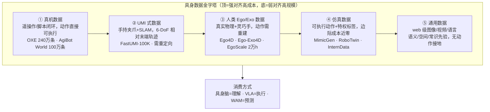

# Data Pyramid for Embodied Manipulation（具身数据金字塔综述）

**Data Pyramid for Embodied Manipulation**（[arXiv:2607.24744](https://arxiv.org/abs/2607.24744)，2026-07-27）是 **北京大学（PKU）牵头、11 家机构** 合作的 **数据中心（data-centric）具身操作综述**。它回答的核心问题是：**具身基础模型没有「整个互联网」可吃——到底该用什么数据训练？** 论文把具身数据生态组织为 **五层金字塔**，再以 **数据配方（data recipe）** 视角分析具身脑模型、VLA、WAM 如何选择、对齐与混合各层数据，最后给出六大开放挑战。

## 一句话定义

**以「可扩展性 × 机器人对齐」这对天然矛盾为主轴（辅以质量/多样性/可复用性/物理保真四维），把具身数据生态组织成「真机 → UMI → 人类 Ego/Exo → 仿真 → 通用」五层金字塔，并用它统一解读具身基础模型的数据配方。**

## 英文缩写速查

| 缩写 | 英文全称 | 简要说明 |
|------|----------|----------|
| UMI | Universal Manipulation Interface | 手持夹爪 + 腕相机 + 视觉惯性 SLAM 的无机器人采集范式（金字塔第二层） |
| VLA | Vision-Language-Action | 视觉-语言-动作模型；综述中 action-labeled 数据的主要消费者 |
| WAM | World Action Model | 世界-动作模型；联合建模世界演化与动作，消费 action-free + action-labeled 数据 |
| VLM | Vision-Language Model | 视觉-语言模型；具身脑模型与 VLA 的上游骨干 |
| SLAM | Simultaneous Localization and Mapping | UMI 估计手持夹爪 6-DoF 轨迹的定位建图技术 |
| IK | Inverse Kinematics | UMI/人类演示重定向到机器人的逆运动学环节 |
| EEF | End-Effector | 末端执行器；跨本体可迁移的动作表示中心 |
| DoF | Degrees of Freedom | 自由度；UMI 记录 6-DoF 末端位姿轨迹 |
| DAgger | Dataset Aggregation | 人在环纠偏数据聚合范式（真机采集三分支之一） |
| OXE | Open X-Embodiment | 跨机构真机数据聚合项目（真机层代表，240 万条级） |
| DR | Domain Randomization | 仿真层缩小 sim2real 观测差距的域随机化手段 |
| EMG | Electromyography | 肌电；Ego 层辅助交互传感之一（EgoEMG） |

## 为什么重要

- **首个类目级（category-level）具身数据系统组织：** 此前金字塔叙事（[GR00T N1](paper-hrl-stack-34-gr00t_n1.md)、Motus）都是 **围绕单个模型训练配方** 设计的，缺少跨「采集可扩展性、本体依赖、物理保真、可迁移性、下游效用」的类目级对比；本综述把整条数据生态放进同一坐标系。
- **给「数据选型」提供了可操作的决策语言：** 五层 × 六维属性直接回答「我缺什么能力、该补哪一层、代价是什么」，而非笼统的「数据越多越好」。
- **把模型族与数据层对齐：** 具身脑 / VLA / WAM 三类模型 **消费金字塔的方式不同**（理解 vs 执行 vs 预测），综述逐族拆解 action-labeled 与 action-free 数据的角色。
- **挑战清单即研究路线图：** 触觉、失败恢复、可扩展采集、跨本体对齐、人视频→灵巧、有原则的配方——六条都是当前发论文与做系统的高价值缺口。

## 核心信息

| 项 | 内容 |
|----|------|
| **机构** | 北京大学（PKU，牵头，通讯 Shanghang Zhang）、南洋理工大学（NTU）、香港科技大学（HKUST）、新加坡国立大学（NUS）、香港中文大学（CUHK）、香港大学（HKU）、杜克大学（Duke）、加州大学伯克利分校（UC Berkeley）、大湾区大学（GBU）、南京大学（NJU）、上海交通大学（SJTU） |
| **类型** | Survey（数据中心视角；非架构综述） |
| **arXiv** | <https://arxiv.org/abs/2607.24744>（v1 2026-07-27） |
| **项目页** | <https://jasper-aaa.github.io/embodied-data-pyramid/>（五层数据集检索表） |
| **开源** | **资源型开源**：Awesome 策展清单（见下） |

## 开源状态

核查日：**2026-07-29**（项目页 / GitHub 实测）。

| 产物 | 状态 |
|------|------|
| Awesome 策展清单 [`worldbench/awesome-embodied-data-pyramid`](https://github.com/worldbench/awesome-embodied-data-pyramid) | **已开源**（五层数据集/管线持续维护清单；归档见 [sources/repos/awesome-embodied-data-pyramid.md](../../sources/repos/awesome-embodied-data-pyramid.md)） |
| 项目页数据集表格（类别 × 任务检索，含规模/许可） | **已开放**（归档见 [sources/sites/embodied-data-pyramid.md](../../sources/sites/embodied-data-pyramid.md)） |
| 训练/推理代码、模型权重 | **不适用**（综述无模型实现） |

## 核心结构

### 组织原则：两主轴 + 四辅维

金字塔由 **互相拉扯的两条主轴** 组织：

- **Scalability（可扩展性）：** 硬件依赖、人力、环境复位、安全监督、边际生成成本——越低越可扩展。
- **Robot Alignment（机器人对齐）：** 观测/表示/监督信号对真机学习执行的直接程度——越对齐越难扩展。

再补四个类目级属性：**Quality**（有效性/一致性/信息量）、**Diversity**（任务/物体/场景/视角/本体/传感覆盖）、**Reusability**（跨任务/环境/本体/模型迁移）、**Physical Fidelity**（接触/摩擦/柔顺/噪声/延迟忠实度）。**层级排序是六维的综合权衡，而非任一单维的严格单调。**

### 五层金字塔（自顶向下：对齐↓、可扩展↑）

| 层 | 监督强度 | 核心代价 | 代表数据集（论文表格） |
|----|----------|----------|------------------------|
| ① 真机 | 动作直接可执行，物理保真最高 | 硬件+操作员+复位；小时级成本 | RT-1、DROID、[OXE](../concepts/open-x-embodiment.md)、AgiBot World、RoboMIND 2.0 |
| ② UMI | 末端 6-DoF + 夹爪状态（相对轨迹表示） | 视觉跟踪脆弱、无关节本体感知、需 IK 重定向 | UMI、FastUMI(-100K)、LEGATO、DexUMI、FreeTacMan、[HiFi-UMI-2K](./paper-hifi-umi.md)（2000 h；主张 UMI-only 后训练可部署） |
| ③ Ego/Exo | 语义/几何/多模态/机器人导向四类监督（需后处理） | 人–机形态鸿沟；手部遮挡；无本体感知 | EPIC-KITCHENS、Ego4D、Ego-Exo4D、HOT3D、EgoDex、[RekaDaily-10k](./rekadaily-10k-dataset.md) |
| ④ 仿真 | 可执行动作 + 特权标签（位姿/接触/成功信号） | 物理近似；观测+交互双重 sim2real 差距 | RLBench、ManiSkill3、MimicGen、RoboTwin 2.0、InternData-A1 |
| ⑤ 通用 | 语义/空间/时序/规划/物理推理（无动作） | 弱动作接地；自动标注幻觉需过滤 | LLaVA 系、SA-1B、ScanNet、RoboVQA、GraspNet-1B |

### 各层采集管线要点（归纳）

- **真机层三范式：** 脚本化（规则执行 / 轨迹回放 / 自主策略 rollout，QT-Opt 谱系）、遥操作（kinesthetic、leader-follower 含 GELLO/ALOHA、一体化 leader-follower、VR/SpaceMouse 设备中介、视觉估计、可穿戴动捕/外骨骼）、**人在环增强**（[DAgger](../methods/dagger.md) 谱系：ThriftyDAgger / Sirius / Fleet-DAgger / CR-DAgger——把部署失败变成恢复监督）。趋势：单臂→双臂/移动/人形/灵巧手；RGB-D→触觉/力觉/音频多模态；**多样性比条数更关键**。
- **UMI 层：** 关键设计是 **相对轨迹动作表示**（未来末端目标相对当前位姿表示，抑漂移、具身无关）；灵巧化靠 DexUMI 外骨骼约束 + 视觉 inpainting 把人手换成机器人手。定位为真机数据的 **可扩展补充而非替代**。反例/升级：[HiFi-UMI](./paper-hifi-umi.md) 用毫米级轨迹 + 微秒同步 + 回放校验论证 **UMI-only 后训练** 可匹配同域 teleop，挑战「UMI 只适合预训练、后训练仍需真机锚」的默认配方。
- **Ego/Exo 层：** 采集按「被测物理量」组织（视觉 / 运动跟踪 / 凝视·EMG·力触觉辅助传感）；监督构建有标注重建、模型预测+参数拟合、传感捕获三条几何路线；机器人导向监督（EgoVLA 重定向、EgoMimic 对齐、H-RDT）把人类演示映射进可学形式。
- **仿真层：** 基础设施三件套（本体-传感、物体场景资产、物理渲染后端）；合成演示四类（人执行、规则执行、回放扩展 MimicGen、自主/生成式 rollout 含 LLM 数据工厂 GenSim/RoboGen）；**世界模型正从预测组件演化为「学习型仿真器」**（策略训练 World4RL、评估 WorldGym、数据引擎 DreamGen/GigaWorld-0）；sim2real 差距 = 观测失配 + 交互失配（运动学 gap 可修，动力学 gap 难消）。
- **通用层：** 按能力贡献组织（视觉语言 / 分割定位 / 3D / 规划 / 时序记忆 / 物理因果失败推理 / 抓取）；价值是认知地基，必须由更对齐的层接地到物理执行。

## 源码运行时序图

**不适用**——本论文为综述，官方产物为 Awesome 策展清单与项目页数据表（资源导航），**无可运行的训练/推理/部署入口**。数据层选型入口见 [工程实践](#工程实践) 与 [sources/repos/awesome-embodied-data-pyramid.md](../../sources/repos/awesome-embodied-data-pyramid.md)。

## 工程实践

| 场景 | 金字塔读法 |
|------|-----------|
| 从零设计数据配方 | 先定 **目标能力**（感知/推理→⑤③；执行→①②④；世界预测→④+③⑤），再按预算自上而下补层；层间是 **互补而非替代** |
| 预算受限 | 仿真+UMI 是「单位成本监督强度」最高的两层；真机数据留给 **对齐关键技能与失败恢复** |
| 跨本体聚合数据 | 统一存储格式 **不够**——坐标原点/手性/TCP/绝对-vs-delta/旋转参数化/单位必须作 **一等元数据** 记录，优先 canonicalize 到共享参考系（相机/末端/世界） |
| 动作接口选型 | 三策略权衡：具身专属投影（保语义、换本体要重写）/ 零填充定长（接口统一、语义不齐）/ **语义动作槽**（维度+语义双对齐，如 Qwen-RobotManip 80 维） |
| 用人类视频 | 当 **结构化交互先验**（任务意图/affordance/接触序列），别当精确动作标签；几何上合理的重定向未必物理可行 |
| 失败数据 | 保留并结构化标注（pre-failure 上下文/onset/类别原因/恢复动作/结局），是恢复行为监督而非废数据 |

## 实验与评测（数据中心分析）

综述的「评测」是对 **70+ 具身基础模型数据配方** 的横向分析（论文 Table 7）：

### 三大配方趋势

1. **异构混合化：** 配方从单一真机演示走向多源共训——π 系列逐代加层（π₀ 真机 → π₀.₅ +通用 → π₀.₇ +egocentric）；LingbotVA 2.0 覆盖全部五层。但 **最优配方未确立**：纯机器人数据训练的 LingbotVLA、DreamZero 仍能很强，「更多源」不是天然更优。
2. **规模陡增：** Qwen-RobotManip 约 3.81 万小时多源语料（含 1,933 小时 ego 视频合成的 2.48 万小时机器人兼容轨迹）；[Xiaomi-Robotics-1](xiaomi-robotics-1.md) >10 万小时 UMI 预训练 + 约 1 万小时跨本体后训练。注意各家的模态/过滤/阶段不同，**小时数不可直接横比**。
3. **Ego 数据升为主料：** [EgoScale](../methods/egoscale.md) 把带动作标签 ego 预训练扩到 20,854 小时并报告 1k–20k 小时一致增益；HumanScale 受控 5,000 小时；另有对 **低质量轨迹容忍度上升** 的初步证据（π₀.₇：低质量轨迹 + 清晰 prompt 仍可提供监督）。

### 三类模型消费金字塔的方式

| 模型族 | action-labeled 数据角色 | action-free 数据角色 |
|--------|------------------------|---------------------|
| **具身脑**（RynnBrain、HY-Embodied、Pelican-VL） | 转为 affordance/轨迹/子任务边界等可迁移监督（非直接控制目标） | 主力：语义、常识、时空推理、任务理解（含视频预训练 V-JEPA 2/Cosmos Predict） |
| **[VLA](../methods/vla.md)** | 主监督：离散 action token → 扩散/流匹配连续头；人视频经重定向/inpainting 扩容 | latent action（LAPA/UniVLA/Villa-X）与几何重建（Track2Act/VidBot）作 action proxy；CoT/affordance 层次监督 |
| **[WAM](../concepts/world-action-models.md)** | 两范式：扩散/流连续动作去噪（Motus、Genie Envisioner、Cosmos Policy）vs 自回归动作 token（WorldVLA） | 世界先验主力：web 视频 + ego 视频观测级未来预测；主流配方「大规模 action-free 预训练 → 动作条件后训练」 |

### 动作空间对齐（跨本体训练的前提）

- **结构对齐三策略：** 具身专属投影（GR00T N1/Octo）→ 定长零填充（π₀）→ **语义动作槽**（Qwen-RobotManip 80 维规范向量、RDT-1B、LingbotVLA 2.0）——对齐强度递增。
- **几何表示三类：** 机器人中心（OXE）/ 相机中心（Qwen-RobotManip、OC-VLA）/ 腕中心（METIS、LDA-1B）；**尚无受控消融证明哪种坐标约定一致占优**。

## 结论

**一句话总判：这篇综述的真贡献是把「数据选型」从经验谈升级为可推理的类目级坐标系——五层金字塔 × 六维属性；读它的正确姿势是拿去做数据配方决策，而不是当数据集名录收藏。**

1. **先定能力缺口再补层** — 感知/推理缺→⑤③层，执行缺→①②④层，世界预测缺→④+③⑤；「每层都来一点」不是配方，是浪费。
2. **多样性 > 条数** — 任务/场景/本体/模态/轨迹级五类多样性决定分布鲁棒性；InternData-A1 式技能约束生成会产生「量大但keyframe 扎堆」的假多样性。
3. **跨本体共训先对齐几何语义** — 坐标约定不统一的混合数据会产生 **互相矛盾的监督**；元数据（标定/控制模式/坐标系）必须与轨迹同级记录。
4. **Ego 数据已从配菜变主料** — EgoScale/Xiaomi-Robotics-1 量级证据表明人视频是介于 web 数据与真机轨迹之间的预训练基材；用法是结构化先验 + 轻量对齐，不是直接模仿。
5. **失败与触觉是两个最确定的数据缺口** — 成功偏置数据集训不出恢复能力；触觉是金字塔缺失的「接触层」（[T-Rex](paper-trex-tactile-reactive-dexterous-manipulation.md) 等已在补）。
6. **配方结论都按「待验证」读** — 缺 compute-matched 单源消融，不同模型的小时数、混合比不可横比；引用具体数字时回到原论文 Table 7 核实口径。

## 局限与风险

- **综述本身无实验：** 层级排序与配方分析是 **综合归纳**，论文自承「排序非任一单维严格单调」；不要把五层顺序当成某维度的绝对强弱裁决。
- **数据规模数字口径混杂：** 小时数/条数跨模态、跨过滤标准、跨训练阶段，直接横比会得出错误结论（论文明确提醒）。
- **覆盖截至 2026-07：** 数据生态月级演进，Awesome 清单比论文表格更适合跟踪滚动新增的条目；引用时以清单为准。
- **操作域限定：** 金字塔面向 manipulation；locomotion / 导航 / 自动驾驶的数据生态只部分适用同一坐标系。

## 与其他工作对比

| 维度 | 本综述（Data Pyramid） | [GR00T N1 金字塔](paper-hrl-stack-34-gr00t_n1.md) | [WAM 综述](../concepts/world-action-models.md) | [具身 Scaling Laws](../concepts/embodied-scaling-laws.md) |
|------|------------------------|--------------------------------------------------|------------------------------------------------|-----------------------------------------------------------|
| 组织对象 | **数据生态**（类目级五层） | 单模型训练配方（三层） | 模型族（Cascaded/Joint） | 数据/参数/算力 ↔ 性能的幂律 |
| 主轴 | 可扩展性 × 机器人对齐 + 四维 | 数量 × 具身特异性 | 世界预测与动作的耦合位置 | 规模 → 泛化 |
| 产出 | 数据选型坐标系 + 配方分析 + 六大挑战 | N1 共训练机制（latent/IDM 伪动作） | WAM 族谱与评测协议 | 缩放证据与数据引擎路径 |
| 关系 | **把 GR00T/Motus 的模型专属金字塔系统化为类目级** | 本综述的动机案例之一 | 数据视角的互补（模型视角） | 配方优化的量化依据 |

## 关联页面

- [Open X-Embodiment](../concepts/open-x-embodiment.md) — 真机层聚合数据的锚点项目
- [GR00T N1](paper-hrl-stack-34-gr00t_n1.md) — 模型专属数据金字塔叙事（本综述的系统化对象之一）
- [VLA](../methods/vla.md) — action-labeled 数据的主要消费者模型族
- [World Action Models（WAM）](../concepts/world-action-models.md) — 世界–动作模型族谱（数据消费视角互补）
- [世界模型定义与路线图](./paper-sa-2607-06401-a-definition-and-roadmap-for-world-models.md) — 「广度→可执行」倒金字塔，与本页五层配方正交
- [世界模型功能分类](../concepts/functional-taxonomy-world-models.md) — Renderer 吃视频、Simulator/Planner 吃可执行 3D 与轨迹的数据不对称
- [Embodied Scaling Laws](../concepts/embodied-scaling-laws.md) — 数据规模与性能的量化轴
- [EgoScale](../methods/egoscale.md) — Ego 层数据规模化的受控证据
- [JoyAI-RA 0.5](./paper-joyai-ra-05.md) — 人视频作主缩放轴的 VLWA 系统实证（53K+ h；未见饱和）
- [RekaDaily-10k](./rekadaily-10k-dataset.md) — 公开 Apache 2.0 家务 ego 视频（第 ③ 层补充）
- [ACE-Data-0](./paper-ace-data-0.md) — 真实家居双尺度同步度量 HOI/HSI（第 ③ 层高保真、中规模锚点；含触觉）
- [Xiaomi-Robotics-1](xiaomi-robotics-1.md) — 10 万小时 UMI 预训练的配方样本
- [HiFi-UMI / HiFi-UMI-2K](./paper-hifi-umi.md) — UMI 层 2000 h 公开集；zero-robot 后训练挑战「真机锚」默认配方
- [Sim2Real](../concepts/sim2real.md) — 仿真层的核心局限轴
- [DAgger](../methods/dagger.md) — 真机层人在环采集范式
- [Teleoperation](../tasks/teleoperation.md) — 真机层遥操作采集谱系
- [Data Flywheel](../concepts/data-flywheel.md) — 部署数据回流（失败恢复挑战的工程面）
- [T-Rex（触觉 VLA）](paper-trex-tactile-reactive-dexterous-manipulation.md) — 触觉数据缺口的补层实例

## 参考来源

- [Data Pyramid 论文归档](../../sources/papers/data_pyramid_embodied_manipulation_arxiv_2607_24744.md)（[arXiv:2607.24744](https://arxiv.org/abs/2607.24744)）
- [Embodied Data Pyramid 项目页归档](../../sources/sites/embodied-data-pyramid.md)
- [Awesome Embodied Data Pyramid 仓库归档](../../sources/repos/awesome-embodied-data-pyramid.md)

## 推荐继续阅读

- Awesome 清单（持续更新的五层数据集索引）：<https://github.com/worldbench/awesome-embodied-data-pyramid>
- 项目页数据集检索表：<https://jasper-aaa.github.io/embodied-data-pyramid/>
- UMI 原论文（第二层范式源头）：*Universal Manipulation Interface*，[arXiv:2402.10329](https://arxiv.org/abs/2402.10329)
- Open X-Embodiment（真机层聚合源头）：[arXiv:2310.08864](https://arxiv.org/abs/2310.08864)
- WAM 综述（模型族视角互补）：*World Action Models: The Next Frontier in Embodied AI*，[arXiv:2605.12090](https://arxiv.org/abs/2605.12090)
