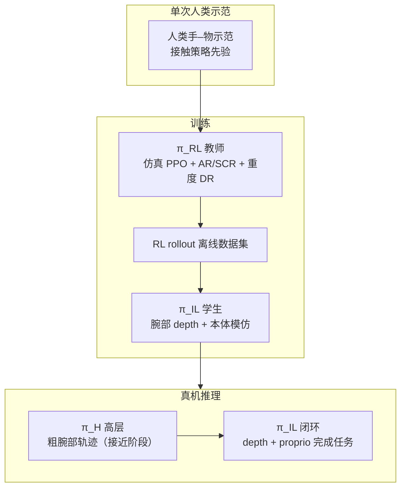

# DemoMimic（One Demonstration, Many Objects）

**DemoMimic**（*Dexterous Motion Mimic*；Stanford；[arXiv:2609.01938](https://arxiv.org/abs/2609.01938)，[项目页](https://demomimic.github.io/)，[PDF](https://demomimic.github.io/static/demomimic_paper.pdf)）提出从 **单次人类示范** 学习灵巧操作策略：在仿真中用 **接触点局部几何** 与 **接触中心奖励（AR / SCR）** 训练 RL 教师，再蒸馏为 **腕部深度 + 本体** 的闭环模仿策略，并借高层 **腕部轨迹** 引导接近阶段。真机报告 **16 物体、四类任务、两种灵巧手** 上 **71%** 平均成功率，且相对 DexMachina* / HERMES* **sim-to-real gap 最小**。

## 一句话定义

用 **接触局部几何** 与 **法向对齐 + 持续接触** 两类奖励，把单次人类示范变成可跨形状/尺度/摩擦泛化的灵巧真机策略，而不是只在仿真里「碰到就算成功」。

## 英文缩写速查

| 缩写 | 英文全称 | 简要说明 |
|------|----------|----------|
| DemoMimic | Dexterous Motion Mimic | 本文框架简称 |
| AR | Alignment Reward | 接触连杆法向与物体表面法向对齐奖励 |
| SCR | Sustained Contact Reward | 示范窗口内维持连续接触的 streak 奖励 |
| RL | Reinforcement Learning | 仿真中训练 \(\pi_{RL}\) 教师策略 |
| IL | Imitation Learning | 由 RL rollout 蒸馏 \(\pi_{IL}\) 深度模仿学生 |
| DR | Domain Randomization | 仿真中随机化质量、摩擦、尺度等以促 sim-to-real |
| Sim2Real | Simulation to Real | 仿真训、真机零样本或少量校准部署 |

## 为什么重要

- **数据效率：** 每条任务仅需 **一次** 人类示范，相对大规模遥操作或 kinesthetic 采集更贴近「家里随手演示一次就想让手学会」的部署想象。
- **接触是泛化接口：** 策略显式关注 **接触点邻域几何**；物体整体 mesh 变化时，只要 **局部接触结构** 保持，同一策略可迁移到未见实例（项目页 16 物体画廊）。
- **奖励设计直接服务真机：** DexMachina* / HERMES* 在仿真可达 **>90%**，真机跌至 **<40%**；AR+SCR 使 DemoMimic 真机 **接近仿真**（Open Box **82.71%** vs sim **84.4%**）。
- **分层可部署：** RL 教师负责探索与接触奖励优化；蒸馏后的 \(\pi_{IL}\) 仅依赖 **腕部 depth + proprio**，推理侧不绑特权物体状态。
- **Stanford 灵巧线：** 与 [DexMachina](./paper-dexmachina.md)（位置+VOC）、[VisualMimic](./paper-notebook-visualmimic.md)（人形 loco-manip 视觉分层）等同校工作形成 **接触精度 vs 全身尺度** 对照。

## 流程总览

## 核心机制（归纳）

### 接触局部几何

- 策略决策聚焦 **接触点邻域** 的物体几何，而非全局物体 pose 或纯演示关键点位置。
- 泛化假设：不同实例若 **局部接触结构**（法向、可施力方向、接触部位）一致，则同一 \(\pi_{IL}\) 可执行（项目页多材质/尺度瓶子、箱盖任务）。

### 接触中心奖励

| 奖励 | 作用 | 真机意义 |
|------|------|----------|
| **AR** | 对齐接触连杆与物体表面法向 | 稳定、良条件的接触，少 exploit 仿真接触 artifact |
| **SCR** | 奖励示范时间窗内的连续接触 streak（二次增长） | 抑制仿真中「间歇松手」在硬件上导致不可逆滑落 |

项目页消融：去掉 AR 或 SCR 后，仿真仍可达 ~70–84%，但真机 **显著下降**（Open Box 完整 **82.71%** vs −AR **57.32%** vs −SCR **37.83%**）。

### 教师–学生与高层引导

1. **\(\pi_{RL}\)** — 仿真中 on-policy RL + 接触奖励 + domain randomization。
2. **\(\pi_{IL}\)** — 用 \(\pi_{RL}\) rollout 监督，输入 **腕部相机深度 + 本体**。
3. **\(\pi_H\)** — 推理初期提供 **粗腕部轨迹**，负责 approach；之后交给 \(\pi_{IL}\) 闭环精细操作。

## 实验与评测

### 真机 per-object 成功率（项目页，每物体 20 rollouts）

| 任务 | 代表物体 | SR |
|------|----------|-----|
| Open the Box | Wooden / Toolbox / Shoe Box | **77–87%** |
| Open the Box | Robot Hand Box | **39.39%**（盖几何与仿真差异大，页内注明） |
| Lift the Lid | 三款 waffleiron / breakfast maker | **45–64%** |
| Move the Bottle | 五款瓶罐（防晒、水杯、罐头、维命瓶等） | **74–94%** |

摘要汇总：**71%** 跨 **16 物体** 平均；项目页 Tab 展示其中 **12 物体 / 3 任务** 的柱状图，第四类任务与两种手型以 PDF 为准。

### Sim-to-real 对比（项目页）

| 任务 | DemoMimic Sim→Real | DexMachina* Sim→Real | HERMES* Sim→Real |
|------|-------------------|----------------------|------------------|
| Open the Box | 84.4→**82.71%** | 95.8→21.72% | 93.7→3.37% |
| Lift the Lid | 70.0→**70.59%** | 80.1→29.91% | 98.4→39.1% |

读法：基线 **仿真虚高、真机崩塌** 是接触奖励缺失的典型症状；AR+SCR 把 **真机曲线拉近仿真**。

## 结论

**单次示范灵巧操作的瓶颈往往在「仿真里算不算真接触」，而不是示范条数；DemoMimic 用局部几何 + AR/SCR 把这条缝补上了。**

1. **一次示范即可** — 每条任务一条人类轨迹，无需 per-object 重采集。
2. **AR+SCR 是真机关键** — 去掉任一项，仿真分数仍好看，真机 Open Box 可跌至 **~28–57%**。
3. **局部几何泛化** — 16 物体跨材质/质量/摩擦；失败案例（Robot Hand Box）也提示 **局部结构不一致** 时仍会掉点。
4. **分层部署合理** — RL 探索留在仿真；真机跑 depth IL + 粗腕引导，不绑特权状态。
5. **基线对照有力** — 相对 DexMachina* / HERMES*，**最小 sim-to-real gap** 是主要卖点。
6. **开源待跟进** — 截至 2026-09-03 项目页 **Code / arXiv coming soon**；工程复现需等官方仓库。

## 源码运行时序图

**不适用** — 截至入库日（2026-09-03）项目页 **Code · coming soon**，无官方 GitHub / 可运行入口。若后续开源，预期路径：人类示范处理 → 仿真 \(\pi_{RL}\) 训练（AR/SCR）→ rollout 数据集 → \(\pi_{IL}\) 蒸馏 → 真机 \(\pi_H\) 腕引导 + depth 闭环部署。

## 工程实践

| 项 | 建议 |
|----|------|
| 示范质量 | 单次示范应覆盖 **稳定接触阶段**；SCR 依赖示范时间窗内的接触持续性 |
| 奖励调试 | 先查 **真机是否间歇松手**；再调 AR 法向对齐权重 |
| 物体泛化 | 优先保证 **接触局部几何** 与示范一致；整体 mesh 差过大（如 Robot Hand Box 盖）仍会失败 |
| Sim 指标 | **勿只看仿真 SR**；对照项目页 sim-vs-real 柱，确认 gap |
| 部署栈 | 真机侧准备 **腕部 depth 相机 + 本体**；接近阶段需 \(\pi_H\) 或等价粗轨迹 |
| 复现 | 等待官方代码；PDF 已挂项目页 |

## 局限与风险

- **第四任务 / 手型细节：** 项目页主视觉仅三项任务；完整 4×2 设定以 PDF 为准。
- **单次示范脆弱性：** 示范接触策略差或遮挡严重时，RL 教师可能学偏；未见多示范融合叙事。
- **几何失配：** Robot Hand Box **39%** 说明 **仿真物体与真机盖几何不一致** 时局部几何假设破裂。
- **未开源：** 仿真环境、示范格式、蒸馏细节暂不可复现。
- **与 wrench 路线差异：** [CHORD](./paper-chord-contact-wrench-dexterous-manipulation.md) 在 wrench 空间比接触效应；DemoMimic 强调 **局部几何 + 法向/持续接触**，二者可互补而非替代。

## 与其他工作对比

| 对照 | 差异读法 |
|------|----------|
| [DexMachina](./paper-dexmachina.md)\* | 项目页列作基线（位置 + VOC 引导）：仿真 **95.8%** 但真机跌至 **21.72%**；DemoMimic 用 AR+SCR 把同任务真机保到 **82.71%** |
| HERMES\* | 同为项目页基线：仿真 **93.7%** → 真机 **3.37%**，是「仿真虚高、真机崩塌」最极端的一条对照 |
| [CHORD](./paper-chord-contact-wrench-dexterous-manipulation.md) | 在 **wrench 空间** 比接触效应；DemoMimic 在 **接触局部几何 + 法向对齐/持续性** 上做奖励，两条接触奖励范式互补 |
| [ADEPT](./paper-adept-dexterity.md) | 高 DoF 灵巧 **RL 预训练 + distill** 走大规模任务面；DemoMimic 只要 **每任务一条人类示范**，靠局部几何换物体泛化 |
| [VisualMimic](./paper-notebook-visualmimic.md) | 同校线但对象不同：全身 loco-manipulation 的视觉分层控制 vs 本页多指 **桌面灵巧接触** |
| 多示范模仿学习 | 依赖 per-object 重采集；DemoMimic 的赌注是「示范条数不是瓶颈，仿真里算不算真接触才是」 |

> 读法提醒：\* 标注的基线数字来自 **项目页复现**，非原论文自报值；跨论文横比前应回各自原文核评测协议。

## 关联页面

- [Manipulation 任务](../tasks/manipulation.md) — 灵巧操作与单次示范路线语境
- [Sim2Real](../concepts/sim2real.md) — 接触奖励缩小 visual/动力学 gap
- [DexMachina](./paper-dexmachina.md) — 项目页列作 * 基线（位置+VOC）
- [CHORD](./paper-chord-contact-wrench-dexterous-manipulation.md) — 接触空间奖励的另一范式
- [ADEPT](./paper-adept-dexterity.md) — 高 DoF 灵巧 RL 预训练 + distill 对照
- [VisualMimic](./paper-notebook-visualmimic.md) — 同校 Jiajun Wu 线；全身 loco-manip vs 多指灵巧

## 参考来源

- [demomimic_stanford_2026.md](../../sources/papers/demomimic_stanford_2026.md)
- [demomimic-github-io.md](../../sources/sites/demomimic-github-io.md)
- [具身智能小站 2026-09-03 八篇盘点](../../sources/blogs/wechat_embodied_station_8_papers_open_source_2026-09-03.md)

## 推荐继续阅读

- [DemoMimic 项目页](https://demomimic.github.io/) — 多物体真机视频与 sim-to-real 交互图表
- [DexMachina 项目页](https://project-dexmachina.github.io/) — VOC + 位置引导基线来源
- [DexForce（arXiv:2501.10356）](https://arxiv.org/abs/2501.10356) — 力感知示范与接触丰富灵巧操作
