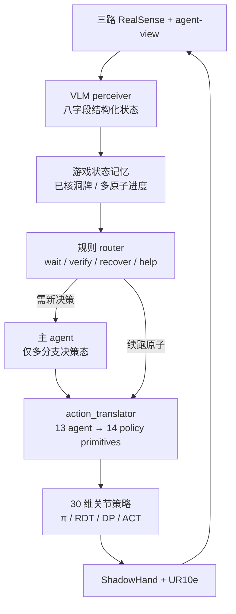
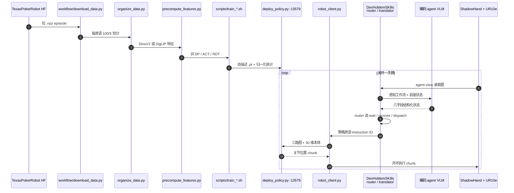

# DexHoldem：德州扑克桌面上的灵巧具身基准

**DexHoldem**（*Playing Texas Hold'em with Dexterous Embodied System*，[arXiv:2605.18727](https://arxiv.org/abs/2605.18727)，[项目页](https://dexholdem.github.io/Dexholdem/)，[代码](https://github.com/DexHoldem/Dexholdem-Policy)）由 **香港大学（HKU）** 数据科学研究院团队提出（Yuexiang Zhai / Yi Ma 另有伯克利背景）：在 **ShadowHand + UR10e** 真机牌桌上，同时评 **指令条件灵巧原语**、**结构化牌桌状态恢复** 和 **感知→路由→执行闭环**。它测的不是扑克智能，而是薄牌（约 0.3 mm）与筹码上的接触精度，以及场面被搅乱之后系统还能不能继续。

## 一句话定义

**同一套真机牌桌协议，把「原语做没做成、场面还能不能用」和「八个游戏状态字段读没读对」拆开打分，再看闭环里等待、恢复和求助怎么把误差堆起来。**

## 英文缩写速查

| 缩写 | 英文全称 | 简要说明 |
|------|----------|----------|
| SPSR | Scene-Preserving Success Rate | 只计场面仍可继续的成功 |
| TCR | Task Completion Rate | SPSR + 搅乱场面的完成 |
| SP / DC / TF / DF | Scene-preserving / Disruptive completion / Task failure / Disruptive failure | 四级真机结果 |
| LS / TO / BI / CC | Loop stage / Turn ownership / Blind info / Community cards | 感知八字段的前四项 |
| CB / RCI / OCI / SO | Current bet / Robot chip inventory / Opponent chip inventory / Showdown outcome | 感知八字段的后四项；筹码字典最难 |
| VLA | Vision-Language-Action | π₀ / π₀.₅ 走语言条件；任务 IL 基线走 instruction ID |

## 为什么重要

- **补评测缺口。** [具身评测枢纽](../overview/hub-embodied-eval-benchmark.md) ③ 层多数是仿真 SR 或工业规格；DexHoldem 是 **真机灵巧 + 结构化状态** 的可跑协议，和 [DexBench](./dexbench.md)（规范已公开、Arena 待发布）不要混读。
- **把「做成」和「不破坏」拆开。** 长程闭环吃的是 SPSR。TCR 会把扫飞邻筹码的完成算进去。
- **感知子能力加不起来。** field-wise 66.8% 仍可能 Overall 只有三成——路由要的是整份状态。
- **代码和数据能下。** [Dexholdem-Policy](https://github.com/DexHoldem/Dexholdem-Policy) + [TexasPokerRobot](https://huggingface.co/datasets/Winniechen2002/TexasPokerRobot)；agent 侧另装 [DexHoldemSKills](https://github.com/DexHoldem/DexHoldemSKills)。

## 核心信息

| 项 | 内容 |
|----|------|
| **机构** | 香港大学（HKU）；加州大学伯克利分校（UC Berkeley，部分作者） |
| **作者** | Feng Chen\*†、Tianzhe Chu\*、Li Sun\*、Pei Zhou\*、Zhuxiu Xu、Shenghua Gao、Yuexiang Zhai、Yanchao Yang、Yi Ma |
| **出处** | arXiv:2605.18727（2026-05） |
| **平台** | ShadowHand（24 DoF）+ UR10e（6 DoF）；三路 RealSense RGB-D；Vive 遥操作采集 |
| **数据** | 1,470 条成功示范（14 × 105）；每原语 100/5 划分；HF 约 378 GB |
| **接口** | 观测：顶视 / 第三人称 / 腕 + 本体；动作：30 维关节位置 chunk（默认 horizon 1、预测 64 步） |
| **开源** | **已开源**：Policy 仓可训可部署；Skills 可装；数据 CC BY 4.0。两仓截至 2026-09-05 **未附 LICENSE** |

## 核心原理

### 输入 / 机制 / 输出

策略侧输入是三路 RGB-D、30 维本体和任务条件（预训练 VLA 用自然语言，任务 IL 用离散 instruction ID），输出短时域关节位置。Agent 侧另用一张 **agent-view** 桌面图，解析成八字段结构化状态，再经规则路由选出 13 个 agent primitive（等待、看牌、推/拉筹码、摊牌、求助等），翻译成上表 14 个策略原语后下发。

14 个策略原语：`pick_up_{left,right}`、`push/pull_{5,10,50,100}`、`put_down_{left,right}`、`show_{left,right}`。左右与推拉一律按 **机器人朝向** 定义。

### 流程总览

四级结果：SP（做成且场面可续）/ DC（做成但场面被搅）/ TF（没做成但可重试）/ DF（失败且必须重置，如掉牌、筹码出区、手有损坏风险）。

## 源码运行时序图

官方可运行入口在 [Dexholdem-Policy](https://github.com/DexHoldem/Dexholdem-Policy)（训练与 ZeroMQ 部署）和 [DexHoldemSKills](https://github.com/DexHoldem/DexHoldemSKills)（感知–路由 skill）。π 系走 OpenPI 桥，不在六条 public recipe 里。

- **训练最短路径：** `workflow/download_data.py` → `scripts/prepare.sh` → `bash scripts/train_dp.sh data/easy_mode checkpoints/dp_dino 0 data/vitl14_features`。
- **真机推理：** `deploy_policy.py --ckpt ... --port 13579`，客户端 `robot_client.py --instruction 0`。Skill 用 `npx skills add DexHoldem/DexHoldemSKills` 安装。

## 工程实践

| 项 | 做法 |
|----|------|
| 数据落地 | `python workflow/download_data.py --local_dir data/TexasPokerRobot`；子集可 `--include "pick_up_left/**"` |
| 划分 | `organize_data.py --eval_count 5`，与论文 100/5 对齐 |
| 公开配方 | DP(DINO)、DP Transformer、DP-UNet、ACT、RDT_small、RDT_FT（需先拉 `rdt-1b`） |
| 部署 | ZeroMQ 默认 13579；服务端 4×4090，客户端只管采图与下发 |
| 采集 | Vive + Shadow 遥操作；失败尝试不进发布集 |
| 读榜 | 先看 SPSR，再看 TCR；芯片 pull 和 CB/OCI 才是硬项 |
| 源码运行时序图 | 见上一节；无 LICENSE，商用前先向作者确认 |

## 实验与评测

策略：每模型 80 次真机试（14 原语，按 pickup / push / pull / put-down-show 四组各 20 次）。感知：36 题 × 3 次验证，Overall 要求适用字段全对。

| 策略 | 族 | SPSR | TCR |
|------|----|------|-----|
| π₀.₅ | 预训练 VLA | 47.5% | **61.2%** |
| π₀ | 预训练 VLA | **47.5%** | 57.5% |
| RDT | 预训练 | 30.0% | 46.2% |
| DP (DINO) | 从零 IL | 26.2% | 36.2% |
| DP-Transformer | 从零 | 13.8% | 20.0% |
| RDT-small | 从零 | 13.8% | 17.5% |
| ACT | 从零 | 10.0% | 15.0% |
| BAKU | 从零 | 6.2% | 12.5% |
| DP-UNet | 从零 | 1.2% | 1.2% |

分组：π 系 pickup **100%**，chip pull SPSR 只有 **15%**；put-down/show 的 SPSR/TCR 常是 50/80——牌翻开了，场面却被带歪。RDT 数据缩放：夹爪预训练在 10% 数据上验证损失只相对随机初始化降 1.2%，到满数据也只到 11.3%，不像语言少样本迁移。

感知：Opus 4.7 Overall **34.3%** 最高；GPT 5.5 Avg **66.8%** 最高但 Overall 31.5%。BI 接近 100%，CB 峰值 45.8%，OCI 峰值 43.8%。系统级三条 GPT 5.5 + π₀ 案例不报成功率；最长一手 54 状态、26 次 wait。

## 结论

**DexHoldem 证明：当前 VLA 能稳定把牌拿起来，但还不能在不搅乱牌桌的前提下推拉筹码，也不能可靠恢复路由所需的整份筹码状态；闭环里大部分时间花在等待和核对，而不是下一手决策。**

1. **报 SPSR，不要只报 TCR。** 差的那十几到二十个百分点就是被扫飞的邻筹码。
2. **芯片类原语才是区分度。** pickup 已接近饱和；pull 才拉开 π 系和任务 IL。
3. **感知看 Overall，不要被 field-wise 安慰。** 错一个筹码字典就会一直 wait 或下错注。
4. **夹爪预训练帮不了少样本灵巧拟合。** RDT 10% 数据几乎看不出预训练红利。
5. **系统级三条案例只当失败模式图，不当胜率。** 作者自己写了统计力不够。
6. **复现先跑 DP(DINO) 或 ACT。** π 系要另接 OpenPI；Being-H 已实现但因振荡未进主榜。

## 局限与风险

- **固定具身与桌面。** 不支持跨本体、换桌几何或任意物体灵巧。
- **数据相对预训练很小。** 1,470 条够定义协议，不够谈 scaling。
- **仿真重建不能替代接触评测。** 忠实分数仍要真机和人力。
- **系统级无成功率。** 只有三条案例计数器。
- **许可空缺。** 代码仓无 LICENSE；数据是 CC BY 4.0。
- **不是扑克 AI 榜。** 策略层不选 fold/raise 智能，只执行被路由的原语。

## 与其他工作对比

| 工作 | 关系 |
|------|------|
| [DexBench](./dexbench.md) | 工业灵巧 **规格**（OSC / 18 任务），Arena 待发布。DexHoldem 是已开源的 **真机扑克协议**，对象更窄、分数已出 |
| CALVIN / LIBERO / RoboCasa | 语言条件长程，但仿真或夹爪为主 |
| Adroit / DexArt / Dex1B | 灵巧技能或大规模抓取；少指令接地与场面保持 |
| EmbodiedBench 等 agent 榜 | 重感知规划，轻真机多指执行 |
| [π₀](./paper-pi0.md) / [π₀ 方法](../methods/π0-policy.md) | 本榜最强策略族；OpenPI 桥接 30 维关节 |
| [Diffusion Policy](../methods/diffusion-policy.md) | 最强从零基线是 DP (DINO)；DP-UNet 在本协议上接近失败 |
| [VLA](../methods/vla.md) | 预训练 VLA 领先任务 IL，但芯片状态与场面保持仍是缺口 |

## 关联页面

- [Manipulation](../tasks/manipulation.md) — 操作任务总览；灵巧真机协议落在本页
- [Contact-Rich Manipulation](../concepts/contact-rich-manipulation.md) — 薄牌/筹码接触
- [DexBench](./dexbench.md) — 工业规格对照，不要和本榜数字直接比
- [具身评测基准枢纽](../overview/hub-embodied-eval-benchmark.md) — ③ 层真机灵巧条目
- [评测基准选型闭环](../queries/embodied-eval-benchmark-selection-loop.md) — ③ 层：SPSR ≠ 仿真 SR
- [π₀ 策略模型](../methods/π0-policy.md)
- [π₀ 论文实体](./paper-pi0.md)
- [VLA](../methods/vla.md)
- [Diffusion Policy](../methods/diffusion-policy.md)
- [Diffusion Policy 论文](./paper-diffusion-policy.md)

## 参考来源

- [论文归档](../../sources/papers/dexholdem_arxiv_2605_18727.md)
- [项目页归档](../../sources/sites/dexholdem-github-io.md)
- [策略仓归档](../../sources/repos/dexholdem-policy.md)
- [技能仓归档](../../sources/repos/dexholdem-skills.md)
- [数据集归档](../../sources/datasets/texaspokerrobot.md)

## 推荐继续阅读

- 项目页与真机视频：<https://dexholdem.github.io/Dexholdem/>
- 论文 HTML（原语表、感知 schema、案例计数器）：<https://arxiv.org/html/2605.18727v1>
- 策略仓复现：<https://github.com/DexHoldem/Dexholdem-Policy>
- 数据集：<https://huggingface.co/datasets/Winniechen2002/TexasPokerRobot>
