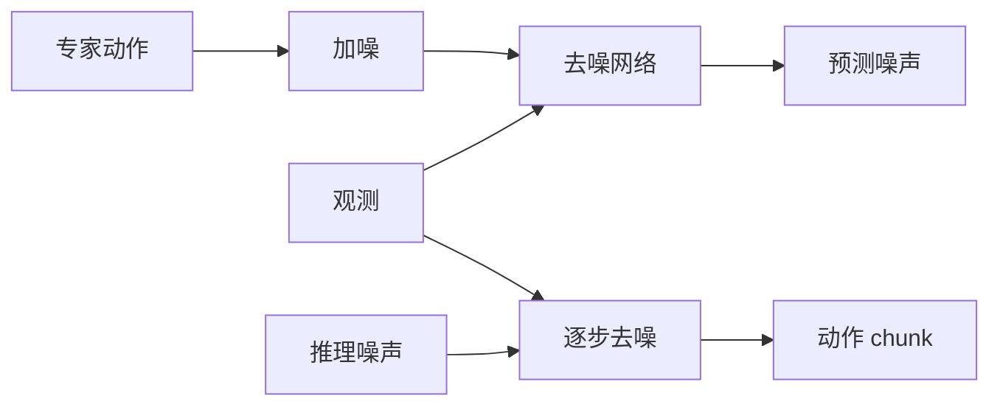
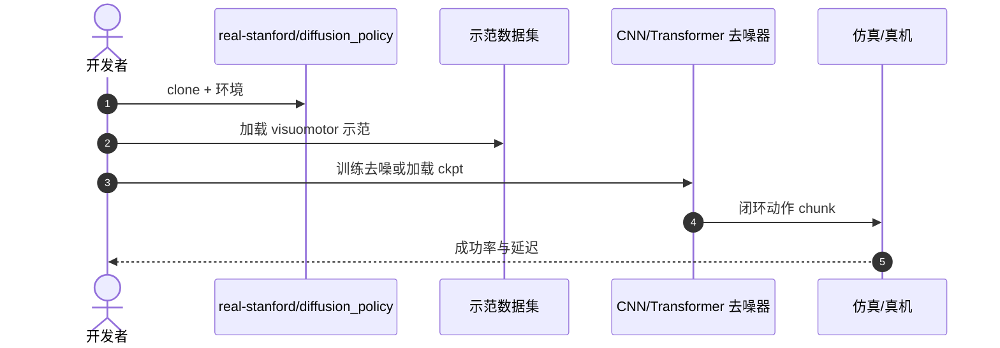

# Diffusion Policy：用去噪生成动作序列

**Diffusion Policy**（*Visuomotor Policy Learning via Action Diffusion*，[arXiv:2303.04137](https://arxiv.org/abs/2303.04137)，[项目页](https://diffusion-policy.cs.columbia.edu/)，[代码](https://github.com/real-stanford/diffusion_policy)）由 **哥伦比亚大学 / MIT** 提出：把扩散模型从图像生成换成 **动作 chunk 去噪**。它不是带语言的严格 VLA，但是 [π₀](./paper-pi0.md) 等 VLA 的动作头前身。方法综述见 [diffusion-policy](../methods/diffusion-policy.md)。

## 一句话定义

**不直接回归下一个动作，而是从噪声里逐步「擦」出一条多峰、平滑的动作轨迹。**

## 英文缩写速查

| 缩写 | 英文全称 | 简要说明 |
|------|----------|----------|
| DP | Diffusion Policy | 本工作 |
| DDPM | Denoising Diffusion Probabilistic Model | 去噪训练目标 |
| IL | Imitation Learning | 训练范式 |
| ACT | Action Chunking Transformer | 并行的 chunk 路线，见 [ACT](./paper-act.md) |

## 为什么重要

- 纳入 [VLA/WM 阅读路线](../../sources/blogs/wechat_embodied_ai_lab_vla_wm_reading_roadmap_2026-09-02.md) 的动作生成基座。
- 同一观测下可有多条合理轨迹（绕左/绕右），GMM/VAE 往往不够。
- CNN 与 Transformer 两种去噪骨干均可。
- **已开源** 训练与评测。

## 核心信息

| 项 | 内容 |
|----|------|
| **机构** | 哥伦比亚大学；麻省理工 |
| **输入** | 视觉观测 + 状态 |
| **输出** | 未来动作序列（chunk） |
| **骨干** | CNN 或 Transformer 去噪器 |
| **开源** | **已开源** [real-stanford/diffusion_policy](https://github.com/real-stanford/diffusion_policy) |

### 流程总览

## 评测

- 多任务 visuomotor 上相对 BC / IBC / LSTM 更稳，尤其多峰场景。
- 去噪步数是 **速度 vs 质量** 主旋钮。
- 表以 [原文](https://arxiv.org/abs/2303.04137) 为准。

## 结论

**动作分布多峰时，先用扩散/流模型，再决定要不要接语言骨干。**

- chunk 预测降低逐步误差累积
- 去噪迭代是延迟税，实时部署要蒸馏或减步
- 本页无语言输入；接 VLM 才变成 VLA 动作头
- [π₀](./paper-pi0.md) 用流匹配把多步税压下去
- 方法选型叙事读 [diffusion-policy](../methods/diffusion-policy.md)

## 源码运行时序图

## 局限与风险

- **延迟：** 默认多步去噪不适合极高频。
- **非 VLA：** 不要把它当成指令跟随模型。
- **超参：** 噪声日程与 chunk 长度敏感。

## 与其他工作对比

| 工作 | 相对本页 |
|------|----------|
| [ACT](./paper-act.md) | CVAE 回归 chunk，无扩散 |
| [π₀](./paper-pi0.md) | 流匹配 + VLM |
| [OpenVLA](./paper-openvla.md) | 离散 token，非去噪 |

## 关联页面

- [Diffusion Policy 方法页](../methods/diffusion-policy.md)
- [π₀](./paper-pi0.md)
- [ACT](./paper-act.md)
- [VLA/WM 14 篇路线](../overview/vla-wm-reading-roadmap-14-papers-technology-map.md)

## 推荐继续阅读

- [项目页](https://diffusion-policy.cs.columbia.edu/)
- [arXiv:2303.04137](https://arxiv.org/abs/2303.04137)

## 参考来源

- [diffusion_policy_arxiv_2303_04137](../../sources/papers/diffusion_policy_arxiv_2303_04137.md)
- [具身智能研究室 VLA/WM 阅读路线](../../sources/blogs/wechat_embodied_ai_lab_vla_wm_reading_roadmap_2026-09-02.md)
- [real-stanford-diffusion-policy](../../sources/repos/real-stanford-diffusion-policy.md)
