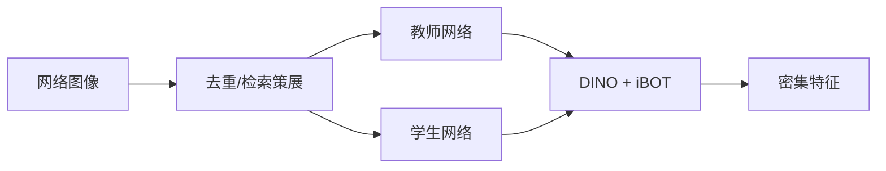
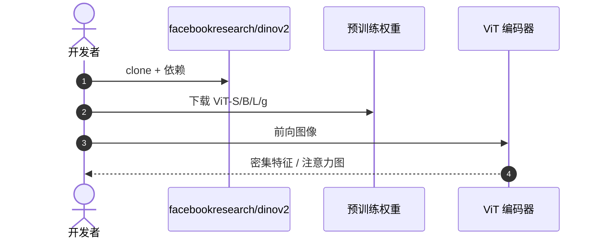

# DINOv2：无监督的稳健视觉特征

**DINOv2**（*Learning Robust Visual Features without Supervision*，[arXiv:2304.07193](https://arxiv.org/abs/2304.07193)，[代码](https://github.com/facebookresearch/dinov2)）由 **Meta AI** 提出：在约 **1.42 亿** 去重图像上做自蒸馏（DINO + iBOT 掩码预测），得到可迁移的密集视觉特征。[OpenVLA](./paper-openvla.md) 用它当几何塔。

## 一句话定义

**不靠图文对，也能学到比 CLIP 更懂空间的特征——操作策略往往更需要这个。**

## 英文缩写速查

| 缩写 | 英文全称 | 简要说明 |
|------|----------|----------|
| DINO | Self-Distillation with No Labels | 自蒸馏框架 |
| iBOT | Image BERT 式掩码预测 | 与 DINO 损失联用 |
| SSL | Self-Supervised Learning | 无标签预训练 |
| ViT | Vision Transformer | 骨干 |

## 为什么重要

- 纳入 [VLA/WM 阅读路线](../../sources/blogs/wechat_embodied_ai_lab_vla_wm_reading_roadmap_2026-09-02.md) 的几何视觉基座。
- Attention map 可检查模型「在看哪里」，利于调试操作策略。
- 与 SigLIP/CLIP 互补：空间 vs 语言对齐。
- **已开源** 代码与权重。

## 核心信息

| 项 | 内容 |
|----|------|
| **机构** | 元宇宙人工智能（Meta AI） |
| **数据** | LVD-142M（嵌入、去重、检索构建） |
| **损失** | DINO 自蒸馏 + iBOT 掩码 |
| **产出** | 通用 ViT 特征 |
| **开源** | **已开源** [facebookresearch/dinov2](https://github.com/facebookresearch/dinov2) |

### 流程总览

## 评测

- 分割、深度、检索等密集任务上强于同规模 CLIP。
- 机器人侧通常不当策略本身，而是当 VLA/WM 编码器。
- 表以 [原文](https://arxiv.org/abs/2304.07193) 为准。

## 结论

**搭 VLA 视觉塔时：DINOv2 管「在哪、什么形状」，CLIP/SigLIP 管「叫什么」。**

- 自监督特征对几何任务更稳
- 数据策展（去重）和架构一样重要
- 单独 DINOv2 不会听指令
- [OpenVLA](./paper-openvla.md) / [LaDi-WM](./paper-sa-2505-11528-ladi-wm-a-latent-diffusion-based-world-model-for.md) 都复用这一对塔思路
- 权重加载走官方仓即可

## 源码运行时序图

## 局限与风险

- **无语言：** 必须另接文本塔才成 VLA。
- **算力：** 大 ViT 推理成本进入策略延迟。
- **域移：** 网页照片 ≠ 腕部鱼眼。

## 与其他工作对比

| 工作 | 相对本页 |
|------|----------|
| [CLIP](./paper-clip.md) | 语言对齐强、几何弱 |
| [OpenVLA](./paper-openvla.md) | 消费本特征作双塔之一 |
| [视觉表征概念](../concepts/visual-representation-for-policy.md) | 策略视觉选型 |

## 关联页面

- [CLIP](./paper-clip.md)
- [OpenVLA](./paper-openvla.md)
- [视觉表征与策略](../concepts/visual-representation-for-policy.md)
- [VLA/WM 14 篇路线](../overview/vla-wm-reading-roadmap-14-papers-technology-map.md)

## 推荐继续阅读

- [arXiv:2304.07193](https://arxiv.org/abs/2304.07193)
- [facebookresearch/dinov2](https://github.com/facebookresearch/dinov2)

## 参考来源

- [dinov2_arxiv_2304_07193](../../sources/papers/dinov2_arxiv_2304_07193.md)
- [具身智能研究室 VLA/WM 阅读路线](../../sources/blogs/wechat_embodied_ai_lab_vla_wm_reading_roadmap_2026-09-02.md)
- [facebookresearch-dinov2](../../sources/repos/facebookresearch-dinov2.md)
