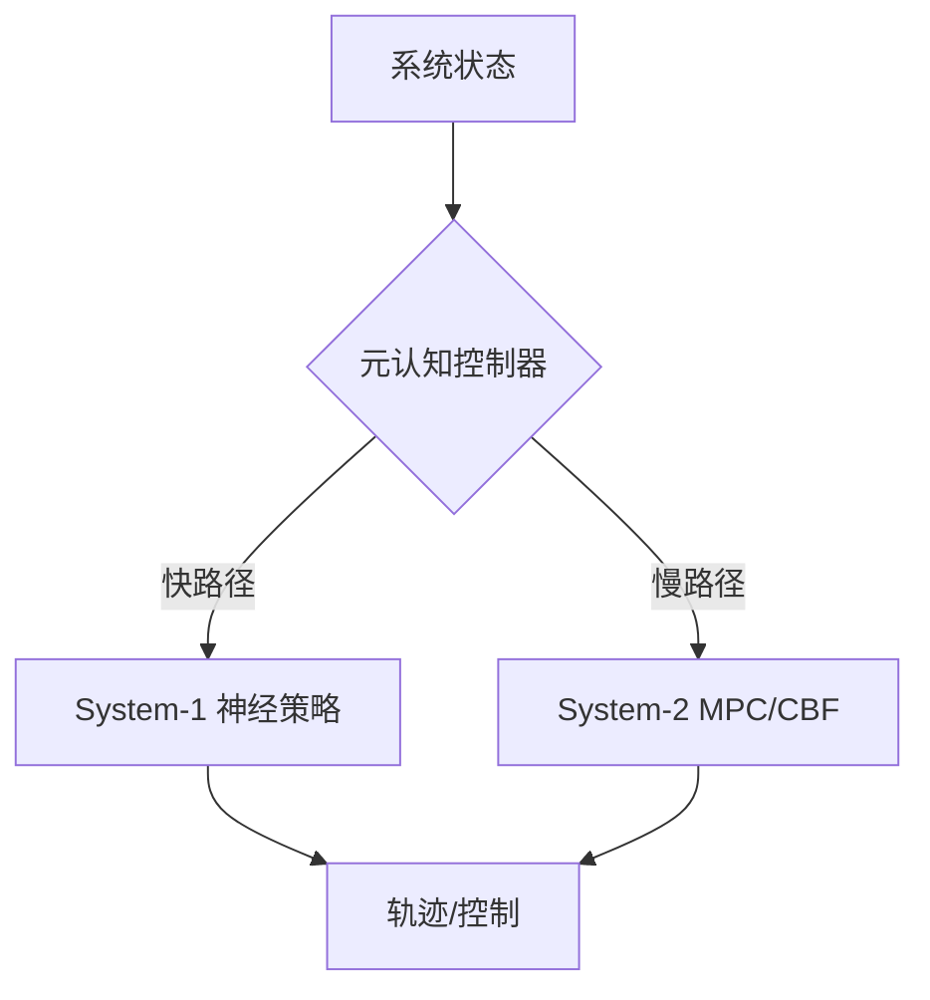
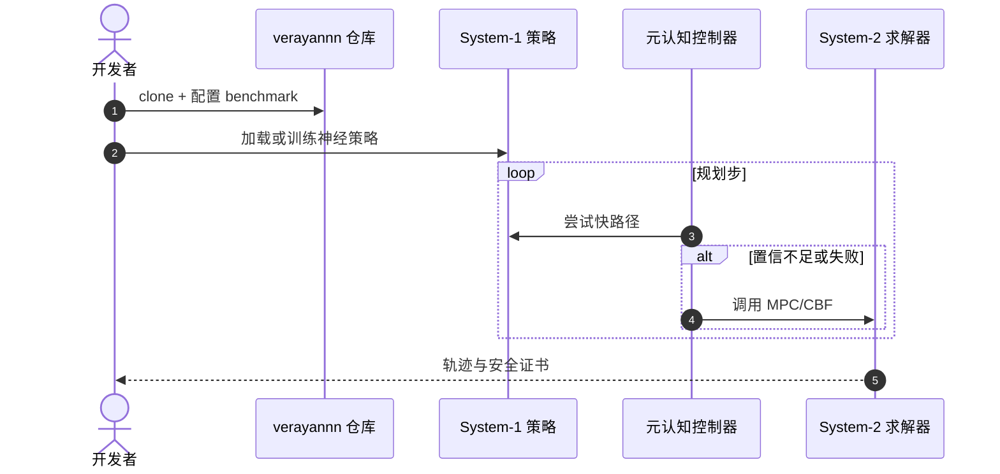

# Dual Process Motion Planning：快慢系统协同的非线性运动规划

**Dual Process Motion Planning**（*Dual-MP*，[arXiv:2609.01260](https://arxiv.org/abs/2609.01260)，[代码](https://github.com/verayannn/System-1-and-System-2-in-Motion-Planning)）由 **香港中文大学（深圳）** 与 **牛津大学（University of Oxford）** 合作提出：受 *Thinking, Fast and Slow* 启发，将 **经验驱动 System-1** 与 **符号求解器 System-2**（MPC、CBF）通过 **元认知控制器** 动态仲裁。

## 一句话定义

**运动规划不必在学习和经典求解器之间二选一，关键是何时信任快直觉、何时调用慢推理。**

## 英文缩写速查

| 缩写 | 英文全称 | 简要说明 |
|------|----------|----------|
| MPC | Model Predictive Control | System-2 在线优化求解器之一 |
| CBF | Control Barrier Function | 安全约束在线求解器 |
| S1 | System-1 | 快速经验神经策略 |
| S2 | System-2 | 慢速精确符号/优化求解 |

## 为什么重要

- 纳入 [2026-09-02 七篇盘点](../../sources/blogs/wechat_embodied_station_7_papers_contact_manipulation_2026-09-02.md) 的「神经符号规划」支线。
- 经典规划有保证但效率受限；纯学习快但难保安全/精度——Dual-MP 显式建模 **调度** 问题。
- 多类非线性 benchmark 上效率、准确性与泛化性均有稳定增益。
- **已开源** 评测与实现代码。

## 核心信息

| 项 | 内容 |
|----|------|
| **机构** | 香港中文大学（深圳）；牛津大学（University of Oxford） |
| **架构** | SOFAI 风格：S1 神经策略 + S2 MPC/CBF + 元认知仲裁 |
| **开源** | **已开源** [verayannn/System-1-and-System-2-in-Motion-Planning](https://github.com/verayannn/System-1-and-System-2-in-Motion-Planning) |

### 流程总览

## 评测

- 多类非线性运动规划 benchmark：规划效率、准确率与跨任务泛化均优于单一路线基线。
- 数据出处：[ingest 摘录](../../sources/papers/dual_process_motion_planning_arxiv_2609_01260.md)。

## 结论

**非线性运动规划的工程解法是双系统 + 元认知调度，而非替换式选型。**

- System-1 吸收成功轨迹加速常见情形
- System-2 在难例上提供可验证安全/精度
- 元认知控制器决定切换时机，是性能关键
- 模块化设计便于跨 benchmark 复用 S2 求解器
- 开源代码覆盖训练、仲裁与评测全流程
- 对「学习规划器」与「经典规划器」混合栈有直接参考

## 源码运行时序图

## 局限与风险

- **benchmark 域：** 以非线性规划环境为主，高维全身人形规划外推需谨慎。
- **S1 数据：** 神经策略质量依赖成功轨迹覆盖，冷启动仍需 S2。
- **实时性：** 元认知切换与 S2 求解延迟需在真机控制周期内标定。

## 与其他工作对比（索引级）

| 维度 | Dual-MP（本文） | 纯 System-1（学习式规划器） | 纯 System-2（[MPC](../methods/model-predictive-control.md) / [CBF](../concepts/control-barrier-function.md)） | 固定级联（学习热启动 + 求解器） |
|------|----------------|--------------------------|------------------------------------|---------------------------|
| 谁决定用哪条路径 | **元认知控制器在线仲裁** | 无（始终快路径） | 无（始终慢路径） | 编译期写死的固定顺序 |
| 常见情形延迟 | 走 S1，接近学习式 | 最低 | 最高（每步求解） | 求解器仍每步跑 |
| 难例安全性 | 回落 S2，保留约束满足 | **无保证** | 最强 | 强，但代价恒定 |
| 冷启动 | 数据不足时自然多走 S2 | 差 | 不受影响 | 不受影响 |
| 主要新增风险 | **仲裁阈值本身要标定** | 分布外失效 | 实时性 | 无自适应 |

- **不是替换式选型**：本文主张的是调度问题被显式建模，而不是「学习规划器优于经典规划器」——把它读成 S1 打败 S2 会错过全部要点。
- **与固定级联的差别在自适应**：热启动式混合栈的求解器开销是恒定的；Dual-MP 的收益恰恰来自在容易的状态上**跳过** S2，因此其效率增益强依赖 benchmark 中简单/困难状态的混合比例，换分布需重测。
- **外推边界**：验证域为非线性规划 benchmark，高维全身人形规划的实时仲裁未在本文覆盖（见「局限与风险」）。

## 关联页面

- [Trajectory Optimization](../methods/trajectory-optimization.md)
- [Locomotion](../tasks/locomotion.md)
- [Model Predictive Control](../methods/model-predictive-control.md) — System-2 的主力求解器
- [Control Barrier Function](../concepts/control-barrier-function.md) — System-2 的安全约束来源
- [接触丰富操作 7 篇地图](../overview/contact-rich-manipulation-7-papers-technology-map.md)

## 推荐继续阅读

- [arXiv:2609.01260](https://arxiv.org/abs/2609.01260)
- [System-1-and-System-2-in-Motion-Planning](https://github.com/verayannn/System-1-and-System-2-in-Motion-Planning)

## 参考来源

- [dual_process_motion_planning_arxiv_2609_01260](../../sources/papers/dual_process_motion_planning_arxiv_2609_01260.md)
- [具身智能小站 2026-09-02 七篇盘点](../../sources/blogs/wechat_embodied_station_7_papers_contact_manipulation_2026-09-02.md)
- [verayannn-dual-process-motion-planning](../../sources/repos/verayannn-dual-process-motion-planning.md)
