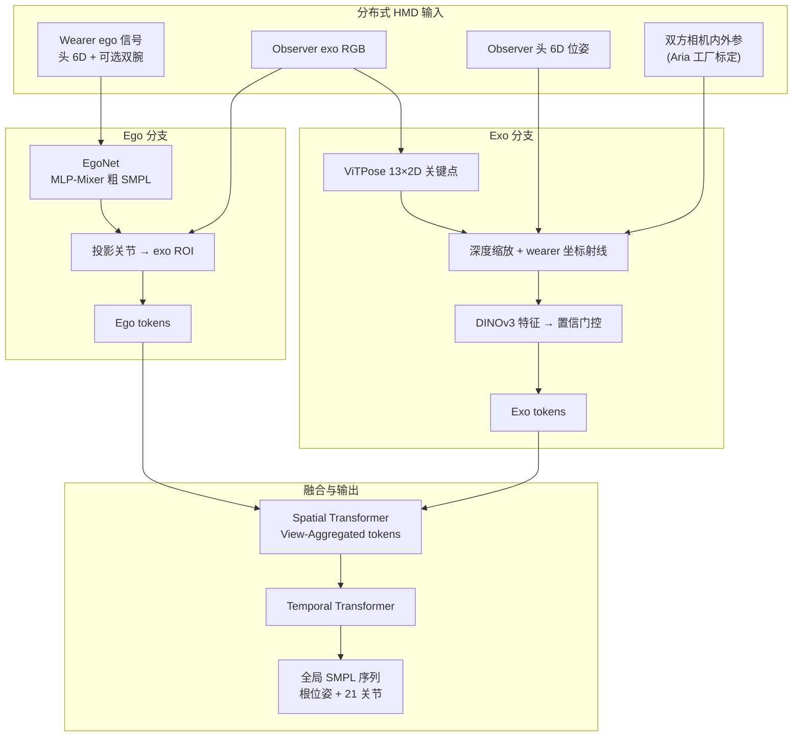

# EgoExoMoCap

**EgoExoMoCap: Distributed Ego-Exo Human Motion Capture**（Jiang et al., ECCV 2026 Spotlight）提出一种**分布式、可穿戴**的野外人体动捕框架：两名及以上佩戴 HMD（论文以 Project Aria 为主）的受试者互为观测者，将 **egocentric 连续头/腕轨迹** 与 **exocentric 间歇 RGB 观测** 在 wearer 头局部坐标系下统一融合，输出全局 SMPL 全身运动，面向具身 AI、VR/AR 与可扩展人类交互数据采集。

## 一句话定义

EgoExoMoCap 把「每人戴一副智能眼镜」变成分布式动捕系统：ego 侧提供全局轨迹与粗姿态先验，exo 侧在 EgoNet 引导的 ROI 内提取 ViTPose 关键点并经 DINOv3 置信门控的射线表示融合，用时空 Transformer 在遮挡与 out-of-view 下仍保持可用的全身重建。

## 英文缩写速查

| 缩写 | 英文全称 | 简要说明 |
|------|----------|----------|
| HMD | Head-Mounted Device | 头戴设备（论文以 Aria 眼镜为主） |
| Ego | Egocentric | 佩戴者自身传感器视角与轨迹 |
| Exo | Exocentric | 他人 HMD 相机对 wearer's 外视角观测 |
| MPJPE | Mean Per-Joint Position Error | 关节位置平均误差（cm），主精度指标 |
| SMPL | Skinned Multi-Person Linear Model | 参数化人体模型（21 关节 6D 旋转 + 根位姿） |
| ROI | Region of Interest | EgoNet 投影关节得到的 exo 图搜索区域 |

## 为什么重要

- **打破 ego / exo 动捕孤岛**：纯 ego 方法（AvatarPoser、EgoPoser）下肢不可见、遮挡下易失真；纯 exo（PromptHMR）在快速 HMD 运动与完全 out-of-view 时脆弱；分布式 HMD 使每人既是 subject 又是 mobile observer。
- **硬件门槛极低**：无需多相机棚或惯性动捕服，两人各戴眼镜即可；可自然扩展到多 observer、多 subject。
- **服务具身数据主线**：野外真实全身运动与多人交互是模仿学习、人形重定向与 ego 视频策略的数据上游；与 [Human-as-Humanoid](./paper-human-as-humanoid.md) 的 ego-exo **标签生成**、[EgoExoMem](./paper-ego-08-egoexomem.md) 的 ego-exo **理解**形成互补技术栈。
- **同实验室方法链**：作者延续 AvatarPoser → EgoPoser → MANIKIN 的稀疏传感全身估计路线，本工作把 **exo 互观测** 纳入同一叙事。

## 流程总览

## 核心机制

### 1）问题设定：wearer + observer（可扩展多 observer）

- **Wearer**：待重建者；提供头轨迹，可选 3-point（头 + 双腕）或 1-point（仅头）。
- **Observer**：邻近佩戴 HMD 的观测者；提供 RGB 与自身头轨迹。
- **输出**：wearer 在**世界坐标**下的 SMPL 序列（不预测体型，评测使用 GT shape）。

### 2）EgoNet：用 ego 粗姿态引导 exo 定位

通用检测器（YOLO）在强遮挡、视角剧变下易失败。EgoNet 仅用归一化 ego 信号（60D：头/腕位姿、速度、相对位移编码）经 MLP-Mixer 预测粗 SMPL，将 3D 关节投影到 observer 图像得 **ROI**，后续 ViTPose 与 DINOv3 仅在 ROI 内运行。消融显示替换为 YOLO 框会显著降精度。

### 3）射线规范化：统一异构 exo 观测到 wearer 坐标系

2D 关键点经 observer 内外参反投影为射线，按 **observer–wearer 头距** 深度缩放，再变换到 **wearer 头局部系**。这样同一姿态在不同全局位置/observer 快速转头下表示一致，利于跨场景泛化。消融：去掉深度缩放或在 world/exo 系保留射线均损害 MPJPE。

### 4）DINOv3 置信门控：exo 不可靠时自动降权

observer 转头时 wearer 可能部分或完全出视野；家具遮挡会使 ViTPose 产生噪声关键点。冻结 DINOv3 提取上下文特征，小 MLP 学习 per-keypoint 置信，对 exo token 软加权。相比无门控、ViT score 或硬阈值 mask，DINO 门控尤其改善**下肢**精度（遮挡场景）。

### 5）时空 Transformer 融合与训练

- **Spatial Transformer**：聚合 ego tokens（输入信号 + EgoNet 输出）与 exo tokens → View-Aggregated tokens。
- **Temporal Transformer**：时序平滑，输出根 6D 朝向、21 关节 6D 旋转。
- **两阶段训练**：先训 EgoNet（仅 ego）；冻结粗预测后端到端训融合模块（DINO 骨干冻结，仅训门控 MLP）。
- **损失**：根朝向 + 关节旋转 L1 + FK 关节位置 L1（λ_orient=0.02, λ_rot=λ_pos=1.0）。

## 实验与评测

| 维度 | 设置 / 结果 |
|------|-------------|
| **主数据集** | Nymeria（300h Aria + Xsens GT，80/20 按 subject 划分） |
| **跨数据集** | EgoHumans 户外多人交互（击剑、篮球、羽毛球等） |
| **跟踪配置** | 3-point（头+双腕）与 1-point（仅头）；observer 仅眼镜 |
| **指标** | MPJPE、上下身 PE、MPJVE、Jitter（jerk） |

**Nymeria 主结果（MPJPE，cm）：**

| 方法 | 模态 | 3-point | 1-point |
|------|------|---------|---------|
| EgoPoser | Ego | 7.74 | 11.86 |
| AvatarPoser | Ego | 8.16 | 12.38 |
| PromptHMR-Finetuned | Exo | 10.65 | 10.65 |
| PromptHMR + EgoPoser | EgoExo | 6.47 | 9.03 |
| **EgoExoMoCap** | **EgoExo** | **5.72** | **8.28** |

**EgoHumans：** 3-point MPJPE **7.62**（EgoPoser 9.03）；多 observer 子集 **7.11**，单 observer 约 8.8–11 cm，说明**分布式多视角 HMD** 有明确收益。

**消融要点（Nymeria）：** 去 ego → 11.45 cm；去 exo → 7.53 cm；EgoNet 关节加噪 σ=10 cm 仅使最终 MPJPE +0.54 cm，融合管线对粗定位误差鲁棒。

## 工程实践

| 维度 | 记录 |
|------|------|
| **硬件** | Project Aria 眼镜；Nymeria 另用 miniAria 腕带提供 6DoF 腕轨迹 |
| **标定/同步** | 依赖 Aria 工厂内外参与 Gen2 分布式同步工具链 |
| **外部依赖** | ViTPose 2D、冻结 DINOv3、SMPL FK；训练数据 Nymeria SMPL（NymeriaPlus 重定向） |
| **部署形态** | 论文聚焦**野外 GT 采集**（离线重建），非在线实时跟踪 |
| **开源状态** | GitHub [`eth-siplab/EgoExoMoCap`](https://github.com/eth-siplab/EgoExoMoCap) 已建仓（MIT），README **Code coming soon** → **待发布** |
| **源码运行时序图** | **不适用**（截至 2026-09-05 无可运行官方训练/推理入口，见 [sources/repos/egoexomocap.md](../../sources/repos/egoexomocap.md)） |

## 局限与风险

- **非实时**：当前为批处理式运动重建；实时 avatar 需等待硬件与工具链成熟。
- **体型需已知**：未联合估计 SMPL shape；野外需额外标定或均值体型近似。
- **exo 长期失效**：wearer 长时间出视野或持续严重遮挡时，精度向 ego-only 退化，下肢尤甚。
- **人群遮挡混淆**：wearer 被另一人大面积遮挡时，DINO 可见性分数可能误判。
- **硬件生态绑定**：实验深度依赖 Aria 数据格式与标定；迁移到其他 HMD 需重做标定与可能的重训。
- **代码未发布**：选型时只能依据论文与项目页，复现窗口待官方推送代码。

## 与相邻路线对比

| 路线 | 传感配置 | 强项 | 弱项 |
|------|----------|------|------|
| **EgoExoMoCap** | ≥2 人各戴 HMD，互观测 | 野外分布式、遮挡/out-of-view 鲁棒 | 需多人协同、代码待发布 |
| EgoPoser / AvatarPoser | 单人 HMD 稀疏点 | 实时、单用户便携 | 下肢不可见、exo 信息缺失 |
| PromptHMR 等 exo HPS | 单 exo 视频 | 全身可见时精度尚可 | 全局尺度、HMD 快速运动、完全 out-of-view |
| Xsens / 多相机棚 | 惯性服或固定相机 | GT 精度高 | 笨重、难规模化野外采集 |
| [Human-as-Humanoid](./paper-human-as-humanoid.md) | Ego-Exo 视频 → 机器人标签 | 面向 VLA 可执行监督 | 绑定 PrimeU 与 IK 链，非通用 MoCap |

## 结论

**EgoExoMoCap 的核心贡献是把「多人各戴一副眼镜」正式写成可扩展的分布式动捕拓扑，并用射线规范化 + DINO 门控解决 exo 间歇不可靠，而不是再做一次 naive 特征拼接。**

- 读结果先看 **ego+exo 是否同时必要**：Nymeria 上去 ego 11.45 cm、去 exo 7.53 cm，完整模型 **5.72 cm**（3-point），说明两侧信号互补而非可替换。
- **下肢与遮挡**是区分点：相对 PromptHMR+EgoPoser（6.47 cm），本方法在相同融合设定下进一步压低 MPJPE，消融显示 DINO 门控对遮挡下下肢尤为关键。
- **多 observer 是可扩展旋钮**：EgoHumans 上从单 observer ~9–11 cm 降到多 observer **7.11 cm**，部署时应规划观测者站位而非假设单人 exo 足够。
- **工程落地当前边界**：聚焦离线 GT、依赖 Aria 标定；GitHub 仓存在但 **Code coming soon**，复现与产品化须跟踪官方发布。
- **具身数据读法**：输出是野外 SMPL 轨迹，下游可接重定向、模仿学习或与人形 [motion retargeting](../concepts/motion-retargeting.md) 管线对接，与「从 ego 视频直接训策略」仍差一层动作/本体对齐。

## 关联页面

- [Ego 分类 04：Ego+Exo 融合](../overview/ego-category-04-ego-exo-fusion.md) — 同栈「ego 不够、exo 补结构」专题
- [EgoPoser（深读笔记索引）](./paper-notebook-egoposer-robust-real-time-egocentric-pose-estima.md) — 同作者 ego-only 前作，本论文重要基线
- [AvatarPoser](./paper-notebook-avatarposer-articulated-full-body-pose-tracking.md) — 稀疏 HMD 全身估计起点
- [Human-as-Humanoid](./paper-human-as-humanoid.md) — ego-exo 人类视频 → 机器人可执行标签的下游用法
- [Ego4D](./paper-ego4d.md) — egocentric 数据基础设施；Nymeria 属同生态后续规模级数据

## 参考来源

- [egoexomocap_arxiv_2607_15868.md](../../sources/papers/egoexomocap_arxiv_2607_15868.md) — 论文策展摘录
- [egoexomocap-siplab.md](../../sources/sites/egoexomocap-siplab.md) — 项目页与开源核查
- [egoexomocap.md](../../sources/repos/egoexomocap.md) — 官方 GitHub 占位仓

## 推荐继续阅读

- 项目页：<https://siplab.org/projects/EgoExoMoCap>
- 论文 PDF：<https://arxiv.org/abs/2607.15868>
- 相关 SIPLAB 项目：[EgoPoser](https://siplab.org/projects/EgoPoser) · [AvatarPoser](https://siplab.org/projects/AvatarPoser)
