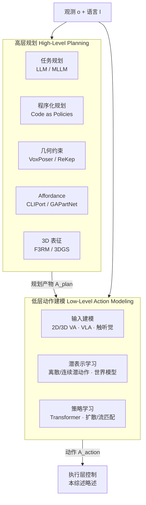

# 基础模型时代具身操作综述（Planning & Learning）

**Embodied Robot Manipulation in the Era of Foundation Models: Planning and Learning Perspectives**（Bai et al., arXiv:2512.22983）从 **算法功能角色** 而非模型家族出发，把现代操作栈分解为 **高层规划**（产出结构化规划产物）与 **低层学习式动作建模**（产出可执行动作/轨迹），并配套维护 [Awesome-Robotics-Manipulation](https://github.com/BaiShuanghao/Awesome-Robotics-Manipulation) 论文库。

## 一句话定义

以 \(A_{\text{plan}}=f_{\text{plan}}(o,l)\) 与 \(A_{\text{action}}=f_{\text{act}}(o,l\mid A_{\text{plan}})\) 统一表述，把基础模型在操作中的贡献定位为 **生成规划约束/潜输入** 或 **直接建模可执行动作**，并按规划类型与学习管线双轴组织文献。

## 英文缩写速查

| 缩写 | 英文全称 | 简要说明 |
|------|----------|----------|
| VLA | Vision-Language-Action | 视觉–语言–动作端到端策略 |
| MLLM | Multimodal Large Language Model | 联合视觉与语言的高层推理模块 |
| IL | Imitation Learning | 示教驱动的策略学习范式 |
| RL | Reinforcement Learning | 试错交互驱动的策略优化 |
| BC | Behavior Cloning | 直接观测–动作映射的模仿学习 |
| IfO | Imitation from Observation | 仅观测轨迹、无动作标签的模仿 |

## 为什么重要

- **补齐坐标系**：既有 VLA / 扩散 / 生成式操作综述多按 **骨干或生成范式** 分族；本篇按 **规划产物 vs 执行动作** 的功能接口重组，便于判断某方法落在训练链还是在线执行链。
- **三层边界清晰**：高层规划 → 低层动作建模 → 执行层控制；综述主范围锁定前两层，避免把「会说话的 planner」与「闭环 Hz 级 policy」混谈指标。
- **评测读法**：Table II 汇总 MetaWorld、CALVIN、LIBER O、SimplerEnv、RoboTwin 等 **能力–局限对照表**，强调分数须结合基准设定（长程、语言、真机对齐、接触丰富度）解读，而非横向排名。
- **配套策展**：官方 [Awesome 列表](https://github.com/BaiShuanghao/Awesome-Robotics-Manipulation) 持续维护论文/代码链接，适合作为操作领域外部索引。

## 流程总览

## 核心结构（归纳）

### 1）高层规划六类

| 类别 | 产物形态 | 典型局限 |
|------|----------|----------|
| LLM 任务规划 | 技能序列、子目标 | 语义合理但几何/接触不可行 |
| MLLM 任务规划 | 视觉 grounded 计划 | 推理成本、重规划延迟 |
| 程序化规划 | 可执行代码 | 安全验证、无效 API 调用 |
| 几何约束 | 3D value map、关键点关系 | 依赖重建/预定义几何 |
| Affordance | 动作相关区域先验 | 杂乱/新物体歧义 |
| 3D 表征 | 抓取候选、场优化目标 | 动态/遮挡下重建误差 |

### 2）低层学习式动作建模三线

- **学习策略**：RL（无模型/有模型）、IL（动作监督 / 观测监督）、辅助任务（世界建模、目标提取、多模态对齐）。
- **输入建模**：2D Vision–Action → 3D 几何增强 → VLA（非 LLM / LLM·VLM / 3D VLA）→ 触觉/力/音频扩展。
- **潜表示 + 策略**：离散/连续潜动作、隐式世界模型、扩散/流匹配/频率域/SSM 等生成或序列策略族。

## 与其他工作对比

| 维度 | 本篇（Planning & Learning） | [VLA Survey（HMI P071）](./paper-vla-survey-embodied.md) | [操作鲁棒性综述](./paper-robustness-robotic-manipulation-survey.md) |
|------|----------------------------|----------------------------------------------------------|---------------------------------------------------------------------|
| 组织轴 | 规划接口 × 学习管线 | VLA 数据/架构/训练/评测 | 鲁棒性原则 × 五模块机制 |
| 覆盖范围 | 全操作栈（含非 VLA 规划器） | 具身 VLA 专精 | 鲁棒性为中心对象 |
| 主要用途 | 判断组件落在哪一层、如何对接 | VLA 技术选型拆解 | 部署可靠性与评测协议 |

## 工程实践

| 检查项 | 建议 |
|--------|------|
| 一手来源 | 回 [arXiv:2512.22983](https://arxiv.org/abs/2512.22983) 核对 Table I/II 与分类边界 |
| 开源边界 | **已开源** Awesome 策展列表；**无**统一可运行训练/推理仓库 |
| 选型读法 | 先标清系统含 **规划器 + policy** 还是 **端到端 VLA**；再对齐动作接口（关节/末端/chunk/Hz） |
| 外部索引 | 跟踪 [Awesome-Robotics-Manipulation](https://github.com/BaiShuanghao/Awesome-Robotics-Manipulation) 获取最新论文/代码链接 |

## 源码运行时序图

**不适用**（综述 + Awesome 策展列表；无可运行的官方训练/推理/部署入口）。若后续发布统一代码栈，应补 `sources/repos/` 并更新本图。

## 实验与评测读法

- Table II 强调 **没有单一基准能衡量「机器人智能」**：CALVIN 偏长程语言条件但场景固定；LIBERO 偏终身学习但 OOD 有限；SimplerEnv 评 real-to-sim 一致性而非真机成功率。
- 对照 [VLA SOTA 排行榜](./vla-sota-leaderboard.md) 或具体论文时，须先对齐 **任务定义、观测接口、本体与闭环频率**，再比成功率。
- 综述类条目关注 **分类框架与能力边界**（Table I 的代表性方法优缺点列），不把引用列表当选型排名。

## 结论

**本篇的真正价值是把「基础模型 + 操作」从模型名清单，收成可对接的工程接口：规划产物是什么、动作模型吃什么、评测在测哪一层能力。**

- 组织骨架是 **高层六类规划产物 × 低层「学习策略 → 输入 → 潜表示 → 策略」管线**；读任何新论文应先问它改的是 \(A_{\text{plan}}\) 还是 \(A_{\text{action}}\)，以及产物是否进入闭环 Hz 级执行。
- 与按 VLA/扩散/生成模型分族的综述 **互补而非替代**：本篇适合画系统框图与接口对齐；深入 VLA 训练细节仍应读 [VLA 方法页](../methods/vla.md) 或 [VLA Survey](./paper-vla-survey-embodied.md)。
- 四大开放方向（通用机器人大脑、数据/评测瓶颈、多模态物理交互、安全协作）里，**评测协议未标准化** 与 **真机数据稀缺** 是最直接影响今日选型判断的两条——基准分数须带设定脚注，不能跨 CALVIN/LIBERO/SimplerEnv 直接排名。
- 部署读法：高层 MLLM planner 的代价主要在 **重规划延迟** 而非内环控制；低层 VLA 则要同时看 **动作离散化精度、chunk 长度、触觉/力接口是否真接入**。
- 开源状态：**已开源** [Awesome-Robotics-Manipulation](https://github.com/BaiShuanghao/Awesome-Robotics-Manipulation) 策展列表；权重与统一训练代码 **不在** 该仓库内。
- 与 [操作鲁棒性综述](./paper-robustness-robotic-manipulation-survey.md) 交叉：本篇 §IV-D 安全与本篇 Table I 局限列提供 **能力边界**，鲁棒性综述提供 **原则与评测四元组**——二者合用可避免把语义规划成功误读为接触可靠。

## 局限与风险

- 综述覆盖面广，**单篇深度不及** 领域专精 survey（如纯 VLA、纯扩散策略）；细节须回原文与 Awesome 列表所列论文。
- Table I 代表性方法 **不能** 直接外推为全库 SOTA；作者亦强调各路线有鲜明失败模式（如 LLM 规划物理不可行、2D VLA 缺几何接地）。
- Awesome 列表由社区维护，链接时效性依赖 upstream；入库结论以 **2026-09-01** 项目页核查为准。

## 关联页面

- [Manipulation（任务页）](../tasks/manipulation.md)
- [VLA（方法页）](../methods/vla.md)
- [Foundation Policy（概念页）](../concepts/foundation-policy.md)
- [VLA Survey（HMI P071）](./paper-vla-survey-embodied.md)
- [操作鲁棒性综述](./paper-robustness-robotic-manipulation-survey.md)

## 核心信息

| 字段 | 内容 |
|------|------|
| 机构 | 香港科技大学（广州）（HKUST-GZ）；中国科学院（CAS）；西安交通大学（XJTU）；西湖大学（Westlake）；浙江大学（ZJU）；悉尼大学（Sydney）；北京智源人工智能研究院（BAAI）；北京大学（PKU） |
| arXiv | <https://arxiv.org/abs/2512.22983> |
| 类型 | Survey |
| 开源状态 | Awesome 列表 **已开源**；无可运行统一代码栈 |
| 配套资源 | <https://github.com/BaiShuanghao/Awesome-Robotics-Manipulation> |

## 参考来源

- [embodied_robot_manipulation_fm_survey_2512_22983.md](../../sources/papers/embodied_robot_manipulation_fm_survey_2512_22983.md)
- [awesome-robotics-manipulation.md](../../sources/repos/awesome-robotics-manipulation.md)
- [awesome-robotics-manipulation（项目页）](../../sources/sites/awesome-robotics-manipulation.md)
- Bai et al., *Embodied Robot Manipulation in the Era of Foundation Models: Planning and Learning Perspectives*, arXiv:2512.22983, 2025

## 推荐继续阅读

- [Awesome-Robotics-Manipulation](https://github.com/BaiShuanghao/Awesome-Robotics-Manipulation) — 综述配套论文/代码策展列表
- Ma et al., *A Survey on Vision-Language-Action Models for Embodied AI*（arXiv:2405.14093）— VLA 专精对照
- Dong et al., *Robustness of Robotic Manipulation*（arXiv:2606.31494）— 鲁棒性原则与评测协议
