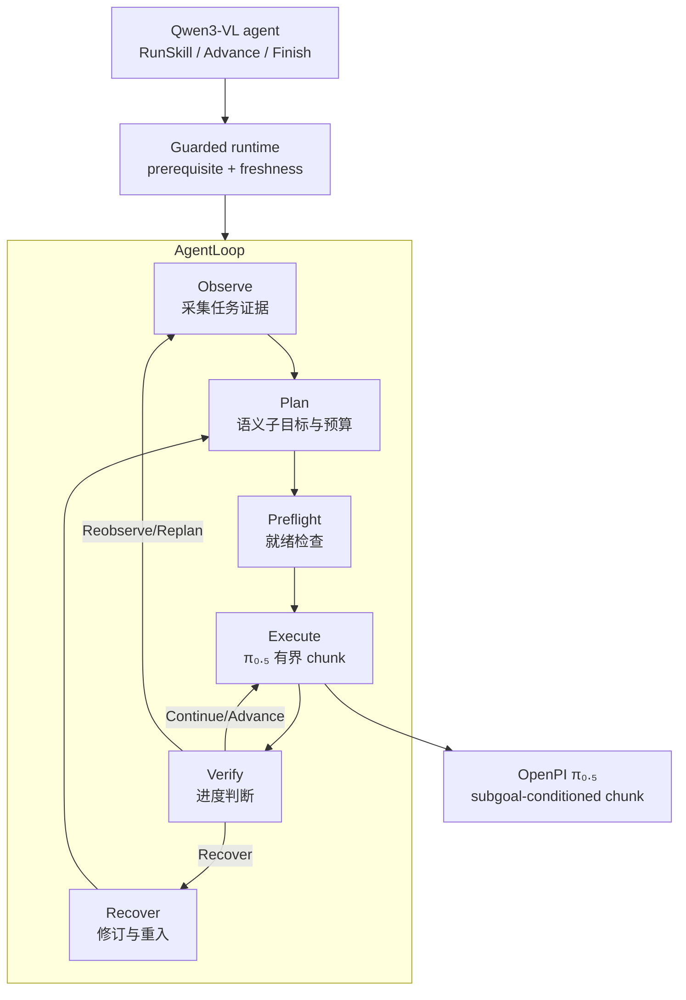

# EmbodiedSkills（Orchestrating, Training, and Deploying VLA Agents）

**EmbodiedSkills**（[arXiv:2609.01281](https://arxiv.org/abs/2609.01281)，[GitHub](https://github.com/DCDmllm/EmbodiedSkills)）提出统一框架，把 **Vision-Language-Action 策略** 变成 **可编排、可训练、可部署的闭环 agent**：高层 VLM 提出 **结构化 skill 决策**，**guarded runtime** 在执行前校验前提、在执行后验证结果，低层 **OpenPI/π₀.₅** 输出 **有界 action chunk**；全链路以共享 **trajectory schema** 记录，支持组件级监督与可选在线适应。

## 一句话定义

**不让 VLA 独自扛长时程任务——用可执行 skill 契约和 runtime guard，把「模型想说」和「物理能做」拆开，并把每一步变成可诊断、可训练的 agent 轨迹。**

## 英文缩写速查

| 缩写 | 英文全称 | 简要说明 |
|------|----------|----------|
| VLA | Vision-Language-Action | 低层 visuomotor 策略（本文实例为 OpenPI/π₀.₅） |
| VLM | Vision-Language Model | 高层 agent 组件（Qwen3-VL + LoRA） |
| AgentLoop | EmbodiedSkills Agent Loop | Observe→Plan→Preflight→Execute→Verify→Recover 闭环 |
| SFT | Supervised Fine-Tuning | planner / verifier / agent skill 的轨迹监督 |
| LIBERO | Language-Instructed Benchmark for Robot Manipulation | 四套件长程操作基准 |
| RMBench | Robotic Manipulation Benchmark | 含记忆依赖子集 M(n) |
| LoRA | Low-Rank Adaptation | Qwen3-VL agent 组件默认微调方式 |

## 核心信息

| 项 | 内容 |
|----|------|
| **机构** | 浙江大学（ZJU）；南京航空航天大学；康奈尔大学（Cornell）；云深处科技（Deep Robotics）；新加坡国立大学（NUS）等 |
| **高层** | Qwen3-VL-8B-Instruct + 组件 LoRA（agent / verifier / recovery 等路由） |
| **低层** | OpenPI **π₀.₅** 持久 worker；子任务条件 frame-aligned 训练 |
| **基准** | RoboTwin 2.0（50 任务）、LIBERO 四套件、RMBench 四记忆任务 |
| **开源** | **已开源** — [`DCDmllm/EmbodiedSkills`](https://github.com/DCDmllm/EmbodiedSkills)；checkpoint 需自备或按文档训练 |

## 为什么重要

- **agent 层显式化：** 长时程失败可定位到 **grounding、子目标、低层 chunk、验证或恢复**，而非只有终端 success bit。
- **Policy–runtime 分离：** 学习策略只 **提案**；phase 兼容、artifact freshness、action schema 由 runtime **强制**——避免 prompt 承担执行安全。
- **低层 VLA 可插拔：** 共享 skill 接口下替换 π₀.₅ 或任务 specialist **不必重写** AgentLoop（与 [Harness VLA](./paper-harness-vla.md) 的冻结原语路线互补）。
- **跨基准证据：** 低层执行在 RoboTwin / LIBERO 上 **超过** 公开 π₀.₅ / OpenPI 参考；AgentLoop 消融显示 **verification 与子任务分解** 对长程成功率决定性（86.2% → 48.2% / 34.4% / 19.5%）。
- **工程可跟：** 发布 `embodiedskills-run`、三环境 runtime config、OpenPI 数据构建与 Qwen LoRA 训练脚本（包名 `clawvla`）。

## 流程总览



## 核心机制（归纳）

### 可执行 skill contract

每个 skill \(k\) 定义 typed 输入/输出、**pre** 前提、**exec** 操作、**post** 状态更新与 **fail** 证据映射。模型输出在通过 schema 与 prerequisite 校验前 **只是提案**；依赖证据变化时，runtime **失效** 相关 artifact，防止陈旧观测授权新动作。

### 六阶段语义空间（非固定流水线）

阶段集 \(\mathcal{Z} =\) Observe, Plan, Preflight, Execute, Verify, Recover。策略可在验证失败或新观测下 **重入** 早期阶段；`AdvanceStage` 与 `FinishRun` 与 `RunSkill` 共享同一决策接口。

### 有界 Execute

低层 VLA 将 **active subgoal + 观测 + 本体 + preflight 证据** 映射为 horizon \(\leq H_{\max}\) 的 action chunk；同一语义子目标可 **多 chunk** 完成。Runtime 检查 action type、维度、数值合法性与 subgoal/观测 **freshness**。

### 组件级训练

- **π₀.₅：** 从成功专家轨迹按 **子任务帧段** 构建数据（三 RGB + 14D 状态 + 当前子任务文本 + ≤32 步动作）。
- **Qwen3-VL：** 回放成功片段经 **同一 prompt renderer** 收集 AgentLoop 轨迹，SFT planner / scheduler / verifier / recovery 等 skill 行。

## 源码运行时序图

```mermaid
sequenceDiagram
  autonumber
  participant User as 用户/评测器
  participant CLI as embodiedskills-run
  participant Loop as AgentLoop (clawvla)
  participant VLM as Qwen3-VL (+LoRA)
  participant RT as Guarded runtime
  participant VLA as OpenPI π₀.₅ worker
  participant Env as RoboTwin/LIBERO/RMBench

  User->>CLI: instruction + runtime config
  CLI->>Loop: 初始化 phase=Observe
  loop 每步
    Loop->>VLM: 紧凑上下文 C_t (plan, artifacts, history)
    VLM-->>Loop: RunSkill(k,q) | AdvanceStage | FinishRun
    Loop->>RT: guard(skill/advance/finish)
    alt Preflight 通过
      RT->>VLA: subgoal + obs + state + budget
      VLA-->>RT: action chunk
      RT->>Env: 执行 chunk
      Env-->>Loop: 新观测 + 执行报告
      Loop->>VLM: Verify 路由 (Continue/Advance/Replan/Recover)
    else Guard 失败
      RT-->>Loop: blocked + 证据写入 trace
    end
  end
  Env-->>User: 终端 evaluator success
```

典型入口：`embodiedskills-run --config configs/runtime/robotwin.json --run`；本地 vLLM 多 LoRA 路由见 `embodiedskills-run-vllm`。

## 实验与评测

| 基准 | 设定 | 参考 | EmbodiedSkills |
|------|------|------|----------------|
| **RoboTwin 2.0** | 50 tasks，100 ep/task | π₀.₅ **82.74** | **86.20** |
| **LIBERO** | Spatial / Object / Goal / Long | OpenPI **96.85** | **97.40** |
| **RMBench M(n)** | 4 记忆依赖任务 | X-VLA **7.3** | **12.5** |

**AgentLoop 消融（RoboTwin，同 5000 ep）：** 无 verification **48.2%**；无子任务分解（全指令）**34.4%**；每子任务 1 chunk **19.5%** — 说明 **中间验证 + 语义子目标 + 多 chunk** 是长程主因，而非仅靠更强低层。

## 结论

**EmbodiedSkills 把「强低层 VLA」与「可审计 agent 层」用同一 skill 契约接起来，是长时程仿真操作的可复现闭环栈。**

1. **Runtime guard 是刚需** — 去掉 verification，RoboTwin 均值从 **86.2%** 跌至 **48.2%**。
2. **子任务接口要语义化** — 直接把全任务指令塞给低层 VLA 仅 **34.4%**。
3. **Chunk 预算是长程杠杆** — 限制每子任务 1 chunk → **19.5%**。
4. **低层可独立很强** — 任务适配 π₀.₅ 在 RoboTwin / LIBERO 上超过公开参考，但 **agent 层** 才把它们变成闭环系统。
5. **记忆仍难** — RMBench **12.5%** 绝对值低，相对 X-VLA 有提升，说明记忆依赖任务需专门 agent / 记忆模块（对照 [EventVLA](./paper-eventvla-visual-evidence-memory.md)）。
6. **开源栈完整** — 代码已发布；checkpoint 与 LICENSE 需部署前自行确认。

## 工程实践

| 项 | 建议 |
|----|------|
| 环境 | Python **3.12**；OpenPI / vLLM / LLaMA-Factory / 仿真器 **分环境** 安装 |
| 配置 | 复制 `.env.example`；`configs/runtime/{robotwin,libero,rmbench}.json` 选环境 |
| 低层训练 | 先 `collect_robotwin_expert_subtasks` → merge → `embodiedskills-build-robotwin-vla-data` |
| Agent SFT | `embodiedskills-collect-agent-trajectories` → `build-agent-sft` → `train_qwen_agent_lora.sh` |
| 诊断 | 查 trace 中 **blocked guard** vs **verify route** vs **terminal evaluator** |
| 对照 | 与 [Harness VLA](./paper-harness-vla.md) 比：本文 **训练 planner+verifier**，Harness 偏 **冻结 VLA + 记忆重绑定** |

## 与其他工作对比

| 对照 | 差异读法 |
|------|----------|
| [Harness VLA](./paper-harness-vla.md) | 冻结 `vla_act` + **记忆重绑定**；EmbodiedSkills **训练** planner/verifier 并 **runtime guard** 每步 |
| 端到端 VLA | 无显式子目标/验证；EmbodiedSkills 长程靠 **AgentLoop**（消融 86.2%→48.2%） |
| [RoboHarness](./paper-robo-harness.md) | 异构策略路由；EmbodiedSkills 统一 **skill contract** + 可替换 π₀.₅ |
| LLM code-as-policy | 提案不保证可执行；EmbodiedSkills **preflight + verify** 强制物理一致性 |

## 局限与风险

- **记忆任务绝对成功率仍低** — RMBench 12.5% 提示 agent 层对 **非马尔可夫** 证据仍不足。
- **权重未捆绑发布** — 复现需按文档采集 50 ep/任务 与 LoRA 训练（算力门槛不低）。
- **许可证未在 API 标明** — 生产部署前核对仓库 LICENSE。
- **历史 RL 实验未开源** — 论文可选在线优化路径以 **SFT 轨迹** 为主发布。
- **与端到端 VLA 路线竞争** — 额外 runtime 延迟与系统复杂度；适合需要 **可解释失败** 与 **组件替换** 的场景。

## 关联页面

- [VLA 方法](../methods/vla.md) — foundation policy 与 agent 层关系
- [Manipulation 任务](../tasks/manipulation.md) — 长时程操作语境
- [Harness VLA](./paper-harness-vla.md) — 冻结 VLA 原语 + 记忆编排对照
- [RoboTwin 2.0](./robotwin.md) — 主评测平台
- [EventVLA](./paper-eventvla-visual-evidence-memory.md) — 记忆增强 VLA / RoboTwin-MeM
- [LingBot-VLA](./lingbot-vla.md) — RoboTwin π₀.₅ 参考对照
- [行为树 × VLA 编排](../concepts/behavior-tree-vla-orchestration.md) — 结构化编排对照

## 参考来源

- [embodiedskills_arxiv_2609_01281.md](../../sources/papers/embodiedskills_arxiv_2609_01281.md)
- [embodiedskills.md](../../sources/repos/embodiedskills.md)

## 推荐继续阅读

- [EmbodiedSkills GitHub README](https://github.com/DCDmllm/EmbodiedSkills) — 安装、CLI 与训练管线
- [arXiv:2609.01281 PDF](https://arxiv.org/pdf/2609.01281) — skill contract 与 guarded transition 公式
- [Harness VLA 项目页](https://harnessvla.github.io/) — 另一类 agentic VLA 部署对照
