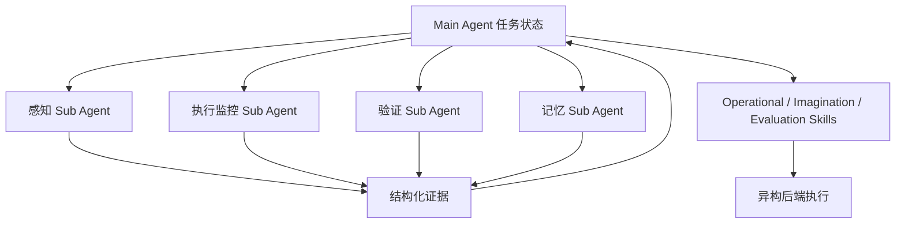
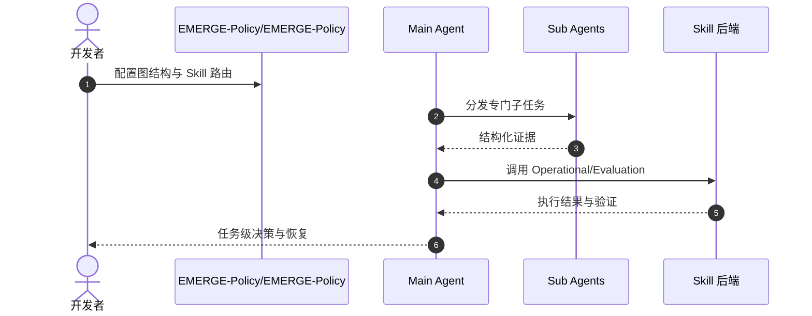

# EMERGE-Policy：超越单一策略的机器人系统级「心智」

**EMERGE-Policy**（*A Robot Mind Emerges Beyond a Single Policy*，[arXiv:2608.29896](https://arxiv.org/abs/2608.29896)，[项目页](https://emerge-policy.github.io/EMERGE-Policy/)，[代码](https://github.com/EMERGE-Policy/EMERGE-Policy)）提出：机器人有效「心智」可从 **专门组件在共享编排流程中的协作** 涌现。**图结构 agentic 框架** 协调 **能力调用与信息交换**。

## 一句话定义

**机器人策略可以是编排出来的——感知、验证、记忆拆成 Sub Agent，Main Agent 只保留决策相关证据。**

## 英文缩写速查

| 缩写 | 英文全称 | 简要说明 |
|------|----------|----------|
| Main Agent | Main Agent | 保持任务级状态与最终决策 |
| Sub Agent | Sub Agent | 感知、执行监控、验证、记忆等专门角色 |
| Skill | Skill Interface | Operational / Imagination / Evaluation 异构后端组合接口 |

## 为什么重要

- 纳入 [2026-09-01 七篇盘点](../../sources/blogs/wechat_embodied_station_7_papers_open_source_system_loop_2026-09-01.md) 的「多智能体系统级策略」支线。
- **无需额外微调** 即在多 benchmark 与真机展示突出系统级表现。
- **角色隔离上下文** 控制信息负载，避免单窗口塞满全栈日志。
- **已开源** 官方仓库。

## 核心信息

| 项 | 内容 |
|----|------|
| **框架** | 图结构 agentic orchestration |
| **组件** | Main Agent + 感知/监控/验证/记忆 Sub Agents |
| **恢复** | Branch Stack recovery、文本失败诊断、external memory |
| **Skill 类型** | Operational、Imagination、Evaluation |
| **开源** | **已开源** [EMERGE-Policy/EMERGE-Policy](https://github.com/EMERGE-Policy/EMERGE-Policy) |

### 流程总览

## 评测

- 多个公开 benchmark 与真实机器人实验展示 **系统级** 表现（项目页/论文）。
- 强调 **无额外微调** 即可组合现有后端。

## 结论

**把机器人心智从「一个大网络」改成「可验证的多角色编排」，是提升可靠性的系统路线。**

- Main/Sub Agent 分工控制上下文负载
- Skill 接口统一异构能力后端
- 准则验证 + 失败诊断 + Branch Stack 局部恢复
- token-aware external memory 保持长时程状态
- 无需额外微调即可部署组合
- 官方代码已发布

## 源码运行时序图

## 局限与风险

- **编排复杂度：** 图结构与 Skill 路由需工程维护。
- **延迟与成本：** 多 Agent 调用增加 token 与链路延迟。
- **后端依赖：** 系统表现受所接 VLA/仿真等后端质量约束。

## 与其他工作对比（索引级）

| 维度 | EMERGE-Policy | 端到端单体 [VLA](../methods/vla.md) | 单 LLM + 工具调用 | [MistyPilot](./paper-mistypilot.md) 式技能编排 |
|------|--------------|-------------------------------|-----------------|--------------------------------------|
| 能力来源 | **编排既有后端**，不训新策略 | 权重里学到的策略 | 提示 + 工具 | 技能库 + 调度 |
| 上下文管理 | **角色隔离**，Main 只收结构化证据 | 无此问题（无文本上下文） | 单窗口易被日志塞满 | 依实现而定 |
| 失败恢复 | Branch Stack 局部回退 + 文本诊断 | 重试或人工接管 | 重规划 | 技能级重试 |
| 是否需微调 | **否** | 需大规模训练 | 否 | 视后端 |
| 主要代价 | **多 Agent 调用的延迟与 token** | 训练成本 | 单点上下文瓶颈 | 技能维护 |

- **它是系统层而非策略层的工作**：EMERGE-Policy 的增益来自编排与证据裁剪，底层执行仍依赖所接的 VLA/仿真后端，因此其 benchmark 数字与单体 VLA 的成功率**不是同一层的比较**——换后端结论即变（本页「局限与风险」已注明后端依赖）。
- **与 MistyPilot 的差别在证据流**：两者都做多角色编排，本文更强调 Main Agent 只保留决策相关证据的上下文预算控制，以及 Branch Stack 的局部恢复语义。
- **成本方向相反**：免微调换来的是每次任务的推理调用开销，长时程任务上 token 与链路延迟会成为主约束。

## 关联页面

- [MistyPilot](./paper-mistypilot.md) — 同主题多智能体技能编排
- [Manipulation](../tasks/manipulation.md)
- [VLA](../methods/vla.md) — 被编排的执行后端一类
- [开源系统闭环 7 篇地图](../overview/open-source-system-loop-7-papers-technology-map.md)

## 推荐继续阅读

- [EMERGE-Policy 项目页](https://emerge-policy.github.io/EMERGE-Policy/)
- [arXiv:2608.29896](https://arxiv.org/abs/2608.29896)

## 参考来源

- [emerge_policy_arxiv_2608_29896.md](../../sources/papers/emerge_policy_arxiv_2608_29896.md)
- [具身智能小站 2026-09-01 七篇盘点](../../sources/blogs/wechat_embodied_station_7_papers_open_source_system_loop_2026-09-01.md)
- [EMERGE-Policy 项目页](../../sources/sites/emerge-policy.md)
- [EMERGE-Policy/EMERGE-Policy](../../sources/repos/emerge-policy-emerge-policy.md)
