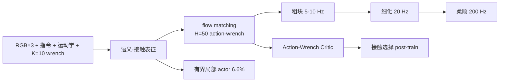

# Facet-0：接触丰富精密装配基础模型

**Facet-0**（*A Robotic Foundation Model for Contact-Rich Precise Manipulation*，[arXiv:2609.01596](https://arxiv.org/abs/2609.01596)，[项目页](https://pine-lab-ntu.github.io/facet-0/)，[代码占位](https://github.com/PINE-Lab-NTU/FACET)）由 **南洋理工大学（NTU）PINE Lab** 提出：把腕部力当成**动作的预测后果**，用 flow matching 同时生成笛卡尔动作块与预期 wrench，再用分布 critic 与有界局部 actor 在部署里给接触打分、做零件级适应。

## 一句话定义

**精密装配的瓶颈不是看懂场景，而是预测、估价并修正每个动作将带来的接触后果。**

## 英文缩写速查

| 缩写 | 英文全称 | 简要说明 |
|------|----------|----------|
| F/T | Force/Torque | 腕部六维力矩；预测头输出，**不是**力指令 |
| VLA | Vision-Language-Action | 对照族；本页骨干是 PaliGemma + action expert |
| AWC | Action–Wrench Critic | 给联合提案打分布价值 |
| HF | Hugging Face | ManuFacet-1K 已发；模型卡为空 |
| RECAP | Physical Intelligence 的 VLA 部署后训练目标 | 论文最强基线是 \(\pi_{0.5}\) 上的 RECAP-style 复现，不是官方 \(\pi_{0.6}^{\star}\) |

## 为什么重要

- 通用 VLA 在自由空间 pick 已经接近满，失败集中在 **0.10–0.30 mm** 的 align/place/press。
- 把 wrench **只当输入**（\(\pi_{0.5}\)+F、TA-VLA）仍停在 9–16%——感觉接触不等于按接触后果选动作。
- ManuFacet-1K 把约 **1000 h** 力同步装配数据补进公开语料。
- **开源要读边界：** 数据集已上 HF；仓库截至 2026-09-03 **仅 README**。

## 核心信息

| 项 | 内容 |
|----|------|
| **机构** | 南洋理工大学（NTU）PINE Lab |
| **数据** | ManuFacet-1K（~1000 h，三本体 UR7e/xArm/Franka，两机箱族） |
| **评测** | RAM / CPU / Disk / GPU / CPU LEVER；20 trial / 格 |
| **开源** | **部分开源**：[ManuFacet-1K](https://huggingface.co/datasets/Pinelab/ManuFacet-1K) 已发；[FACET](https://github.com/PINE-Lab-NTU/FACET) **Code coming soon**；`Pinelab/Facet-0` 卡片为空 |

### 流程总览

## 核心原理

**联合提案。** \(Y_t=[A,\widehat{W}]\in\mathbb{R}^{H\times 13}\)，\(H=50\)。力窗口 \(K=10\)，因为卡死/偏斜是短轨迹事件，单帧力看不出来。\(\widehat{W}\) 反归一化后仍是**预测**，执行层只跑笛卡尔目标；200 Hz 柔顺环闭在**实测** F/T 上。

**价值细化。** VLM 法官切子目标并标相；奖励奖励更快完成、惩罚超相包络的力。分布 critic 读 \((h_t^c,Y_t)\)，所以「同深度干净插入」和「同深度卡死」不再被几何进度抹平。接触选择信用在 contact/free 两档内取高分帧，避免全局阈值只挑自由空间。

**局部适应。** 冻表征与细化专家，只训有界绝对笛卡尔 actor（不是残差）。辅助力头继续预测下一步 wrench，**不进** TD3 动作维。10 条示范、约 3 小时、**6.6%** 参数，把未见过的内存条做到 45%。

## 评测

五任务成功率（%），20 trial；均值 Align **16** → +RL **38** → Full **82**；最强基线 \(\pi_{0.5}\)+RECAP **15**。

| 任务 | \(\pi_{0.5}\) | +RECAP | TA-VLA | Align | +RL | Full |
|------|--------------:|-------:|-------:|------:|----:|-----:|
| RAM | 10 | 35 | 10 | 15 | 45 | **95** |
| CPU | 5 | 15 | 20 | 20 | 45 | **85** |
| Disk | 25 | 20 | 30 | 30 | 65 | **95** |
| GPU | 10 | 5 | 5 | 10 | 35 | **85** |
| LEVER | 0 | 0 | 5 | 5 | 0 | **50** |

- 自由空间 pick 各方法都高；缺口在带 \(\dagger\) 的接触子目标。LEVER 没有自由空间步，是最难的 50%。
- 同语料 AWR：成功 20%→65%，干预 **47%→24%**，恢复 **44%→81%**。
- 放置 **0.5 mm**、指令 **50 ms**（\(\pi_{0.5}\) 约 5 mm / 150 ms）。
- RAM 接触角色消融：去掉预测+估价+适应 → 45%、峰值侧向力回到 1.0×；完整配方 95%、侧向力 0.2×。

## 结论

**通用 VLA 已经会「拿起来」；精密装配要的是给动作附带可估价的力后果，并在部署里按后果改行为。**

1. **wrench 当输入不够** — +F / TA-VLA 与 Align 同处 9–16% 带。
2. **16→38→82 是三段互补** — 表征给联合对象，critic 给排序，局部 actor 给零件动力学。
3. **82% 是整链成功率** — 接触子目标均值约 87%；任一环失败就掉任务。
4. **LEVER 50% 说明纯接触链仍难** — 不要把 82% 读成「所有装配已解决」。
5. **few-shot 45% 花在接触接口上** — 10 条示范不该拿去重学语义。
6. **复现入口未齐** — 能下的是 ManuFacet-1K，不是可跑训练脚本。

## 源码运行时序图

**不适用。** [PINE-Lab-NTU/FACET](https://github.com/PINE-Lab-NTU/FACET) 截至 2026-09-03 只有 README（Code coming soon），没有 `train.py` / 推理 CLI。HF 模型卡为空；数据集可下，但不能对齐官方运行时序。

## 工程实践

| 项 | 口径 |
|----|------|
| 执行分层 | 粗 5–10 Hz → 细化 20 Hz → 柔顺 200 Hz |
| 安全层 \(\mathcal{S}_{\mathrm{task}}\) | 工作空间与逐步位移裁剪；**不是**能量罐无源性证明 |
| 适应 | 有界盒 \([a_{\min},a_{\max}]\) 后再过安全层 |
| 数据 | 15 Hz 训练时间线；力环保留 200 Hz |

## 局限与风险

- **评测域窄** — 五任务是同一机箱夹具上的腕力平行夹爪电子装配；语料虽跨三本体，主表不是跨行业零件。
- **硬件前提** — 腕部 F/T + 柔顺栈；低成本位置臂要另做力蒸馏。
- **仓库占位** — 勿按昨日浅入库把 GitHub 当成可复现训练入口。

## 与其他工作对比

| 维度 | Facet-0 | 通用 [VLA](../methods/vla.md) / \(\pi_{0.5}\) | 传统柔顺装配 |
|------|---------|-----------------------------------------------|--------------|
| 预测目标 | **动作块 + 预期腕力** | 多半只有动作 | 无力预测 |
| 力的角色 | 目标、价值、适应接口 | 可选输入 token | 实时反馈 |
| 亚毫米主表 | 均值 **82%** | 最强对照 **15%** | 逐任务编程 |
| 复现 | **数据已发，代码未发** | 视具体模型 | — |

- **82% vs 15%** 只在这套五任务、同一传感上成立；语义泛化仍是通用 VLA 的强项。
- 与 [Peg-in-Bench](./paper-peg-in-bench.md) 是算法–基准互补，成功率不可横比。
- 与 [ParcelStow](./paper-parcelstow.md) 不在一条轴：那边问模仿是否继承时间鲁棒性，这里问接触后果能否写进学习目标。

## 关联页面

- [Manipulation](../tasks/manipulation.md)
- [VLA](../methods/vla.md)
- [接触丰富操作 7 篇地图](../overview/contact-rich-manipulation-7-papers-technology-map.md)
- [Peg-in-Bench](./paper-peg-in-bench.md)
- [ParcelStow](./paper-parcelstow.md)

## 推荐继续阅读

- [Facet-0 项目页](https://pine-lab-ntu.github.io/facet-0/)
- [arXiv:2609.01596](https://arxiv.org/abs/2609.01596)
- [ManuFacet-1K](https://huggingface.co/datasets/Pinelab/ManuFacet-1K)

## 参考来源

- [facet_0_arxiv_2609_01596](../../sources/papers/facet_0_arxiv_2609_01596.md)
- [Facet-0 项目页](../../sources/sites/facet-0.md)
- [PINE-Lab-NTU/FACET](../../sources/repos/pine-lab-ntu-facet.md)
- [ManuFacet-1K](../../sources/datasets/manufacet-1k.md)
- [具身智能小站 2026-09-02 七篇盘点](../../sources/blogs/wechat_embodied_station_7_papers_contact_manipulation_2026-09-02.md)
