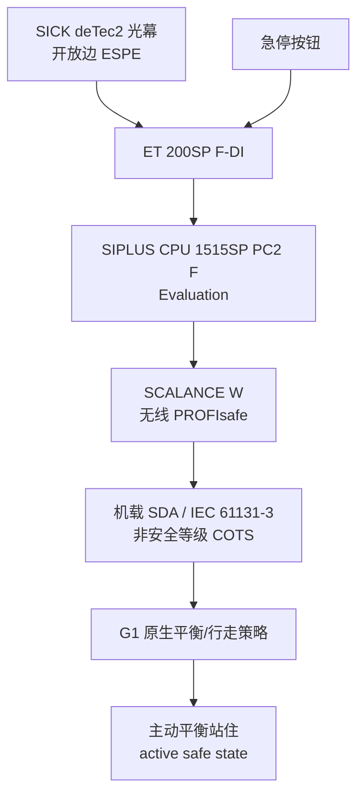

# Fail-Passive Gap：工业人形功能安全的认证缺口

**Toward Certified Functional Safety for Industrial Humanoid Robots**（Caiwu Ding、Tao Cui、Lingyun Wang、Chengtao Wen；**西门子基础技术部门 / Siemens Corporation，Princeton NJ**，[arXiv:2608.02809](https://arxiv.org/abs/2608.02809)）指出：工业人形落地的瓶颈不是走/抓，而是**腿式平台还没有可认证的功能安全反应链**。经典机械安全把「安全态」等同于断电静止；动态平衡双足把同一动作变成摔倒危害。作者称之为 **fail-passive gap**，并用一条已认证外部安全链当测量仪器，把缺口钉在机侧。

## 一句话定义

**对会自己站着的人形，保护停不能切电——安全态是主动控制出来的平衡站住；现有 ISO 13849 / EN 60204 能评到光幕和安全 PLC，评不到「策略把机器人停住且不摔」。**

## 英文缩写速查

| 缩写 | 英文全称 | 简要说明 |
|------|----------|----------|
| PL | Performance Level | ISO 13849-1 安全功能性能等级 a–e；e 最高 |
| SIL / SILCL | Safety Integrity Level / Claim Limit | IEC 62061 并行框架；参考例评到 SIL 3 |
| PFHD | Probability of dangerous Failure per Hour | 每小时危险失效概率，PL/SIL 的量化入口 |
| DC | Diagnostic Coverage | 危险失效被诊断出的比例；Cat. 4 目标 \(\ge 99\%\) |
| CCF | Common Cause Failure | 共因失效抗性；参考门槛 \(\ge 65\) 分 / \(\beta=0.1\) |
| PROFIsafe | PROFIsafe (IEC 61784-3) | 在标准（含无线）网络上走 SIL 3 安全报文的黑通道 |
| SDA | Software-Defined Automation | 机载 soft PLC（IEC 61131-3），收停指令但非认证 F-host |
| ESPE | Electro-Sensitive Protective Equipment | 光电保护设备；本文 Type 4 光幕 |

## 为什么重要

- **把「人形还不能进产线」从口号变成可定位缺口：** 不是缺光幕或安全 PLC，而是 Reaction 子系统没法用接触器 Stop Category 0 收尾。
- **纠正认证话术：** 外部链可以按成熟方法做到 PL e / SIL 3 **能力**；把整机说成已认证 PL e 在本文框架下站不住。
- **和算法安全分层：** [Safety Filter](../concepts/safety-filter.md) / [CBF](../concepts/control-barrier-function.md) 管「动作别越界」；本页管「保护停在标准里怎么算、算到哪一层为止」。
- **工程可抄的半成品：** 半封闭单元 + 无线 PROFIsafe + 机载 SDA，是现在就能搭的监督架构，同时诚实标出机侧不可认证。

## 核心信息

| 字段 | 内容 |
|------|------|
| 机构 | 西门子（Siemens）基础技术部门，Siemens Corporation（美国新泽西州普林斯顿） |
| 发表 | arXiv preprint（2026-08-03 v1，`cs.RO`） |
| arXiv | [2608.02809](https://arxiv.org/abs/2608.02809) |
| 项目页 | 无 |
| 代码 | **确认未开源**（截至 2026-08-17） |
| 平台 | Unitree G1 EDU；\(3\,\mathrm{m}\times 1.5\,\mathrm{m}\) 半封闭传送带抓放（1×1 inch 立方体） |
| 安全件 | SIPLUS CPU 1515SP PC2 F、ET 200SP F-DI、SICK deTec2 Core、Siemens 急停、SCALANCE W |

## 核心原理

### 输入 / 输出

| 层 | 输入 | 输出 |
|----|------|------|
| Detection | 光幕遮挡、急停按下 | 安全 DI 状态 |
| Evaluation | F-DI + F-CPU 逻辑、复位互锁 | PROFIsafe 停需求电报 |
| Reaction（缺口） | 无线安全报文 / 看门狗超时 | 机载 SDA 收包 → 原生行走策略切平衡站住 |

安全功能 SF-1：开放边入侵或急停 → 命令安全停并达到稳定平衡静站；**禁止自动再启动**（HMI 人工确认）。通信丢失走 PROFIsafe 看门狗 fail-safe standstill。急停按 EN ISO 13850 是**补充**功能，主风险降低是光幕保护停 + 工位布局。

### 流程总览

**量尺用法：** Detection + Evaluation 闭合、可用 ISO 13849-1 参数打分；Reaction 在参考例里是两只监测接触器（Stop Category 0），在人形单元里被换成「无线报文 + 专有策略」。缺口不在 PLC，在 **SDA 把停需求交给平衡策略** 这一跳。

### 停止类别

实现不是 Category 0（立即切动力）。更接近 **Category 1 意向**：受控停、动力保持以维持平衡；作者用谨慎措辞，因为机内停动态与最终是否切电都在认证边界之外。机载 LiDAR 局部避障被明确**排除**出 SIL/PL 论证。

## 源码运行时序图

**不适用**：截至 **2026-08-17**，论文仅 arXiv，无项目页、无 GitHub / 数据集。安全逻辑在 TIA Portal + 商用 F-PLC 与宇树专有策略上，无可对齐的公开运行入口。

## 工程实践

| 项 | 建议 / 论文设定 |
|----|----------------|
| 外部链 | 用认证件搭 D–E；不要为了「看起来更安全」给平衡人形加接触器切母线 |
| 机载端点 | SDA 把 PROFIsafe 收到 IEC 61131-3 接口，**不等于**认证 F-host；COTS 计算无 PFHD |
| 复位 | 停后闭锁；清入侵 / 松急停 + HMI 确认，禁止自动恢复运动 |
| 时序记账 | 每项标 [S]/[C]/[M]；认证最坏界由 \(F\_WD\_Time\) 卡住无线段，机械 \(t_{\mathrm{stop}}\) 另计 |
| 单小区 | 无漫游可收紧看门狗、缩小 ISO 13855 间距；多 AP 漫游未做 |
| 辅助感知 | 机载 LiDAR 停只能当碰撞回避行为，不能替外部保护停 |

## 实验与评测

- **时序（Table III）：** \(t_{\mathrm{detect}}=11\,\mathrm{ms}\) [S]；F-DI 4–10 ms [C]；PLC 扫描 15–40 ms [M]；PROFIsafe 30–39 ms、看门狗 \(\le 192\) ms [C]/[M]；接收 5–20 ms [M]；机械停 **0.3–1.0 s** [M]。最坏 \(t_{\mathrm{response}}^{\mathrm{wc}}\approx 1.1\,\mathrm{s}\)，由 \(t_{\mathrm{stop}}\) 主导。
- **通信丢失 S6：** AP 断电、拆天线、断有线上行、停 F-CPU，各 3 次；全部在 **0.5–1.3 s** 内平衡站住、未摔倒，与 \(F\_WD\_Time+t_{\mathrm{stop}}\) 一致。
- **参考例数字（方法对照，不是本单元重算）：** Detection / Evaluation / 接触器 Reaction 的 PFHD 合计约 \(7.35\times 10^{-9}\)（ISO 13849-1，PL e）或 \(1.24\times 10^{-8}\)（IEC 62061，SILCL 3）。人形链没有等价接触器，**尚无端到端 PFHD**。
- **未报：** 停距曲线 \(d_{\mathrm{stop}}(v)\)、误触发率、可用性、丢包看门狗裕度 — 标为后续。

## 结论

**工业人形现在就能用认证外部链做保护监督；不能宣称整机已认证，因为「停」必须靠未评级的平衡策略主动完成。**

1. **缺口位置唯一：** 可量化的是光幕→F-DI→F-PLC→PROFIsafe；不可量化的是机侧收包之后到站住。
2. **切电不是安全：** Stop Category 0 对行走双足是新危害；不要把固定臂/AGV 的 fail-passive 话术搬过来。
3. **停是非单调的：** 过猛的急停可能摔；单支撑相位给 \(t_{\mathrm{stop}}\) 下界，间距按最坏相位算。
4. **SDA 标准化接口，不关闭缺口：** 机载 soft PLC 让工业方法够到反应链前半段，但 COTS 计算无 SIL/PL。
5. **读数纪律：** 规格 / 配置 / 实测分栏；参考例 PFHD 不可当作本单元已评数字。
6. **部署读法：** 半封闭 + 单区光幕是当前可行范围；速度–间距监测、安全等级机载计算、反应链 DC/PFHD 仍是研究议程。

## 与其他工作对比

| 对象 | 安全态假设 | 和本文的关系 |
|------|------------|--------------|
| ISO 10218:2025 / ISO/TS 15066（SSM、PFL） | 停或限功率后平台 fail-passive | 概念可借到「该不该停」；**执行停**在双足上不成立 |
| ISO 3691-4 / 固定臂 Cat. 0 | 切电滑停无害 | 西门子 S7-1500 参考例能评 PL e 的原因；人形故意删掉这一环 |
| [Safety Filter](../concepts/safety-filter.md) / CBF-QP | 在线改动作，保持安全集 | 控制层保证 ≠ 功能安全认证（无 PFHD/DC/CCF） |
| Grandia et al. CBF+MPC（腿式多层安全） | 控制屏障 + 预测控制 | 本文引用为「主动安全态」文献，不提供认证路径 |
| Safe-stoppability monitor（[arXiv:2603.22703](https://arxiv.org/abs/2603.22703)，部分共同作者） | 学「此刻还能不能安全停」 | 可缩小策略残差；作者写明给不出可认证 PFHD |
| [机器人安全状态机](../concepts/robot-safety-state-machine.md) | 故障边切阻尼/无力矩/冻结 | 软件 FSM 必要，但「Safe=无力矩」正是本缺口的现场表现 |

## 局限与风险

- **主缺口：** 反应链无 PFHD/DC/CCF，也无人形专用标准覆盖「平衡站住」。
- **机载非安全等级：** 真 F-host 需要安全等级硬件；G1 计算是 COTS。
- **停止类别未闭环：** 「静站且保持平衡」不是 fail-passive；Cat. 1 只是暂拟。
- **范围：** 单区、单场景；操作中断可能让工件状态不确定。
- **参考数字不可挪用：** Table II 是方法示例，不是本单元重算。

## 关联页面

- [机器人安全状态机](../concepts/robot-safety-state-machine.md) — 软件故障降级；「Safe=无力矩」与主动安全态冲突
- [整机配电架构](../concepts/robot-power-distribution-architecture.md) — Stop Category 0/1/2 与 STO 硬件回路
- [Safety Filter](../concepts/safety-filter.md) — 算法层最小改动作 vs 本页认证边界
- [Capture Point / DCM](../concepts/capture-point-dcm.md) — 单支撑保护停必须先落到可捕获点
- [Balance Recovery](../tasks/balance-recovery.md) — 保护停是受约束的恢复，不是越快越好
- [系统工程知识链](../overview/hub-systems-engineering.md) — 安全 FSM 与现场总线之上的认证层
- [Unitree G1](./unitree-g1.md) — 本文验证平台
- [Safe-Stop](./paper-safe-stop-humanoid.md) — 学习式可停止性门控；互补认证缺口，不替代本页
- [控制环路延迟建模](../formalizations/control-loop-latency-modeling.md) — 把 \(t_{\mathrm{response}}\) 拆成可加分段的同一思路

## 参考来源

- [Fail-Passive Gap 论文策展](../../sources/papers/fail_passive_gap_arxiv_2608_02809.md)
- Ding et al., *Toward Certified Functional Safety for Industrial Humanoid Robots*（[arXiv:2608.02809](https://arxiv.org/abs/2608.02809)）

## 推荐继续阅读

- [Siemens 应用例：Fail-Safe S7-1500 急停至 PL e / SIL 3（Entry ID 21064024）](https://support.industry.siemens.com/cs/document/21064024) — 本文 Table II 的方法参照
- [ISO 13849-1](https://www.iso.org/standard/69883.html) / [IEC 62061](https://webstore.iec.ch/) — PL 与 SILCL 定量框架
- Sun et al., *Learning Safe-Stoppability Monitors for Humanoid Robots*（[arXiv:2603.22703](https://arxiv.org/abs/2603.22703)）— 同作者线的学习式可停监测，互补而非替代认证
