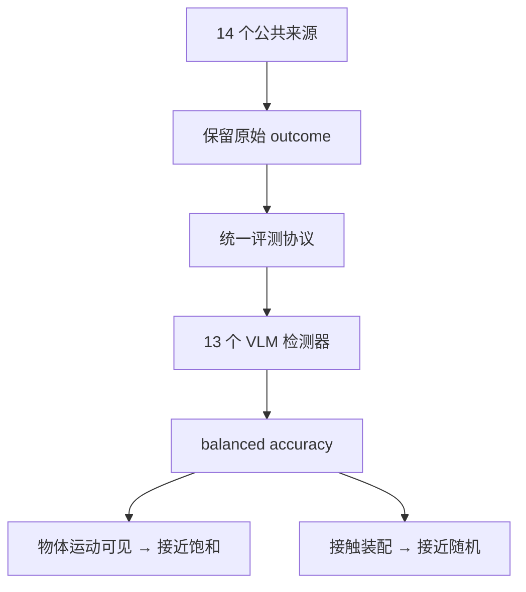

# FailBench：VLM 当裁判有多可靠

**FailBench**（*How Reliable are VLMs at Judging Robot Task Success?*，[arXiv:2609.03611](https://arxiv.org/abs/2609.03611)，[项目页](https://metric-ai-lab.github.io/failbench/)）由 **Metric AI Lab** Zaruhi Navasardyan、Tatul Danielyan、Hrant Davtyan 提出：机器人学习越来越把 VLM 判断当作 RL 奖励、数据过滤、策略排序或重试触发，但跨域证据不足。FailBench 收集 **14 个公共来源、2197 次** 操作尝试（12 真机 + 2 仿真），**保留原始 outcome labels**；其中 **75%** 失败为自然发生，六个真实来源本不是失败检测数据集。

## 一句话定义

**VLM 可以当裁判，但在接触密集失败上还不能被当作真值。**

## 英文缩写速查

| 缩写 | 英文全称 | 简要说明 |
|------|----------|----------|
| FailBench | Failure Benchmark | 本文跨源失败检测基准 |
| VLM | Vision-Language Model | 被测成功/失败判定器 |
| BA | Balanced Accuracy | 主指标（各类别平衡） |
| OOD | Out-of-Distribution | 跨数据集 / 非失败检测源 |

## 为什么重要

- 纳入 [九篇盘点](../../sources/blogs/wechat_embodied_station_9_papers_open_source_2026-09-04.md) 的「可靠评测」支线。
- 把「VLM 当奖励」从默认选项改成必须过的压力测试。
- 显示 **证据类型** 比模型品牌更决定上限。

## 方法

| 项 | 内容 |
|----|------|
| **机构** | Metric AI Lab |
| **规模** | 2197 attempts / 14 sources / 13 detectors |
| **标签** | 沿用各源原始 outcome，不重标成统一美学标准 |
| **开源** | **部分开源**：仓为站点镜像，harness 按钮仍为 `#` |

### 流程总览

## 评测

| 发现 | 数字 / 读法 |
|------|-------------|
| 最好模型 | mean balanced accuracy **0.77** |
| 接触密集装配 | **没有任何模型超过 0.60** |
| 微调失败检测器 | 整体 **不如** 通用 VLM 及其预训练基线 |
| 自然失败占比 | **75%** |

项目页写「释放基准与 evaluation harness」；截至入库日 GitHub 只有 `index.html`，Code/Dataset 仍指向 `#`。

## 结论

**把 VLM 成功率当 RL 奖励或数据过滤器之前，先看失败是不是「看得见的物体运动」。**

1. **0.77 不是可用真值** — 尤其不能用于接触装配的自动标注。
2. **微调不是免费午餐** — 专用失败检测器整体更差。
3. **跨源比单源演示重要** — 六个源本来就不是失败基准。
4. **证据类型决定上限** — 运动可见接近饱和，接触接近随机。
5. **harness 还没落地** — 论文可引用，管道不可复跑。

## 源码运行时序图

**不适用** — 截至 **2026-09-04**，`Metric-AI-Lab/failbench` 无可辨识的训练/评测入口（仅站点镜像）。

## 工程实践

| 项 | 建议 |
|----|------|
| 何时引用 | 计划用 VLM 做成功判定、过滤或重试 |
| 部署红线 | 接触/插孔/装配任务不要把 VLM 判决当 GT |
| 选型 | 对照 [评测基准选型闭环](../queries/embodied-eval-benchmark-selection-loop.md) |

## 局限与风险

- **复现材料未齐** — 项目页按钮占位。
- **标签异构** — 保留原始 outcome 带来可比性，也带来定义漂移。
- **不是策略基准** — 不替代 LIBERO/RoboCasa 成功率。

## 与其他工作对比

| 对照 | 差异读法 |
|------|----------|
| 策略成功率榜 | 评「机器人会不会做」；本页评「裁判靠不靠谱」 |
| 单源失败检测论文 | 易过拟合该源视觉；FailBench 强制跨 14 源 |
| [IRWOZ 2.0](./paper-irwoz-2.md) | 工业「听懂」数据；本页是执行成败视觉判定 |

## 关联页面

- [VLA](../methods/vla.md)
- [Manipulation](../tasks/manipulation.md)
- [评测基准选型闭环](../queries/embodied-eval-benchmark-selection-loop.md)
- [具身评测基准选型闭环（枢纽）](../overview/hub-embodied-eval-benchmark.md)
- [机器人视觉感知栈选型闭环](../queries/robot-perception-stack-selection-loop.md) — 本页「证据类型决定上限」即感知栈①层模态选型的下游后果：物体运动视觉可见故判定接近饱和，接触装配纯视觉不可观测故接近随机
- [开源可复现性 9 篇地图](../overview/open-source-reproducibility-9-papers-technology-map.md)

## 参考来源

- [failbench_arxiv_2609_03611](../../sources/papers/failbench_arxiv_2609_03611.md)
- [FailBench 项目页](../../sources/sites/failbench.md)
- [Metric-AI-Lab/failbench](../../sources/repos/metric-ai-failbench.md)
- [具身智能小站 2026-09-04 九篇盘点](../../sources/blogs/wechat_embodied_station_9_papers_open_source_2026-09-04.md)

## 推荐继续阅读

- [arXiv:2609.03611](https://arxiv.org/abs/2609.03611)
- [FailBench 项目页](https://metric-ai-lab.github.io/failbench/)
