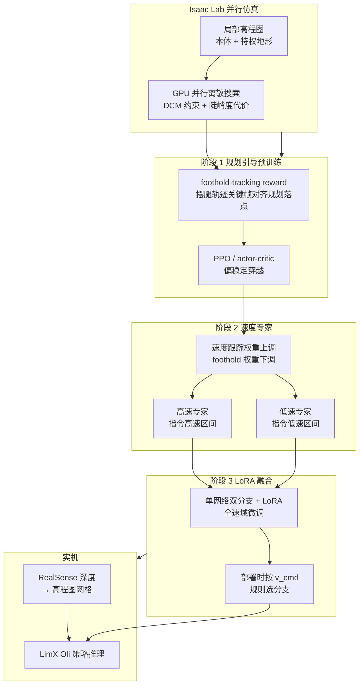

---

type: entity
tags:
  - paper
  - humanoid
  - locomotion
  - reinforcement-learning
  - foothold-planning
  - dcm
  - isaac-lab
  - sim2real
  - limx-dynamics
  - stairs
status: complete
updated: 2026-09-01
arxiv: "2601.10365"
related:
  - ../../roadmap/depth-perceptive-locomotion.md
  - ../tasks/stair-obstacle-perceptive-locomotion.md
  - ../tasks/locomotion.md
  - ../methods/reinforcement-learning.md
  - ../concepts/capture-point-dcm.md
  - ../concepts/footstep-planning.md
  - ../concepts/privileged-training.md
  - ../concepts/sim2real.md
  - ../concepts/terrain-adaptation.md
  - ./isaac-gym-isaac-lab.md
  - ./paper-explicit-stair-geometry-humanoid-locomotion.md
sources:
  - ../../sources/papers/faststair_arxiv_2601_10365.md
  - ../../sources/sites/npcliu-faststair-github-io.md
summary: "FastStair（arXiv:2601.10365）把 GPU 并行离散搜索的 DCM 落脚点规划嵌进 Isaac Lab 大规模 RL：先用 foothold-tracking 强监督得到偏安全的基策略，再分训高速/低速专家并用 LoRA 合成单网络，在 LimX Oli 上报告约 1.65 m/s 指令速度下的稳定上楼与长螺旋梯实机结果。"
tags: [paper, humanoid, locomotion, reinforcement-learning, foothold-planning, dcm, isaac-lab, sim2real, limx-dynamics, stairs, limx]

---

# FastStair（Learning to Run Up Stairs with Humanoid Robots）

**FastStair** 是面向 **人形机器人高速上楼梯** 的 **规划引导 + 多阶段强化学习** 工作（arXiv:2601.10365，LimX Dynamics 等）：用 **DCM 落脚点规划器** 在训练中提供 **显式动态可行接触** 的引导信号，再用 **专家分解与 LoRA 融合** 缓解「规划器保守性」与「全速域单策略难训」的矛盾，在 **LimX Oli** 全尺寸人形上给出 **高指令速度仍稳定爬梯** 的实机证据链。

## 一句话定义

**把离散化、GPU 并行的落脚点「规划代价」接进 RL 奖励，先把楼梯上的安全接触学稳，再用分速专家 + LoRA 把速度跟踪拉满并抹平切换。**

## 英文缩写速查

| 缩写 | 英文全称 | 简要说明 |
|------|----------|----------|
| Sim2Real | Simulation to Real | 把仿真中学到的策略迁移落地真机的工程主线 |
| GPU | Graphics Processing Unit | 图形处理器，大规模并行仿真训练的算力基础 |
| DCM | Divergent Component of Motion | 质心发散分量，用于落脚点与平衡调节 |
| Isaac Lab | NVIDIA Isaac Lab | 基于 Omniverse 的机器人学习训练框架 |
| RL | Reinforcement Learning | 通过与环境交互最大化长期回报来学习策略的范式 |
| LoRA | Low-Rank Adaptation | 低秩增量微调，低成本适配大模型 |
| Locomotion | Robot Locomotion | 足式/人形等无轮移动能力的总称 |
| PPO | Proximal Policy Optimization | 人形/足式 locomotion 中最常用的 on-policy 策略梯度算法 |
| Isaac Gym | NVIDIA Isaac Gym | GPU 并行刚体仿真训练环境 |
| G1 | Unitree G1 Humanoid | 宇树入门级教育科研人形平台 |
| OOD | Out-of-Distribution | 分布外样本/未见场景，泛化评测关注点 |

## 为什么重要

- **对准离散地形的结构性难点：** 楼梯把 **接触选择** 与 **动态平衡** 绑在一起；纯隐式稳定性奖励在 **高速跟踪** 面前常出现 **目标冲突**，FastStair 用 **规划可行域** 把探索 **钉在** 更安全的接触流形附近。
- **工程可扩展：** 将 foothold 优化改写为 **张量并行搜索**，避免在万级并行仿真里堆 **重型实时优化器**，使「规划在环」对 **训练吞吐** 相对友好（论文给出约 **25×** 加速叙事，以原文实验为准）。
- **从「能爬」到「能跑爬」：** 在 **长距离螺旋梯** 与 **竞赛场景** 上给出 **高速度指令下仍稳定** 的叙事，和多数偏保守的楼梯 RL 演示形成对照。

## 核心结构

| 模块 | 作用 |
|------|------|
| **VHIP + DCM 落脚点规划** | 用变高倒立摆刻画上楼时 **自然频率随高度变化**，在局部高程图上定义候选落脚点，施加 **DCM 等式约束 + 地形陡峭度代价**，求下一步 **平面最优落点** 与高度。 |
| **优化 → 并行离散搜索** | 候选集由高程图分辨率自然离散化；对每个候选 **解析求配套 DCM offset**，批量算代价并 **argmin**；在名义目标附近 **裁剪 ROI** 进一步降本。 |
| **RL 观测与特权** | 本体侧含 **机载高程图**、步态时钟、历史动作等；特权侧含 **规划器最优落脚点** 等，用于训练期引导（部署依赖机载感知重建地图，与论文管线一致）。 |
| **三阶段训练** | (1) **foothold-tracking 主导** → 安全基策略；(2) **速度跟踪权重上升**，分 **低速 / 高速** 两档训专家；(3) **单网 + 分支 LoRA** 融合专家并全速域微调，规则切换器按指令速度选分支。 |

### 流程总览

## 常见误区或局限

- **误区：「规划在环 = 部署必须在线求解优化」。** 本文训练期用 **离散搜索近似** 规划代价；部署侧核心是 **机载地图 + 学习策略**，不要把训练期算子与机载算力需求混为一谈。
- **误区：「LoRA 在这里是语言模型式指令微调」。** 文中 LoRA 用于 **吸收两专家分支差异、平滑速度边界附近策略**，与 NLP 里的用法同名但 **目标与数据分布完全不同**。
- **局限：** 简化动力学（如论文对系数 **a≈1** 的近似）与 **高程图分辨率** 共同决定规划信号是 **启发式引导** 而非硬安全证明；跨平台迁移仍需重新对齐感知与执行器。

## 关联页面

- [感知越障纵深路线（Stage 3：楼梯 / 离散地形）](../../roadmap/depth-perceptive-locomotion.md) — 本页在感知越障纵深中的 **人形高速上楼 · 规划引导 RL** 代表作
- [楼梯与障碍 Locomotion（感知/盲走中心节点）](../tasks/stair-obstacle-perceptive-locomotion.md) — 本页在「带感知 · 人形 · 高速上楼」轴上的索引位
- [Locomotion（运动任务）](../tasks/locomotion.md) — 楼梯与离散地形在任务层的总览
- [Reinforcement Learning](../methods/reinforcement-learning.md) — PPO 类 actor-critic 与奖励工程坐标
- [Capture Point / DCM](../concepts/capture-point-dcm.md) — DCM 动力学直觉与文献锚点
- [Footstep Planning](../concepts/footstep-planning.md) — 落脚点规划与离散地形
- [Privileged Training](../concepts/privileged-training.md) — 特权观测引导训练
- [Sim2Real](../concepts/sim2real.md) — 域随机化与感知 sim2real
- [Terrain Adaptation](../concepts/terrain-adaptation.md) — 高程图与崎岖地形策略
- [Isaac Gym / Isaac Lab](./isaac-gym-isaac-lab.md) — 训练框架参照

## 方法栈

见上文 **核心结构** 与 **流程总览**（`###` 小节）；完整机制与模块分工以原文为准。

## 实验与评测

- 量化指标、消融与 sim2real / 实机结果见 **原文 PDF** 与 [参考来源](#参考来源)；本页正文侧重方法结构与知识库交叉引用。

## 结论

**高速上楼梯的关键不是「部署时在线求解落脚点优化」，而是训练期把 DCM 可行接触钉进奖励，再用分速专家 + LoRA 把速度跟踪拉满。**

1. **先安全接触、再提速** — 阶段 1 以 foothold-tracking 主导得到偏安全基策略；阶段 2 才上调速度跟踪、分训低速/高速专家；阶段 3 单网双分支 LoRA 融合并按 \(v_{\mathrm{cmd}}\) 规则选分支。
2. **规划在环 ≈ GPU 并行离散搜索** — 候选由高程图分辨率自然离散，解析求 DCM offset 后 argmin；论文给出约 **25×** 加速叙事，避免在万级并行仿真里堆重型实时优化器。
3. **部署依赖机载地图 + 学习策略** — RealSense 深度→高程网格→LimX Oli 推理；训练期特权「规划最优落点」不假设真机可得。
4. **实机叙事对准「能跑爬」** — frontmatter / 摘要口径约 **1.65 m/s** 指令速度下稳定上楼，并覆盖长螺旋梯；与偏保守楼梯 RL 形成对照。
5. **LoRA 此处不是 NLP 指令微调** — 目标是吸收两专家分支差异、平滑速度边界；跨平台仍需重对齐感知与执行器，规划信号是启发式引导而非硬安全证明。

## 与其他工作对比

- 正文已给出与相邻路线 / baseline 的 **定性对照**；定量表格与 ablation 见原文（[参考来源](#参考来源)）。
- **显式几何条件化（arXiv:2605.09944）：** [Explicit Stair Geometry Conditioning](./paper-explicit-stair-geometry-humanoid-locomotion.md) 用 **BEV 点云 → 踢面/踏面/航向 token** 条件化 PPO（**Unitree G1**），强调 **OOD 踢面泛化** 与 **长程户外楼梯**；FastStair 则用 **DCM 落点规划监督 + LoRA 专家** 追求 **高速上楼梯**（**LimX Oli**）。二者互补：规划引导 vs 低维几何接口。

## 参考来源

- [FastStair 论文摘录（arXiv:2601.10365）](../../sources/papers/faststair_arxiv_2601_10365.md)
- [npcliu.github.io/FastStair 项目页归档](../../sources/sites/npcliu-faststair-github-io.md)

## 推荐继续阅读

- [机器人论文阅读笔记：FastStair](https://imchong.github.io/Robot_Learning_Paper_Notebooks/papers/05_Locomotion/FastStair__Learning_to_Run_Up_Stairs_with_Humanoid_Robots/FastStair__Learning_to_Run_Up_Stairs_with_Humanoid_Robots.html)
- 论文 HTML（公式与图表）：<https://arxiv.org/html/2601.10365v1>
- 项目页（视频与 BibTeX）：<https://npcliu.github.io/FastStair>
