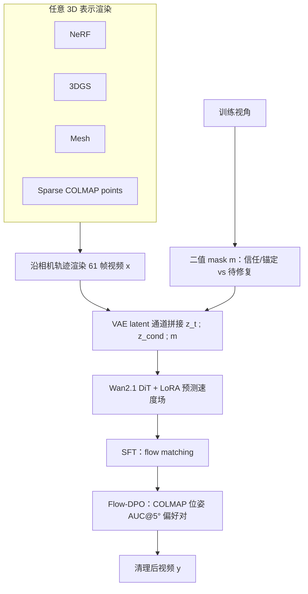
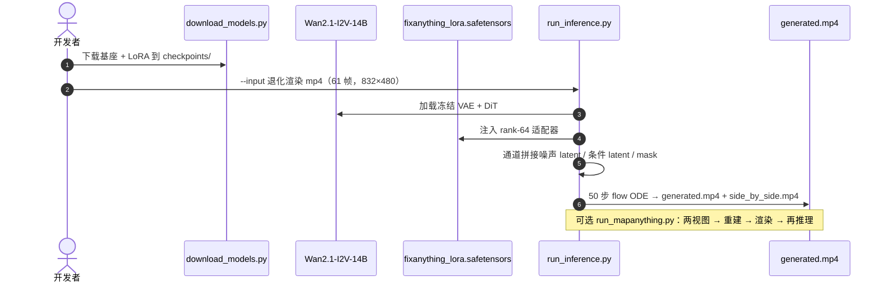

# FixAnything

**FixAnything: 3D-Consistent Rendering Refinement via Video Generative Priors**（[arXiv:2608.23549](https://arxiv.org/abs/2608.23549)，**ECCV 2026**，[项目页](../../sources/sites/fix-anything-github-io.md)）——卡内基梅隆大学（CMU）**Khiem Vuong**、**Deva Ramanan***、**Srinivasa Narasimhan***。

## 一句话定义

**退化渲染视频仍携带相机轨迹与粗场景布局——用单一视频先验做 video-to-video 清理，比为每种 3D 表示各建一套 specialist 更可扩展。**

## 英文缩写速查

| 缩写 | 英文全称 | 简要说明 |
|------|----------|----------|
| 3DGS | 3D Gaussian Splatting | 本文四类输入表示之一 |
| NeRF | Neural Radiance Fields | 稀疏视角下易雾状伪影的辐射场表示 |
| DPO | Direct Preference Optimization | 偏好优化框架；本文用 Flow-DPO 变体 |
| SfM | Structure from Motion | COLMAP 恢复相机位姿，作几何一致性奖励 |
| LoRA | Low-Rank Adaptation | rank-64 适配 Wan2.1，更新 <1% 参数 |

## 为什么重要

- **统一 specialist 族：** 以往 3DGS-Enhancer、Difix3D+、ViewCrafter 等多针对单一表示或需定制架构；FixAnything **同一 LoRA** 处理 NeRF / 3DGS / mesh / 稀疏 COLMAP 点云。
- **数据与算力友好：** 依赖 [Wan2.1-I2V-14B](./paper-wan-video.md) 预训练先验，**20 条配对视频** 即可有效清理；SFT 3000 iter 单卡 H100。
- **机器人 / Real2Sim 读法：** 稀疏捕获的 3DGS / mesh 渲染质量直接限制 [LEGS](./paper-legs-embodied-gaussian-splatting-vla.md)、[R2S-EGO](./paper-r2s-ego.md) 等管线的视觉资产上限；本文提供 **后处理增强** 路径，与「重建阶段正则」正交。

## 核心信息

| 项 | 内容 |
|----|------|
| **机构** | 卡内基梅隆大学（CMU） |
| **出处** | ECCV 2026；arXiv:2608.23549 |
| **基座** | Wan2.1-I2V-14B-480P + rank-64 LoRA |
| **开源** | **已开源（推理）** — [GitHub](https://github.com/kvuong2711/fix-anything) + [HF 权重](https://huggingface.co/kvuong2711/fix-anything)；训练脚本未发布 |

### 流程总览

## 源码运行时序图

自定义采集：`run_mapanything.py` 用 MapAnything 重建两视图场景并渲染轨迹，再链接 `run_inference.py` 完成端到端清理。

## 工程实践

| 项 | 内容 |
|----|------|
| **环境** | Python 3.10；PyTorch 2.6 + CUDA 12.6；`pip install --no-build-isolation -e .` |
| **权重** | `scripts/download_models.py` 拉取 Wan2.1（~60 GB）+ FixAnything LoRA |
| **输入格式** | 61 帧相机路径渲染；默认保留首尾干净帧（`--clean_frame_indices "0 60"`） |
| **长轨迹** | >61 帧时分块重叠处理；DL3DV-Drone 示例见项目页 |
| **加速** | 去噪 50→5 步约 **10×** 加速，质量接近（论文 Tab. 5） |
| **训练** | SFT / Flow-DPO **未开源**；复现训练需等待官方或自实现 |

## 评测

**协议：** DL3DV-10K 20 场景 hold-out；每场景 3 / 6 / 9 训练视角；query 为每隔 8 帧的非训练帧。指标：PSNR / SSIM / LPIPS + COLMAP 位姿 **AUC@5°**。

| 设置（6 views） | PSNR↑ | SSIM↑ | LPIPS↓ |
|-----------------|-------|-------|--------|
| 3DGS-Enhancer | 16.94 | 0.565 | 0.356 |
| Xu et al. | 17.35 | 0.566 | 0.396 |
| Difix3D+ | 14.41 | 0.424 | 0.400 |
| **FixAnything（3DGS 输入）** | **17.65** | **0.561** | **0.289** |
| FixAnything（mesh 输入） | 17.95 | 0.583 | 0.269 |
| FixAnything（sparse SfM） | 17.74 | 0.568 | 0.271 |

- **Flow-DPO 增益（6-view，3DGS）：** AUC@5° **61.12 → 68.32**（+7.2%）；PSNR 17.51 → 17.65。
- **跨数据集：** MipNeRF-360 / LLFF 上 3DGS 输入与 SOTA 可比，LPIPS 有优势（补充材料）。
- 数据出处：[ingest 摘录「评测」](../../sources/papers/fixanything_arxiv_2608_23549.md) 与 arXiv 正文 Tab. 1–3。

## 结论

**一条轻量 LoRA 就能把通用视频先验变成跨表示的渲染修复器，几何一致性应用偏好优化「烤进」权重而非推理时加约束。**

1. **表示无关：** 同一模型清理 NeRF 雾状、3DGS floaters、mesh 破洞与稀疏点云，mesh / sparse 输入在 6-view 下甚至略优于 3DGS 输入。
2. **mask 是锚：** 显式标记训练视角可避免在已干净帧上 hallucinate，并向外传播外观与光照（无 mask −1.3 dB PSNR）。
3. **稀疏点云够用：** COLMAP 关键点渲染 + 少量干净帧即可暴露相机轨迹，不必为每种表示重训相机条件模块。
4. **DPO 奖励选对：** COLMAP 位姿 AUC 比纯像素损失更能抑制跨帧漂移的幻觉结构。
5. **工程可落地：** 推理仓 + HF 权重已发布；5 步去噪可近实时；与 [Wan](./paper-wan-video.md) 升级路径解耦——换更强视频骨干只需重训 LoRA。
6. **边界：** 仍依赖 61 帧窗口与离线清理，不是在线 SLAM / 策略回路组件；训练脚本未开源限制完整复现。

## 局限与风险

- **训练未开源：** 仅能跑推理与 MapAnything 示例管线，无法复现 SFT / Flow-DPO 全流程。
- **算力与依赖：** Wan2.1-I2V-14B 权重 ~60 GB；默认 50 步去噪对消费级 GPU 仍重。
- **窗口与分块：** 长轨迹需重叠分块，边界帧可能需额外融合策略。
- **与重建正交：** 清理视频不保证可反投影为一致 3D；下游若需 metric 几何仍要独立验证。
- **机器人场景泛化：** 主评测为 DL3DV 户外/室内静态场景；操纵、动态物体与 sim 资产未覆盖。

## 与其他页面的关系

- **上游基座：** [Wan 视频基础模型](./paper-wan-video.md) — FixAnything 直接 finetune Wan2.1-I2V-14B。
- **同轴对比：** [R2S-EGO](./paper-r2s-ego.md) 评测含 Difix3D+ 基线；FixAnything 走 **整段视频时序一致** 而非逐帧增强再蒸馏。
- **3DGS 资产链：** [LEGS](./paper-legs-embodied-gaussian-splatting-vla.md) 用 3DGS 缩小 VLA 视觉 gap；FixAnything 可作为 **渲染后处理** 提升稀疏捕获外观。
- **概念：** [视频作为仿真媒介](../concepts/video-as-simulation.md)、[生成式世界模型](../methods/generative-world-models.md)。

## 推荐继续阅读

- [3DGS-Enhancer](https://arxiv.org/abs/2406.16898) — 3DGS 专用视频 latent 扩散增强先例
- [Difix3D+](https://arxiv.org/abs/2411.19495) — 单步图像扩散 + 3D 蒸馏的 post-hoc 路线
- [ViewCrafter](https://arxiv.org/abs/2409.02048) — 点云条件相机控制视频生成（[R2S-EGO](./paper-r2s-ego.md) 组件）
- [Flow-DPO](https://arxiv.org/abs/2411.16378) — rectified flow 上的偏好优化框架

## 参考来源

- [FixAnything 论文摘录](../../sources/papers/fixanything_arxiv_2608_23549.md)
- [FixAnything 项目页](../../sources/sites/fix-anything-github-io.md)
- [kvuong2711/fix-anything 代码仓](../../sources/repos/fix-anything.md)
