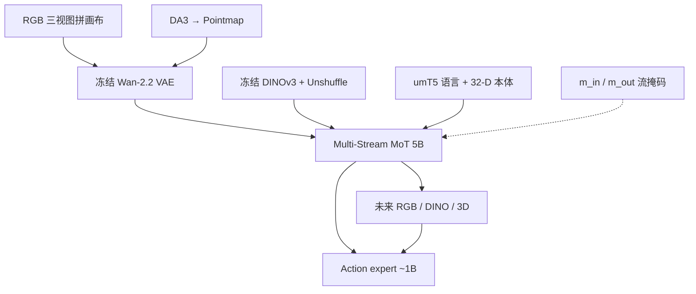

# Flex-π（Multi-Stream WAM · Compute Flexibility · arXiv:2608.10860）

**Flex-π**（*Flex-π: A Multi-Stream World-Action Model with Compute Flexibility*，[arXiv:2608.10860](https://arxiv.org/abs/2608.10860)）由 **华盛顿大学（UW）** 与 **艾伦人工智能研究所（AI2）** 提出（Yan\* / Liu\* / Fan\* / Cai / Liao / Zhang† / Fox†）：在共享 latent 里联合去噪 **RGB · 3D pointmap · DINO 语义 · 动作**，并用流 dropout + cross-modality forcing 让 **一个 checkpoint** 覆盖 action-only 到 full joint 的算力档位。[项目页](https://flex-pi.github.io/) · [代码占位](https://github.com/geyan21/flex-pi)。

## 一句话定义

**几何和语义不必新传感器：冻结视频 VAE 几乎免费吃进 pointmap，再和 DINO 一起训；部署时用掩码选你要的速度–精度点。**

## 英文缩写速查

| 缩写 | 英文全称 | 简要说明 |
|------|----------|----------|
| WAM | World Action Model | 联合未来与动作的策略族；本文为 Joint 多流 |
| MoT | Mixture-of-Transformers | 多流共享 trunk、分模态 FFN；5B 视觉 + ~1B 动作专家 |
| VAE | Variational Autoencoder | 冻结 Wan-2.2；RGB 与 pointmap **共用** |
| DINO | Self-Distillation with No Labels | 冻结 DINOv3 物体语义 token 流 |
| CMF | Cross-Modality Forcing | 输入缺某流仍强制预测其未来 |
| DA3 | Depth Anything 3 | 离线从 RGB 提 metric depth → pointmap |
| FM | Flow Matching | 视觉/动作去噪目标；DINO 流改用 x-prediction |

## 为什么重要

- **把 DreamWAM 式「训练多视图」推到可部署多组合：** 推理仍可只出动作，也可读 3D/语义未来；同一权重覆盖 **56** 种输入/输出流组合（7 种非空输入子集 × 8 种输出子集）。
- **算力柔性是产品接口：** action-only ~**60 ms**（快于 π0.5）；full joint ~**193 ms** 换更高成功率（RTX 5090，K=4 Euler）。
- **真机精密双臂增益大：** self-repair / soft-bag 等接触丰富任务相对最强基线最高约 **2–7×**；几何来自离线 DA3，推理不必带深度相机。

## 核心信息

| 项 | 内容 |
|----|------|
| **机构** | 华盛顿大学（UW）；艾伦人工智能研究所（AI2） |
| **规模** | ~6B（5B 视觉 MoT trunk + ~1B action expert） |
| **预训练** | Wan-2.2-5B 初始化；AGIBOT World-Beta ~**500 h** / 100 任务 |
| **本体** | 真机双臂 **YAM**（2×6-DoF + 夹爪；头 ZED 2i + 双腕 ZED Mini） |
| **开源** | **代码待发布**（GitHub 仅 README；截至 2026-08-13 复核仍无训练入口） |
| **源码运行时序图** | **不适用**（无可运行实现） |

## 核心原理

### 三视觉流 + 动作专家

| 流 | 编码 | 角色 |
|----|------|------|
| RGB \(z^o\) | 冻结 Wan-2.2 VAE | 外观与视频先验 |
| Pointmap \(z^p\) | **同一** VAE | 3D 几何；论文报重建 PSNR **31.1 dB**、归一化 MSE \(3.1{\times}10^{-3}\)、\(z\)-RMSE **4.9 cm** |
| DINO \(d\) | 冻结 DINOv3 + PixelUnshuffle \(2{\times}2\)（\(768\to 3072\)） | 物体语义；token 数降 4× |
| Action | 较窄 expert（\(d_a{=}1024\)），从 Wan 权重 resample 初始化 | 控制输出；视觉永不反向注意动作 |

中间 **16/30** MoT block 做跨流注意力；早期编码与晚期解码保持流内。语言走冻结 **umT5**，本体感觉 \(s_t\) 线性投到同一条件序列。动作 chunk \(H{=}32\)（33 步窗口）；RGB/pointmap 步长 4 抽成 9 帧，VAE 时间压缩为 **3** 个 latent 帧。

### 柔性训练：dropout 不是 loss mask

独立采样 \(\mathbf{m}^{\mathrm{in}}\) / \(\mathbf{m}^{\mathrm{out}}\)（每流 Bernoulli 0.5，至少保留一流输入）。**\(\mathbf{m}^{\mathrm{out}}\) 不是 loss mask**——所有未来流始终算 flow matching；它只决定动作读哪些未来、未来流之间如何互看。缺输入仍预测该模态未来 = **cross-modality forcing**：RoboTwin 消融去掉 CMF 成功率掉约 **21 pt**（项目页相对增益约 **+47%**）。DINO 头用 x-prediction（预测干净特征再转成速度），因折叠后维数接近 trunk 宽度。

训练目标（各 \(\lambda{=}1\)）：\(\mathcal{L}=\lambda_a\mathcal{L}^{\mathrm{FM}}_a(a_t)+\sum_{i\in\{o,d,p\}}\lambda_i\mathcal{L}^{\mathrm{FM}}_i(i_{t+1})\)。

### 流程总览

## 源码运行时序图

**不适用。** 截至 2026-08-13 复核，[geyan21/flex-pi](https://github.com/geyan21/flex-pi) 仓内仅 `README.md`（The code is ready soon），无训练 / 推理脚本或权重。

## 工程实践

| 项 | 建议读法 |
|----|----------|
| 部署档位 | 默认先跑 **action-only**；难任务再开 joint 未来。掩码是运行时参数，不是两个模型 |
| 传感器 | 训练用 RGB→DA3/DINO 离线；推理可无 3D 输入。真机有立体深度，但主张增益来自联合表征而非测试时深度 |
| 延迟前沿 | 5090 上 ~60 ms vs ~193 ms（action-only vs full joint，K=4）；真机整 chunk 开环 32 步后再规划（约 1.07 s） |
| 微调代价 | 真机任务至少 **10 epoch** 才收敛（多流 + CMF 比单流慢） |
| 开源跟进 | Watch [geyan21/flex-pi](https://github.com/geyan21/flex-pi) |
| 对照协议 | 真机与 π0.5、ManiFlow、Fast-WAM **同数据**对照；演示量按最小基线 ManiFlow 调到能做再公平比 |

## 实验与评测

| 设定 | Flex-π 读点 |
|------|-------------|
| 真机 ID avg（full / action-only） | **83.0% / 76.4%**（ManiFlow 58.0，π0.5 52.1，Fast-WAM 31.7） |
| 真机 OOD avg | **76.1% / 70.8%**（ManiFlow 31.5，π0.5 43.2） |
| Self-Repair / Soft-Bag | full joint **76.0 / 70.0** vs ManiFlow **33.3 / 31.9**；拧螺丝阶段 55% vs ManiFlow 5% |
| 50% 数据 Put Plate | full joint **95%** 仍高于全数据基线 |
| RoboTwin 50 任务 | 两模式均为 **94.6%**；有限演示约 **1.9–4.5×** 最强对照 |
| LIBERO | 柔性 ckpt full joint **98.5%**；固定模式 Flex-π* **99.2%**（与 Qwen-RobotManip 持平） |
| LIBERO-Plus Total | full joint **80.9%** / action-only **78.3%**（π0.5 **84.7**，Qwen **91.4**，Fast-WAM **65.3**） |

RoboTwin 五任务消融（50 demo）：RGB-only 加 DINO **+6.8 pt**，再加点图 **+20 pt**；同一 ckpt、RGB 输入下 action-only **40.2% @ 60 ms** → 加视频 **60.4%** → 全流 **63.8% @ 193 ms**。

## 结论

**Flex-π 证明：WAM 的增益可以来自「多流联合预测 + 部署掩码」，而不必在推理时永远付出 full video 成本；几何先验可以借用 RGB VAE，而不是新传感器或新编码器。**

1. **先看 action-only 是否已超过 π0.5** — 真机五任务均已赢，再决定是否加 joint（平均再 +13% 相对成功率、约 3× 延迟）。
2. **几何/语义是训练税，不是传感器税** — pointmap 走共享 VAE；DINO 冻结；DA3 只在标注期。
3. **CMF 不要当可选项砍掉** — 它强迫共享表征互预测，而不只是缺模态鲁棒。
4. **LIBERO 已饱和，主表读真机精密任务与 OOD** — 99.2% 是拟合上限；LIBERO-Plus 仍落后强 VLM 骨干的 π0.5 / Qwen。
5. **选型坐标：** 要算力柔性多流 → Flex-π；要失败后果 → [FACT](./paper-fact.md)；要 beyond-RGB 但部署 RGB-only 固定配方 → [DreamWAM](./paper-dreamwam.md)；要训练期 4D、推理零几何 → [MECo-WAM](./paper-meco-wam-4d-geometry-cotraining.md)。

## 局限与风险

- **代码与权重待发布**（2026-08-13 复核仓 size=1、仅 README）；数字以论文/项目页为准，暂不可本地复现。
- 仍需大量演示；joint 与最低延迟不可同得。
- 多流 + CMF 拉长微调；LIBERO-Plus 显示强语义骨干与更大数据仍是短板。
- 评测主轴为桌面双臂操纵，未覆盖全身 loco-manip。

## 与其他工作对比

| 工作 | 关系 |
|------|------|
| [DreamWAM](./paper-dreamwam.md) | 同为多视图未来；DreamWAM 推理**固定关** beyond-RGB，Flex-π **保留可选**流组合 |
| [MECo-WAM](./paper-meco-wam-4d-geometry-cotraining.md) | 同为几何共训；MECo 推理撕掉 4D 专家，Flex-π 把 3D 做成可开关生成流 |
| [FACT](./paper-fact.md) | 改失败数据用法与因果序；Flex-π 改监督模态与部署算力接口 |
| [Kairos](./paper-kairos-native-world-model-stack.md) | 同属 MoT Joint WAM；Kairos 强调 CEDC / regret 与已开源 4B 栈 |
| Fast-WAM / DreamZero / LingBot-VA | RGB latent WAM 基线；Flex-π 加 3D/DINO 与柔性掩码 |
| π0.5 | 强 VLA 对照；Flex-π action-only 更快且真机更高，LIBERO-Plus 仍落后 |
| ManiFlow | 显式 3D 输入基线；OOD 掉点更大（约 −26.7 vs Flex-π −4.7） |
| [PointDiT](./paper-pointdit.md) | 同吃 3D pointmap：PointDiT 在像素空间扩散估几何（无 VAE）；Flex-π 借用冻结 Wan VAE 把点图当训练流 |

## 关联页面

- [World Action Models](../concepts/world-action-models.md)
- [生成式世界模型](../methods/generative-world-models.md)
- [DreamWAM](./paper-dreamwam.md)
- [FACT](./paper-fact.md)
- [MECo-WAM](./paper-meco-wam-4d-geometry-cotraining.md)
- [VLA](../methods/vla.md)
- [操纵任务](../tasks/manipulation.md)
- [LIBERO](./libero-benchmark.md)
- [动作后果分类 01](../overview/wm-action-consequence-category-01-wam-action-prediction.md)
- [Rift](./paper-rift-wam.md)
- [PointDiT](./paper-pointdit.md) — 像素空间点图扩散；对照「VAE 吃 3D」vs「数据空间估 3D」

## 参考来源

- [论文归档](../../sources/papers/flex_pi_arxiv_2608_10860.md)
- [仓库归档](../../sources/repos/flex-pi.md)
- [项目页归档](../../sources/sites/flex-pi-github-io.md)

## 推荐继续阅读

- 项目页真机表、56 流组合与速度–精度前沿：<https://flex-pi.github.io/>
- 论文 HTML（方法、附录架构与完整表）：<https://arxiv.org/html/2608.10860>
- 占位仓（watch 代码发布）：<https://github.com/geyan21/flex-pi>
