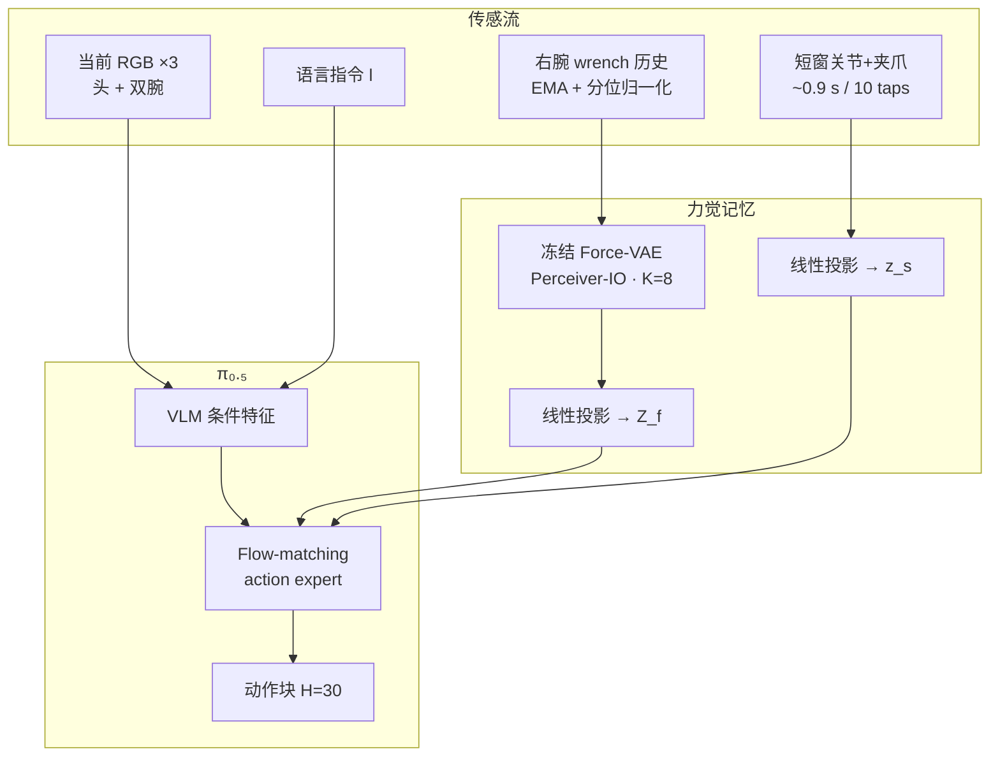

# FM-VLA（Force-based Memory for Vision-Language-Action Models）

**FM-VLA**（arXiv:[2607.18231](https://arxiv.org/abs/2607.18231)，[项目页](https://qft-333.github.io/FM-VLA-Page/)，[代码占位](https://github.com/qft-333/FM-VLA)；清华大学 / 微软研究院 / 复旦大学 / 中国科学技术大学）在 **π₀.₅** 上引入 **力觉（wrench）长程记忆**：用预训练并冻结的 **Perceiver-IO VAE** 将整集腕部六轴力/力矩压缩为紧凑 **力记忆 token**，再与 **短窗本体状态 token** 一并挂到 flow-matching **action expert** 后缀，使策略能在视觉几乎不变的重复接触中 **计数与跟踪进度**。

## 一句话定义

用 **任务无关 Force-VAE** 把高噪声、高频率的接触力历史压成少量 token，作为 VLA 的 **轻量非视觉记忆**，专门解决「画面看不出、力上却很清楚」的非马尔可夫接触操作。

## 英文缩写速查

| 缩写 | 英文全称 | 简要说明 |
|------|----------|----------|
| FM-VLA | Force-based Memory VLA | 本文力觉记忆增强的 VLA |
| VLA | Vision-Language-Action | 视觉-语言-动作多模态策略 |
| VAE | Variational Autoencoder | 力序列重建预训练的压缩编码器 |
| F/T | Force/Torque | 腕部六轴力/力矩传感 |
| EMA | Exponential Moving Average | 力信号因果一阶平滑 |
| MEM | Multi-scale Embodied Memory | 视觉记忆基线（本文重实现为 π-MEM） |
| RoPE | Rotary Position Embedding | 保持 noisy-action token 预训练位置 |

## 为什么重要

- **补上「力=瞬时条件」的缺口：** ForceVLA / TA-VLA 等改善当前接触细节，但不积累「已按几次」；FM-VLA 把 wrench 当作 **episode 级事件记忆**。
- **视觉记忆的盲区：** 按键行程极小、擦拭/杯子复位后外观还原时，MemoryVLA / MEM 类帧记忆 **贵且易失效**；力尖峰对接触次数更直接。
- **工程可负担：** 相对 π₀.₅ 仅 **+3.3 ms**（RTX 4090），而 π-MEM（K=5/16）约 **+39 / +129 ms**。
- **与稀疏视觉记忆正交：** [KEMO](./paper-kemo-event-driven-keyframe-memory-vla.md) / [EventVLA](./paper-eventvla-visual-evidence-memory.md) 记 **可见状态转移**；FM-VLA 记 **接触物理事件**——选型时应先问「阶段变化看不看得见」。

## 核心信息

| 项 | 内容 |
|----|------|
| 机构 | 清华大学、微软研究院、复旦大学、中国科学技术大学 |
| 骨干 | **π₀.₅**（PaliGemma + SigLIP + flow-matching）；OpenPI 公开权重 + 智元 Challenge 再预训练 |
| 平台 | 智元 **AgiBot G1** 双臂；腕部 6 轴 F/T @100 Hz；头+双腕 RGB |
| 任务 | Cups / Buttons / Wipe（每任务 18 trials；Buttons/Wipe 的 $N\in\{1,2,3\}$） |
| 主指标 | 平均成功率 **83.3%**（基线最高视觉记忆 **53.7%**） |
| 开源（2026-07-27） | **宣称将开源**：GitHub 占位，「Code will be released soon」 |

## 流程总览

## 核心原理（方法）

### 1）问题形式

策略为 $\pi(a_t\mid o_t,l,h_t)$，其中历史

$$
h_t=\big[\mathrm{Enc}_\phi(\{f_\tau\}_{\tau=1}^{t})\;\|\;\mathrm{Proj}_\psi(\{s_\tau\}_{\tau=t-W+1}^{t})\big]
$$

- $f_\tau\in\mathbb{R}^6$：右腕力/力矩；
- $s_\tau$：双臂关节 + 夹爪（双臂例 $d_s=16$）；
- $\mathrm{Enc}_\phi$：冻结 VAE → $K$ 个力 token；$W$ 窗 → 单状态 token。

### 2）Force-VAE 与预处理

| 步骤 | 做法 |
|------|------|
| 平滑 | 因果 EMA，$\alpha=0.3$（30 Hz 下采） |
| 防捷径 | 训练时随机噪声前缀（≤~10 s），避免用长度猜进度；推理关闭 |
| 结构 | Perceiver-IO；$K=8$；$d_z=96$；Fourier 位置编码 |
| 损失 | 掩码重建 + free-bits 正则 KL；全任务 inverse-frequency 共训 |
| 微调 | 编码器冻结，仅用后验均值；零初始化投影到 action-expert 隐宽 |

### 3）Token 注入

Action expert 序列：`[noisy-action × H] ‖ [力记忆 × K] ‖ [状态 × 1]`，力/状态放在 **后缀**，noisy-action 的 RoPE 与预训练一致。默认 $H=30$，$K=8$。

### 4）两阶段训练

1. **Stage 1：** Force-VAE 力序列重建（~100k steps）。
2. **Stage 2：** 冻结 VAE；联合微调 VLM、action expert、两投影头；rectified-flow 速度匹配；50k steps、batch 32、8×A100。

## 源码运行时序图

**不适用**（截至 **2026-07-27**：官方仓 [`qft-333/FM-VLA`](https://github.com/qft-333/FM-VLA) 仅为占位 README + demo 媒体，无可辨识训练/推理入口；见 [`sources/repos/fm-vla.md`](../../sources/repos/fm-vla.md)）。

## 实验与评测

### 主结果（成功率 %，18 trials/任务）

| Method | Cups | Buttons | Wipe | Average |
|--------|------|---------|------|---------|
| π₀.₅（无历史） | 72.2 | 11.1 | 0.0 | 27.8 |
| TA-VLA（短窗力） | 50.0 | 11.1 | 5.6 | 22.2 |
| π-MEM（视觉记忆） | 77.8 | 33.3 | 50.0 | 53.7 |
| Force only | 55.6 | 0.0 | 22.2 | 25.9 |
| State only | 100.0 | 11.1 | 11.1 | 40.7 |
| FM-VLA（GRU） | 55.6 | 38.9 | 5.6 | 33.3 |
| FM-VLA（Q-Former） | 100.0 | 16.7 | 55.6 | 57.4 |
| **FM-VLA（VAE）** | **100.0** | **72.2** | **77.8** | **83.3** |

### 推理延迟（RTX 4090）

| Method | Latency (ms) | Δ vs base |
|--------|--------------|-----------|
| π₀.₅ | 60.7 | — |
| π-MEM (K=5) | 99.8 | +39.1 |
| π-MEM (K=16) | 190.0 | +129.3 |
| **FM-VLA** | **64.0** | **+3.3** |

成功判据：完成指令指定次数并稳定终止（夹爪张开、约 3 s 无运动）；Buttons 以可听 click 计数，Wipe 要求满幅不中断接触。

## 工程实践

| 项 | 实践要点 |
|----|----------|
| 传感 | 腕部 **6 轴 F/T** 是硬前置；无力传感时本方法不适用 |
| 通道 | 论文主用 **右腕** wrench；策略侧 **30 Hz** + EMA |
| $K$ | **8** 为经验甜点；过大 token 会冲击 π₀.₅ 动作专家容量先验 |
| 短状态窗 | **必配**：仅力记忆易在接触前重复乱动 |
| 初始化 | 投影层 **零初始化**，早期近似原 π₀.₅ |
| 对照复现 | 公平后训练：同 demo、同 LR/WSD、同 image dropout $p=0.4$ |
| 开源 | **待发布**；选型勿按「可立即复现」排期 |

## 结论

**当任务进度写在接触力历史上、而不是画面上时，轻量 Force-VAE 记忆比视觉帧记忆更准也更便宜；力与短状态必须一起用，VAE 预训练压缩优于端到端 GRU/Q-Former。**

1. **读表优先看 Buttons/Wipe** — 视觉几乎不变的计数任务上，FM-VLA 相对 π-MEM / TA-VLA 拉开最大差距。
2. **短窗力 ≠ 长程记忆** — TA-VLA 平均 22.2%，说明「当前力」解决不了「已发生几次」。
3. **模态互补** — Force-only 25.9%、State-only 40.7%，合成才到 83.3%。
4. **压缩目标要对** — 重建预训练迫使 latent 编码幅值/起止/接触次数，而非瞬时尖峰过拟合。
5. **延迟预算友好** — +3.3 ms 量级，适合真机实时；视觉多帧记忆成本陡升。
6. **部署边界** — 需要可靠 F/T；超长程数百次接触可能需分层/自适应压缩；代码仍 coming soon。

## 局限与风险

- **固定 8-token 瓶颈** 对极长接触序列可能不够。
- **VAE 域窄**：仅在本任务 demo 力数据上训；跨机器人/传感器迁移未验证。
- **硬件依赖**：无腕部 F/T 则路线不可用；力标定与噪声会影响计数。
- **开源未落地**：截至入库日仅有 demo 媒体；工程复现需等官方实现。
- **任务面窄**：三项桌面双臂接触计数/搜索；未覆盖大规模开放词汇泛化主张。

## 与其他工作对比

| 路线 | 记什么 | 典型代表 | 相对 FM-VLA |
|------|--------|----------|-------------|
| 视觉稀疏关键帧 | 可见状态转移 | [KEMO](./paper-kemo-event-driven-keyframe-memory-vla.md)、[EventVLA](./paper-eventvla-visual-evidence-memory.md) | 画面有阶段变化时优先；视觉模糊计数时 FM-VLA 更对症 |
| 全历史 SSM 策略 | 轨迹级相位状态 | [Chronos](./paper-chronos.md) | 紧凑专用策略 + 二阶动作桥；非挂到 π 系的力/视觉记忆模块 |
| 视觉稠密/多尺度 | 帧或语言摘要 | MemoryVLA、MEM / π-MEM | 更贵；Buttons 上仍明显落后 |
| 短窗力/触觉条件 | 瞬时接触 | TA-VLA、ForceVLA、[FWBC-VLA](./paper-fwbc-vla.md) | 改善接触细控或机身稳定，不解决长程事件计数 |
| Fast-weight / TTT | 压缩进权重 | RoboTTT 等 | 另一记忆介质；与力通道正交 |

## 关联页面

- [Manipulation](../tasks/manipulation.md) — 桌面/双臂操作与记忆依赖任务语境
- [Contact-Rich Manipulation](../concepts/contact-rich-manipulation.md) — 接触力作为任务状态
- [VLA](../methods/vla.md) — 记忆增强与力模态子路线
- [π₀.₇ Policy](../methods/pi07-policy.md) / [π₀ Policy](../methods/π0-policy.md) — π 系 flow-matching 骨干
- [Action Chunking](../methods/action-chunking.md) — $H=30$ 动作块
- [KEMO](./paper-kemo-event-driven-keyframe-memory-vla.md) — 事件关键帧视觉记忆（π₀.₅）
- [EventVLA](./paper-eventvla-visual-evidence-memory.md) — 学习式视觉关键帧记忆 + RoboTwin-MeM
- [Chronos](./paper-chronos.md) — 全历史 SSM + IMLE/二阶桥的紧凑记忆策略（arXiv:2606.30318）

## 参考来源

- [fm_vla_arxiv_2607_18231.md](../../sources/papers/fm_vla_arxiv_2607_18231.md)
- [fm-vla-page.md](../../sources/sites/fm-vla-page.md)
- [fm-vla.md](../../sources/repos/fm-vla.md)

## 推荐继续阅读

- Li et al., *FM-VLA: Force-based Memory for Vision-Language-Action Models in Contact-Rich Manipulation* — <https://arxiv.org/abs/2607.18231>
- [FM-VLA 项目页](https://qft-333.github.io/FM-VLA-Page/) — 真机视频与结果表
- Physical Intelligence, *π₀.₅* — <https://arxiv.org/abs/2504.16054>（微调骨干）
- Zhang et al., *TA-VLA* — <https://arxiv.org/abs/2509.07962>（短窗力矩条件对照）
- Torne et al., *MEM* — <https://arxiv.org/abs/2603.03596>（视觉多尺度记忆对照）
