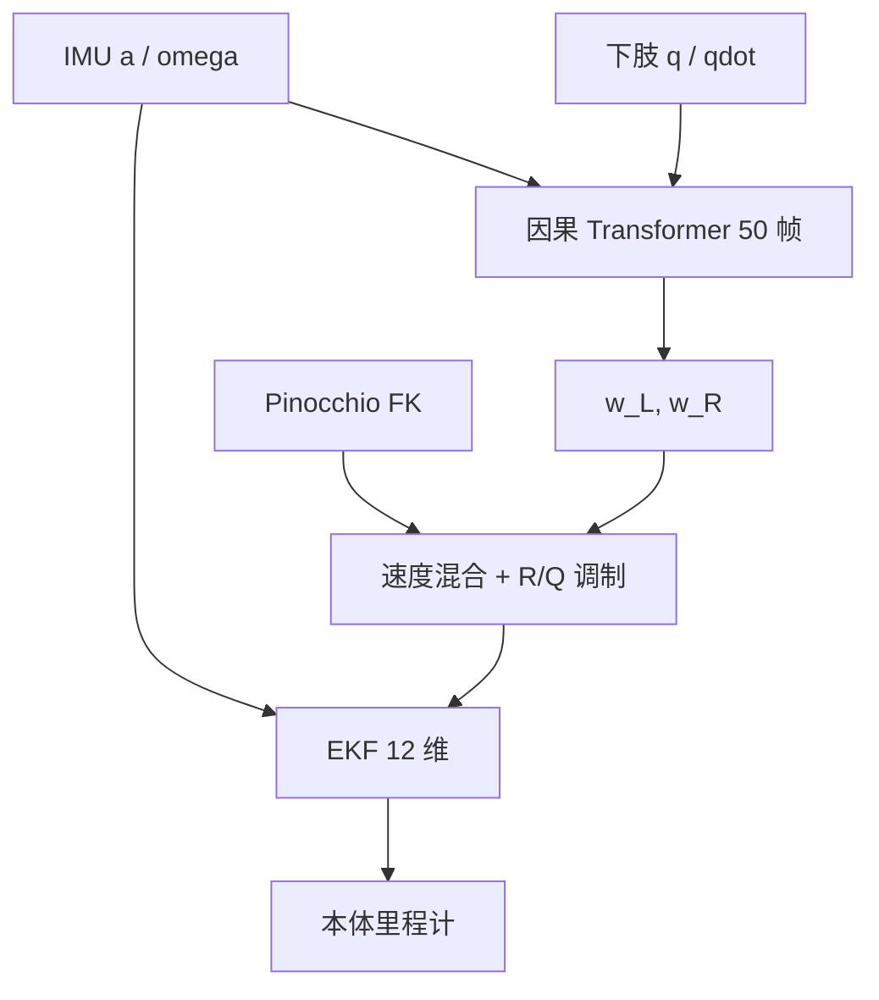

# FOCUS：连续足部置信度的人形本体里程计

**FOCUS**（*Foot Observation Confidence for Robust Humanoid Proprioceptive Odometry*；方法全称 **Foot Observation Confidence from Unannotated Simulation**，[arXiv:2609.02222](https://arxiv.org/abs/2609.02222)）由 **武汉大学（WHU）** 与 **智元机器人（AgiBot）** 提出：在接触辅助 EKF 里，用 **每只脚的连续 FK 可靠度** \(w_L,w_R\in[0,1]\) 代替「整脚接触 / 不接触」硬开关。网络只在仿真里用自动信号训练，部署只吃 **IMU + 下肢关节**，面向力矩估计不可靠的硬件。真机平台是 **A3 Ultra**（174 cm / 60 kg），**不是** Unitree G1。

## 一句话定义

**脚在地上，不代表这只脚的正运动学速度还能当可靠观测。**

## 英文缩写速查

| 缩写 | 英文全称 | 简要说明 |
|------|----------|----------|
| FOCUS | Foot Observation Confidence from Unannotated Simulation | 本文：无人工连续标签的足部 FK 可靠度 |
| FK | Forward Kinematics | 由关节角推足端位姿/速度 |
| EKF | Extended Kalman Filter | 保留的模型侧滤波器；网络不直接输出里程计 |
| ATE | Absolute Trajectory Error | 水平面轨迹 RMSE |
| ONNX | Open Neural Network Exchange | 部署的 693k 可靠度头 |
| IMU | Inertial Measurement Unit | 骨盆惯性；与关节组成 30 维输入 |

## 为什么重要

- 走路拉长接触误差，舞蹈/踢腿带来拖趾、部分支撑、快速摆动和打滑——二值门控无法表达「在接触但 FK 不可信」。
- 网络 **不替换** 度量 FK 与 EKF，只调节信任：比端到端位移网络更好解释，也比手调力矩阈值更抗标定误差。
- 19 段真机走路（五台同构机、1.51 km）ATE **2.634→0.768 m（−70.8%）**；学二值接触的对照反而到 6.125 m。

## 核心信息

| 项 | 内容 |
|----|------|
| **机构** | 武汉大学（WHU）；智元机器人（AgiBot） |
| **平台** | AgiBot A3 Ultra ×5；外感知仅作评测真值（走路 LiDAR / 动态 MoCap），**不进估计器** |
| **训练** | Isaac Lab 冻结运动跟踪策略回放；5420 / 1151 条；约 51.65 h @ 50 Hz |
| **开源** | **确认未开源**（无项目页、无官方仓；截至 2026-09-04） |

**易混：** [StefanoFerraro/FOCUS](https://github.com/StefanoFerraro/FOCUS) 是 2023 物体中心世界模型，**不是** 本页里程计。站内另有 [FocusNav](./paper-notebook-focusnav.md) 导航占位页，亦无关。

## 核心原理

EKF 状态 12 维：世界系基座位姿速度 + 左右足位置；姿态由骨盆 IMU 四元数当测量输入，**不估姿态偏差或 IMU bias**。每只脚的静止约束给出

\[\mathbf{v}_{B,i}^{G,\mathrm{FK}}=-\mathbf{R}_{GB}(\boldsymbol{\omega}_B^B\times\mathbf{p}_{f_i,\mathrm{FK}}^B+\mathbf{v}_{f_i,\mathrm{FK}}^B).\]

可靠度同时做两件事：

1. **协方差放大** \(R=R_0[1+(1-w)S]\)（实验 \(S_{\mathrm{vel}}=100,S_p=1000,S_h=S_q=100\)）；
2. **速度混合** \(\tau=\min(1,2.5w)\)，\(z_v=(1-\tau)\hat{v}_{\mathrm{IMU}}+\tau v_{\mathrm{FK}}\)。

因果 Transformer：每帧 30 维（加速度 3 + 陀螺 3 + 下肢 \(q,\dot q\) 各 12），窗长 \(T=50\)（1 s @ 50 Hz），4 层 4 头，最后 token 出双 sigmoid。训练主损失是加权 FK 速度与仿真真值速度的一致性，外加 0.3× 仿真接触 BCE——**没有人工连续可靠度标签**。部署去掉力矩通道。

### 流程总览

## 源码运行时序图

**不适用** — 截至 **2026-09-04** 无可运行官方代码。

## 工程实践

| 项 | 建议 |
|----|------|
| 不要先学二值接触 | 同数据 NN-binary 真机 ATE 6.125 m，差过手调阈值 |
| 连续权重要保留混合 | 只改协方差（cov-only）0.902 m，完整 FOCUS 0.768 m |
| 硬阈值连续权重 | 在 0.5 切开得到 0.802 m，仍不如软混合 |
| 算力 | 693,768 参数；i7-13700K 单线程 1.62 ms，50 Hz 约占 8.1% 单核 |
| 评测对齐 | 走路用逐段 yaw+平移对齐；动态用归一化时间 + 最佳 yaw；**不做尺度校正** |

## 实验与评测

对照：力矩阈值门控、Pronto、CoCo-InEKF、Legolas（四足出身，人形存在形态域差）。学习基线只在 Isaac 训练划分裂上重训。

| 设置 | 阈值 ATE | FOCUS ATE | 读法 |
|------|----------|-----------|------|
| 仿真走路 20 ep | 1.016 m | **0.166 m** | −83.7%；漂移 5.47%→0.73% |
| 仿真动态 20 ep | **0.382 m** | 0.711 m | 阈值 ATE 更低；FOCUS 幅度/频谱比更接近 1 |
| 真机走路 19 段 | 2.634 m | **0.768 m** | −70.8%；Wilcoxon \(p<10^{-5}\) |
| 真机四套路 | 0.947 m | **0.542 m** | −42.7%；Pronto 次之 0.605 m |

 Charleston 139,013 帧上，可靠度与 FK 足高 / 六关节速度幅值的 Spearman 为 **−0.608 / −0.663**，与抬脚和快速运动时降权一致。

## 结论

**该学的是「这只脚的 FK 速度现在值多少」，不是「这只脚算不算接触」。**

1. **接触只是间接线索** — 部分支撑和打滑会让接触为真、FK 为假。
2. **保留 EKF，只调信任** — 度量尺度仍由 Pinocchio + 滤波承担。
3. **不要部署学到的硬接触** — NN-binary 在真机走路上崩掉。
4. **走路看 ATE，原地动态还要看幅度/频谱** — 净位移小时 ATE 会偏袒「几乎不动」的估计。
5. **无力矩输入是为了抗电流标定** — 适合力矩通道脏的人形。
6. **未开源** — 数字可引用，栈不可复现。

## 与其他工作对比

| 对照 | 差异读法 |
|------|----------|
| 力矩阈值 / Pronto | 整脚硬门控；FOCUS 连续混合 |
| CoCo-InEKF | 学接触协方差，**不改** FK 观测本身；FOCUS 先按可靠度改观测再调 \(R\) |
| Legolas / 端到端 IO | 网络承担度量里程计；FOCUS 网络只出权重 |
| [X-IONet](./paper-x-ionet-cross-platform-inertial-odometry.md) | 单 IMU、行人/四足；FOCUS 是人形腿式 FK+IMU |
| [WM-LOCO](./paper-wm-loco.md) | 视觉落脚策略；FOCUS 是本体估计，平台也不同 |

## 局限与风险

- **A3 Ultra 专用标定腿模** — 换机需重做 URDF / 踝滚足坐标系。
- **仿真动态 ATE 不是全面领先** — 作者改用保真度指标解释。
- **未来工作写了在线自适应** — 当前模型冻结，未见地形在线更新。
- **名称碰撞** — 检索 FOCUS 会命中无关世界模型仓。

## 关联页面

- [EKF](../formalizations/ekf.md)
- [接触估计](../concepts/contact-estimation.md)
- [里程计与激光融合](../methods/lidar-odometry-fusion.md)
- [状态估计枢纽](../overview/hub-state-estimation.md)
- [X-IONet](./paper-x-ionet-cross-platform-inertial-odometry.md)
- [WM-LOCO](./paper-wm-loco.md) / [Safe-Stop](./paper-safe-stop-humanoid.md)
- [三篇阅读坐标](../overview/g1-foothold-safe-stop-focus-technology-map.md)

## 参考来源

- [focus_foot_observation_confidence_arxiv_2609_02222](../../sources/papers/focus_foot_observation_confidence_arxiv_2609_02222.md)

## 推荐继续阅读

- [arXiv:2609.02222](https://arxiv.org/abs/2609.02222) / [HTML](https://arxiv.org/html/2609.02222)
- Hartley et al., *Contact-aided invariant EKF* — 接触辅助滤波基线
- Baumgartner et al., *CoCo-InEKF*（[arXiv:2605.15122](https://arxiv.org/abs/2605.15122)）— 学接触协方差的近邻
