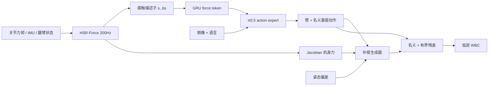

# FWBC-VLA：无传感器接触感知的全身补偿

**FWBC-VLA**（*Force-Aware Whole-Body Compensation for Contact-Rich Loco-Manipulation*，[arXiv:2609.03889](https://arxiv.org/abs/2609.03889)）由 **浙江大学**、**上海人工智能实验室**、**清华大学**、**北京中关村学院**、**云深处科技**、**浙江科技学院** 的 Yutian Zhang、Siyuan Ma、Dong Wei、Qiaojun Yu、Dibo Hou 等提出：接触丰富的轮足 loco-manipulation 需要把 **任务级 VLA 动作** 和 **机身级稳定** 用同一条物理反馈连起来。现成 VLA 只出语义动作、不懂接触演化；WBC 能稳住，但分不清任务力和扰动；腕部 F/T 改装贵、许多平台也装不上。作者用 **HSR-Force** 从本体力矩估无传感器残差，编成 force token 注入 π₀.₅ 动作专家，同时用机身投影力 + IMU 偏差生成有界底盘补偿，再交给低层 WBC。

## 一句话定义

**没有力传感器，也能把「接触开始 / 持续加载 / 松开」同时喂给 VLA 和底盘补偿，而不是只给手臂加一条力通道。**

## 英文缩写速查

| 缩写 | 英文全称 | 简要说明 |
|------|----------|----------|
| FWBC | Force-Aware Whole-Body Compensation | 本文的力感知全身补偿框架 |
| VLA | Vision-Language-Action | 任务级视觉语言动作策略（本文骨干为 π₀.₅） |
| HSR-Force | History-State Residual Force Estimator | 双 LSTM + 固定门的无传感器残差估计 |
| WBC | Whole-Body Control | 低层平衡与指令跟踪，不区分任务力 |
| FI / BC | Force-aware Interface / Body Compensation | 消融里的力接口与底盘补偿两支 |
| EE | End-Effector | 末端；残差经 Jacobian 投到 EE / 机身 |

## 为什么重要

- 轮足+臂比人形更稳、比纯轮式更能过地形，但末端力会沿臂传到机身；只做臂中心力觉会漏掉这条耦合。
- 把「无 F/T」写成可部署接口，而不是再买一只六维力传感器。
- 消融把贡献拆开：**力接口改操作相位，底盘补偿改持续高载**（带闭门器推门、擦白板）。

## 方法

| 项 | 内容 |
|----|------|
| **机构** | 浙江大学、上海人工智能实验室、清华大学、北京中关村学院、云深处科技、浙江科技学院 |
| **平台** | 云深处 M20S 轮足 + CM1 6-DoF 臂 + 1-DoF 夹爪；三路 RealSense D435i |
| **骨干** | 预训练 π₀.₅ **全参微调**；策略 15 Hz，估计器 200 Hz |
| **数据** | WL&Arm >5000 条 Pico 混合位/力遥操作（力意图只作元数据） |
| **开源** | **确认未开源**；数据集宣称将公开，入库日无 URL |

### 流程总览

### 核心原理

1. **残差不是标定力。** \(\tau^{\mathrm{meas}}=\tau_{\mathrm{free}}+\tau_{\mathrm{ext}}+\epsilon\)。HSR-Force 估自由运动力矩，相减得到六维关节残差；下游才用阻尼最小二乘 Jacobian 得到 EE / 机身 wrench **代理**。
2. **双专家 + 固定门。** History 专家吃力矩历史，自由运动噪声更低；State 专家不看力矩历史，持续接触不容易被「学成动力学」。\(\alpha_t\) 按 state 残差范数在两者间插值。
3. **接触描述子很瘦。** \(d^{\mathrm{int}}=[s_t,\Delta s_t]^\top\)：强度 + 局部趋势，用来区分加载与松开。\(K=13\)（约 60 ms）按 **latest-before-query** 对齐到 15 Hz VLA，禁止用未来力。
4. **力只进动作专家。** Cross-attention 把 force token 加到 action hidden，再出 flow velocity；视觉语言前缀不动，也不另训接触分类头。
5. **补偿在 VLA 外面。** MLP 吃机身力代理、IMU 相对自由运动参考的姿态/角速度、名义基座命令，回归 \((\Delta v_x,\Delta v_y,\Delta\omega_z)\)，\(\tanh\) 限幅后再 deadband / 低通 / 斜率限制。力或 IMU 失效则残差置零。

## 源码运行时序图

**不适用** — 截至 **2026-09-05** 无官方仓库、权重或可运行入口；WL&Arm 仅论文承诺将公开。

## 评测

估计器（Table 1，与 NEXT / GMO-SI / DF-MLP 同残差适配器）：

| 方法 | 零载 Force MAE (N) ↓ | Touch AUC ↑ | Door-phase AUC ↑ |
|------|----------------------|-------------|------------------|
| NEXT | 0.28 | 0.95 | 0.82 |
| GMO-SI | 0.43 | 0.94 | 0.83 |
| DF-MLP | 0.21 | 0.47 | 0.50 |
| **HSR-Force** | **0.15** | **0.97** | **0.85** |

真机分阶段成功率（Table 2，每任务 25 trial；S5 为离开/过门终段）：

| 任务 / 方法 | 无力最强终段 | 有力基线终段 | FWBC-VLA 终段 |
|-------------|--------------|--------------|---------------|
| 擦白板 | OpenPI 0.5 **12%** | ForceVLA **24%** | **64%** |
| 开门（含闭门器） | OpenPI 0.5 **0%** | ForceVLA **12%** | **52%** |

对照含 OpenVLA、StarVLA、π₀.₅、GR00T N1.6、ACP、ForceVLA，以及用真 F/T 的 **FWBC-GT**（擦白板终段 60%、开门 48%，与估计版接近）。闭门器手柄约 **50 N**。擦白板域外污渍比例 1:2。

组件消融（Table 3，四接触关键阶段均值）：

| 变体 | Handle Press | 无闭门器推 | 有闭门器推 | 板擦净 | Avg. |
|------|--------------|------------|------------|--------|------|
| w/o Force | 28 | 12 | 0 | 8 | 12.0 |
| FI only | 52 | 56 | 0 | 32 | 35.0 |
| FWBC-VLA | 60 | 72 | 52 | 76 | **65** |

正文另写加 BC 后均值 59.5；**以表内 65 为准**，读时不要混用。无闭门器推门上 FI 已够，闭门器与擦板才真正吃到 BC。

## 结论

**接触丰富 loco-manipulation 缺的不是更大的 VLA，而是一条能同时改任务动作和机身稳定的因果力通道；无传感器残差在这篇设定里已经够用，接近真 F/T 的 FWBC-GT。**

1. **先分任务力与扰动** — 低层 WBC 不会自己做这件事。
2. **双专家门控是估计器的关键** — 只用 history 会把持续接触吃进动力学；只用 state 自由运动噪声大。
3. **FI ≠ BC** — 力 token 改抓/擦相位；底盘补偿改持续高载。不要只融力、不补机身。
4. **残差是代理不是牛顿** — \(s_t\) 依赖估计器与采样，不能当标定 F/T 用。
5. **读终段不要读接近** — 无力基线也会走到门前，失败发生在加载之后。
6. **复现材料未落地** — 数字可引用，训练/部署不能按论文复跑。

## 工程实践

| 项 | 建议 |
|----|------|
| 适用平台 | 轮足+臂、无力传感器、接触会推机身（擦、推门、带弹簧负载） |
| 同步 | 200 Hz 估计 → 15 Hz 策略，只取 query 时刻之前的 13 帧 |
| 动作空间 | 基座用速度+转向，不要让 VLA 直接出轮腿关节 |
| 安全 | 补偿必须限幅；估计失效回零，保留名义 VLA 命令 |
| 数据采集 | 力意图可以记，但不要泄漏进估计或策略输入 |
| 误用 | 不要把 64%/52% 读成开放词汇家庭机器人；任务就两项 |

## 局限与风险

- **确认未开源** — 无仓、无权重；WL&Arm 仅「将公开」。
- **任务面窄** — 擦白板 + 开门；拾放瓶占数据 41% 但不是主表。
- **估计精度→任务的因果** — 作者自己把「估计误差如何传导到成功率」列为未来工作。
- **表文数字不一致** — 消融均值 65 vs 正文 59.5。
- **人形未验证** — 局限写明下一步才到人形 / 纯轮式。
- **不是替代分层 WBC** — 低层仍负责平衡；本文只在命令空间加有界残差。

## 与其他工作对比

| 对照 | 差异读法 |
|------|----------|
| ForceVLA / ACP | 臂中心 + 真 F/T；本文无传感器，并且补机身补偿 |
| [FM-VLA](./paper-fm-vla.md) | 腕部 F/T 的 **长程记忆**（计数）；本文是 **短窗残差 + 机身稳定** |
| 端到端全身 VLA（WholeBodyVLA 等） | 接触多被视觉/本体隐式吃掉；本文显式共享力接口 |
| [MINERVA](./paper-minerva-libero.md) | 闭集桌面容量下限；本文是真机接触 loco-manip，不是 LIBERO 尺子 |
| 动量观测器 / GMO | 要动力学模型；HSR-Force 用双学习专家替代显式辨识 |

## 关联页面

- [VLA](../methods/vla.md)
- [Loco-Manipulation](../tasks/loco-manipulation.md)
- [Whole-Body Control](../concepts/whole-body-control.md)
- [Contact Estimation](../concepts/contact-estimation.md)
- [Contact-Rich Manipulation](../concepts/contact-rich-manipulation.md)
- [FM-VLA](./paper-fm-vla.md)
- [MINERVA](./paper-minerva-libero.md)

## 参考来源

- [fwbc_vla_arxiv_2609_03889](../../sources/papers/fwbc_vla_arxiv_2609_03889.md)

## 推荐继续阅读

- [arXiv:2609.03889](https://arxiv.org/abs/2609.03889)
- Yu et al., *ForceVLA* — <https://arxiv.org/abs/2505.22159>
