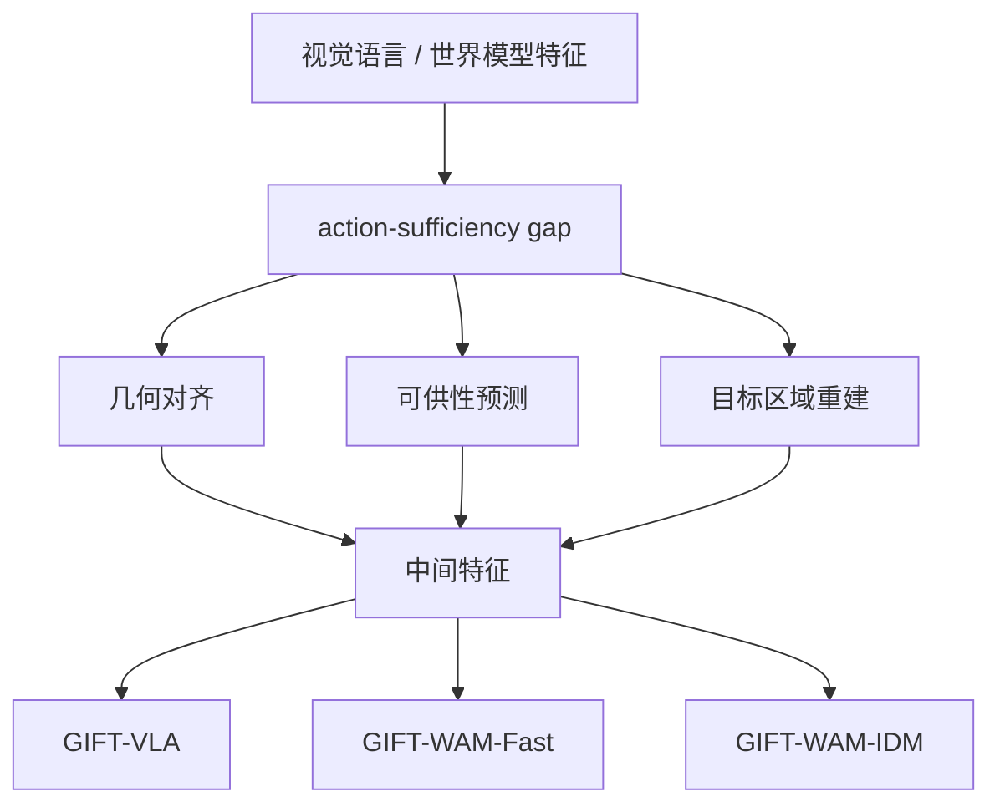

# GIFT：面向动作足够用的中间特征训练

**GIFT**（*Guided Intermediate Feature Training via Action-Oriented Structural Supervision for Robotic Manipulation*，[arXiv:2609.04193](https://arxiv.org/abs/2609.04193)，[项目页](https://openphoenix-team.github.io/GIFT-pages)）由 **中国科学院自动化研究所（CASIA）**、**中国科学院大学（UCAS）**、**新加坡国立大学（NUS）**、**清华大学**、**复旦大学** 等提出：视觉语言预训练与预测式世界模型能提供丰富视觉特征，但其原生目标可能保留控制无关冗余、遗漏关键物理与任务结构——作者称之为 **action-sufficiency gap**。GIFT 把 **几何对齐、可供性预测、目标区域重建** 写成训练约束，并分别接入 **VLA**、**直接动作 WAM** 与 **逆动力学 WAM**。

## 一句话定义

**VLA / WAM 不只需要「看得多」，更需要把中间表征训练成动作足够用的结构。**

## 英文缩写速查

| 缩写 | 英文全称 | 简要说明 |
|------|----------|----------|
| GIFT | Guided Intermediate Feature Training | 本文中间特征监督框架 |
| VLA | Vision-Language-Action | 视觉-语言-动作策略族 |
| WAM | World Action Model | 联合预测未来观测与动作 |
| IDM | Inverse Dynamics Model | 由观测对回归动作的 WAM 变体 |

## 为什么重要

- 纳入 [2026-09-04 九篇盘点](../../sources/blogs/wechat_embodied_station_9_papers_open_source_2026-09-04.md) 的「控制相关表征」支线。
- 同一套结构监督可插到三类骨干，而不是只服务一个模型名。
- 在 LIBERO-Plus 分布转移上给出可比较的百分点增益。

## 方法

| 项 | 内容 |
|----|------|
| **机构** | 中科院自动化所、国科大、新加坡国立大学、清华大学、复旦大学 |
| **监督** | 几何（运动可行性）、可供性（指令相关物体）、目标区域（执行区位） |
| **骨干** | GIFT-VLA / GIFT-WAM-Fast / GIFT-WAM-IDM |
| **开源** | **待发布**（截至 2026-09-04 仅项目页） |

### 流程总览

## 评测

| 变体 | LIBERO-Plus（文内） | 相对基线 |
|------|---------------------|----------|
| GIFT-VLA | **79.6%** | +4.6 pp |
| GIFT-WAM-Fast | **72.6%** | +12.6 pp |
| GIFT-WAM-IDM | **87.8%** | +5.2 pp |

项目页称 RoboCasa 上也保持明显增益；定性注意图更集中在交互区域。

## 结论

**把几何、可供性与目标区域写进中间特征，比继续堆视觉预训练目标更能补上「动作够不够用」。**

1. **先命名 gap** — 视觉丰富 ≠ 控制足够。
2. **三类骨干同一套约束** — 说明这是表征层而不是单模型技巧。
3. **IDM 变体最高** — 87.8% 提示逆动力学路径更能吃到结构监督。
4. **读 LIBERO-Plus 而不是只读标准 LIBERO** — 分布转移才是这篇的主场。
5. **代码待发布** — 复现需跟踪项目页后续训练仓。

## 源码运行时序图

**不适用** — 截至 **2026-09-04** 无可运行官方训练/推理代码（`GIFT-pages` 仅为站点仓）。

## 工程实践

| 项 | 建议 |
|----|------|
| 何时引用 | 已有 VLA/WAM 骨干，但 OOD 掉点怀疑出在中间特征而非动作头 |
| 与纯视觉预训练对比 | 预训练看语义；GIFT 逼特征记住可行性与执行区位 |
| 部署前提 | 需要几何/可供性/目标的辅助标注或代理任务 |

## 局限与风险

- **代码未公开** — 辅助头权重、注入位置与延迟剖面待发布。
- **基准域** — 主数字来自 LIBERO-Plus / RoboCasa，真机细节以项目页可视化为准。
- **辅助监督成本** — 结构标签本身可能成为新的标注瓶颈。

## 与其他工作对比

| 对照 | 差异读法 |
|------|----------|
| 纯 VLA 视觉预训练 | 优化看懂场景；GIFT 优化「动作够不够用」 |
| [SA-WAM](./paper-sa-wam.md) | SA-WAM 把 depth 几何塞进扩散骨干；GIFT 监督中间特征并可接 VLA/WAM |
| [MINERVA](./paper-minerva-libero.md) | MINERVA 量闭集容量下限；GIFT 量分布转移下的结构监督收益 |

## 关联页面

- [VLA](../methods/vla.md)
- [World Action Models](../concepts/world-action-models.md)
- [Manipulation](../tasks/manipulation.md)
- [开源可复现性 9 篇地图](../overview/open-source-reproducibility-9-papers-technology-map.md)

## 参考来源

- [gift_arxiv_2609_04193](../../sources/papers/gift_arxiv_2609_04193.md)
- [GIFT 项目页](../../sources/sites/gift-pages.md)
- [具身智能小站 2026-09-04 九篇盘点](../../sources/blogs/wechat_embodied_station_9_papers_open_source_2026-09-04.md)

## 推荐继续阅读

- [arXiv:2609.04193](https://arxiv.org/abs/2609.04193)
- [GIFT 项目页](https://openphoenix-team.github.io/GIFT-pages)
