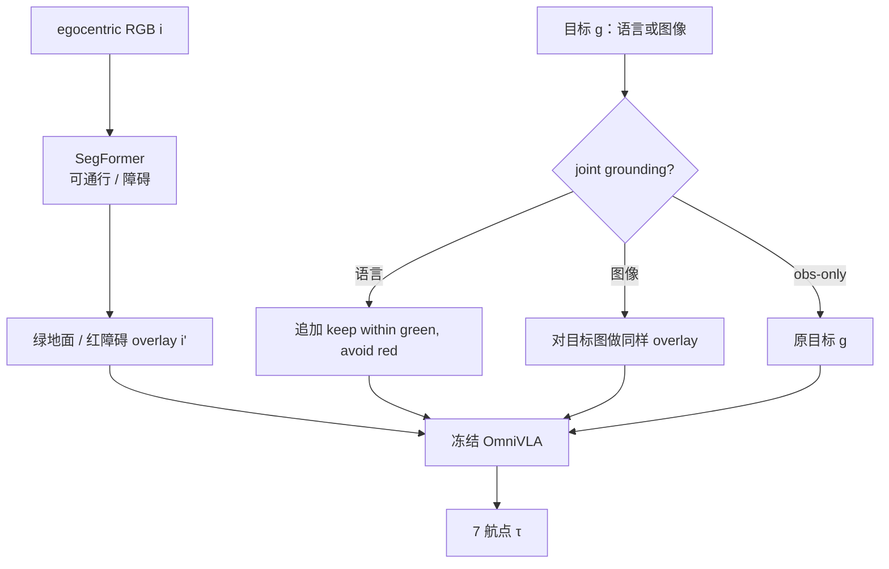

# Green for Go（VLA 导航可通行性视觉接地）

**Green for Go, Red for No**（*Visual Grounding via Semantic Segmentation for VLA Navigation Policies*，[arXiv:2607.05122](https://arxiv.org/abs/2607.05122)）由 **伦敦大学学院（UCL）** 提出：在 **不重训** 导航 VLA 的前提下，用 **SegFormer** 把 egocentric RGB 标成 **绿=可通行 / 红=不可通行**，再喂给冻结的 **OmniVLA**。这是导航 VLA 上视觉接地的一次受控实证，不是新的 foundation policy。

> **消歧：** 本页 **不是** [Green-VLA](./paper-greenvla-staged-vla-humanoid.md)（Sber 分阶段通才操作 VLA，arXiv:2602.00919）。此处 “Green” 只表示可通行区域着色。

## 一句话定义

**给冻结的导航 VLA 加一层实时可通行 overlay：绿走红停，绝对航点误差会降，但多半是因为它让模型走出更短的轨迹，而不是把单位距离的空间推理变强。**

## 英文缩写速查

| 缩写 | 英文全称 | 简要说明 |
|------|----------|----------|
| VLA | Vision-Language-Action | 被接地的冻结导航策略；本文评测 OmniVLA |
| VLN | Vision-and-Language Navigation | 语言条件下的视觉导航任务族 |
| WP | Waypoint | OmniVLA 输出的 7 个 2D 航点（WP1 近、WP7 远） |
| CAST | Counterfactual Augmentation for Spatial Transfer | OmniVLA 的原子指令微调数据；本文用 finetuned-cast 对照 |
| SoM | Set-of-Marks | 给 VLM 打物体编号的视觉提示；延迟不适合连续导航 |

## 为什么重要

- **便宜的部署旋钮：** 不改权重、不重训，只改观测（以及可选的目标文本/图像）。对已部署导航 VLA 是可试的输入侧干预。
- **把「误差下降」拆开看：** 最远航点绝对误差降 **27–44%**，但轨迹同时短约 **30%**；归一化后优势消失——选型时不要把 overlay 当成「空间理解升级」。
- **模态不对称：** 语言目标受益明显，**图像目标几乎无增益**（视觉目标本身已提供空间线索）。
- **训练缺口不可靠 overlay 补：** 「stop」从不产生零位移，三种接地条件都失败。

## 核心信息

| 项 | 内容 |
|----|------|
| **机构** | 伦敦大学学院（University College London）；计算机系 + 安全与犯罪科学系 |
| **发表** | arXiv preprint（2026-07-06） |
| **arXiv** | [2607.05122](https://arxiv.org/abs/2607.05122) |
| **平台** | 评测数据来自 Grand Tour ETH-2（ANYmal D）；推理硬件 NVIDIA Jetson Thor |
| **被测策略** | 冻结 OmniVLA：omnivla-base、omnivla-finetuned-cast；语言或图像目标 |
| **开源** | **确认未开源**（截至 2026-08-14：无项目页、无官方仓、论文未承诺发布） |

## 核心原理

轨迹生成写成 \(\tau = VLA(i, g)\)，其中 \(i\) 为当前 egocentric 图，\(g\) 为语言指令或目标图像，\(\tau\) 为 7 个 2D 航点。

SegFormer 做二值可通行分割（地面 vs 墙/家具/楼梯），绿/红叠加得到 \(i'\)。

| 变体 | 输入 | 公式 |
|------|------|------|
| **observation-only** | 接地观测 + 原目标 | \(\tau_1 = VLA(i', g)\) |
| **joint** | 接地观测 + 增强目标 | \(\tau_2 = VLA(i', g')\) |

joint 时：语言目标追加 *keep the trajectory within green traversable areas and avoid red non-traversable areas*；图像目标同样做绿/红 overlay。

设计被三条约束卡住：**实时**、**未见环境**（不绑 YOLO 式固定词表）、**多模态目标**。Set-of-Marks 把单图推理从约 **0.5 s 拉到 5 s**；目标检测泛化差。分割 overlay 同时满足三条。

### 流程总览

## 源码运行时序图

**不适用**（截至 2026-08-14）：无项目页、无官方训练/推理仓。放出后应补：ETH-2 分段加载 → SegFormer overlay → OmniVLA 7 航点 → 与 GT 轨迹的最小欧氏距离。

## 工程实践

| 项 | 做法 |
|----|------|
| **接入点** | 策略前的图像预处理；权重冻结 |
| **分割骨干** | SegFormer（层次编码器 + 轻量 MLP 解码） |
| **编码** | 绿=可通行，红=不可通行；颜色启发式未做系统搜索 |
| **语言后缀** | 仅 joint；描述性指令上常冗余 |
| **硬件** | 论文在 Jetson Thor 上跑实时分割 + VLA |
| **调试指标** | 分航点最小欧氏距离、轨迹长度、长度归一化误差；按指令词数分层 |
| **不要做的事** | 用 overlay 冒充闭环成功率；把楼梯当可通行（本文分割会标红并因此丢掉楼梯段） |

## 实验与评测

数据：Grand Tour **ETH-2** 室内 episode，切成语言/图像目标片段。评测开环：每个片段预测一条 7 航点轨迹，取到 GT 轨迹的最小欧氏距离。楼梯段与 **stop** 段从总表剔除。

| 轴 | 报告口径 |
|----|----------|
| **omnivla-base 语言 WP7** | 0.22 m → 0.16 m（seg, −27%）→ 0.15 m（aug, −32%） |
| **WP1（近）** | 仅 −13–25%；远航点收益更大 |
| **短指令 WP7（2–7 词）** | 0.187 → 0.120 / 0.122 m（约 −35–36%） |
| **长指令 WP7（≥8 词）** | 0.160 → 0.090 / 0.098 m（约 −39–44%） |
| **去 stop 后 1–7 均值** | 0.095 → 0.064 / 0.064 m |
| **轨迹长度** | 0.63 → 0.45 / 0.43 m（约 −30%） |
| **长度归一化误差** | 三条件收敛；WP1–5 基线甚至略低 |
| **图像目标** | 基线 0.13 m；接地 0.12–0.11 m，几乎无增益 |
| **指令长度** | 词数与误差轻度负相关 \(r\approx -0.54\)；8–16 词优于单词语 |
| **stop** | 从不零位移；WP1 仍 0.10–0.20 m |

joint 相对 obs-only：约一半片段无优势；含糊指令更吃后缀，描述性指令上后缀重复可通行约束。

## 结论

**绿/红 overlay 是便宜的输入正则：它让冻结导航 VLA 走出更短、绝对误差更小的轨迹，但没有证明单位距离的空间推理变强，也修不好没见过的原子指令。**

1. **先看归一化，再报绝对误差** — WP7 降 27–44% 的同时路径短约 30%；归一化后优势消失。
2. **语言目标优先试，图像目标别指望** — 图像目标基线已强，overlay 几乎不加分。
3. **obs-only 往往够用** — joint 后缀主要帮含糊指令；描述性指令不必强行追加。
4. **stop / 静止是数据问题** — 三种接地都失败；要补原子指令微调，而不是再叠一层分割。
5. **证据边界窄** — 单室内 episode、开环航点误差、单一 OmniVLA 视觉编码器；楼梯与动态障碍未覆盖。
6. **部署含义** — 适合当推理时试验旋钮，不能替代重训、闭环评测或新 VLA。

## 局限与风险

- **误区：** 把本页当成新 VLA 或与 [Green-VLA](./paper-greenvla-staged-vla-humanoid.md) 混为同一工作。
- **误区：** 绝对航点误差下降 = 空间推理变好；归一化后主要是长度正则。
- **误区：** overlay 能补 OOD 原子指令（stop 反例）。
- **局限：** 静态 2D 可通行假设；楼梯被标不可通行；颜色映射未消融；其他 VLA 编码器未必同样响应绿/红；开环、单 episode，不能外推闭环 SR。
- **开源：** 确认未开源；复现只能按方法描述自搭 SegFormer + OmniVLA 包装。

## 与其他工作对比

| 路线 | 干预位置 | 是否重训 | 标的 | 典型平台 |
|------|----------|----------|------|----------|
| **Set-of-Marks / PIVOT** | VLM 视觉提示 | 否 | 物体编号 / 动作可视化 | VQA、慢查询控制 |
| **BYOVLA** | 操作观测遮挡 | 否 | 任务无关背景 | 操作 VLA |
| **[ActFovea](./paper-actfovea.md)** | 观测–动作一致性防护 | 否 | 扰动恢复 / 安全失败 | 操作 π₀ / LIBERO |
| **[NaVILA](./paper-notebook-navila-legged-robot-vision-language-action-model.md)** | 中层语言动作 + locomotion | **是** | 语义导航命令 | Go2 / H1 |
| **[DA-Nav](./paper-da-nav.md)** | 图像平面离散网格 + CoT | 是（LoRA） | 城市方向指令 | CARLA / Go2 |
| **[NavWAM](./paper-navwam-goal-conditioned-visual-navigation-wam.md)** | 联合未来观测 / value / 动作 | 是 | image-goal | Diablo；对照 OmniVLA |
| **本文** | **可通行绿/红 overlay** | **否** | **冻结 OmniVLA 航点** | Grand Tour ETH-2 |
| **[CrossTracer](./paper-crosstracer.md)** | **像素轨迹残差** | **是**（LoRA + adapter） | **本体条件 8 航点** | NaviTrace + 轮/腿真机 |

- **相对 NaVILA：** 不改策略与低层控制，只改输入；换来的是开环误差读数，不是腿式闭环 SR。
- **相对 NavWAM：** NavWAM 在 image-goal 上打 OmniVLA；本文则显示 **同一 OmniVLA 在图像目标上几乎不吃 overlay**——视觉目标已带空间线索时，再涂可通行色收益有限。
- **相对 CrossTracer：** 都碰 OmniVLA 与可通行性，但 CrossTracer **重训提案头 + 显式机器人 ID**，评 NaviTrace / 真机 SR；本文是 **冻结权重的输入正则**，评开环航点误差。选型时不要把 overlay 当跨本体残差的平价替代。
- **相对 REALM：** REALM 修的是 VLN **末段实例可见性**；本文修的是 **全程可通行提示**，评测也不是 REVERIE 式接地。
- **相对 ActFovea：** 同属冻结 VLA 的推理时壳层；ActFovea 做安全恢复，本文做可通行着色。

## 关联页面

- [视觉–语言导航（VLN）](../tasks/vision-language-navigation.md) — 任务总览；本页补「冻结导航 VLA 的推理时可通行接地」
- [VLA](../methods/vla.md) — 不重训的输入侧干预，对照重训式导航 VLA
- [NaVILA](./paper-notebook-navila-legged-robot-vision-language-action-model.md) — 训练式腿式导航 VLA 对照
- [NavWAM](./paper-navwam-goal-conditioned-visual-navigation-wam.md) — image-goal 对照；同用 OmniVLA 作基线
- [CrossTracer](./paper-crosstracer.md) — 重训式像素残差 + 本体 ID；NaviTrace / 真机 SR
- [DA-Nav](./paper-da-nav.md) — 图像平面 grounding，但是训出来的户外方向 VLN
- [REALM](./paper-realm-last-3-meter-vln-grounding.md) — 另一类导航接地：末段实例可见性
- [ActFovea](./paper-actfovea.md) — 冻结操作 VLA 的运行时防护
- [Green-VLA](./paper-greenvla-staged-vla-humanoid.md) — 同名易混的分阶段通才操作 VLA
- [VLN 四范式开源复现](../overview/vln-open-source-repro-paradigms.md) — 本文未开源，不进入可跑通清单
- [机器人视觉感知栈选型闭环](../queries/robot-perception-stack-selection-loop.md) — 分割 overlay 是感知输出如何被冻结策略消费的一例

## 参考来源

- [Green for Go 论文摘录（arXiv:2607.05122）](../../sources/papers/green_for_go_vla_nav_grounding_arxiv_2607_05122.md)

## 推荐继续阅读

- Szvoren, Kanoulas, Tuptuk, *Green for Go, Red for No* — [arXiv:2607.05122](https://arxiv.org/abs/2607.05122)
- Hirose et al., *OmniVLA: An Omni-Modal Vision-Language-Action Model for Robot Navigation* — [arXiv:2509.19480](https://arxiv.org/abs/2509.19480)
- Frey et al., *GrandTour: A Legged Robotics Dataset in the Wild* — [arXiv:2602.18164](https://arxiv.org/abs/2602.18164)
- Xie et al., *SegFormer* — NeurIPS 2021
- Hancock et al., *BYOVLA* — ICRA 2025（操作 VLA 的运行时观测干预对照）
