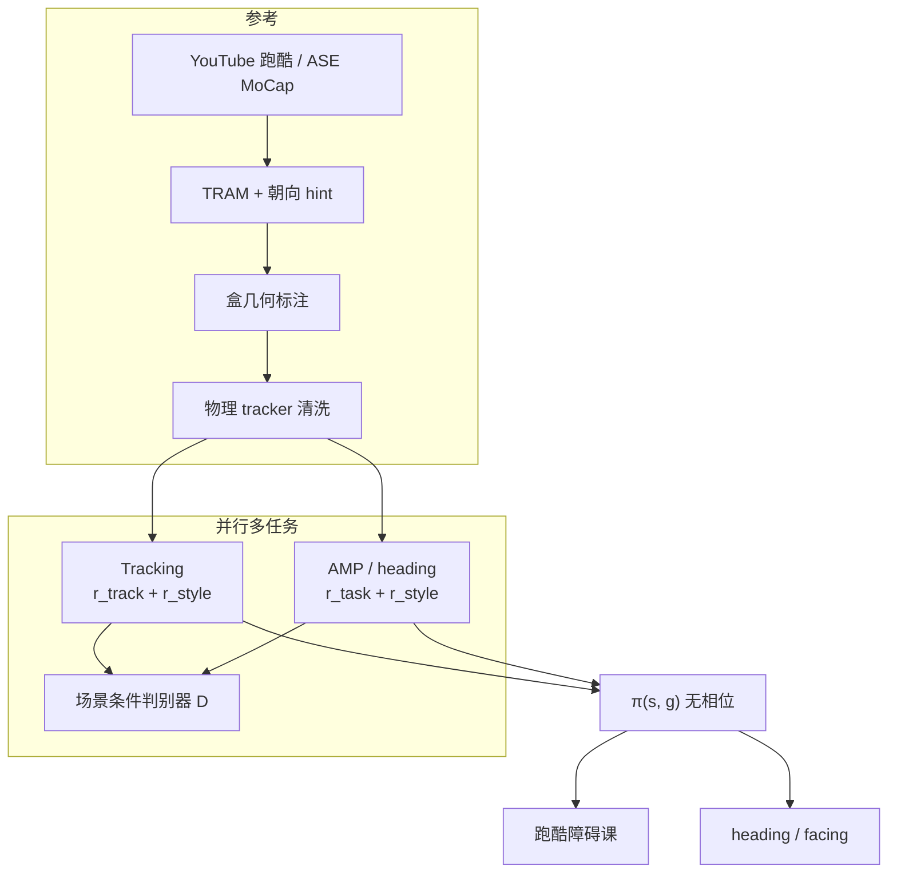
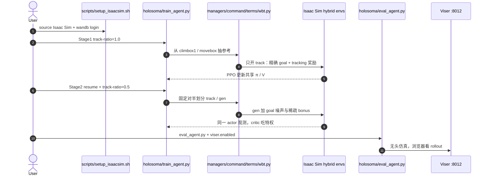

# HIL：混合模仿学习做动态运动控制

**HIL**（*Hybrid Imitation Learning for Dynamic Athletic Control*，[*ACM Transactions on Graphics* 2026](https://jiashunwang.github.io/HIL/)，预印本 [arXiv:2505.12619](https://arxiv.org/abs/2505.12619)）由 **卡内基梅隆大学** Jiashun Wang、Jessica Hodgins 与 **英伟达** Yifeng Jiang、Haotian Zhang、Chen Tessler、Davis Rempe 以及 **西蒙菲莎大学 / 英伟达** Xue Bin Peng 提出：用并行多任务把 **逐帧 tracking** 和 **AMP 式对抗模仿** 训成一条统一物理角色策略。方法导航见 [HIL](../methods/hil-hybrid-imitation-learning.md)。预印本旧题是 *Diverse Parkour Skills from Videos*；TOG 定稿补了 **heading / facing** 任务，并把标题改成 Dynamic Athletic Control。

## 一句话定义

**不要相位、不要未来姿态：用场景/方向 goal 当空间相位，让 tracking 与 AMP 共享同一观测，既跟得住参考特技，又能在新障碍和新朝向上改动作。**

## 英文缩写速查

| 缩写 | 英文全称 | 简要说明 |
|------|----------|----------|
| HIL | Hybrid Imitation Learning | 本文框架：tracking + 对抗模仿并行 |
| AMP | Adversarial Motion Prior | 判别器给出 style reward 的运动先验 |
| AIL | Adversarial Imitation Learning | 用对抗信号匹配参考运动分布 |
| PSI | Perturbed State Initialization | 参考初态加噪，促技能过渡 |
| DTW | Dynamic Time Warping | 评测时对齐生成动作与参考的距离 |
| SMPL | Skinned Multi-Person Linear Model | 论文仿真角色的人体网格/骨骼 |
| PPO | Proximal Policy Optimization | Isaac Gym 上的 on-policy 优化器 |

## 为什么重要

- **跑酷同时要「像」和「能改」。** 纯 tracking 出不了新障碍序列；纯 AMP 容易反复 vault、绕开障碍或卡住。HIL 用共享判别器把两路桥起来。
- **观测接口可部署到无参考场景。** 策略只看状态 + goal（点云/目标点，或 heading/facing），这是后面 [MTRG / GfR](../methods/mtrg-reference-goal-driven-rl.md)「参考不进 actor」的动画侧先证。
- **第二任务证明配方不只吃 30 秒视频。** Heading 用 ASE sword-and-shield MoCap（约 7 分钟），Facing 分到 0.97，说明 hybrid 能吃更大运动库。
- **读数别被完成率骗。** Table 1 里 Task Reward / AMP-ws 完成率更高（0.81 / 0.85 vs 0.74），但技能准确率差一截。HIL 卖的是 **skill accuracy 0.66、track error 0.31**。
- **今天不能当官方复现栈。** 项目页无代码。能跑的是一作 [Hybrid-Motion-Imitation](https://github.com/jiashunwang/Hybrid-Motion-Imitation)：G1 箱攀/搬箱，且 **去掉了 AMP 判别器**。

## 核心信息

| 项 | 内容 |
|----|------|
| **机构** | 卡内基梅隆大学（Carnegie Mellon University）；英伟达（NVIDIA）；西蒙菲莎大学（Simon Fraser University） |
| **平台** | SMPL 物理角色（Isaac Gym）；论文任务不含真机 |
| **栈** | PPO + GAE；仿真 120 Hz、策略 30 Hz；4×V100；先 4B tracking，再 2B 两模式各半 |
| **数据** | 跑酷：YouTube 19 clip / 30 s / 15 技能 + 手工盒几何；heading：ASE sword-and-shield ≈7 min |
| **开源（截至 2026-09-05）** | **官方未开源**。一作非官方 G1 仓 Apache-2.0，见下方时序图 |

## 核心原理

### 流程总览

### 统一 goal-conditioned 观测

标准 DeepMimic / MaskedMimic tracker 依赖相位或未来姿态，这些量在新场景里不存在。HIL 改成：

- **跑酷** \(g_t=(c_t,l_t)\)：根附近最近点云 + 目标位置。tracking 时 \(l_t\) 取参考 1–2 s 后根位置；AMP 时在前方障碍附近加 \(\mathcal{N}(0,0.2)\)。
- **Heading** \(g_t=(\hat d_t,\hat f_t)\)：地面平面单位前进方向与朝向，沿 ASE 设定。

作者在 heading 上对照了「未来姿态 tracker」vs「只看方向的 task-conditioned tracker」：后者收敛稍慢、成功率略低，但已经够用——这是「空间/任务约束能当相位」的直接证据。

### 两路奖励与共享 style

Tracking 奖励是位置、旋转、线/角速度、根高的指数项，再加能量惩罚。AMP 侧跑酷用进度差 + 到达奖励；heading 用速度对齐 \(\hat d_t\) 与朝向点积 \(\hat f_t\)。style \(r^{style}=-\log(1-D)\) **两模式都加**，判别器看 10 步转移 + 场景点云（heading 去掉点云）。critic 另吃任务指示 \(k_t\)，去掉后 critic loss 大约大 5 倍。

### PSI 与提前终止

PSI 给参考初态加高斯噪声，降低「技能 A 终点对不上技能 B 起点」时的 mode collapse。ET：tracking 关节偏参考 >0.5 m；跑酷摔倒或偏目标 >2 m；heading 头高 <0.3 m。

## 源码运行时序图

**官方 TOG 角色动画代码不适用**（项目页截至 2026-09-05 未列仓库）。下面画的是一作非官方 G1 仓 [Hybrid-Motion-Imitation](https://github.com/jiashunwang/Hybrid-Motion-Imitation) 的可运行路径：Holosoma + Isaac Sim，实验别名 `exp:g1-29dof-wbt-hybrid-climb` / `exp:g1-29dof-wbt-hybrid-object`。它复用「actor 不见逐步参考、先 track 再 50/50 混合」，**不用论文里的 AMP 判别器**；gen 侧是稀疏 goal bonus。

复现入口：`scripts_run/run_train.sh` / `run_play.sh`；方法细节 `docs/wbt-hybrid.md`。默认 8192 envs。评测必须用 checkpoint 里的配置，**不要再传 `exp:` 别名**。

## 工程实践

| 项 | 建议 |
|----|------|
| 先问要不要对抗 | 仿真角色、要技能–场景对齐 → 论文 HIL（AMP + 点云判别器）。G1 箱攀/搬箱要可跑代码 → 非官方仓（无判别器，更像 GfR）。真机 goal-only → [MTRG](../methods/mtrg-reference-goal-driven-rl.md) |
| 观测 | 先试「状态 + goal」，不要默认加相位/未来姿态 |
| 训练日程 | 先纯 tracking，再 50/50；G1 仓 Stage 2 还要重置 `init-noise-std=0.45` |
| 判别器 | 跑酷务必把场景点云喂给 \(D\)；去场景后 skill acc 从 0.66 掉到 0.38 |
| PSI | 技能衔接难时先加初态扰动，再加数据 |
| critic | 两模式奖励结构不同，保留 \(k_t\) |
| 数据 | 视频参考要先物理洗（碰撞/滑步），再当 AMP 正样本 |
| 复现预期 | **无官方权重**；G1 仓还要自备 Isaac Sim 与 `climbox1` / `movebox` 运动目录 |

## 实验与评测

- **跑酷 Table 1（障碍位姿/尺度扰动）：** HIL skill acc **0.66**、DTW track error **0.31**、完成率 0.74。MaskedMimic 跟得住第一障（acc 0.50）但完成率 0；ASE 完成率 0；AMP 无 warm-start 完成率 0.11。Task Reward 完成率 0.81，但会爬行钻仿真；AMP-ws 完成率 0.85，却反复同一 vault。
- **消融 Table 2：** w/o \(D\) acc 0.53 / 完成 0.62；w/o PSI acc 0.50 / 完成 **0.52**；\(D\) 无场景 acc **0.38**；w/o \(k\) acc 0.52。
- **鲁棒：** \(\sigma=0.05\) 完成 >70%，\(\sigma=0.1\) >50%；训 5 障测 20 障约 40%。
- **混训：** 跑酷数据 + SAMP 坐姿，同一策略先特技再坐椅。
- **Heading Table 3：** HIL Direction 0.94、Facing **0.97**、Return 227。AMP Direction 0.95 / Return 266 但行为更窄；ASE 更自然、任务分低（0.54 / 147）；MaskedMimic Return 17。

## 结论

**HIL 真正卖的是「统一观测 + 全程保持 tracking」；完成率可以让给纯任务基线，换技能覆盖和动作像人。官方动画代码没有，G1 仓是去对抗后的工程延伸。**

1. **读 Table 1 先看 skill accuracy，再看 completion。** 0.74 对 0.86 不是输，是拒绝爬行和反复 vault。
2. **空间 goal 可以当相位。** heading 上 task-conditioned tracker 已经接近未来姿态 tracker；这是两模式能共享 \(\pi\) 的前提。
3. **判别器要看场景。** 去掉点云，完成率几乎不动，技能对齐先垮。
4. **PSI 是衔接开关。** 消融里完成率掉得最狠的是去扰动初始化。
5. **先 track 再混合。** 论文 4B+2B；G1 仓同样 Stage 1 纯 track、Stage 2 对半。
6. **选型：** 动画跑酷 / heading → 本页方法；G1 要可跑 hybrid → 非官方仓；真机 goal-only 跑酷 → MTRG；部署还要播参考 → [ZEST](../methods/zest.md)。
7. **不要把 Hybrid-Motion-Imitation 写成官方 TOG 代码。** README 自己否认。

## 与其他工作对比

| 对照 | 差异读法 |
|------|----------|
| [DeepMimic](../methods/deepmimic.md) | 祖先 tracking；HIL 去掉相位/未来姿态，才能和 AMP 共用 \(\pi\) |
| [AMP](../methods/amp-reward.md) | HIL 把 style 判别器条件于场景，并**训练期一直留着 tracking** |
| [ASE](../methods/ase.md) | 层次 latent；无任务引导时在障碍前卡住。HIL heading 用了它的 sword-and-shield 数据 |
| MaskedMimic | 只在参考条件里蒸馏；新障碍序列会在第一障后摔倒 |
| [MTRG / GfR](../methods/mtrg-reference-goal-driven-rl.md) | 同作者下一站：去掉对抗，G1 真机，参考只塑形 |
| [ZEST](../entities/paper-zest.md) | 部署仍播下一步参考；工业跨形态 tracking，不是动画 hybrid |
| Hybrid-Motion-Imitation | 一作 G1 扩展：Holosoma、无 AMP、箱攀/搬箱 |

## 局限与风险

- **官方未开源。** 项目页与 Peng 组页都没有 GitHub。论文讨论真机人形是未来工作，不是本页结果。
- **仿真过强。** 作者承认 SMPL 角色执行器过猛，纯任务基线会用超高跳和爬行刷完成率。
- **场景几何简。** 默认顺序盒障碍 + 手工标注；非线性布局和复杂物体超出数据分布就会掉。
- **非官方仓 ≠ 论文复现。** 无场景点云判别器、无 SMPL 跑酷环境；不要用它的数字回填 Table 1。
- **和 [HIL-HARC](./paper-hil-harc.md) 不是一篇。** 后者是真机在线 RL（Hardware-in-the-Loop），缩写碰巧相同。

## 关联页面

- [HIL 方法页](../methods/hil-hybrid-imitation-learning.md) — 机制速览
- [HIL vs MTRG vs ZEST](../comparisons/hil-vs-mtrg-vs-zest-parkour-imitation.md) — 跑酷三条路线
- [MTRG / GfR](../methods/mtrg-reference-goal-driven-rl.md) — 人形后继
- [AMP & HumanX](../methods/amp-reward.md) — style 判别器来源
- [DeepMimic](../methods/deepmimic.md) — tracking 祖先
- [ASE](../methods/ase.md) — heading 数据与基线
- [holosoma](./holosoma.md) — 非官方 G1 仓的上游栈
- [Unitree G1](./unitree-g1.md)
- [Locomotion](../tasks/locomotion.md) / [Humanoid Locomotion](../tasks/humanoid-locomotion.md)

## 参考来源

- [HIL TOG / arXiv 归档](../../sources/papers/hil_hybrid_imitation_learning_arxiv_2505_12619.md)
- [HIL 项目页归档](../../sources/sites/hil-project.md)
- [Hybrid-Motion-Imitation 仓库归档](../../sources/repos/hybrid-motion-imitation.md)
- [arXiv:2505.12619](https://arxiv.org/abs/2505.12619)
- [TOG PDF](https://jiashunwang.github.io/HIL/static/mat/Hybrid_Imitation_Learning_TOG.pdf)

## 推荐继续阅读

- [HIL 项目页](https://jiashunwang.github.io/HIL/) — 跑酷 / heading / 消融视频
- [Peng 组 HIL 索引](https://xbpeng.github.io/projects/HIL/index.html)
- [Hybrid-Motion-Imitation](https://github.com/jiashunwang/Hybrid-Motion-Imitation) — G1 非官方训练入口
- [GfR 项目页](https://jiashunwang.github.io/GfR/) — 同作者 RSS 2026 人形后继
