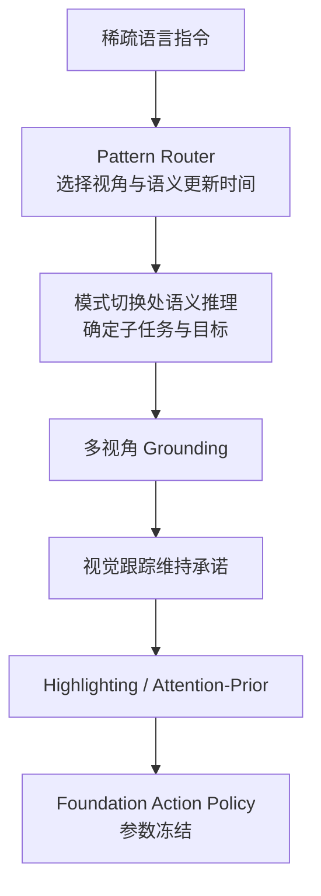

# HINT：长视野操作的人类意图注入

**HINT**（*Human-Intent Inception for Long-Horizon Robot Manipulation*，[arXiv:2609.02653](https://arxiv.org/abs/2609.02653)，[项目页](https://robot-hint.github.io/)）由 **浙江大学（ZJU）**、**上海交通大学（SJTU）** 等提出：受人类操作原则启发，仅在 **manipulation-pattern transitions** 处调用语义推理确定子任务与目标，再通过 **多视角 grounding** 与 **视觉跟踪** 保持该承诺，并以 **image-space highlighting** 或 **attention-prior injection** 将跟踪到的意图传给动作策略——**不向 foundation action model 引入额外可训练参数**。

## 一句话定义

**长视野操作的关键，是让稀疏语言意图在密集动态视觉中不被短期相关性带偏。**

## 英文缩写速查

| 缩写 | 英文全称 | 简要说明 |
|------|----------|----------|
| HINT | Human-Intent Inception | 本文 agentic 框架简称 |
| VLA | Vision-Language-Action | 视觉-语言-动作策略族 |
| OOD | Out-of-Distribution | 分布外物体/布局/指令变体 |
| IS | Intention Score | 项目页报告的意图理解指标 |

## 为什么重要

- 纳入 [2026-09-03 八篇盘点](../../sources/blogs/wechat_embodied_station_8_papers_open_source_2026-09-03.md) 的「长视野意图保持」支线。
- **插件式**：在 Wall-OSS-0.5 与 π₀.₅ 上提升意图分、子任务 SR 与全流程 SR，同时保持低延迟控制。
- 分离 **what/when**（稀疏语义）与 **how**（预训练动作策略连续控制）。

## 核心信息

| 项 | 内容 |
|----|------|
| **机构** | 浙江大学（ZJU）、上海交通大学（SJTU）、Noematrix、EndlessAI |
| **平台** | 双臂 PiPER；全局 + 双腕相机 |
| **任务** | 果蔬分拣、拼词、插孔 + OOD 变体 |
| **开源** | **待发布**（项目页无 GitHub，截至 2026-09-03） |

### 流程总览

## 评测

| 任务 | 指标 | π₀.₅ | π₀.₅ + HINT（ID，项目页） |
|------|------|------|---------------------------|
| 果蔬分拣 | Full SR | 10.0% | **60.0%**（+50.0 pp） |
| 拼词 | Full SR | 13.3% | **86.7%**（+73.4 pp） |
| 插孔 | Full SR | 5.0% | **40.0%**（+35.0 pp） |

OOD 设置下仍有显著提升（如插孔 IS 26.7%→90.0%）。

## 结论

**稀疏意图更新 + 连续视觉跟踪，可在不改动作骨干权重的前提下拉升长视野 VLA 成功率。**

1. **只在模式切换处推理** — 降低语义调用频率，保留低延迟闭环。
2. **双视觉接口互补** — highlighting 与 attention-prior 均不增训 action backbone。
3. **跨骨干有效** — Wall-OSS-0.5 与 π₀.₅ 均受益，说明是接口层而非单模型技巧。
4. **OOD 仍有增益** — 未见物体/布局/指令变体下意图分与子任务 SR 提升。
5. **代码待发布** — 复现需跟踪项目页后续 GitHub。

## 源码运行时序图

**不适用** — 截至 **2026-09-03** 无可运行官方代码。

## 工程实践

| 项 | 建议 |
|----|------|
| 何时引用 | 已有 foundation manipulation policy，需长视野多子任务编排 |
| 与纯 VLA 对比 | 密集视觉易走捷径；HINT 用稀疏语义锚定目标 |
| 部署前提 | 多相机（全局+腕部）；需 pattern 识别与跟踪模块 |

## 局限与风险

- **代码未公开** — 工程细节与延迟剖面待发布。
- **任务域** — 三类桌面操作；泛化到移动操作/双手协作待验证。
- **依赖上游 policy** — 不能替代弱基础策略的接触与精度能力。

## 与其他工作对比

| 对照 | 差异读法 |
|------|----------|
| 纯语言条件 VLA | 长指令下视觉相关性压过语义；HINT 稀疏重锚定 |
| [hint²](./paper-hint2.md) | 不同论文：hint² 是 LTL 世界模型推理引导；HINT 是操作模式切换处意图注入 |
| [DemoMimic](./paper-demomimic.md) | DemoMimic 解决接触几何泛化；HINT 解决长视野意图保持 |

## 关联页面

- [VLA](../methods/vla.md)
- [Manipulation](../tasks/manipulation.md)
- [开源系统可靠性 8 篇地图](../overview/open-source-system-reliability-8-papers-technology-map.md)

## 参考来源

- [hint_robot_manipulation_arxiv_2609_02653](../../sources/papers/hint_robot_manipulation_arxiv_2609_02653.md)
- [robot-hint 项目页](../../sources/sites/robot-hint.md)
- [具身智能小站 2026-09-03 八篇盘点](../../sources/blogs/wechat_embodied_station_8_papers_open_source_2026-09-03.md)

## 推荐继续阅读

- [arXiv:2609.02653](https://arxiv.org/abs/2609.02653)
- [HINT 项目页](https://robot-hint.github.io/)
