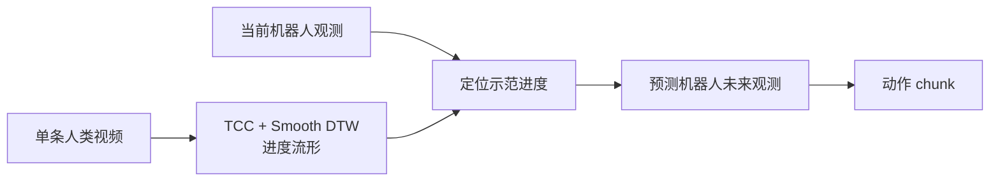
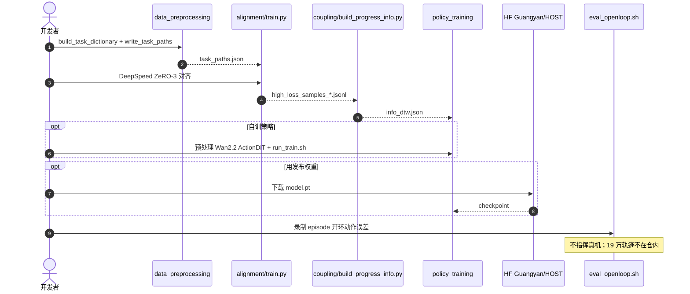

# HOST：单条人类视频秒级习得操作

**HOST**（*Human-to-robot One-Shot Skill AcquisiTion*，*Robots Acquire Manipulation Skills in Seconds from a Single Human Video*，[arXiv:2607.20033](https://arxiv.org/abs/2607.20033)，[项目页](https://host-site.host-robotics.workers.dev/)，[代码](https://github.com/CGuangyan-BIT/HOST)，[权重](https://huggingface.co/Guangyan/HOST)）由 **北京理工大学（BIT）**、**自变量机器人（X Square Robot）** 与 **清华大学（Tsinghua）** 提出：把新技能从「再采遥操作再微调」改成 **推理时一条人类视频**。

## 一句话定义

**不改权重，用一条人类视频在约半分钟内指定新操作：先把人/机进度对齐到同一流形，再按「我现在做到哪 → 我自己的下一帧该长什么样 → 动作」执行。**

## 英文缩写速查

| 缩写 | 英文全称 | 简要说明 |
|------|----------|----------|
| HOST | Human-to-robot One-Shot Skill AcquisiTion | 本文框架：推理时单视频习得 |
| ICL | In-Context Learning | 权重不变、上下文指定任务；本页技能存在外部视频里 |
| TCC | Temporal Cycle Consistency | 对齐模块的循环一致损失 |
| DTW | Dynamic Time Warping | Smooth DTW 把人/机轨迹拉到共享进度 |
| WAM | World-Action Model | 先预测机器人未来观测再出动作 |
| SFT | Supervised Fine-Tuning | 对照的「50 条遥操作再训」基线 |

## 为什么重要

- **打断训练时环：** 新任务不再默认消耗专家遥操作 + 数小时微调，也不必覆盖已掌握技能。
- **可核对的开源 one-shot：** 对照闭源 [GEN-1.5](./generalist-gen15-one-shot.md) / [S1](./skild-s1.md)，本页给出代码、HF 权重和真机数字。
- **评测轴与 Imitator Game 互补：** [Imitator Game](./paper-imitator-game.md) 问「意图是否过了 L3」；HOST 问「单视频能不能在秒级变成可执行技能且不遗忘」。
- **机制不是堆上下文：** 相对 [Zero-WAM](./paper-zero-wam.md) 的合成人视频前缀，HOST 显式做 **进度对应 + 自接地未来观测**。

## 核心信息

| 项 | 内容 |
|----|------|
| **机构** | 北京理工大学（BIT）；自变量机器人（X Square Robot）；清华大学（Tsinghua） |
| **出处** | arXiv:2607.20033（v4，2026-08-20） |
| **平台** | 双臂 ARX R5 + 平行夹爪；双腕 + 第三人称 RGB；动作 20 维 |
| **预训练** | Stage 1：193,462 条机器人轨迹 / 229 任务；Stage 2：5,847 条自采人视频配对 |
| **评测** | 50 个未见任务 × 20 trial；八任务对照子集报 62% |
| **开源** | **已开源** — GitHub 训练/对齐入口 + HF `Guangyan/HOST`；真机大规模数据未随仓发布 |

### 流程总览

两阶段训练：先用同任务机器人–机器人配对学会「跟着示范走」，再用少量人–机配对把条件从机器人视频换成人类视频。

## 核心原理（方法）

### 1. 把预测目标耦到示范，而不是耦到时钟

人与机快慢不同。固定时间偏移会让「下一秒该模仿什么」对不上示范。HOST 用 Qwen3-VL-Embedding-8B 把同任务人/机帧映到共享进度流形，再用 Smooth DTW 恢复对应，按 **示范即将到来的进度** 重写每个监督目标。

### 2. 自接地级联，而不是视频直接回归动作

级联三步：

1. 估计机器人在这条示范里走到哪；
2. 把接下来的进度译成 **机器人自己的** 未来观测（本体/视角/场景已在预测里对齐）；
3. 从预测观测出动作。

策略是双专家自回归扩散：视频专家初始化自 Wan2.2-TI2V-5B，与动作专家做 Mixture-of-Transformers 共享注意力。实现继承 Fast-WAM（[arXiv:2603.16666](https://arxiv.org/abs/2603.16666)）。

### 3. 技能停在外部视频，不写进共享权重

新技能以视频上下文提供，不改 \(\pi\)。同一权重可反复检索已存示范，作者把它读成「可累积、不互相覆盖」的技能库——这是遗忘表 99% 的机制解释，不是另一套持续学习算法。

## 源码运行时序图

官方仓 [CGuangyan-BIT/HOST](https://github.com/CGuangyan-BIT/HOST) 把数据契约、对齐、进度标签和策略拆成四个顶层目录；对齐与策略是两套 Conda / 两套 PyTorch。

- **最短核对路径：** 按 README 建 `HOST_Alignment` / `HOST_Policy` → 自备同格式 episode → 开环 `eval_openloop.sh`；论文 64 GPU 规模需自己改 launcher。
- **权重：** HF `Guangyan/HOST`（MIT）；仓根无统一 LICENSE。

## 工程实践

| 项 | 实践要点 |
|----|----------|
| **环境** | 对齐 PyTorch 2.4、策略 2.6，不要混进同一个 env |
| **数据** | episode 目录需 `episode.json` + 图像/视频 + `task_paths.json`；同任务分组是对齐前提 |
| **复现边界** | 公开的是管线，不是 193k 真机包；内部路径见 `OPEN_SOURCE_PATH_TODOS.md` |
| **评测** | 开环脚本 ≠ 真机 62%；真机数字只能当论文自报 |
| **选型** | 要「秒级单视频、不遗忘」看本页；要「L3 功能替代榜」看 [Imitator Game](./paper-imitator-game.md)；要长程未见闭源上界看 [S1](./skild-s1.md) |

## 实验与评测

| 设定 | 结果 |
|------|------|
| 广度 | 50 个未见任务均能从单视频出可执行技能（每任务 20 trial） |
| 八任务平均 SR | HOST **62%**；Vid2Robot 16%；AWDA 19%；\(\pi_{0.5}\) 11%；Wall-OSS 17%；HOST-base 4% |
| 相对语言零样本 | 摘要口径超过最强零样本基线 **45 pt** |
| 数据/时间 | 1 条人视频 vs 50 条遥操作：少 **50×** 演示，快约 **507×**（29 s vs 数小时 SFT） |
| SFT 对照上限 | Wall-OSS+SFT-50 仍只到 **56%** |
| 遗忘 | 已掌握七任务 HOST 保留约 **99%**；同预算 SFT 约 22–43% |
| 扰动（相对 62%） | 光照 −1；OOD 物体 −4；换场景 −6；执行中人为干扰 −9 |

数字出处：[项目页 Results](https://host-site.host-robotics.workers.dev/) 与 [ingest 摘录](../../sources/papers/host_arxiv_2607_20033.md)。八任务与 50 任务全表不是同一汇总，引用时写明子集。

## 结论

**单视频 one-shot 可以做成不改权重的推理过程；62% 和 99% 遗忘必须分开读，且都还绑在双臂 ARX 上。**

1. **进度对齐比堆整段视频更关键** — 时间错位会让监督目标脱离示范。
2. **先预测「我自己的下一帧」再出动作** — 用来吸收本体/视角差，而不是从人手像素回归关节。
3. **同体机器人–机器人预训练是主数据** — 19 万轨迹换来的是「会跟着示范走」；5.8k 人视频只做跨具身适应。
4. **62% 是八任务对照，不是 50 任务平均** — 广度主张是「每个任务都能跑起来」，不是每个任务都 62%。
5. **开源复现的是管线** — 权重可下，论文规模数据不在仓里；开环脚本不能复核真机表。
6. **单平台** — 作者自认未测差异很大的本体；不要外推到人形全身或跨臂即用。

## 与其他工作对比

| 对照 | 差异读法 |
|------|----------|
| [GEN-1.5](./generalist-gen15-one-shot.md) | 闭源；3–12 s physical prompt 涌现 ICL。HOST 有显式对齐/级联，数字可核对但任务集不同。 |
| [S1](./skild-s1.md) | 闭源；显式视频 ICL，宣称未见最长约 10 min。HOST 是短程桌面双臂，强调不遗忘。 |
| [Zero-WAM](./paper-zero-wam.md) | 合成人视频当 WAM 任务规格；代码待发布。HOST 用真人视频 + 进度流形，代码已开。 |
| [WAM-TTT](./paper-wam-ttt-human-video-test-time-steering.md) | 部署时写 fast weights。HOST **零梯度**，技能停在外部视频。 |
| [Imitator Game](./paper-imitator-game.md) | 基准：L3 功能替代与未见零样本都弱。HOST 是方法，不按 L0–L3 报。 |
| Vid2Robot / AWDA | 同页 OSVI 基线；八任务上 HOST 62% vs 16/19%。 |

## 局限与风险

- 只在 **一对 ARX R5 双臂** 上评；跨本体未测。
- 62% 来自 **八任务子集**；50 任务页只证明「能执行」，未给全表平均。
- Stage 1/2 真机包未公开，第三方无法按论文规模复训。
- 仓级许可未齐；内部路径仍在配置里。
- 「99% 保留」是七个已掌握任务的成功率口径，不是任意长技能库的持续学习证明。
- 扰动后仍有 9 pt 掉到人为干扰，长程恢复不是主叙事。

## 关联页面

- [机器人 In-Context Learning](../concepts/robot-in-context-learning.md)
- [World Action Models](../concepts/world-action-models.md)
- [Imitation Learning](../methods/imitation-learning.md)
- [Manipulation](../tasks/manipulation.md)
- [The Imitator Game](./paper-imitator-game.md)
- [GEN-1.5](./generalist-gen15-one-shot.md)
- [S1（Skild）](./skild-s1.md)
- [Zero-WAM](./paper-zero-wam.md)
- [WAM-TTT](./paper-wam-ttt-human-video-test-time-steering.md)
- [具身 ICL 四路线对比](../comparisons/wam-ttt-robottt-stellavla-zero-wam-embodied-icl.md)
- [跨具身迁移枢纽](../overview/hub-cross-embodiment.md)

## 参考来源

- [host_arxiv_2607_20033](../../sources/papers/host_arxiv_2607_20033.md)
- [HOST 项目页归档](../../sources/sites/host-robotics.md)
- [HOST 仓库归档](../../sources/repos/host.md)

## 推荐继续阅读

- [arXiv:2607.20033](https://arxiv.org/abs/2607.20033)
- [项目页](https://host-site.host-robotics.workers.dev/)
- [GitHub](https://github.com/CGuangyan-BIT/HOST)
- Fast-WAM（策略底座）：[arXiv:2603.16666](https://arxiv.org/abs/2603.16666)
