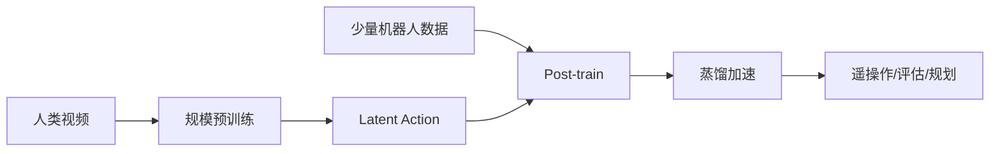
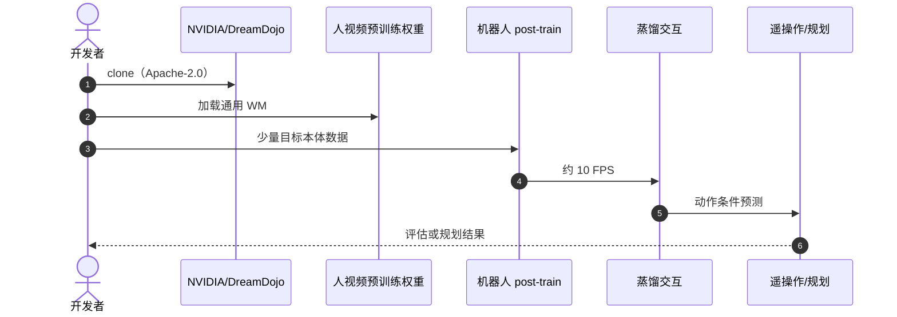

# DreamDojo：从大规模人类视频预训练机器人世界模型

**DreamDojo**（*A Generalist Robot World Model from Large-Scale Human Videos*，[arXiv:2602.06949](https://arxiv.org/abs/2602.06949)，[项目页](https://dreamdojo-world.github.io/)，[代码](https://github.com/NVIDIA/DreamDojo)）由 **UT Austin / NVIDIA** 等提出（ICML 2026）：用约 **44K 小时** 第一视角人类视频预训练通用世界模型，以 **continuous latent action** 补上无机器人动作标签的缺口，再少量目标本体 post-train。人形 RL 栈 **#35/42** 与 VLA/WM 阅读路线共用**本页**为 canonical 节点。

## 一句话定义

**要的不是会生成视频，而是动作可控、能给策略用的机器人世界模型。**

## 英文缩写速查

| 缩写 | 英文全称 | 简要说明 |
|------|----------|----------|
| WM | World Model | 观测+动作 → 未来 |
| LA | Latent Action | 无标签视频中的隐动作 |
| VLA | Vision-Language-Action | 本工作不是 VLA，而是其数据瓶颈对照 |
| FPS | Frames Per Second | 蒸馏后约 10 FPS 交互 |

## 为什么重要

- 纳入 [VLA/WM 阅读路线](../../sources/blogs/wechat_embodied_ai_lab_vla_wm_reading_roadmap_2026-09-02.md) 的人类视频预训练篇。
- 直接回答 VLA 的 **真机数据贵**：先在人视频上规模化。
- 下游不只是长视频：live teleoperation、policy evaluation、model-based planning。
- **已开源** `NVIDIA/DreamDojo`（Apache-2.0，2026-09-02 核查）。

## 核心信息

| 项 | 内容 |
|----|------|
| **机构** | 英伟达；德州大学奥斯汀分校；香港科技大学；伯克利；华盛顿大学；斯坦福；KAIST 等 |
| **数据** | ~44K h 第一视角人类视频 |
| **关键** | continuous latent action + 机器人 post-train |
| **推理** | 蒸馏约 10 FPS |
| **开源** | **已开源** [NVIDIA/DreamDojo](https://github.com/NVIDIA/DreamDojo) |

### 流程总览

## 评测

- 策展与论文强调下游三种用法，而非单纯 FID。
- 量化 benchmark 以 [原文 / 项目页](https://dreamdojo-world.github.io/) 为准。
- 与 [AnyWorld](./paper-anyworld.md) 对照：都做无人–机配对的人视频迁移，配方不同。

## 结论

**人类视频能预训练 WM，前提是 latent action 把「没标签」变成可条件化动作。**

- 44K 小时解决的是覆盖，不是本体对齐
- post-train 才把 embodiment / action space 接上
- 蒸馏在画质与交互速度之间折中
- 判据是可控性与下游任务，不是观感
- 不替代底层 WBC；解决的是预测接口

## 源码运行时序图

## 局限与风险

- **人–机外观差：** 腕部/夹爪域移仍在。
- **隐动作可解释性弱。**
- **栈位：** 42 篇里属视觉闭环/世界模型层，不是全身运动跟踪。

## 与其他工作对比

| 工作 | 相对本页 |
|------|----------|
| [LaDi-WM](./paper-sa-2505-11528-ladi-wm-a-latent-diffusion-based-world-model-for.md) | 隐空间操作预测，数据规模更小 |
| [PointWorld](./paper-sa-2601-03782-pointworld.md) | 3D 点流跨本体 |
| [AnyWorld](./paper-anyworld.md) | 因子化人视频 WM |

## 关联页面

- [VLA/WM 14 篇路线](../overview/vla-wm-reading-roadmap-14-papers-technology-map.md)
- [人形 RL 身体系统栈](../overview/humanoid-rl-motion-control-body-system-stack.md)
- [AnyWorld](./paper-anyworld.md)
- [生成式世界模型](../methods/generative-world-models.md)

## 推荐继续阅读

- [项目页](https://dreamdojo-world.github.io/)
- [论文笔记](https://imchong.github.io/Robot_Learning_Paper_Notebooks/papers/06_Manipulation/DreamDojo_A_Generalist_Robot_World_Model_from_Large-Scale_Human_Videos/DreamDojo_A_Generalist_Robot_World_Model_from_Large-Scale_Human_Videos.html)
- [arXiv:2602.06949](https://arxiv.org/abs/2602.06949)

## 参考来源

- [humanoid_rl_stack_35_dreamdojo](../../sources/papers/humanoid_rl_stack_35_dreamdojo_a_generalist_robot_world_model_from_la.md)
- [具身智能研究室 VLA/WM 阅读路线](../../sources/blogs/wechat_embodied_ai_lab_vla_wm_reading_roadmap_2026-09-02.md)
- [nvidia-dreamdojo](../../sources/repos/nvidia-dreamdojo.md)
- [42 篇栈总表](../../sources/papers/humanoid_rl_stack_42_catalog.md)
- [人形 RL 运动控制公众号](../../sources/blogs/wechat_embodied_ai_lab_humanoid_rl_motion_survey.md)
