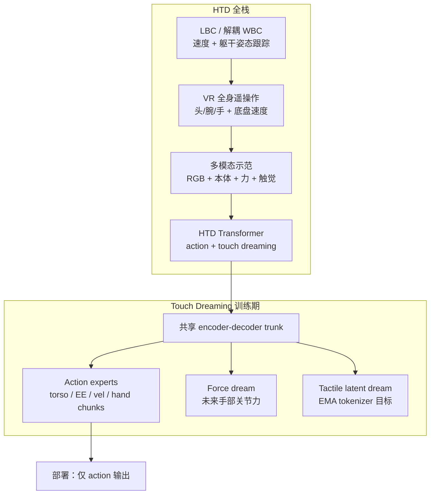
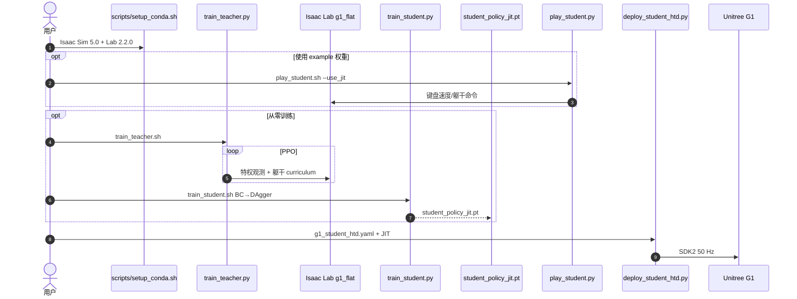

# Humanoid Touch Dream（Learning Versatile Humanoid Manipulation with Touch Dreaming）

**Humanoid Touch Dream（HTD）**（[arXiv:2604.13015](https://arxiv.org/abs/2604.13015)，[项目页](https://humanoid-touch-dream.github.io/)，[论文仓](https://github.com/chrisyrniu/humanoid-touch-dream)）由 **卡内基梅隆大学（CMU）**、**德克萨斯大学阿灵顿分校（UT Arlington）** 与 **博世人工智能中心（Bosch Center for AI）** 提出：在 **解耦全身控制（WBC/LBC）** 稳定下肢与躯干的前提下，用 **VR 全身遥操作** 采集含双手分布式触觉与手部关节力的示范，再以 **Humanoid Transformer with Touch Dreaming** 做多模态行为克隆——训练期额外预测 **未来手部力** 与 **触觉 latent**，迫使共享 trunk 学到接触动态；部署时仅输出 action chunks。

## 一句话定义

**把人形接触丰富型 loco-manipulation 拆成「RL 下肢稳住全身 → VR 采到真接触 → Transformer 一边克隆动作一边做梦预测触觉」——触觉不是多拼几路传感器，而是靠未来接触预测才进策略表征。**

## 英文缩写速查

| 缩写 | 英文全称 | 简要说明 |
|------|----------|----------|
| HTD | Humanoid Transformer with Touch Dreaming | 本文多模态模仿策略与 Touch Dreaming 训练目标 |
| LBC | Lower-Body Controller | RL 下肢+腰控制器，论文中亦称解耦 WBC 的执行层 |
| WBC | Whole-Body Control | 协调全身关节满足移动与躯干姿态命令 |
| ACT | Action Chunking Transformer | 行为克隆基线：短 horizon 动作块预测 |
| BC | Behavior Cloning | 从示范直接监督学习策略 |
| VR | Virtual Reality | 全身遥操作采集头/腕/手与底盘速度命令 |
| EMA | Exponential Moving Average | 触觉 tokenizer 的慢速 teacher，提供稳定 latent 目标 |
| RGB | Red-Green-Blue | 头部/腕部多视角彩色图像观测 |

## 核心信息

| 项 | 内容 |
|----|------|
| **机构** | CMU；UT Arlington；Bosch Center for AI |
| **会议** | **IROS 2026**（论文仓 README 已标注） |
| **平台** | 人形机器人（真机五任务；WBC 开源栈面向 **Unitree G1**） |
| **系统三层** | [解耦 WBC/LBC](./htd-decoupled-wbc.md) → VR 全身遥操作采数 → HTD 多模态策略 |
| **触觉规模** | 双手各 **1062 维** 分布式触觉 + 手部关节力；覆盖 **17** 个空间感知区域 |
| **开源** | **部分开源** — [IsaacLab-Decoupled-WBC](https://github.com/chrisyrniu/IsaacLab-Decoupled-WBC) **已发布**（训练/蒸馏/G1 部署 + example checkpoint）；[humanoid-touch-dream](https://github.com/chrisyrniu/humanoid-touch-dream) 为入口仓；**VR 遥操作采数与 HTD 策略训练仍 on-going**（截至 2026-09-03） |

## 为什么重要

- **分层而非端到端蛮干：** 下肢/躯干稳定性外包给 RL LBC，策略主要学上身、双手与速度命令，降低全身 BC 的动力学负担。
- **接触数据进闭环：** VR 采数同步记录 RGB、本体、手部力与双手触觉，插入/折叠/工具/端杯等阶段不是事后补标签。
- **Touch Dreaming 有消融支撑：** 仅给 ACT 加触觉输入 **不稳定**；预测未来接触（尤其 **latent tactile** 而非 raw array）才带来约 **30% relative** 成功率增益。
- **WBC 可独立复用：** 相对 [AMO](./paper-loco-manip-161-135-amo.md)、[FALCON](./paper-loco-manip-161-109-falcon.md) 等项目页跟踪误差对照有竞争力；浏览器 [MuJoCo Demo](https://humanoid-touch-dream.github.io/wbc_mujoco/dist/index.html) 可交互验证。
- **真机五任务覆盖：** Insert-T、Book Organization、Towel Folding、Cat Litter Scooping、Tea Serving — 紧公差、薄物体、可变形、蹲下工具操作与双手端杯行走。

## 流程总览

## 核心机制（归纳）

### 1. 解耦 WBC 作为稳定执行层

RL teacher 在 Isaac Lab 上学习跟踪 **(vx, vy, yaw rate)** 与 **躯干 height/roll/pitch/yaw**；再经 BC→DAgger 蒸馏为只依赖真机可观测本体信息的 **15 DoF** student，上肢保持默认位姿或外部命令。详见 [HTD 解耦 WBC](./htd-decoupled-wbc.md)。

### 2. VR 遥操作与多模态示范

操作者头/腕/手经 IK 与 DexPilot 式 retargeting 映射为躯干命令、腕部 6D pose 与灵巧手目标；摇杆提供底盘速度。每条轨迹同步含头部/腕部 RGB、本体、手部关节力、双手触觉与全身 action targets。

### 3. HTD 策略与 Touch Dreaming

多模态 tokenizer 将各输入压成 tokens，encoder-decoder Transformer 融合后：

| 分支 | 训练目标 | 部署 |
|------|----------|------|
| Action experts | torso、end-effector、velocity、dexterous-hand **action chunks** | **参与控制** |
| Force dream expert | 未来手部关节力（Smooth L1） | 不参与 |
| Tactile latent dream expert | 未来触觉 latent（EMA teacher + cosine/magnitude） | 不参与 |

EMA tactile tokenizer **不反传梯度**，避免 student 与 detokenizer 共同塌缩到无信息表示。

## 源码运行时序图

**HTD 策略训练/部署代码：** **不适用** — 截至入库日（2026-09-03）论文仓 README 仍将「全身遥操作与采数」「HTD 策略训练与部署」标为 **on-going**；无官方策略训练或 rollout 入口。

**已开源的解耦 WBC（论文系统下层，与 [htd-decoupled-wbc.md](./htd-decoupled-wbc.md) 对齐）：**

策略层若未来开源，预期路径：VR 采数 → 多模态 dataset → HTD 训练（BC + touch dreaming loss）→ 冻结 dream heads 部署 action experts。

## 实验与评测

| 任务 | 特点 |
|------|------|
| **Insert-T** | 紧公差插入 |
| **Book Organization** | 薄物体推抓 |
| **Towel Folding** | 可变形物体折叠 |
| **Cat Litter Scooping** | 蹲下工具操作 |
| **Tea Serving** | 双手端杯 + 移动操作 |

- **试验规模：** 每任务/方法 **20** 次真机 trial。
- **相对更强 ACT 基线：** 平均成功率 **+30.0 个百分点**，约 **90.9% relative** improvement。
- **触觉消融：** **latent tactile dreaming** 相对 **raw tactile prediction** 约 **+30% relative** 成功率；单纯加触觉观测到 ACT **不稳定**。
- **WBC 跟踪：** 项目页给出相对 AMO、FALCON 的 \(E_v, E_\omega, E_h, E_y, E_r\) 等跟踪误差对照（HTD WBC 在多数指标更优；FALCON 不跟踪 pitch/roll）。

## 结论

**HTD 用「稳定 WBC + 含触觉的 VR 示范 + 未来接触预测式 BC」把接触丰富人形 loco-manipulation 做成可验证栈；开源边界清晰，但策略复现仍待官方发布。**

1. **分层是前提** — 先把下肢/躯干交给 RL LBC，再学上身与双手，比纯端到端 BC 更可行。
2. **触觉要「做梦」才管用** — 被动拼接触觉观测不够；未来力与 **latent** 触觉预测才是表征压力。
3. **Latent 优于 raw tactile** — 高维稀疏阵列直接回归易追噪声；EMA teacher latent 更稳（约 30% relative gain）。
4. **部署保持简洁** — dream heads 仅训练期存在，推理只走 action experts。
5. **WBC 可先落地** — Isaac Lab 训练、G1 零样本部署与浏览器 Demo 已可用；不必等策略代码。
6. **采数栈仍封闭** — Apple Vision Pro / PICO 仿真遥操作未发布，完整复现 HTD 策略需跟进论文仓 checklist。
7. **与纯视觉 BC 对照** — 五任务均超 ACT，说明接触丰富移动操作需要显式接触模态与训练目标。

## 工程实践

| 项 | 建议 |
|----|------|
| **先 WBC** | `bash scripts/play_student.sh` 验证 bundled JIT；真机按 [Deployment Guide](https://github.com/chrisyrniu/IsaacLab-Decoupled-WBC/blob/main/docs/deployment.md) |
| **环境** | Isaac Sim **5.0** + Isaac Lab **2.2.0**；或 Docker `chrisyrniu/htd-wbc:isaaclab-2.2.0` |
| **训练量级** | Teacher 默认 12288 env；Student BC 250k → DAgger 600k（单 GPU 可跑通） |
| **策略复现** | 关注 [humanoid-touch-dream](https://github.com/chrisyrniu/humanoid-touch-dream) README checklist；遥操作与 HTD 训练 **on-going** |
| **Demo** | [浏览器 MuJoCo WBC](https://humanoid-touch-dream.github.io/wbc_mujoco/dist/index.html) — 七组运动命令，青色带为训练范围 |
| **动捕数据** | `dataset/g1/CMU/` 受 AMASS  retarget 条款约束，勿与 BSD 软件许可混淆 |

## 与其他工作对比

| 对照 | 差异读法 |
|------|----------|
| [ACT / Action Chunking](../methods/action-chunking.md) | HTD 继承 chunking，但加多模态与 touch dreaming；论文主基线 |
| [AGILE](./paper-agile-humanoid-loco-manipulation.md) | 同为 Isaac Lab 人形工作流；AGILE 偏 **RL 生命周期**，HTD 偏 **触觉 BC + 解耦 WBC** |
| [AMO](./paper-loco-manip-161-135-amo.md) / [FALCON](./paper-loco-manip-161-109-falcon.md) | 项目页 WBC 跟踪误差对照对象 |
| [ViTacFormer](https://arxiv.org/abs/2506.15953) | 视触觉表征学习；HTD 强调 **未来触觉预测** 而非仅融合 |
| [161 篇 #092](./paper-loco-manip-161-092-n092.md) | 策展索引条目；量化指标与机制以 **本页** 为准 |

## 局限与风险

- **策略与采数未开源** — 截至 2026-09-03 无法复现 HTD 训练与 VR 数据管线；WBC  alone 不能代表全文贡献。
- **平台绑定** — 开源 WBC 面向 G1；论文五任务真机细节与机体配置以 PDF 为准。
- **触觉硬件依赖** — 双手 1062 维×2 的传感与标定门槛高，迁移到其他手型需重做 tokenizer 与采数。
- **BC 固有限制** — 单阶段模仿，未见论文主线的在线 DAgger 纠错（WBC student 侧有 DAgger）。
- **索引页勿当结论** — [161 #092](./paper-loco-manip-161-092-n092.md) 为地图坐标，benchmark 以本文与项目页为准。

## 关联页面

- [Humanoid Transformer with Touch Dreaming（方法）](../methods/humanoid-transformer-touch-dreaming.md) — Touch Dreaming 机制展开
- [HTD 解耦 WBC](./htd-decoupled-wbc.md) — 可运行 LBC 实现
- [Loco-Manipulation](../tasks/loco-manipulation.md) — 接触丰富移动操作语境
- [Teleoperation](../tasks/teleoperation.md) — VR 采数栈（待发布）
- [Tactile Sensing](../concepts/tactile-sensing.md) / [Visuo-Tactile Fusion](../concepts/visuo-tactile-fusion.md)
- [Unitree G1](./unitree-g1.md) — WBC 部署平台

## 参考来源

- [humanoid_touch_dream.md](../../sources/papers/humanoid_touch_dream.md)
- [humanoid_touch_dream.md](../../sources/repos/humanoid_touch_dream.md)
- [isaaclab_decoupled_wbc.md](../../sources/repos/isaaclab_decoupled_wbc.md)
- [humanoid-touch-dream.md](../../sources/sites/humanoid-touch-dream.md)

## 推荐继续阅读

- [HTD 项目主页](https://humanoid-touch-dream.github.io/)
- [arXiv:2604.13015 PDF](https://arxiv.org/pdf/2604.13015)
- [IsaacLab-Decoupled-WBC](https://github.com/chrisyrniu/IsaacLab-Decoupled-WBC) — WBC 训练与 G1 部署
- [浏览器 WBC Demo](https://humanoid-touch-dream.github.io/wbc_mujoco/dist/index.html)
- [Humanoid Transformer with Touch Dreaming 方法页](../methods/humanoid-transformer-touch-dreaming.md)
