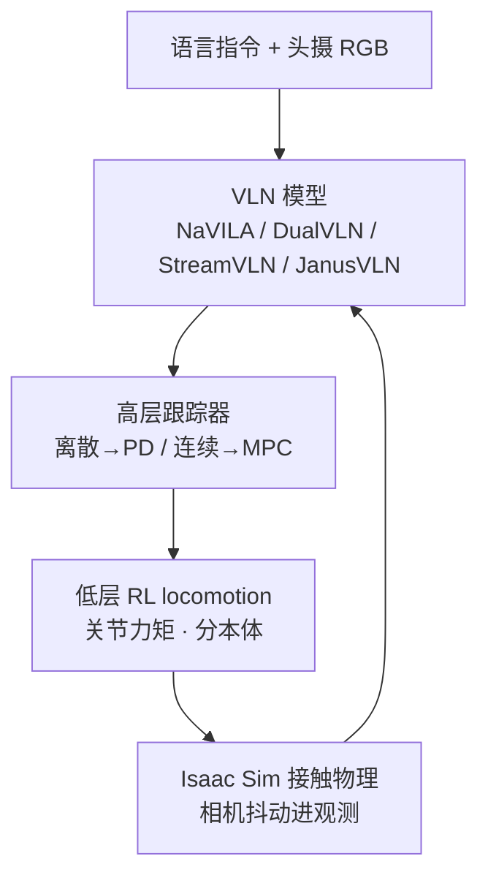

# HumanoidVLN：跨人形本体的物理接地 VLN 仿真与基准

**HumanoidVLN**（*A Physics-Grounded Simulator and Benchmark for Vision-Language Navigation Across Diverse Humanoid Embodiments*，[arXiv:2608.12860](https://arxiv.org/abs/2608.12860)，[项目页](https://humanoid-vln.github.io/)）由 **VinMotion** 与 **南加州大学（USC）** 提出：在 [Isaac Sim](./isaac-sim.md) 上把 VLN 评测从运动学传送改成 **真实双足执行**，并在 **Unitree G1 / H1** 与两台内部机型上做匹配零样本对照。指令由 Generator–Reviewer–Paraphraser 多智能体加人工核验生成；被评模型包括 [NaVILA](./paper-notebook-navila-legged-robot-vision-language-action-model.md)、DualVLN、StreamVLN、JanusVLN。

## 一句话定义

**不要用传送和「通用轮式代理」测人形 VLN：每台双足用自己的 RL 步态走完全程，场景必须走得进去，指令必须和走过的视频对得上。**

## 英文缩写速查

| 缩写 | 英文全称 | 简要说明 |
|------|----------|----------|
| VLN | Vision-and-Language Navigation | 语言指令 + egocentric 视觉下的具身导航 |
| MAA | Multi-Agent Annotation | 双生成器–核验器–改写器 + 人工终审的指令管线 |
| nDTW | Normalized Dynamic Time Warping | 与参考路径的形状相似度，不依赖是否成功 |
| FR | Fall Rate | 发生摔倒的 episode 比例；本文新增物理稳定性指标 |
| 3DGS | 3D Gaussian Splatting | Real2Sim 外观重建；碰撞网格另由 TSDF 提取 |
| SR | Success Rate | 停在目标 3 m 内算成功（沿用 VLN-CE 半径） |
| SPL | Success weighted by Path Length | 成功且路径短才高 |
| PD / MPC | Proportional–Derivative / Model Predictive Control | 高层路径跟踪器；离散模型配 PD，连续速度配 MPC |

## 为什么重要

- **VLN-CE 之后的下一道墙：** [VLN-CE](./paper-vln-02-vln-ce.md) 把图跳转改成连续前进/转向，但仍可绕过双足接触与质心。HumanoidVLN 把 **步态可执行性** 和 **摔倒** 写进协议。
- **跨本体不是换 mesh：** G1（1.32 m / 12 DoF）与 H1（1.80 m / 10 DoF）在同一 933 条 episode 上 SR 可差十几到二十点；H1 上部分模型 FR 超过 60%。这是选型信号，不是渲染差。
- **指令与观测对齐行走：** 视频从走路机器人头摄录出，带步态抖动；MAA 用结构化路线图对账，避免单次 VLM 左右反了仍进榜。
- **开源边界：** 截至 **2026-08-14** 项目页无 GitHub。今日只读表和协议，不能当可跑通复现栈（对照 [四范式](../overview/vln-open-source-repro-paradigms.md)）。

## 核心信息

| 字段 | 内容 |
|------|------|
| 机构 | 越南人形机器人（VinMotion, Inc.）；南加州大学（USC，Quan Nguyen） |
| 出处 | arXiv:2608.12860（2026-08-13）；cs.RO |
| 仿真 | NVIDIA Isaac Sim；新机器人需 URDF/USD + 已训 locomotion 策略 |
| 本体 | G1 12 DoF / 1.32 m；H1 10 DoF / 1.80 m；Internal-A 12 DoF / 1.61 m；Internal-B 12 DoF / 1.17 m |
| 数据 | 87 场景、933 episode；每条 1 细 + 3 粗风格；**评测集，不微调被评模型** |
| 被评模型 | NaVILA、StreamVLN、JanusVLN（离散 + PD）；DualVLN（连续速度 + MPC） |
| 开源（截至 2026-08-14） | **宣称将开源 / 待发布**：录用后放代码与数据；项目页未列仓库 |

## 方法与核心结构

分层控制保证「计划」必须被该本体真正走出来：

| 模块 | 作用 |
|------|------|
| **观测–动作接口** | 模型只看头摄 RGB + 指令，输出动作；平台译成跟踪器参考。接新模型只实现该接口。 |
| **低层 RL** | 每本体独立策略，守关节限位与质心，出力矩而不是传送位姿。 |
| **高层跟踪** | PD 配离散 `{forward, turn, stop}`；MPC 配 DualVLN 连续速度。跟踪器本身是实验变量。 |
| **可通行切片** | 按身高切碰撞网格 → 2D 占据图，按最高本体足迹膨胀；A\* 采样 start–goal，走不稳就重采样。 |
| **3DGS Real2Sim** | COLMAP → gsplat；无偏深度 + 深度–法向一致；TSDF 出碰撞网格，与 Gaussian 打进同一 USDZ。Isaac Sim 5.1 原生渲染 3D Gaussian。 |
| **MAA** | 两路生成器只看关键帧建 \(R=\langle(a_i,\ell_i,s_i,o_i,m_i)\rangle\)；核验器拿轨迹 / A\* / 可见物体 scene-graph；改写必须保动作与地标顺序。 |

场景准入是 **≥100 m² 可通行地面**（相对最高本体膨胀足迹人工核对），不是「场景张数越多越好」。最终 87 场：中位 266 m²、均值 387 m²；路径中位 9.97 m，指令中位 50 词，路径长度与指令长度相关仅 **r=0.29**。

### 流程总览

## 源码运行时序图

**不适用**（截至 2026-08-14）：项目页与论文只承诺录用后开源，**未提供** 训练 / 评测 / 数据入口。放出后应补：USD/URDF 加载 → locomotion 策略 → VLN 接口 → 933 episode 评测 →（可选）G1 真机对齐。

## 工程实践

| 项 | 建议 / 论文设定 |
|----|----------------|
| **何时用这篇** | 要在人形上比 VLN 模型，且关心摔倒、步态相机、跨身高/DoF |
| **何时不用** | 需要今天就跑通的 Habitat/R2R 栈 → 走 [四范式](../overview/vln-open-source-repro-paradigms.md)；城市户外方向指令 → [DA-Nav](./paper-da-nav.md) |
| **接新机器人** | URDF/USD + 该本体 RL 步态；不要复用别的机型控制代理 |
| **接新 VLN** | 只实现 RGB+指令→动作；离散走 PD，连续速度走 MPC |
| **读 FR** | 摔倒即终止、无自动爬起；T1/T2/T3 用相对身高阈值，排除正常下蹲 |
| **读 SR** | 仍是 **3 m** 停靠；末段朝向/可见性不在协议里（对照 [REALM](./paper-realm-last-3-meter-vln-grounding.md)） |
| **指令风格** | 每 episode 四风格按固定近似均衡分配，全模型共用，保证可复现 |
| **Sim2Real 试点** | DualVLN + G1 + D435i；Orin 上机、A6000 Pro 推理；只覆盖两场景 |

## 实验与评测

零样本、同一 933 条、同一风格分配。SR = 停在目标 **3.0 m** 内。

| 模型 | 四本体平均读法 | 突出点 |
|------|----------------|--------|
| **JanusVLN** | 平均 SR **43.55%**、nDTW **48.38** | G1 SR 44.59；Internal-A SR **50.38**（表内最高） |
| **DualVLN** | 平均 nDTW 43.39（第二） | 跨本体 **FR 最低**；G1 SR 35.05 |
| **NaVILA** | 中游 SR | 平均 OS–SR 差 **17.39**；H1 FR **70.95%** |
| **StreamVLN** | 平均 SR **23.63%**、nDTW 36.67 | 论文称更吃连续视频，但本协议下最弱；H1 FR **64.52%** |

**本体效应：** H1 平均 SR **20.84%**，其余三机约 32–37%。Internal-A 平均 SR 最高（36.66%），G1 平均 SPL 最高（25.19）。作者把 H1 崩盘同时归因于形态、步态策略与跟踪器设定，**未做单因素消融**。

**3DGS 几何：** 相对原版 gsplat，加深度–法向一致再加无偏深度，法向更连续，TSDF 碰撞网格才适合物理仿真。

**Sim–real（N=20）：** DualVLN 在 pantry + studio 上仿真 vs 真机 NE Pearson **r=0.935**（Spearman 0.911），绝对差均值 **0.68 m**、符号差 0.04 m；成对轨迹 nDTW **0.782±0.188**（studio 0.803 / pantry 0.761）。范围只到「这对重建场景」，不是场景级泛化证明。

## 结论

**人形 VLN 的分数差，往往来自「这台双足能不能把计划走完」，而不是 VLM 榜上再涨几个点。**

1. **真影响：物理执行进协议** — 传送式 VLN 看不到 H1 上 60%+ 摔倒；FR 与 SR 必须一起读。
2. **真影响：分本体控制** — 把人形当轮式/四足的互换 mesh，会掩盖步长、相机高度与质心差。
3. **真影响：可通行筛选** — 场景张数不是规模；<100 m² 或窄门家具会把双足卡死在拓扑瓶颈。
4. **次要代价：3 m SR 仍粗** — 协议继承 VLN-CE 半径，不评最终朝向与目标可见性。
5. **次要代价：H1 差未拆因** — 形态、步态策略与跟踪器缠在一起，不能直接说「高个子一定难」。
6. **部署读法：** DualVLN 连续速度在稳定性和路径保真上更像可上真机的接口；JanusVLN 仿真 SR 最高，H1 FR 仍约 31%。
7. **工程读法：无代码** — 2026-08-14 只能引用数字与项目页叙事；复现仍走已开源 NaVILA / Habitat 栈。

## 与其他工作对比

| 对照 | 差异读法 |
|------|----------|
| [VLN-CE](./paper-vln-02-vln-ce.md) | 连续动作，但仍是 Habitat 运动学步进；本文把接触与摔倒算进去 |
| VLN-PE / VLNVerse | 同为 Isaac 物理 VLN，但人形只是多种本体之一、场景不按双足可通行筛、指令多为单次 VLM |
| [NaVILA](./paper-notebook-navila-legged-robot-vision-language-action-model.md) | 腿式分层 VLA 代表实现，且已开源；在本基准上是 **被测对象**，H1 FR 很高 |
| [REALM](./paper-realm-last-3-meter-vln-grounding.md) | 补 REVERIE **末 3 m 实例可见性**；本文补 **双足物理可执行性**，轴正交 |
| [DA-Nav](./paper-da-nav.md) | 城市户外方向指令 + 四足/人形零样本；本文是室内物理 VLN 平台 |
| [CrossTracer](./paper-crosstracer.md) | 改的是图像平面 trace 是否按本体可走；本文评的是双足能不能把计划走完。轴正交 |
| [WorldVLN](./paper-worldvln-aerial-vln-wam.md) | 空中连续航点 WAM；本体与动作空间都不同 |

## 局限与风险

- **待开源：** 无法本地复现 933 条评测或 3DGS 管线。
- **内部机型双盲：** Internal-A/B 不可当公开硬件选型依据。
- **评测即全集：** 没有 train/val 划分；往上微调会泄漏。
- **Sim–real 很小：** 两场景、一模型、一机型。
- **算力：** 全文物理仿真比 Habitat 离散图贵一个数量级。
- **人工核验仍是瓶颈：** 作者自己把 HITL 写成扩展障碍。

## 关联页面

- [视觉–语言导航](../tasks/vision-language-navigation.md) — 任务定义；本文是人形物理执行层
- [VLN 分类 01：数据集与仿真平台](../overview/vln-category-01-datasets-platforms.md) — R2R → VLN-CE 之后的物理平台对照
- [VLN 四范式开源复现](../overview/vln-open-source-repro-paradigms.md) — 今日可跑通的栈；本文不进入清单
- [NaVILA](./paper-notebook-navila-legged-robot-vision-language-action-model.md) — 本基准离散模型之一
- [VLN-CE](./paper-vln-02-vln-ce.md) — 连续环境前身
- [Isaac Sim](./isaac-sim.md) — 仿真底座
- [Unitree G1](./unitree-g1.md) — 仿真与 20 条真机试点平台
- [Sim2Real](../concepts/sim2real.md) — 重建场景与真机 NE 相关
- [Locomotion](../tasks/locomotion.md) — 低层步态；本文把它接到 VLN 评测环
- [VLN 10 篇技术地图](../overview/vln-10-papers-technology-map.md) — 2018–2024 基础设施地图；本文是后续物理层
- [具身大模型评测基准选型闭环](../queries/embodied-eval-benchmark-selection-loop.md) — 本文落在策略任务成功率 + sim↔real 校准层；FR 把物理可执行性写进协议
- [CrossTracer](./paper-crosstracer.md) — 跨本体像素轨迹残差（NaviTrace）；不评摔倒

## 参考来源

- [humanoidvln_arxiv_2608_12860.md](../../sources/papers/humanoidvln_arxiv_2608_12860.md)
- [项目页归档](../../sources/sites/humanoid-vln-github-io.md)
- [具身智能小站 10 篇盘点（2026-08-19）](../../sources/blogs/wechat_embodied_station_world_model_exec_10_papers_2026-08-19.md)
- Pham et al. — <https://arxiv.org/abs/2608.12860>
- 项目页 — <https://humanoid-vln.github.io/>

## 推荐继续阅读

- 项目页对照表与 FR 协议 — <https://humanoid-vln.github.io/>
- NaVILA（已开源腿式 VLN）— <https://arxiv.org/abs/2412.04453>
- DualVLN — <https://arxiv.org/abs/2512.08186>
- StreamVLN — <https://arxiv.org/abs/2507.05240>
- JanusVLN — <https://arxiv.org/abs/2509.22548>
- VLN-PE — <https://arxiv.org/abs/2507.13019>
- VLNVerse — <https://arxiv.org/abs/2512.19021>
