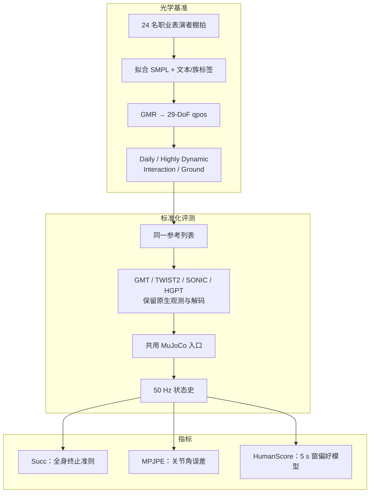
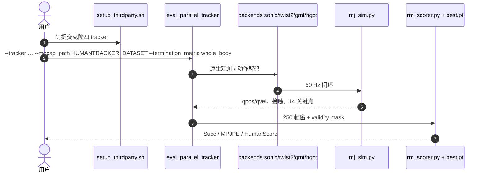

# HumanTracker（Comprehensive and Human-Aligned Motion Tracking Benchmark）

**HumanTracker**（*Towards Comprehensive and Human-Aligned Motion Tracking Benchmark*，南开大学、清华大学、银河通用、上海交通大学、北京大学、上海期智研究院，arXiv:[2608.13555](https://arxiv.org/abs/2608.13555)，仓库标注 **ECCV 2026**）把人形 motion tracking 评测拆成两件事：一块 **按失败机制分族的大规模光学基准**，一个从专家成对偏好学出来的轨迹指标 **HumanScore**。目标是让「数字好看」和「视频里像不像人」对齐，而不是再用 AMASS 百余条 + 平均关节误差代替诊断。

## 一句话定义

**用四族 153 小时光学参考压 tracker，再用 HumanScore 预测人更喜欢哪条 rollout——别只报 MPJPE。**

## 英文缩写速查

| 缩写 | 英文全称 | 简要说明 |
|------|----------|----------|
| HumanScore | Human-aligned trajectory score | 本文偏好奖励模型输出，0–100，越高越好 |
| MPJPE | Mean Per-Joint Position Error | 本文为 29 主动关节角平均绝对误差（rad） |
| Succ | Success / completion rate | 未触发全身终止准则的回合比例 |
| GMR | General Motion Retargeting | 人体拟合轨迹到机器人 `qpos` 的前端 |
| SMPL | Skinned Multi-Person Linear Model | 每条 clip 附带的人体拟合表示 |
| MoCap | Motion Capture | 24 名职业表演者的光学棚拍来源 |
| DoF | Degrees of Freedom | 评测本体 29 个主动关节 |
| MAE | Mean Absolute Error | 关键点位置等解析诊断 |

## 为什么重要

- **评测错位是真问题，不是边角：** 脚滑、支撑切换、接触时序和失败恢复决定视频观感，却会被逐帧姿态平均抹平。观察者会稳定偏好接触干净的那条，即使 MPJPE 接近。
- **常用测试集太小：** 论文指出主流 tracker 仍在 **AMASS 约 140 条** 上汇总一个总分；缺长尾接触、不对称平衡和复杂恢复，也看不到「败在哪一族」。
- **把对照协议标准化：** GMT / TWIST2 / SONIC / Humanoid-GPT 保留各自策略接口，但参考表示、rollout 记账、终止准则和指标实现被钉死——读表时比的是 tracker，不是后处理。
- **HumanScore 不是再堆一条规则：** 族均衡对齐率 **90.83%**，比最强单条解析诊断高约 **6.8** 点；消融说明优势来自 **数秒接触证据**，不是未来参考残差。

## 核心信息

| 字段 | 内容 |
|------|------|
| 作者 | Dairu Liu\*、Zekun Qi\*、Jiayu Zeng\*、Ruixi Yu、Yu Guan、Yintianrun Zhang、Xuchuan Chen、Sikai Liang、Zekai Li、Chenghuai Lin、Xinqiang Yu、Wenyao Zhang、He Wang†、Li Yi† |
| 机构 | 南开大学；清华大学；银河通用（Galbot）；上海交通大学；北京大学；上海期智研究院 |
| 出处 | arXiv:2608.13555（2026-08-13）；仓库 README 标 ECCV 2026 |
| 评测本体 | 29-DoF 人形，`qpos` 参考，MuJoCo，50 Hz |
| 重定向 | [GMR](../methods/motion-retargeting-gmr.md)；人工剔除漂浮 / 穿地 / 接触不连续 |
| 开源（截至 2026-08-15） | **部分开源**：评测框架 + HumanScore 训练/权重已开；**153 h 数据集未发布**。项目页按钮仍写 Coming Soon，以 GitHub README 为准 |

## 流程总览

四族按**暴露的失败机制**划分，而不是按活动频率强行均分；主表必须按族报，不能只报一个总分。

| 族 | 小时 / clip | 典型压力 |
|----|-------------|----------|
| Daily | 89.29 / 9,739 | 稳态行走、转弯、残余漂移 |
| Highly Dynamic | 11.01 / 2,676 | 冲击、腾空、快步点地 |
| Interaction | 47.78 / 10,940 | 手–臂–全身协调（人体参考，可作操作运动学先验） |
| Ground | 4.59 / 1,640 | 低姿、多接触、起身恢复 |
| 合计 | ~153 / ~25K | 训练 22,495 / 测试 2,500，按源动作 9:1 |

## 核心机制

### 标准化 tracker 评测

对每个方法：参考先转成同一套 29-DoF `qpos`，再走共用 MuJoCo 入口。策略观测和动作解码保持原样；评测器统一运动列表、机器人模型、参考索引、rollout 记账和指标实现。每步记录广义位置/速度、策略动作、电机目标、足接触与力、足/骨盆速度、14 个关键点位姿与空间速度。同一份状态史同时喂解析诊断和 HumanScore。

终止准则对齐 [SONIC](../methods/sonic-motion-tracking.md)：骨盆、双踝或双腕垂向误差超过 **0.25 m**，骨盆旋转超过 **1 rad**，或 `qpos`/`qvel` 非有限，即失败。Succ 是跑完比例；MPJPE 只在**已执行片段**上对 29 个主动关节取平均绝对误差。

### HumanScore

偏好池只用**训练 split**，避免测试动作泄漏。四条 tracker 对同一参考出对齐 rollout，按 250 帧（5 s @ 50 Hz）切窗；在族 / 源动作 / 时间上均匀抽样，六种无序配对各占一份。6 名人形方向博士看同步视频，先判是否失衡或没跑完，再比抖动、脚滑、步态一致性和全身自然度。标签含严格偏好、Similar、Cannot compare（后者不进训练）。原始 **6,000** 对经左右镜像变成 **12,000** 条；按 `motion_id` 80/20 划分。

每帧 **539 维** token：当前参考 70 维 + 仿真 rollout 469 维（状态/动作、测量接触动力学、根运动、14 关键点）。**不用未来参考残差**。线性投影 + 正弦位置编码 → 4 层 Transformer，padding mask 同时挡住注意力和均值池化；MLP 出无界奖励。严格对用 Bradley–Terry；Similar 用对称损失，把胜率推向 0.5。

推理时把整条轨迹切成连续窗，短尾窗右侧补零。窗奖励经 sigmoid 后按真实帧数加权，乘 100 得到 **HumanScore ∈ (0, 100)**。补零不进平均。

## 源码运行时序图

官方仓 [GalaxyGeneralRobotics/HumanTracker](https://github.com/GalaxyGeneralRobotics/HumanTracker) 已提供评测与 HumanScore 训练入口；**25K 运动 NPZ 仍需本地数据集**（项目页 Dataset · Coming Soon）。一次「上游 tracker → 共用仿真 → HumanScore」如下：

- **复现边界：** 代码与 HumanScore `best.pt` 已开；没有官方数据路径就跑不了论文主表。`--device cpu` 可比特复现，CUDA 闭环会漂第三位有效数字。
- **训练 HumanScore：** `python -m humantracker.reward_model.train.trainer` 读偏好对，写出 `storage/checkpoints/reward_model/best.pt`；`tool/rm_pipeline` 负责切片与配对。

## 工程实践

| 步骤 | 做法 |
|------|------|
| 装评测环境 | Python 3.12 + CUDA 12.x；`pip install -e .`；SONIC 网格需 git-lfs |
| 拉上游 | `./setup_thirdparty.sh`；SONIC 再 `download_from_hf.py`；HGPT 的 `pns_wo_priv216.onnx` 需另放 |
| 跑主表 | `--termination_metric whole_body`（无默认，避免结果文件说不清规则） |
| 四卡并行 | `HUMANTRACKER_DATASET=… bash src/humantracker/eval/eval.sh` |
| 读 HumanScore | 只在**同一评测设置、同一参考**内比高低；它概括接触/稳定/平滑/贴合，不替代 Succ 与 MPJPE |
| 调试 | 先看族级 Succ：Ground 上 GMT/TWIST2 为 0，说明失败在多接触低姿，不是「整体差一点」 |

## 实验与评测

零样本、不在 HumanTracker 上微调。数字来自论文 Table 3（测试 split）。

| 方法 | Daily Succ / MPJPE / HS | HD Succ / MPJPE / HS | Interaction Succ / MPJPE / HS | Ground Succ / MPJPE / HS |
|------|-------------------------|----------------------|-------------------------------|--------------------------|
| GMT | 17.0 / 0.250 / 2.4 | 36.2 / 0.196 / 7.0 | 81.4 / 0.205 / 11.7 | 0.0 / 0.456 / 4.0 |
| TWIST2 | 60.1 / 0.105 / 10.1 | 39.9 / 0.112 / 16.9 | 91.3 / 0.111 / 28.3 | 0.0 / 0.341 / 4.5 |
| SONIC | 93.8 / 0.102 / 49.5 | 82.1 / 0.118 / 41.0 | **97.6** / 0.128 / 54.6 | 20.1 / 0.231 / **26.5** |
| Humanoid-GPT | **94.4** / **0.046** / **54.7** | **86.9** / **0.047** / **49.2** | 97.2 / **0.070** / **56.8** | **32.9** / **0.216** / 24.9 |

族均衡严格偏好对齐率（Table 4）：HumanScore **90.83%**；KPT MAE **84.05**；MPJVE **84.04**；MPJPE **80.49**；足接触 **78.82**；平均关节加速度 **69.33**。

读法：Humanoid-GPT 在 Daily / Highly Dynamic 三项全领先，整体完成率和贴合最好；SONIC 在 Interaction 完成率最高，在 Ground 上 **HumanScore 更高**——完成率和「看起来稳」可以分家。GMT / TWIST2 在 Ground 上 Succ 为 0，单看 Interaction 完成率会严重高估通用性。

## 结论

**人形 tracking 现在缺的不是又一条 MPJPE，而是「按接触机制分族的大测试集 + 能看见滑步和恢复的轨迹分」；HumanScore 是后者，不能代替 Succ 和关节误差。**

1. **先看族，再看总分** — Ground 只有 4.59 h，却把 GMT/TWIST2 打到 Succ 0；Daily 89 h 上的高分不能外推到跪坐翻滚。
2. **三指标分工** — Succ 挡住「提前摔但仍像准」；MPJPE 定位关节错哪；HumanScore 概括人眼在乎的接触、稳定和恢复。
3. **HumanScore 的增量来自时间 + 接触** — 去掉测量接触在 Ground 上最伤；1 s 窗不够，5 s 才能看到滑步、抖动、漂移和恢复。未来参考残差没有帮助。
4. **零样本表的选型读法** — 要整体贴合与完成率，看 Humanoid-GPT；要 Ground 观感，SONIC 的 HS 更高。不要把项目页同步视频里的排名直接当成可部署排序。
5. **复现边界** — 评测代码和 `best.pt` 已开；**数据集未发布**。HumanScore 输入含仿真特权接触量，不能直接当真机奖励；论文也警告不要未经正则就拿它做 RL 目标。

## 局限与风险

- **数据未随代码发布：** 没有官方 25K NPZ / `train.json`，主表不可复现；项目页 Dataset 仍是 Coming Soon。
- **单本体、单仿真：** 只有 29-DoF 人形 + MuJoCo。跨具身、真机 rollout 都还没做。
- **HumanScore 的泛化范围：** 训练分布是四条 tracker 的 HumanTracker 训练动作；测试是**未见动作**，不是未见机器人、未见仿真器或未见控制器家族。
- **特权特征：** 539 维里含仿真接触力等，真机要用可观测特征或单独验证的状态估计。
- **标注粒度：** 每对一次主判断，没有重复标注量化一致性。
- **族不平衡：** Daily / Interaction 远多于 Ground / Highly Dynamic；必须按族均权读对齐率。
- **不要把 HumanScore 当 RL 奖励：** 直接优化会钻模型空子；需要正则和独立的人评。

## 与其他工作对比

| 路线 | 评测单元 | 相对 HumanTracker |
|------|----------|-------------------|
| AMASS-test ~140 条 | 小集 + 常报单一总分 | 规模与诊断粒度都不够 |
| [PHUMA](./dataset-bfm-phuma.md) 73 h | 物理可信 locomotion 训练源 | 训练友好，但无四族诊断、无文本、无偏好指标 |
| [SONIC](../methods/sonic-motion-tracking.md) 自报协议 | 规模化 tracker 自己的 Succ/误差 | HumanTracker **复用其终止准则**，但换成四族大测试集 |
| [HumanoidArena](./paper-humanoidarena.md) | 分层 HOI/HSI、跨 GMT 后端 | 任务是场景交互，不是纯 tracking 感知质量 |
| HumanTracker | 四族光学参考 + HumanScore | 评测层；不提供新的 tracking 策略 |

## 关联页面

- [运控模型评测指标](../concepts/motion-control-policy-evaluation-metrics.md) — 本文的终止准则对齐、MPJPE 记账口径与 HumanScore 被收进的通用指标体系页

- [Humanoid-GPT](./paper-humanoid-gpt.md) — 本基准上整体最强的零样本 tracker
- [SONIC](../methods/sonic-motion-tracking.md) — Interaction Succ 与 Ground HumanScore 的对照强基线
- [GMT](./paper-gmt.md) / [TWIST2](./paper-twist2.md) — 同一协议下暴露 Ground 崩溃
- [GMR](../methods/motion-retargeting-gmr.md) — 人体→机器人参考前端
- [人形运动跟踪方法选型](../queries/humanoid-motion-tracking-method-selection.md) — 把「怎么评」补进「怎么选」
- [具身大模型评测基准选型闭环](../queries/embodied-eval-benchmark-selection-loop.md) — 本页是其 ③ 策略任务成功率评测层的人形 tracking 代表基准（四族分层 + 偏好对齐指标），双向回链
- [人形参考运动数据集选型](../comparisons/humanoid-reference-motion-datasets.md) — 与 AMASS / PHUMA 对照
- [Whole-Body Tracking Pipeline](../concepts/whole-body-tracking-pipeline.md) — 重定向 → tracker → 评测的上下文

## 参考来源

- [humantracker_arxiv_2608_13555.md](../../sources/papers/humantracker_arxiv_2608_13555.md) — arXiv 策展摘录
- [humantracker-dairuliu-github-io.md](../../sources/sites/humantracker-dairuliu-github-io.md) — 项目页公开主张
- [humantracker.md](../../sources/repos/humantracker.md) — 官方评测仓与入口

## 推荐继续阅读

- 论文：<https://arxiv.org/abs/2608.13555>
- 项目页：<https://dairuliu.github.io/humantracker/>
- 代码：<https://github.com/GalaxyGeneralRobotics/HumanTracker>
- 对照：[Humanoid-GPT](https://qizekun.github.io/Humanoid-GPT/) · [GEAR-SONIC](https://nvlabs.github.io/GEAR-SONIC/)
