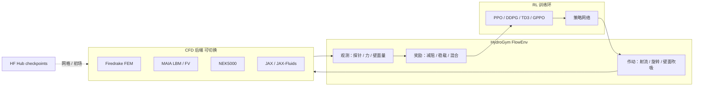
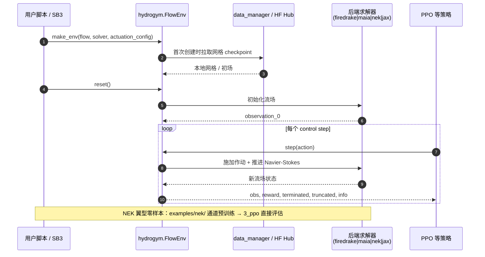

# HydroGym：流体动力学强化学习平台

**The HydroGym reinforcement learning platform for fluid dynamics**（Lagemann 等，*Nature* 2026，DOI [10.1038/s41586-026-10917-6](https://doi.org/10.1038/s41586-026-10917-6)）提出面向 **主动流控（active flow control, AFC）** 的 **solver-independent** 强化学习基础设施：**HydroGym**。平台以 **[Gymnasium](./gymnasium.md) 兼容 API** 封装 **61+** 经校验的流场环境，横跨 **6** 类 CFD 后端（有限元 / 格子玻尔兹曼 / 有限体积 / 谱元 / 可微 JAX），Re 上至 **\(4\times10^5\)**，并系统报告 **PPO / DDPG / TD3** 基线与 **GPPO、多智能体、迁移学习** 扩展。全文开放获取推荐入口为 **arXiv:2512.17534**；官方实现 **MIT** 开源于 `dynamicslab/hydrogym`。

## 一句话定义

**把流控从「单几何单工况手工调参」升级为可累积、可对比的 Gymnasium 基准套件，并用通道湍流代理上的零样本翼型部署证明：RL 能学到可迁移的近壁控制先验，而非工况记忆。**

## 英文缩写速查

| 缩写 | 英文全称 | 简要说明 |
|------|----------|----------|
| AFC | Active Flow Control | 通过射流、壁面吹吸等主动作动改变流场 |
| CFD | Computational Fluid Dynamics | 计算流体力学，HydroGym 各环境的物理内核 |
| RL | Reinforcement Learning | 通过与流场仿真交互学习控制策略 |
| GPPO | Gradient-enhanced PPO | 利用可微求解器梯度的 PPO 变体，提升样本效率 |
| MARL | Multi-Agent Reinforcement Learning | 多智能体 RL；用于 spanwise 分布作动器协同 |
| ZNMF | Zero Net Mass Flux | 零净质量流量射流约束（吸吹配对） |
| Re | Reynolds Number | 雷诺数，刻画惯性/粘性比 |
| TBL | Turbulent Boundary Layer | 湍流边界层；高 Re 减阻主战场之一 |
| LBM | Lattice Boltzmann Method | 格子玻尔兹曼法；MAIA 后端大规模 GPU 求解 |

## 为什么重要

- **填补 benchmark 缺口：** 类比 AlphaFold / 聚变等离子体 RL 的 **共享环境**，流控长期缺少可公平对比的标准套件；HydroGym 把 **环境、接口、评测** 产品化。
- **求解器解耦：** 同一 RL 训练脚本可在 **Firedrake 原型** 与 **MAIA/NEK 大规模湍流** 间切换，降低「换求解器即换整套代码」的摩擦。
- **可微 + 多智能体：** **JAX/JAX-Fluids** 支撑 **GPPO**（Kolmogorov 流训练迭代 **≥65%** 减少）；**PettingZoo** 接口覆盖 **3D 圆柱 spanwise 射流** 等高维作动。
- **零样本工业叙事：** 仅在 **\(Re_\tau=206\)** 通道训练 **TD3 多智能体**，零样本部署 **\(Re_c=200{,}000\)** 三维 NACA0012，局部 **\(c_f\)** 降 **~38%**、总阻力降 **~11%**，探索代价较直接翼型优化降 **>10⁴** — 为「在简单环境学物理、在复杂几何用控制」提供 Nature 级证据。

## 方法栈：平台核心结构

| 模块 | 作用 |
|------|------|
| **FlowEnv（Gymnasium）** | 统一 `reset` / `step`；配置 `flow` + `solver` + `actuation` |
| **6 求解器后端** | Firedrake（20 环境）、MAIA LBM（55）、MAIA FV（8）、NEK5000（2）、JAX（2）、JAX-Fluids（2） |
| **环境谱系** | 圆柱/方柱/球/立方尾迹；腔体；后向台阶；湍流通道/边界层；NACA0012 定常/阵风；可压缩喷管 SVC；Kolmogorov 湍流 |
| **观测与奖励** | 力传感器、速度/压力/涡量探针、壁面剪切等可配置；减阻/稳载/混合等任务奖励 |
| **训练生态** | Stable-Baselines3、RLlib；`VecNormalize`；HF Hub **checkpoint** 按需下载 |
| **HPC** | MPI 并行求解器 + 分布式 RL；Docker（CUDA Hopper/Blackwell、Turing/Ampere、ROCm） |

## 流程总览（平台数据流）

## 源码运行时序图

典型复现路径：**Docker 起环境** → `examples/firedrake/getting_started/run_example_docker.sh train`（原型）或 `examples/nek/3_ppo/run_ppo_docker.sh`（通道→翼型迁移）。

## 实验要点（归纳）

| 设置 | 要点 |
|------|------|
| **2D 基准** | Pinball \(Re=100\) ~90% 减阻；腔体 \(Re=4200\) 剪切层/声学反馈抑制；圆柱 \(Re=3900\) ZNMF 边界层操纵 |
| **3D 基准** | Pinball \(Re=150\)；开腔 \(Re=7500\)；阵风翼型 \(Re=1000\)，载荷振荡 ~20% 降低 |
| **GPPO** | Kolmogorov 流：相对 PPO 训练样本 **≥65%** 减少，动作幅值更低 |
| **MARL** | 3D 圆柱 \(Re=3900\)：spanwise 分布式 ZNMF，共享梯度与 replay，~8% 减阻 |
| **迁移** | Re 缩放 / 圆→方柱 / 2D→3D：**微调** episode 约减半 |
| **零样本翼型** | 通道 \(Re_\tau=206\) 训练 → NACA0012 \(Re_c=200{,}000\)：**38%** 局部 \(c_f\) 降幅，**11%** 总阻力降幅 |
| **算力** | 全部验证基线累计 **>150,000 GPU·h**（SI） |

## 结论

**HydroGym 的价值是把流控 RL 从个案工程升级为可对比的社区基础设施；Nature 版最有说服力的证据不是单环境减阻百分比，而是通道代理训练在三维高 Re 翼型上的零样本生效。**

- 平台层：61+ 环境 + Gymnasium API + 6 后端，让 PPO/DDPG/TD3 可在同一套接口下跨 Re、维度和可压缩性系统评测，基线训练量级 **>150k GPU·h** 已固化在 SI。
- 算法层：可微后端上的 **GPPO** 在 Kolmogorov 流上比 PPO 少 **≥65%** 迭代；**MARL + 共享 replay** 把 3D 圆柱 spanwise 射流控到 ~8% 减阻，说明高维作动需要分布式接口而非硬堆单智能体动作维。
- 迁移层：Re/几何/2D→3D **微调** 普遍只需约一半 episode；**零样本** 通道→翼型（\(Re_\tau=206\) → \(Re_c=200{,}000\)）局部皮肤摩擦降 **~38%**，总阻力降 **~11%**，优于 opposition control 等金标准 — 支持「学近壁条纹动力学，而非记几何」的解释。
- 工程层：`dynamicslab/hydrogym` **MIT 开源**，HF checkpoint + Docker 降低上手门槛；但 MAIA/NEK 仍依赖 GPU/HPC，与机器人 Isaac/MuJoCo 栈 **正交** — 读作 **RL 环境文化** 在 CFD 的落地，而非腿足/操作 benchmark 的延伸。
- 开放获取：全文推荐 **arXiv:2512.17534**；Nature 排版版可通过 DOI / 作者共享链阅读；前序 **L4DC 2025** 会议版与 arXiv 为同一平台主线早期公开。

## 常见误区或局限

- **误区：「HydroGym = 机器人仿真环境」。** 物理内核是 **Navier-Stokes CFD**，与 [Gymnasium](./gymnasium.md) 的关系是 **API 层同构**，任务域在 **减阻/稳载/混合**，不是 locomotion/manipulation。
- **误区：「零样本等于任意翼型任意 Re 即插即用」。** 论文强调的是 **近壁湍流结构相似性** 下的迁移；几何、压力梯度与作动器布局差异过大时，仍需 **微调** 或重新训练。
- **局限：** 单次 RL rollout 代价远高于 CartPole/MuJoCo；**无模型 RL 样本效率** 仍是瓶颈（GPPO/可微求解器是重要但未全覆盖的缓解）。大规模后端对 **HPC/GPU** 与离线 checkpoint 管理有门槛。
- **许可与依赖：** 代码 MIT；部分后端（NEK5000、MAIA 等）有各自 **安装与许可** 约束，需按 `examples/[backend]/getting_started` 逐项配置。

## 开源状态（项目页核查）

| 资源 | 状态 |
|------|------|
| `github.com/dynamicslab/hydrogym` | **已开源**（MIT） |
| `dynamicslab.github.io/hydrogym` | 官方项目页 + 文档 |
| `huggingface.co/datasets/dynamicslab/HydroGym-environments` | 环境网格/checkpoint（运行时下载） |
| Docker 镜像 `clagemann/hydrogym-*` | 推荐安装路径 |
| Nature 正文 | arXiv **开放**；Nature 页 + SI PDF 可获取 |

## 与其他工作对比

| 维度 | HydroGym | Gymnasium 经典控制 | 腿足 RL（Isaac/LeggedGym） |
|------|----------|-------------------|---------------------------|
| 物理 | CFD 流场 | 低维解析/简单刚体 | 接触丰富刚体 |
| 动作 | 射流/壁面/旋转等 | 力矩/离散 | 关节目标力矩 |
| 样本成本 | 高（CFD 步） | 极低 | 中（GPU 并行刚体） |
| 迁移亮点 | **通道→翼型零样本** | 少见 | sim2real 域随机化 |
| 开源 | GitHub + HF + Docker | Farama 生态 | 依具体项目 |

## 关联页面

- [Reinforcement Learning（强化学习方法）](../methods/reinforcement-learning.md) — PPO/DDPG/TD3 与基准文化
- [Gymnasium（RL 环境 API）](./gymnasium.md) — `FlowEnv` 对齐的接口契约
- [Sim2Real](../concepts/sim2real.md) — 代理环境训练→目标几何部署的迁移叙事
- [电机电磁仿真软件选型](../comparisons/motor-em-simulation-software.md) — 另一维度的 **CFD/热** 工程仿真（非 RL 流控，但共享 CFD 缩写语境）
- [Query：具身大模型评测基准选型闭环](../queries/embodied-eval-benchmark-selection-loop.md) — HydroGym 与该闭环里的具身基准 **正交**：物理域是 Navier-Stokes 而非接触刚体，减阻百分比不可与 VLA 任务成功率横比；可借鉴的是「共享环境 + 固定基线」这套基准文化

## 参考来源

- [HydroGym Nature 2026 论文摘录](../../sources/papers/hydrogym_nature_s41586_026_10917_6.md)
- [dynamicslab/hydrogym 代码归档](../../sources/repos/dynamicslab_hydrogym.md)
- [HydroGym 项目页归档](../../sources/sites/dynamicslab_hydrogym.md)

## 推荐继续阅读

- arXiv 开放全文：<https://arxiv.org/abs/2512.17534>
- Nature 论文页：<https://www.nature.com/articles/s41586-026-10917-6>
- 官方代码：<https://github.com/dynamicslab/hydrogym>
- 项目站：<https://dynamicslab.github.io/hydrogym>
- 补充材料 PDF（Nature SI）：<https://media.springernature.com/original/springer-static/esm/art%3A10.1038%2Fs41586-026-10917-6/MediaObjects/41586_2026_10917_MOESM1_ESM.pdf>
- 前序 L4DC 2025 会议版（PMLR）：检索 *HydroGym: A Reinforcement Learning Platform for Fluid Dynamics*, Lagemann et al.
