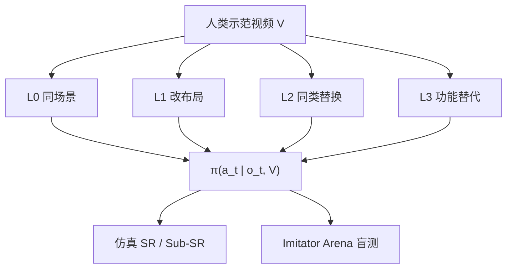
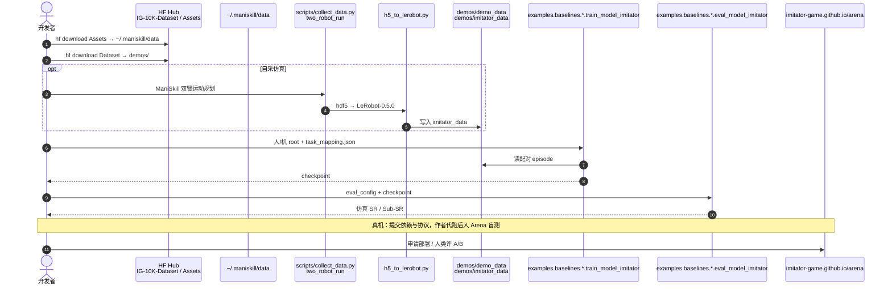

# The Imitator Game：用目标等价衡量模仿

**The Imitator Game**（*Benchmarking Robot Imitative Ability Beyond Action Prediction*，[arXiv:2608.22301](https://arxiv.org/abs/2608.22301)，[项目页](https://imitator-game.github.io/)，[代码](https://github.com/imitator-game/The-Imitator-Game)，[IG-10K](https://huggingface.co/datasets/imitator-game/IG-10K-Dataset)）由 **香港大学（HKU）**、**超忆（TranscEngram）**、**复旦大学（Fudan）** 与 **浙江大学（ZJU）** 提出：四级场景错位把人类示范与机器人现场逐步拉开，配套 IG-10K 配对数据与开放盲测平台 Imitator Arena。

## 一句话定义

**机器人真正的模仿能力，应以目标等价而非动作相似来衡量——L3 功能替代才是轨迹复现失效、意图理解必须上场的分界。**

## 英文缩写速查

| 缩写 | 英文全称 | 简要说明 |
|------|----------|----------|
| IG-10K | Imitator Game 10K | 2 万余组环境对齐人–机配对数据集 |
| L0–L3 | Level 0–3 | 同场景轨迹 → 空间 → 语义 → 功能替代 |
| VLA | Vision-Language-Action | 本基准用固定 captioner \(T(V)\) 喂语言条件族 |
| P+FT | Pretrain + Fine-Tune | IG-10K 预训练后再用 10 条未见任务配对微调 |
| SR | Success Rate | 仿真谓词成功率；真机用 Arena 人类成功判断 |
| Sub-SR | Sub-goal Success Rate | 有序子目标完成比例（仅仿真） |
| WR | Win Rate | Arena 盲测 A/B 胜率 |

## 为什么重要

- **现有榜多测「像不像」：** COLOSSEUM / REALM 测训练场景扰动，Vid2Robot 等视频策略多在近分布评。本基准把示范–执行错位显式分级。
- **数据接口统一：** 仿真与真机同一 LeRobot-0.5.0 格式，含 MANO、分割与三层语言。
- **人类盲测校准：** Arena 与自动 SR 相关 \(r\approx 0.86\)，避免只信脚本判定。
- **可复现栈已落地：** 2026-09-02 再核时 MIT 仓与 HF 数据/资产已公开，可在 ManiSkill 上自训九套基线。

## 核心信息

| 项 | 内容 |
|----|------|
| **机构** | 香港大学（HKU）；超忆（TranscEngram）；复旦大学（Fudan）；浙江大学（ZJU） |
| **形式化** | \(\pi(a_t\mid o_t,V)\)；策略不见任务描述，也不见层级标签 |
| **数据** | IG-10K：20,000+ 配对（真机 11.7K Realman VR + 仿真 10K 双臂 Franka / ManiSkill3） |
| **任务** | 50+ 基础任务 × 四级、6 领域；主协议固定 5 seen + 5 unseen |
| **开源** | **已开源（MIT）** — 仿真/采集/九套基线训练评测；HF Dataset + Assets；真机部署走申请 |

## 核心原理（方法）

场景写成 \(\mathcal{S}=(\{O_i=(A_i,G_i,S_i)\},P)\)。每一级要同一意图，变的是示范轨迹还能用多少：

| 级 | 保真上限 | \(P\) | \(A/G\) | \(S\) | 还能否靠复现轨迹 |
|----|----------|-------|---------|-------|------------------|
| L0 | 轨迹匹配 | 保 | 保 | 保 | 能 |
| L1 | 物体终态 | 改 | 保 | 保 | 否（布局变） |
| L2 | 语义任务 | n/a | 改 | 保 | 否（同类替换） |
| L3 | 意图 / affordance | n/a | 改 | 改 | 否（功能替代） |

同一人类 clip 服务四级，只改机器人侧场景。具身差距大致固定，与 RHyME 等 embodiment-gap 层级正交。

### 流程总览

三族基线共用同一接口，**冻结**视觉 / VLM 骨干、只训动作头：VLA（GR00T-N1.6、RDT-1B、\(\pi_{0.5}\)、OpenVLA）走固定 captioner \(T(V)\)；技能检索（XSkill、UniSkill）；视频条件 VA（ACT / Diffusion Policy / VQ-BeT × DINOv2 / SigLIP2 / VideoMAE）。

## 源码运行时序图

官方仓 [imitator-game/The-Imitator-Game](https://github.com/imitator-game/The-Imitator-Game)（MIT）提供仿真采集、LeRobot 转换与 `examples/baselines/<model>/` 训练评测入口：

- **最短复现路径：** `uv sync` → 下 Assets + Dataset → 选 `examples/baselines/act`（或 DP）按 README 训/评。
- **社区扩展：** 任务模板 `mani_skill/envs/tasks/_template/`，模型模板 `examples/baselines/_template/`，本体模板 `mani_skill/agents/robots/_template/`。
- **真机：** 仓内无上传接口；联系项目社区后由作者在 Realman 平台代跑。

## 工程实践

| 项 | 建议 |
|----|------|
| 读榜 | 先看 **L3** 与 **unseen 零样本**，不要只报 L0 seen |
| 微调预算 | 10 组配对能拉开 P+FT，但收益跟 IG-10K 预训练规模（15/30/45 任务）走 |
| 编码器 | 视频条件族里 DINOv2 / SigLIP2 稳定优于 VideoMAE |
| 接口选型 | 看过的任务：视频 / 技能检索更强；少样本适应：\(\pi_{0.5}\) 等 VLA 更稳 |
| 数据体积 | Dataset 约 **747 GB**；先下单任务子集再全量 |
| 安装坑 | README 要求补丁一份上游 lerobot `lerobot_dataset.py`；Vulkan 按 ManiSkill 文档 |

## 实验与评测

主协议：5 个长程/灵巧 seen（搅拌、叠毛巾、挂杯、归档、上架餐盘）+ 5 个原子 unseen（放置/扫码/倒水/折叠盒等）× 四级。仿真 10 trial / 真机 5 trial。预训练语料嵌套 \(\mathcal{C}_{15}\subset\mathcal{C}_{30}\subset\mathcal{C}_{45}\)。

| 设定 | 结果 |
|------|------|
| 仿真 seen SR | ACT/DINOv2 **0.81**；XSkill **0.79**；\(\pi_{0.5}\) **0.73** |
| 未见任务零样本 | 全部模型 **<13%**（仿真最好 0.13） |
| P+FT vs 从零 10 条 | 15/15 仿真变体里 12 个 P+FT 胜；14 个随 15→45 预训练任务上涨 |
| 真机 Arena（代表四模型） | XSkill seen SR **0.63** / P+FT **0.49** / WR **0.95**；视频族零样本优于 \(\pi_{0.5}\) |
| 真机 P+FT 按级 | L0–L2 均值 SR≈**0.40**，L3 掉到 **0.29**；XSkill L0–L2 ≈0.53–0.57 → L3 **0.29** |
| 自动 SR vs Arena | \(r\approx\) **0.858 / 0.861**（SR / \(Q\)） |

## 结论

**L3 才是意图模仿的考场；只扩语料或只换动作头，过不去功能替代。**

1. **人视频条件 > 字幕条件** — 但两者在未见任务零样本都弱，不要把「视频更强」读成「已经会意图」。
2. **配对预训练的主收益在 few-shot，不在零样本** — 10 条配对的价值取决于 15/30/45 预训练任务数。
3. **自动指标可用** — 与人类盲测相关足够高，但仍应抽查 Arena，尤其 L3。
4. **功能替代单独记账** — L0–L2 平均会掩盖 L3 崩溃。
5. **下一步不在更大动作头** — 作者指向 affordance grounding、显式目标推断、能在物体替换后存活的中间表示。
6. **复现优先仿真** — MIT 仓 + HF 数据可自训；真机数字目前只能走 Arena / 申请代跑。

## 与其他工作对比

| 对照 | 差异读法 |
|------|----------|
| [Indi](./paper-indi.md) | 蒸馏局部目标进 VLA；本页评「目标等价」本身 |
| COLOSSEUM / REALM / RoboTwin | 测训练场景扰动或语言条件任务；本页测示范–执行错位 |
| 常规 BC / ACT / DP 榜 | 多在近复现设定；本页把差距显式分级 |
| RHyME 等跨本体层级 | 测身体差异、场景固定；本页固定具身差距、改场景 |
| 人类视频预训练 VLA | 本页显示视频条件更强，但仍过不了 L3 / unseen |
| [HOST](./paper-host-one-shot-human-video.md) | 方法页：单视频秒级习得 + 不遗忘；不按 L0–L3 报，开源代码与权重 |

## 局限与风险

- 主协议只用 10 个任务（5+5），50 任务全表是参考而非默认排行。
- 每任务–层级目前只有一种替换模式，不测替换方差。
- 仿真 L3 受有限资产与规则规划轨迹偏差。
- 横评冻结骨干、只训动作头，比的是接口而非全量微调。
- 被评模型是「适配到本游戏」，不是为意图级模仿专门设计。
- 真机权重未上 HF；第三方无法本地复核 Arena 真机数字。

## 关联页面

- [模仿学习](../methods/imitation-learning.md)
- [VLA](../methods/vla.md)
- [LeRobot](./lerobot.md) — IG-10K 发布格式
- [ManiSkill2](./maniskill2.md) — 仿真操作泛化前身；本基准仿真栈为 ManiSkill3 / SAPIEN
- [Indi](./paper-indi.md)
- [Manipulation](../tasks/manipulation.md)
- [具身评测基准枢纽](../overview/hub-embodied-eval-benchmark.md) — ③ 层：成功率口径从轨迹相似换成目标等价
- [评测基准选型闭环 Query](../queries/embodied-eval-benchmark-selection-loop.md)
- [48ms WAM / 编排 10 篇地图](../overview/glancewam-vla-crew-10-papers-technology-map.md)
- [HOST](./paper-host-one-shot-human-video.md) — 单条人视频、不改权重的可核对 one-shot 方法（arXiv:2607.20033）

## 参考来源

- [imitator_game_arxiv_2608_22301](../../sources/papers/imitator_game_arxiv_2608_22301.md)
- [项目页归档](../../sources/sites/imitator-game-github-io.md)
- [官方仓库](../../sources/repos/the-imitator-game.md)
- [IG-10K 数据集](../../sources/datasets/ig-10k.md)
- [具身智能小站 10 篇盘点](../../sources/blogs/wechat_embodied_station_10_papers_glancewam_vla_crew_2026-08-30.md)

## 推荐继续阅读

- [arXiv:2608.22301](https://arxiv.org/abs/2608.22301)
- [项目页 / Arena](https://imitator-game.github.io/)
- [官方仓 README](https://github.com/imitator-game/The-Imitator-Game)
- [IG-10K on Hugging Face](https://huggingface.co/datasets/imitator-game/IG-10K-Dataset)
