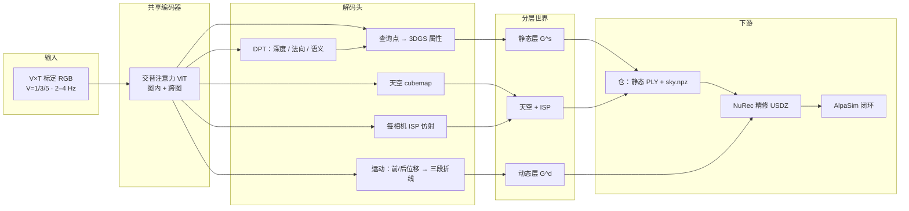
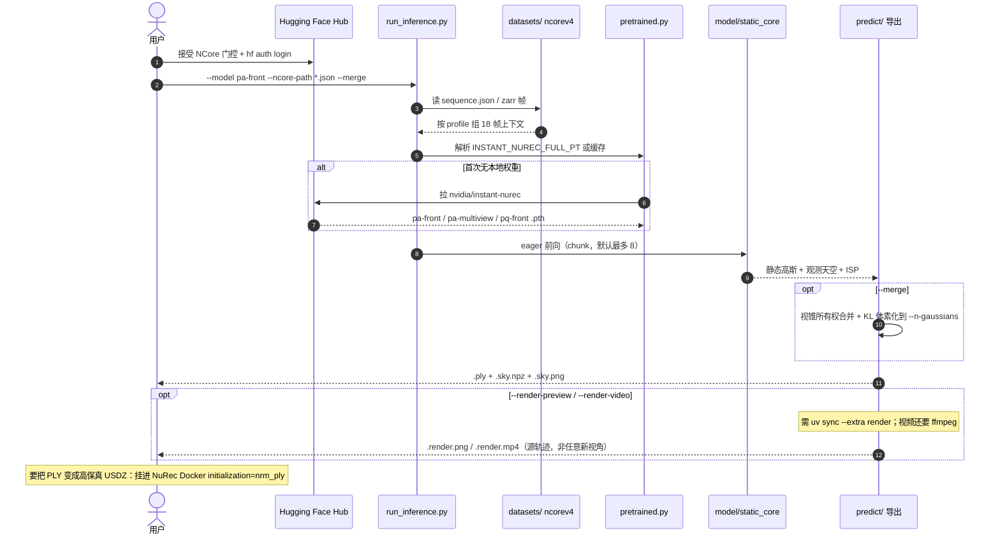

# Instant NuRec（Feed-Forward 3D Gaussian Reconstruction for Driving Scene Simulation）

**Instant NuRec** 是 NVIDIA [Spatial Intelligence Lab](https://research.nvidia.com/labs/sil/projects/instant-nurec/) 的 **前向神经重建模型**（arXiv:2607.14203，2026）：输入标定多相机短日志，**一次前向** 输出可导航、可改时的分层 **3DGS** 世界，并接到 [NuRec](./nvidia-nurec.md) / AlpaSim，而不是再为每段 clip 做数十分钟优化。

## 英文缩写速查

| 缩写 | 英文全称 | 简要说明 |
|------|----------|----------|
| Instant NuRec | Instant Neural Reconstruction | 本文前向模型；秒级出分层 3DGS |
| NuRec | NVIDIA Neural Reconstruction | 逐场景精修与 USDZ 产品栈；本文的质量/时间对照 |
| 3DGS | 3D Gaussian Splatting | 静态/动态层的显式原语 |
| 3DGUT | 3D Gaussian Unscented Transform | 原生支持畸变相机的可微渲染器 |
| ISP | Image Signal Processor | 每相机 3×4 仿射，吸收曝光/白平衡差 |
| NCore | NVIDIA Core clip format | 仓与 NuRec 共用的序列清单输入 |
| PSNR | Peak Signal-to-Noise Ratio | 新视角图像质量；Waymo 全文主数字之一 |
| ViT | Vision Transformer | 交替图内/跨图注意力的共享编码器 |

## 为什么重要

- **把「每段小时级」摊成「每段秒级」：** 逐场景 NuRec / OmniRe 能出生产级外观，但吃不下车队每天的百万级 clip。本文在内部对照上用 **~1.5 s** 换 **~75 min**，外观与检测只退一小步。
- **输出是仿真状态，不是视频：** 相对 GAIA / Cosmos 等 **像素世界模型**，这里给出可重姿态的静态层、可编辑动态层和天空 cubemap——规划器能改视角，而不是再生成一段 2D。
- **闭环选型有证据：** 140 场景 AlpaSim 上，Instant 与逐场景 NuRec **策略排序相同**。评测基础设施要的是「换重建不改榜单」，不是多 4 dB PSNR。
- **产品已接上：** 文档 26.04 把本模型写成 AV 重建的 **推荐初始化**；仓是 Apache 推理 CLI，不是口号式 “code will be released”。

## 流程总览

## 核心原理 / 方法栈

### 输入输出

- **入：** \(V\times T\) 图 + \(SE(3)\) 位姿 + 内参 \(\kappa\)。可选推理期 cuboid，用来校准动态轨迹，不是重建硬依赖。
- **出：**
  - 静态高斯：位置、尺度、四元数、不透明度、颜色、法向、road/non-road 语义。
  - 动态高斯：同样属性，位置换成三段结点的折线 \(\mu(t)\)，两端用不透明度 fade。
  - 天空 cubemap \(6\times H\times W\times 3\)。
  - 每相机 \(3\times 4\) ISP，渲染色上再乘，损失才比。

### 编码器与头

骨干跟 Depth-Anything-3：patch token + 位姿/FoV class token，交替 **图内 / 跨图** 注意。DPT 出深度、法向、四类语义（road / movable / sky / ego-car）。高斯 **不绑死每像素一个**：从深度抬升查询，再 cross-attend 出尺度/旋转/不透明度。

| 查询策略 | 直觉 | 量级（文中例） |
|----------|------|----------------|
| Dense | 上下文每像素一个查询 | ~351K 高斯 / 视图 |
| Selective | stride + 道路分支，每 token 预测 \(M=p^2\) 个 | ~88–120K / 视图，约 **3–4×** 更少 |

运动头对同一查询回归前/后 3D 位移；语义 mask 后只有 movable 进动态层。天空按世界射线方向查特征；ISP token 按相机分组。

### 长片段与训练课表

重叠 chunk 合并时，静态层做 **视锥所有权**：高斯归「最近看到它的 chunk」，避免远场 floater 污染邻段。损失分 context（深度 L1、法向余弦、语义 CE）、motion（前景 scene flow、背景零位移）、render（\(L_1\)+LPIPS，天空区鼓励透明）。**三阶段：** DA3 预训练 → 几何/运动微调 → **冻编码器** 再训 GS/ISP。约 4 万内部 clip，8 节点约 6 天。一阶段联合训更慢且 PSNR 更差（消融 27.65 vs 29.93）。

## 源码运行时序图

官方仓 [NVIDIA/instant-nurec](https://github.com/NVIDIA/instant-nurec)（Apache-2.0，归档见 [nvidia-instant-nurec.md](../../sources/repos/nvidia-instant-nurec.md)）只覆盖 **静态导出**。节点对齐 README：`setup.sh`、`run_inference.py`、`instant_nurec/pretrained.py`、`predict/` merge。

- **复现先跑 `pa-front --merge`：** 成功约 **1.88M** 高斯的一条 PLY。`pq-front` 对应论文 Selective。
- **仓不是论文全模型：** 动态层、训练循环、AlpaSim 评测脚本 **不在本 CLI**。

## 工程实践

| 项 | 内容 |
|------|------|
| 安装 | Python 3.11，`./setup.sh`（`uv sync --frozen`），无 Docker |
| 权重 | 首次自动下载；或 `hf download nvidia/instant-nurec` + `INSTANT_NUREC_FULL_PT` |
| 数据 | 门控 `nvidia/PhysicalAI-Autonomous-Vehicles-NCore`；`--ncore-path` 接受单 JSON 或 `.lst` |
| 默认命令 | `python run_inference.py --model pa-front --ncore-path … --output-dir … --merge` |
| 预览 | `uv sync --extra render` 后 `--render-preview`；全程视频再加 `--render-video`（必须 `--merge`） |
| 看 PLY | SuperSplat 或 NuRec 容器 `ply_viewer`；MeshLab 当点云会失败 |
| 进产品 | PLY → [NuRec 容器](./nvidia-nurec.md) `nrm_ply` 初始化 |
| 相机域外 | 按仓内 `docs/camera_rectification.md` 整流到训练内参；黑边要 inpaint |

## 实验与评测

**Waymo Open Dataset val（STORM 协议，240×160，2 s / 4 上下文帧）：**

| 方法 | 全图 PSNR / SSIM | 动态区 PSNR | AbsRel / \(\delta_1\) |
|------|------------------|-------------|------------------------|
| DepthSplat | 22.48 / 0.645 | 18.59 | 0.295 / 0.592 |
| STORM | 21.88 / 0.752 | 19.89 | 0.123 / 0.870 |
| Depth-Anything-3 | 20.30 / 0.557 | 17.59 | 0.434 / 0.313 |
| DGGT | 26.25 / 0.805 | 21.76 | 0.135 / 0.841 |
| **Instant NuRec** | **28.26 / 0.859** | **24.93** | **0.076 / 0.937** |

**内部 vs 逐场景 NuRec（项目页条形图）：** Dense PSNR **29.93**（NuRec **34.38**）；检测 P/R **0.955 / 0.940**（**0.970 / 0.955**）；时间 **1.5 s vs 75 min**。Selective 再轻一档（29.77 / 0.946 / 0.929）。

**闭环：** 140 场景 × 20 s × 6 trial，策略含 VaVAM、Alpamayo R1、A-1.5 的 1/2/4 相机变体。碰撞 + 冲出路面上，Instant 与 NuRec **排名一致**。

**LiDAR 扩展：** 内部 Chamfer **0.286** vs NuRec **0.204**；约 **20 s vs 75 min**。无各向异性尺度地板则几何碎裂（CD 0.936）。

**消融（内部）：** 去掉视锥合并 PSNR 26.10；天空改 MLP 26.73；去掉 LPIPS 26.81；去掉深度 28.92 但 AbsRel 升到 0.103。

## 结论

**闭环策略排序能对齐逐场景 NuRec，才是 Instant 的产品理由；多出来的数 dB PSNR 是精修阶段该买的，不是前向必须一次付清的。**

1. **时间差三个数量级** — 内部 **~1.5 s vs ~75 min**；外观 29.93 vs 34.38，检测只退约 1.5–1.6 个点。
2. **Waymo 读全图也读动态区** — +2.01 dB 对 DGGT；动态区 24.93 vs 21.76，说明运动头 + movable mask 不是摆设。
3. **Selective 是部署开关** — 高斯约 1/3，PSNR 只掉到 29.77；内存/渲染紧时用 `pq-front`，质量优先用 Dense/`pa-front`。
4. **评测看排序不看单条碰撞率** — 140 场景上排名与 NuRec 相同，才能把 Instant 当策略筛选器。
5. **仓只能复现静态预览** — 动态层、训练、AlpaSim 数字无法从 CLI 复现；要 USDZ 仍走 NuRec 容器。
6. **别当通用室内重建** — 训练在 AV 架上；低挂 / 纯鱼眼要整流或微调，办公室 360° 扫描应走 [NuRec 机器人路径](./nvidia-nurec.md) 或 Niantic 导出。

## 与其他工作对比

| 工作 | 产物 | 时间尺度 | 和本文的读法 |
|------|------|----------|--------------|
| 逐场景 NuRec / OmniRe | 高保真分层 3DGS / USDZ | 数十分钟–小时 | 质量上限与 Instant 的初始化目标 |
| STORM / DrivingForward / DGGT | 前向静+动高斯 | 秒级 | Waymo 图像/深度对照；本文多天空、ISP、仿真层语义 |
| GAIA / Cosmos 等视频 WM | 可控像素 | 生成步 | 互补：本文给显式 3D，生成模型补未观测或去 floater |
| [SimFoundry](./paper-simfoundry-real2sim-scene-generation.md) | 操作场景 mesh + cousins | 约分钟/物 | 桌面操作孪生，不是车队日志 |
| [Flexion × Niantic](./flexion-niantic-nvidia-rgb-sim2real-pipeline.md) | 办公室 NuRec USDZ + RGB RL | 扫描+训练日级 | **消费** NuRec 体积做人形导航，不训练 Instant |
| [GS-Playground](./gs-playground.md) | 批量 3DGS 渲染 + 并行物理 | 训练 FPS | 仿真吞吐，不是日志→世界 |

## 局限与风险

- **高斯预算 vs 细杆细线：** 少了欠采样，多了渲染贵；文内建议 test-time 在输入 clip 上再精修。
- **架外泛化：** 与训练内参/安装差太多要整流或微调。
- **动态是折线刚体近似：** 三段结点吃不住行人关节等亚秒非刚体。
- **开源边界（2026-09-05）：** 项目页有 GitHub + HF → **部分开源、推理可跑**。动态层、训练、闭环评测脚本未随独立 CLI。NCore 演示数据 **门控**。
- **渲染预览 ≠ 任意新视角：** `--render-video` 沿源相机轨迹；任意新视角仍属论文评测设定。
- **标准 PLY 不带天空：** SuperSplat 只显示前景高斯，`.sky.npz` 要自己合成。

## 关联页面

- [NVIDIA Omniverse NuRec](./nvidia-nurec.md) — 产品栈、USDZ、Isaac / gRPC
- [Isaac Gym / Isaac Lab](./isaac-gym-isaac-lab.md) — 机器人侧消费体积的训练底座
- [Isaac Sim](./isaac-sim.md) — `OmniNuRecVolumeAPI`
- [Sim2Real](../concepts/sim2real.md) — Real2Sim 资产上游
- [仿真评测基础设施](../concepts/simulation-evaluation-infrastructure.md) — 「换重建、保策略排序」
- [生成式世界模型](../methods/generative-world-models.md) — 像素 WM vs 显式 3D 重建
- [Flexion × Niantic × NVIDIA RGB 管线](./flexion-niantic-nvidia-rgb-sim2real-pipeline.md)
- [SimFoundry](./paper-simfoundry-real2sim-scene-generation.md)
- [GS-Playground](./gs-playground.md)

## 参考来源

- [instant_nurec_arxiv_2607_14203.md](../../sources/papers/instant_nurec_arxiv_2607_14203.md)
- [nvidia-research-instant-nurec.md](../../sources/sites/nvidia-research-instant-nurec.md)
- [nvidia-instant-nurec.md](../../sources/repos/nvidia-instant-nurec.md)
- [nvidia-nurec-docs.md](../../sources/sites/nvidia-nurec-docs.md)
- 论文：<https://arxiv.org/abs/2607.14203>
- 项目页：<https://research.nvidia.com/labs/sil/projects/instant-nurec/>
- 代码：<https://github.com/NVIDIA/instant-nurec>
- 文档：<https://docs.nvidia.com/nurec/>

## 推荐继续阅读

- NuRec AV 重建（Instant 初始化命令）：<https://docs.nvidia.com/nurec/nurec/reconstruct-av-scene.html>
- AlpaSim：<https://github.com/NVlabs/alpasim>
- 3DGUT（CVPR 2025）：畸变相机高斯渲染
- STORM / Depth-Anything-3：前向重建与深度骨干对照
